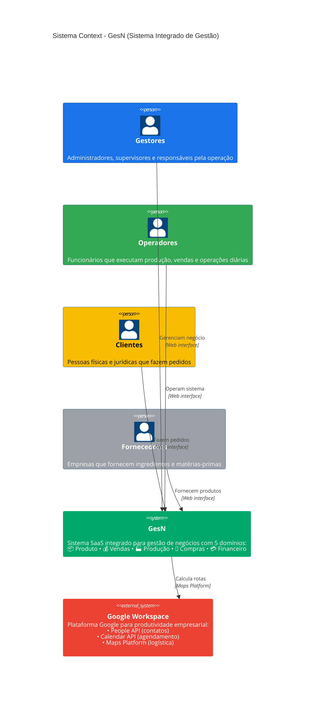
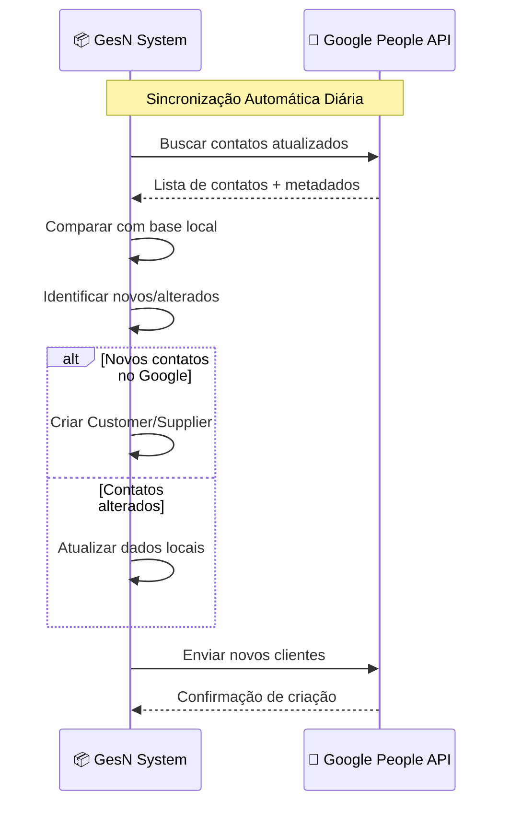
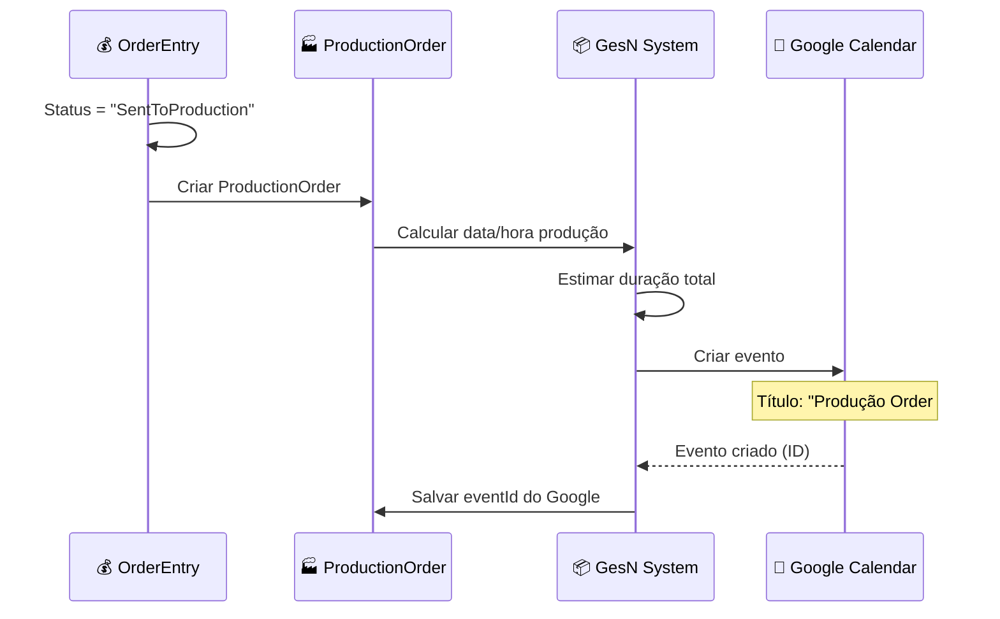
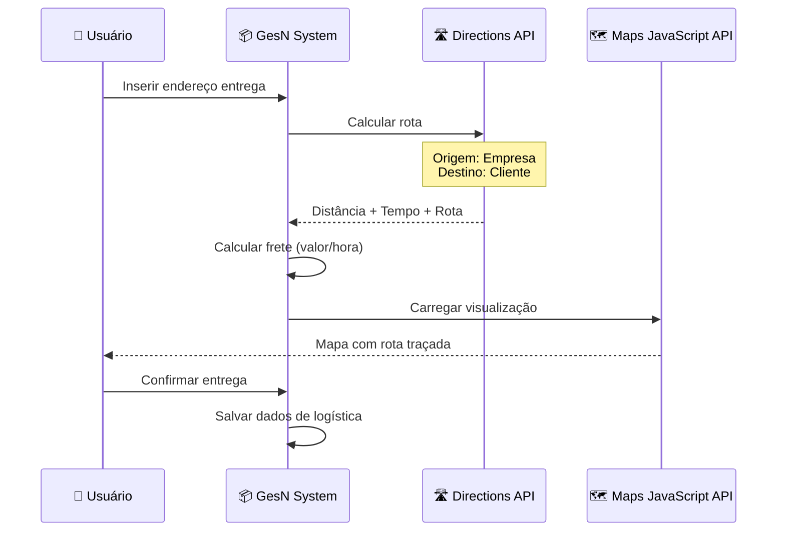

# 🌐 C4 LEVEL 1 - SYSTEM CONTEXT

## 🎯 Visão Geral
Diagrama de contexto do sistema GesN mostrando como o sistema se relaciona com seus usuários e outros sistemas. Este é o nível mais alto de abstração, focando no **"O QUE"** o sistema faz, não no **"COMO"**.

## 📊 Diagrama de Contexto do Sistema



## 👥 Atores do Sistema

### **🎭 Usuários Internos**

#### **👑 Gestores**
```
Perfil: Administradores, supervisores, responsáveis
Acesso: Todas as funcionalidades + relatórios
Principais Ações:
├── 📊 Visualizar dashboards executivos
├── 🎯 Definir metas e políticas
├── 📈 Analisar relatórios financeiros
├── ⚙️ Configurar sistema e usuários
└── 🔍 Auditar operações
```

#### **⚙️ Operadores**
```
Perfil: Funcionários operacionais
Acesso: Funcionalidades específicas por domínio
Principais Ações:
├── 📦 Gerenciar catálogo de produtos
├── 💰 Processar pedidos de venda
├── 🏭 Executar ordens de produção
├── 🛒 Gerenciar compras e estoque
└── 💳 Processar transações financeiras
```

### **🌐 Usuários Externos**

#### **👤 Clientes**
```
Perfil: Pessoas físicas e jurídicas
Acesso: Portal de clientes (limitado)
Principais Ações:
├── 🛍️ Fazer pedidos online
├── 📋 Acompanhar status de pedidos
├── 💳 Realizar pagamentos
├── 📞 Acessar histórico de compras
└── 📧 Receber notificações
```

#### **🏢 Fornecedores**
```
Perfil: Empresas parceiras
Acesso: Portal de fornecedores (limitado)
Principais Ações:
├── 📄 Receber ordens de compra
├── 📦 Confirmar entregas
├── 💰 Acompanhar faturas
├── 📊 Acessar relatórios de performance
└── 🔔 Receber notificações
```

## 🌐 Sistemas Externos

### **🚀 Google Workspace (Dependência Crítica)**

#### **👥 People API**
```
Propósito: Sincronização de contatos
Integração: Bidirecional
Fluxo:
├── 📥 GesN → Google: Novos clientes/fornecedores
├── 📤 Google → GesN: Contatos atualizados
├── 🔄 Sincronização: Automática (diária)
└── 🎯 Benefício: Centralização de contatos
```

#### **📅 Calendar API**
```
Propósito: Agendamento de produção
Integração: Unidirecional (GesN → Google)
Fluxo:
├── ⚡ Trigger: OrderEntry.Status = "SentToProduction"
├── 🏭 Evento: ProductionOrder criada
├── 📅 Ação: Criar evento no Google Calendar
├── ⏰ Dados: Data produção, produtos, tempo estimado
└── 🎯 Benefício: Visibilidade de agenda
```

#### **🗺️ Google Maps Platform**
```
Propósito: Logística e cálculo de entregas
APIs Utilizadas:
├── 🛣️ Directions API
│   ├── Input: Endereço de entrega
│   ├── Output: Rota, distância, tempo
│   └── Uso: Cálculo de frete automático
├── 🗺️ Maps JavaScript API
│   ├── Input: Coordenadas da rota
│   ├── Output: Visualização interativa
│   └── Uso: Interface de acompanhamento
└── 💰 Precificação: Valor/hora configurável
```

## 🔄 Fluxos de Integração Críticos

### **📊 Sincronização de Contatos (People API)**


### **📅 Agendamento de Produção (Calendar API)**


### **🗺️ Cálculo de Rotas (Maps Platform)**


## 🎯 Benefícios das Integrações

### **📊 Impactos de Negócio**

| Integração | Benefício | Métrica |
|------------|-----------|---------|
| **People API** | Redução duplicação dados | -80% tempo cadastro |
| **Calendar API** | Visibilidade produção | +50% aderência prazos |
| **Maps Platform** | Precisão logística | -30% custos entrega |

### **⚡ Automações Habilitadas**

#### **🔄 Sincronização Automática**
- Novos clientes → Google Contacts
- Contatos atualizados → Base GesN
- Frequência: Diária (configurable)

#### **📅 Agendamento Inteligente**
- ProductionOrder → Evento Calendar
- Conflitos de agenda → Alertas
- Rescheduling → Atualização automática

#### **🚚 Logística Otimizada**
- Endereço → Rota automática
- Distância → Cálculo frete
- Visualização → Tracking entrega

## 🚨 Dependências Críticas

### **⚠️ Riscos Identificados**

| Sistema | Risco | Impacto | Mitigação |
|---------|-------|---------|-----------|
| **Google APIs** | Indisponibilidade | Alto | Circuit breaker + cache |
| **Internet** | Conectividade | Crítico | Modo offline limitado |
| **Quotas Google** | Limite atingido | Médio | Monitoramento + alertas |

### **🔧 Estratégias de Contingência**

#### **🌐 Google APIs Indisponíveis**
```
Fallback Strategy:
├── 👥 People API: Usar cache local (até 7 dias)
├── 📅 Calendar API: Agendar localmente + sync posterior  
├── 🗺️ Maps API: Usar histórico de rotas similares
└── 🚨 Alertas: Notificar administrators
```

#### **📊 Monitoramento de Saúde**
```
Health Checks (a cada 5 min):
├── 🟢 APIs Response Time < 2s
├── 🟡 APIs Response Time 2-5s  
├── 🔴 APIs Response Time > 5s ou erro
└── 📧 Escalation: Após 3 falhas consecutivas
```

## 📈 Evolução Futura

### **🚀 Integrações Planejadas**

| Prioridade | Sistema | Propósito |
|------------|---------|-----------|
| **Alta** | Google Drive | Armazenamento documentos |
| **Média** | Google Sheets | Relatórios automáticos |
| **Baixa** | Google Meet | Reuniões com fornecedores |

### **🎯 Objetivos Estratégicos**
- **Reduzir**: Entrada manual de dados
- **Aumentar**: Automação de processos
- **Melhorar**: Experiência do usuário
- **Otimizar**: Custos operacionais

---

**Arquivo**: `level1-system-context.md`  
**Nível C4**: 1 - System Context  
**Audiência**: Stakeholders não-técnicos  
**Foco**: O que o sistema faz + dependências externas  
**Atualização**: 16/06/2025
