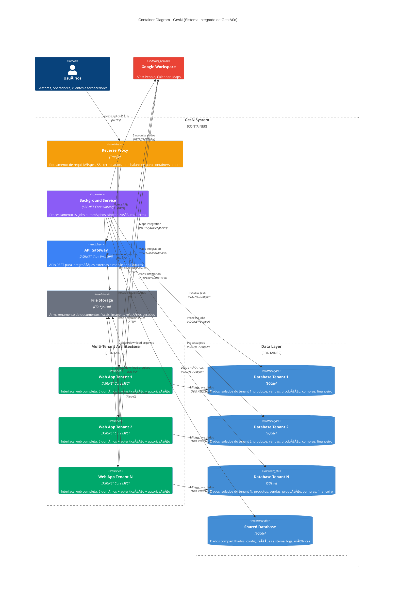
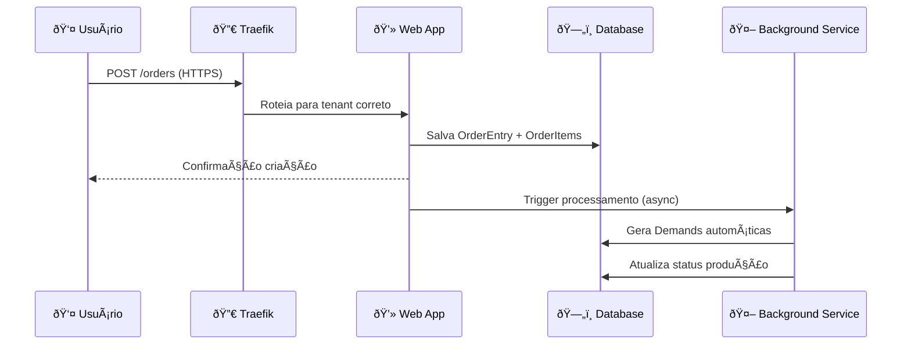
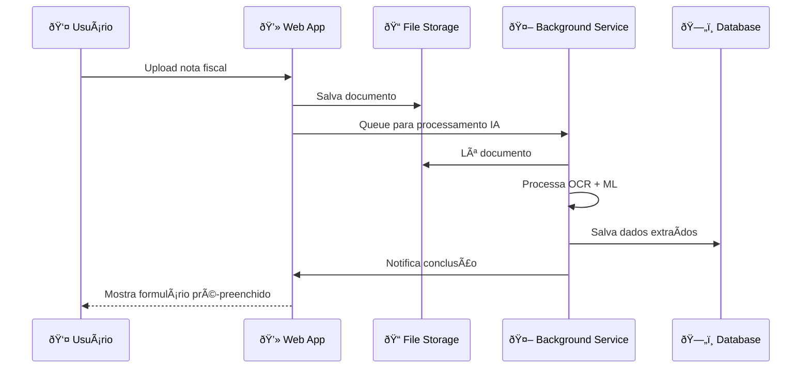
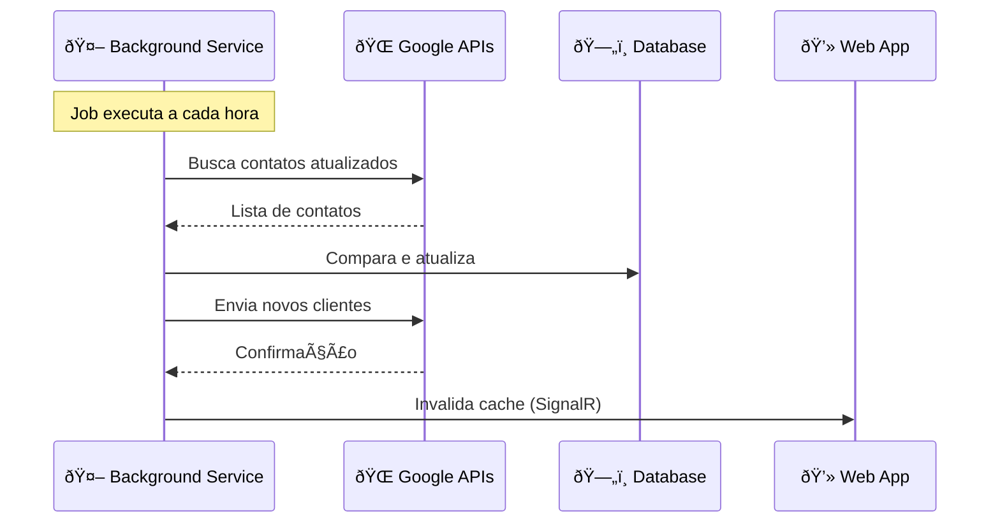

# 🏗️ C4 LEVEL 2 - CONTAINER DIAGRAM

## 🎯 Visão Geral
Diagrama de containers do sistema GesN mostrando as aplicações de alto nível e tecnologias utilizadas. Este nível mostra **"COMO"** o sistema é implementado em termos de aplicações executáveis e armazenamento de dados.

## 📊 Diagrama de Containers


```mermaid
C4Container
    title Container Diagram - GesN (Sistema Integrado de Gestão)
    
    Person(users, "Usuários", "Gestores, operadores, clientes e fornecedores")
    System_Ext(google_workspace, "Google Workspace", "APIs: People, Calendar, Maps")
    
    Container_Boundary(gesn_system, "GesN System") {
        Container(reverse_proxy, "Reverse Proxy", "Traefik", "Roteamento de requisições, SSL termination, load balancing para containers tenant")
        
        Container_Boundary(tenant_isolation, "Multi-Tenant Architecture") {
            Container(web_app_t1, "Web App Tenant 1", "ASP.NET Core MVC", "Interface web completa: 5 domínios + autenticação + autorização")
            Container(web_app_t2, "Web App Tenant 2", "ASP.NET Core MVC", "Interface web completa: 5 domínios + autenticação + autorização")
            Container(web_app_tn, "Web App Tenant N", "ASP.NET Core MVC", "Interface web completa: 5 domínios + autenticação + autorização")
        }
        
        Container(background_service, "Background Service", "ASP.NET Core Worker", "Processamento IA, jobs automáticos, sincronizações, alertas")
        
        Container(api_gateway, "API Gateway", "ASP.NET Core Web API", "APIs REST para integrações externas e mobile apps futuras")
        
        Container_Boundary(data_layer, "Data Layer") {
            ContainerDb(db_tenant1, "Database Tenant 1", "SQLite", "Dados isolados do tenant 1: produtos, vendas, produção, compras, financeiro")
            ContainerDb(db_tenant2, "Database Tenant 2", "SQLite", "Dados isolados do tenant 2: produtos, vendas, produção, compras, financeiro")
            ContainerDb(db_tenantn, "Database Tenant N", "SQLite", "Dados isolados do tenant N: produtos, vendas, produção, compras, financeiro")
            ContainerDb(shared_db, "Shared Database", "SQLite", "Dados compartilhados: configurações sistema, logs, métricas")
        }
        
        Container(file_storage, "File Storage", "File System", "Armazenamento de documentos fiscais, imagens, relatórios gerados")
    }
    
    %% Relacionamentos Usuários
    Rel(users, reverse_proxy, "Acessa aplicação", "HTTPS")
    
    %% Relacionamentos Reverse Proxy
    Rel(reverse_proxy, web_app_t1, "Roteia requisições", "HTTP")
    Rel(reverse_proxy, web_app_t2, "Roteia requisições", "HTTP")
    Rel(reverse_proxy, web_app_tn, "Roteia requisições", "HTTP")
    Rel(reverse_proxy, api_gateway, "Roteia APIs", "HTTP")
    
    %% Relacionamentos Web Apps → Databases
    Rel(web_app_t1, db_tenant1, "Lê/escreve dados", "ADO.NET/Dapper")
    Rel(web_app_t2, db_tenant2, "Lê/escreve dados", "ADO.NET/Dapper")
    Rel(web_app_tn, db_tenantn, "Lê/escreve dados", "ADO.NET/Dapper")
    
    %% Relacionamentos Background Service
    Rel(background_service, db_tenant1, "Processa jobs", "ADO.NET/Dapper")
    Rel(background_service, db_tenant2, "Processa jobs", "ADO.NET/Dapper")
    Rel(background_service, db_tenantn, "Processa jobs", "ADO.NET/Dapper")
    Rel(background_service, shared_db, "Logs e métricas", "ADO.NET/Dapper")
    
    %% Relacionamentos File Storage
    Rel(web_app_t1, file_storage, "Upload/download arquivos", "File I/O")
    Rel(web_app_t2, file_storage, "Upload/download arquivos", "File I/O")
    Rel(web_app_tn, file_storage, "Upload/download arquivos", "File I/O")
    Rel(background_service, file_storage, "Processa documentos", "File I/O")
    
    %% Relacionamentos Google Workspace
    Rel(background_service, google_workspace, "Sincroniza dados", "HTTPS/REST APIs")
    Rel(web_app_t1, google_workspace, "Maps integration", "HTTPS/JavaScript APIs")
    Rel(web_app_t2, google_workspace, "Maps integration", "HTTPS/JavaScript APIs")
    Rel(web_app_tn, google_workspace, "Maps integration", "HTTPS/JavaScript APIs")
    
    %% Styling
    UpdateElementStyle(reverse_proxy, $bgColor="#f59e0b", $fontColor="white")
    UpdateElementStyle(web_app_t1, $bgColor="#00a86b", $fontColor="white")
    UpdateElementStyle(web_app_t2, $bgColor="#00a86b", $fontColor="white")
    UpdateElementStyle(web_app_tn, $bgColor="#00a86b", $fontColor="white")
    UpdateElementStyle(background_service, $bgColor="#8b5cf6", $fontColor="white")
    UpdateElementStyle(api_gateway, $bgColor="#3b82f6", $fontColor="white")
    UpdateElementStyle(file_storage, $bgColor="#6b7280", $fontColor="white")
    UpdateElementStyle(google_workspace, $bgColor="#ea4335", $fontColor="white")
```

## 🏗️ Detalhamento dos Containers

### **🌐 Reverse Proxy (Traefik)**
```
Responsabilidades:
├── 🔀 Roteamento de requisições por tenant
├── 🔒 SSL/TLS termination
├── ⚖️ Load balancing entre instâncias
├── 📊 Monitoring e health checks
└── 🛡️ Rate limiting e security headers

Configuração:
├── 🎯 Routes baseadas em subdomain/header
├── 📜 SSL certificates automáticos (Let's Encrypt)
├── 📈 Métricas expostas para Prometheus
└── 🔧 Configuration via Docker labels
```

### **💻 Web Applications (ASP.NET Core MVC)**
```
Stack Tecnológico:
├── 🎨 Frontend: HTML5, CSS3, JavaScript (ES6+), Bootstrap
├── ⚙️ Backend: ASP.NET Core 8.0 MVC
├── 🔐 Authentication: ASP.NET Core Identity
├── 🗄️ Data Access: Dapper (micro-ORM)
└── 📦 Deployment: Docker containers

Domínios Implementados:
├── 📦 Produto: Catálogo, tipos, componentes, grupos
├── 💰 Vendas: Clientes, pedidos, itens, status
├── 🏭 Produção: Demandas, ordens, composição, execução
├── 🛒 Compras: Fornecedores, ordens, IA processing, estoque
└── 💳 Financeiro: Contas, transações, fluxo de caixa

Arquitetura:
├── 🎮 Controllers: Pontos de entrada HTTP
├── ⚙️ Services: Lógica de negócio por domínio
├── 🗄️ Repositories: Acesso a dados (Repository Pattern)
└── 📋 Models: ViewModels e DTOs
```

### **🤖 Background Service (ASP.NET Core Worker)**
```
Responsabilidades:
├── 🧠 Processamento IA (OCR + ML para notas fiscais)
├── ⏰ Jobs automáticos (alertas, sincronizações)
├── 🔄 Sincronização Google Workspace
├── 📊 Geração de relatórios automáticos
└── 🚨 Monitoramento e alertas

Jobs Principais:
├── 🕕 Daily: Verificação contas vencidas
├── 🕡 Hourly: Sincronização contatos Google
├── 🕐 Continuous: Processamento documentos IA
├── 🕕 Daily: Backup automático databases
└── 🕐 Real-time: Alertas críticos de negócio
```

### **🔌 API Gateway (ASP.NET Core Web API)**
```
Propósito: Futuras integrações e apps mobile
APIs Expostas:
├── 📦 /api/products: Catálogo de produtos
├── 💰 /api/orders: Pedidos e status
├── 🏭 /api/production: Status de produção
├── 📊 /api/reports: Relatórios públicos
└── 🔐 /api/auth: Autenticação externa

Padrões:
├── 📜 OpenAPI/Swagger documentation
├── 🔐 JWT token authentication
├── ⚡ Rate limiting por cliente
└── 📊 Logging e monitoring
```

### **🗄️ Data Layer (SQLite Databases)**

#### **📊 Database per Tenant**
```
Estrutura por Tenant:
├── 📦 Product tables: Product, ProductCategory, etc.
├── 💰 Sales tables: Customer, OrderEntry, OrderItem
├── 🏭 Production tables: Demand, ProductComposition, ProductionOrder
├── 🛒 Purchasing tables: Supplier, PurchaseOrder, Ingredient
├── 💳 Financial tables: AccountReceivable, AccountPayable, Transaction
└── 🔐 Identity tables: Users, Roles, Claims (tenant-specific)

Isolamento:
├── 🏠 Cada tenant = 1 database file separado
├── 🔒 Zero cross-tenant data leakage
├── 📦 Backup e restore independentes
└── 🚀 Scaling horizontal por tenant
```

#### **🌐 Shared Database**
```
Dados Compartilhados:
├── ⚙️ System configurations
├── 📊 Global metrics e analytics
├── 📜 Audit logs cross-tenant
├── 🔧 Background job status
└── 💾 Cache compartilhado
```

### **📁 File Storage (File System)**
```
Organização:
├── 📄 /fiscal-documents/{tenantId}/{year}/{month}/
├── 🖼️ /product-images/{tenantId}/products/
├── 📊 /reports/{tenantId}/{reportType}/
├── 💾 /backups/{tenantId}/{date}/
└── 📜 /logs/{date}/

Características:
├── 🗂️ Estrutura hierárquica por tenant
├── 🔒 Isolamento físico de arquivos
├── 📦 Compressão automática para backups
└── 🗑️ Limpeza automática de arquivos antigos
```

## 🔄 Fluxos de Dados Principais

### **📊 Processamento de Pedido**

```mermaid
sequenceDiagram
    participant User as 👤 Usuário
    participant Proxy as 🔀 Traefik
    participant WebApp as 💻 Web App
    participant DB as 🗄️ Database
    participant BGService as 🤖 Background Service
    
    User->>Proxy: POST /orders (HTTPS)
    Proxy->>WebApp: Roteia para tenant correto
    WebApp->>DB: Salva OrderEntry + OrderItems
    WebApp-->>User: Confirmação criação
    
    WebApp->>BGService: Trigger processamento (async)
    BGService->>DB: Gera Demands automáticas
    BGService->>DB: Atualiza status produção
```

### **🤖 Processamento IA**

```mermaid
sequenceDiagram
    participant User as 👤 Usuário
    participant WebApp as 💻 Web App
    participant FileStorage as 📁 File Storage
    participant BGService as 🤖 Background Service
    participant DB as 🗄️ Database
    
    User->>WebApp: Upload nota fiscal
    WebApp->>FileStorage: Salva documento
    WebApp->>BGService: Queue para processamento IA
    
    BGService->>FileStorage: Lê documento
    BGService->>BGService: Processa OCR + ML
    BGService->>DB: Salva dados extraídos
    BGService->>WebApp: Notifica conclusão
    WebApp-->>User: Mostra formulário pré-preenchido
```

### **🔄 Sincronização Google**

```mermaid
sequenceDiagram
    participant BGService as 🤖 Background Service
    participant Google as 🌐 Google APIs
    participant DB as 🗄️ Database
    participant WebApp as 💻 Web App
    
    Note over BGService: Job executa a cada hora
    
    BGService->>Google: Busca contatos atualizados
    Google-->>BGService: Lista de contatos
    BGService->>DB: Compara e atualiza
    
    BGService->>Google: Envia novos clientes
    Google-->>BGService: Confirmação
    
    BGService->>WebApp: Invalida cache (SignalR)
```

## 🚀 Deployment e Infraestrutura

### **🐳 Containerização Docker**
```yaml
# docker-compose.yml structure
services:
  traefik:
    image: traefik:v3.0
    ports: ["80:80", "443:443"]
    
  gesn-tenant1:
    image: gesn-webapp:latest
    environment:
      - TENANT_ID=tenant1
      - DB_PATH=/data/tenant1.db
    
  gesn-tenant2:
    image: gesn-webapp:latest
    environment:
      - TENANT_ID=tenant2
      - DB_PATH=/data/tenant2.db
      
  gesn-background:
    image: gesn-background:latest
    volumes: ["/data:/data", "/files:/files"]
    
  gesn-api:
    image: gesn-api:latest
    environment:
      - ASPNETCORE_ENVIRONMENT=Production
```

### **📊 Monitoring e Observabilidade**
```
Stack de Monitoring:
├── 📈 Metrics: Prometheus + Grafana
├── 📜 Logs: Serilog → ELK Stack
├── 🔍 Tracing: OpenTelemetry
├── 🚨 Alerting: AlertManager
└── 📊 Health Checks: ASP.NET Core Health Checks

Dashboards:
├── 🌐 System: CPU, memory, disk, network
├── 📦 Application: Response times, error rates
├── 🗄️ Database: Query performance, connections
├── 👥 Business: Orders/hour, revenue, efficiency
└── 🔌 External APIs: Google APIs health
```

## 🔒 Segurança e Isolamento

### **🏠 Multi-Tenancy Strategy**
```
Isolamento por Container + Database:
├── 🏗️ Infrastructure: 1 container per tenant
├── 🗄️ Data: 1 SQLite database per tenant
├── 📁 Files: Diretórios separados por tenant
├── 🌐 Network: Routing via subdomain/headers
└── 🔐 Auth: Identity per tenant database
```

### **🔐 Security Layers**
```
Camadas de Segurança:
├── 🌐 Network: Traefik SSL/TLS termination
├── 🎯 Application: ASP.NET Core Identity + Authorization
├── 🗄️ Data: Database-level isolation
├── 📁 File: File system permissions
└── 🔌 API: JWT tokens + rate limiting
```

## 📈 Escalabilidade

### **🚀 Horizontal Scaling**
```
Estratégias por Container:
├── 💻 Web Apps: Scale por tenant (demand-based)
├── 🤖 Background Service: Single instance com job distribution
├── 🔌 API Gateway: Load balancer com múltiplas instâncias
├── 🗄️ Databases: SQLite = local, sem bottleneck
└── 📁 File Storage: Shared volumes ou S3-compatible
```

### **📊 Performance Targets**
```
SLA por Container:
├── 💻 Web Apps: < 500ms response time, 99.9% uptime
├── 🤖 Background: < 30s IA processing, 99.5% success
├── 🔌 APIs: < 200ms response time, 99.9% uptime
├── 🗄️ Database: < 100ms queries, 99.99% availability
└── 📁 File Storage: < 1s upload/download, 99.9% availability
```

---

**Arquivo**: `level2-container-diagram.md`  
**Nível C4**: 2 - Container  
**Audiência**: Arquitetos técnicos e desenvolvedores  
**Foco**: Como o sistema é implementado em aplicações executáveis  
**Atualização**: 16/06/2025
