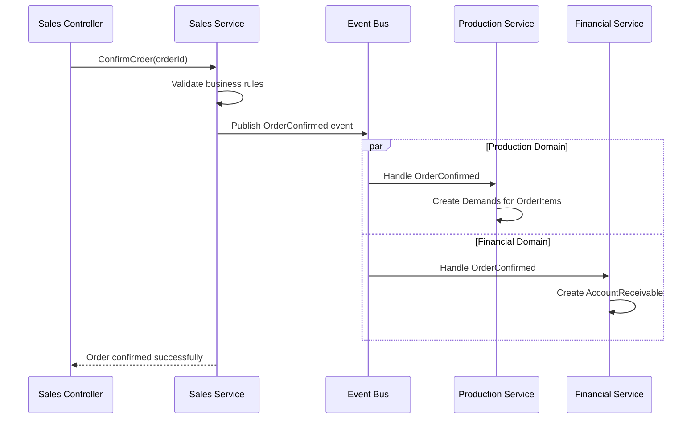
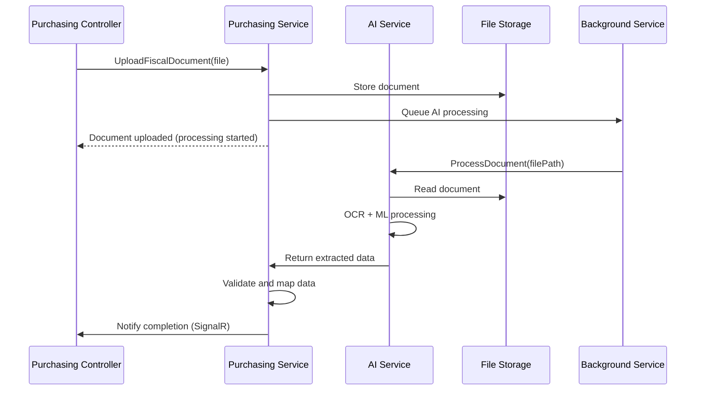

# 🧩 C4 LEVEL 3 - COMPONENT DIAGRAMS

## 🎯 Visão Geral
Diagramas de componentes do sistema GesN mostrando como cada container é decomposto em componentes. Este nível mostra a organização interna dos bounded contexts e suas responsabilidades específicas.

## 📊 Web Application - Component Overview


```mermaid
C4Component
    title Component Diagram - GesN Web Application
    
    Container_Boundary(web_app, "GesN Web Application") {
        
        %% Presentation Layer
        Component(product_controller, "Product Controller", "ASP.NET Core MVC", "Handle requests: catalog, configuration, management")
        Component(sales_controller, "Sales Controller", "ASP.NET Core MVC", "Handle requests: customers, orders, status tracking")
        Component(production_controller, "Production Controller", "ASP.NET Core MVC", "Handle requests: demands, execution, monitoring")
        Component(purchasing_controller, "Purchasing Controller", "ASP.NET Core MVC", "Handle requests: suppliers, purchase orders, IA processing")
        Component(financial_controller, "Financial Controller", "ASP.NET Core MVC", "Handle requests: accounts, transactions, reports")
        
        %% Service Layer (Domain Business Logic)
        Component(product_service, "Product Service", "C# Service", "Product management: types, configuration, validation")
        Component(sales_service, "Sales Service", "C# Service", "Order processing: creation, confirmation, lifecycle")
        Component(production_service, "Production Service", "C# Service", "Demand management: creation, execution, tracking")
        Component(purchasing_service, "Purchasing Service", "C# Service", "Purchase management: suppliers, orders, stock control")
        Component(financial_service, "Financial Service", "C# Service", "Financial management: accounts, transactions, cash flow")
        
        %% Repository Layer (Data Access)
        Component(product_repository, "Product Repository", "Dapper Repository", "CRUD operations: Product, ProductCategory, Components")
        Component(sales_repository, "Sales Repository", "Dapper Repository", "CRUD operations: Customer, OrderEntry, OrderItem")
        Component(production_repository, "Production Repository", "Dapper Repository", "CRUD operations: Demand, ProductComposition, ProductionOrder")
        Component(purchasing_repository, "Purchasing Repository", "Dapper Repository", "CRUD operations: Supplier, PurchaseOrder, Ingredient")
        Component(financial_repository, "Financial Repository", "Dapper Repository", "CRUD operations: Accounts, Transactions")
        
        %% Infrastructure Components
        Component(identity_service, "Identity Service", "ASP.NET Core Identity", "Authentication, authorization, user management")
        Component(integration_service, "Integration Service", "C# Service", "Google Workspace APIs: People, Calendar, Maps")
        Component(ai_service, "AI Service", "C# Service", "Document processing: OCR, ML, data extraction")
        Component(notification_service, "Notification Service", "C# Service", "Email, SMS, in-app notifications")
        Component(audit_service, "Audit Service", "C# Service", "Logging, tracking, compliance")
        Component(cache_service, "Cache Service", "In-Memory Cache", "Performance optimization, data caching")
        
        %% Cross-Cutting Components
        Component(event_bus, "Event Bus", "In-Memory Events", "Domain events coordination between bounded contexts")
        Component(validation_engine, "Validation Engine", "FluentValidation", "Business rules validation across domains")
        Component(mapping_service, "Mapping Service", "AutoMapper", "DTO mapping, data transformation")
    }
    
    ContainerDb(database, "SQLite Database", "SQLite", "Tenant-specific data storage")
    Container_Ext(google_apis, "Google Workspace APIs", "External APIs", "People, Calendar, Maps integration")
    Container_Ext(file_system, "File Storage", "File System", "Documents, images, reports")
    
    %% Controller → Service relationships
    Rel(product_controller, product_service, "Uses", "Business logic")
    Rel(sales_controller, sales_service, "Uses", "Business logic")
    Rel(production_controller, production_service, "Uses", "Business logic")  
    Rel(purchasing_controller, purchasing_service, "Uses", "Business logic")
    Rel(financial_controller, financial_service, "Uses", "Business logic")
    
    %% Service → Repository relationships
    Rel(product_service, product_repository, "Uses", "Data access")
    Rel(sales_service, sales_repository, "Uses", "Data access")
    Rel(production_service, production_repository, "Uses", "Data access")
    Rel(purchasing_service, purchasing_repository, "Uses", "Data access")
    Rel(financial_service, financial_repository, "Uses", "Data access")
    
    %% Repository → Database relationships
    Rel(product_repository, database, "Reads/Writes", "SQL queries")
    Rel(sales_repository, database, "Reads/Writes", "SQL queries")
    Rel(production_repository, database, "Reads/Writes", "SQL queries")
    Rel(purchasing_repository, database, "Reads/Writes", "SQL queries")
    Rel(financial_repository, database, "Reads/Writes", "SQL queries")
    
    %% Cross-domain integrations (Customer-Supplier pattern)
    Rel(sales_service, product_service, "Uses", "Product catalog")
    Rel(sales_service, production_service, "Triggers", "Demand creation")
    Rel(sales_service, financial_service, "Triggers", "Account receivable")
    Rel(production_service, purchasing_service, "Triggers", "Stock consumption")
    Rel(purchasing_service, financial_service, "Triggers", "Account payable")
    
    %% Infrastructure service usage
    Rel(sales_controller, identity_service, "Uses", "Authorization")
    Rel(production_controller, identity_service, "Uses", "Authorization")
    Rel(purchasing_controller, identity_service, "Uses", "Authorization")
    Rel(financial_controller, identity_service, "Uses", "Authorization")
    Rel(product_controller, identity_service, "Uses", "Authorization")
    
    Rel(sales_service, event_bus, "Publishes", "Domain events")
    Rel(production_service, event_bus, "Publishes/Subscribes", "Domain events")
    Rel(purchasing_service, event_bus, "Publishes/Subscribes", "Domain events")
    Rel(financial_service, event_bus, "Subscribes", "Domain events")
    
    Rel(purchasing_service, ai_service, "Uses", "Document processing")
    Rel(production_service, integration_service, "Uses", "Google Calendar")
    Rel(sales_service, integration_service, "Uses", "Google Maps")
    Rel(purchasing_service, integration_service, "Uses", "Google People")
    
    %% External integrations
    Rel(integration_service, google_apis, "Calls", "HTTPS/REST")
    Rel(ai_service, file_system, "Reads/Writes", "Document files")
    
    %% Styling by domain
    UpdateElementStyle(product_controller, $bgColor="#00a86b", $fontColor="white")
    UpdateElementStyle(product_service, $bgColor="#00a86b", $fontColor="white")
    UpdateElementStyle(product_repository, $bgColor="#00a86b", $fontColor="white")
    
    UpdateElementStyle(sales_controller, $bgColor="#f36b21", $fontColor="white")
    UpdateElementStyle(sales_service, $bgColor="#f36b21", $fontColor="white")
    UpdateElementStyle(sales_repository, $bgColor="#f36b21", $fontColor="white")
    
    UpdateElementStyle(production_controller, $bgColor="#fba81d", $fontColor="black")
    UpdateElementStyle(production_service, $bgColor="#fba81d", $fontColor="black")
    UpdateElementStyle(production_repository, $bgColor="#fba81d", $fontColor="black")
    
    UpdateElementStyle(purchasing_controller, $bgColor="#0562aa", $fontColor="white")
    UpdateElementStyle(purchasing_service, $bgColor="#0562aa", $fontColor="white")
    UpdateElementStyle(purchasing_repository, $bgColor="#0562aa", $fontColor="white")
    
    UpdateElementStyle(financial_controller, $bgColor="#083e61", $fontColor="white")
    UpdateElementStyle(financial_service, $bgColor="#083e61", $fontColor="white")
    UpdateElementStyle(financial_repository, $bgColor="#083e61", $fontColor="white")
    
    UpdateElementStyle(identity_service, $bgColor="#8b5cf6", $fontColor="white")
    UpdateElementStyle(integration_service, $bgColor="#ef4444", $fontColor="white")
    UpdateElementStyle(ai_service, $bgColor="#ec4899", $fontColor="white")
    UpdateElementStyle(event_bus, $bgColor="#6b7280", $fontColor="white")
```

## 📦 Detalhamento por Bounded Context

### **📦 PRODUCT DOMAIN COMPONENTS**

#### **🎮 Product Controller**
```
Responsabilidades:
├── 📋 ProductController
│   ├── GET /Product - Listar produtos
│   ├── GET /Product/{id} - Detalhes produto
│   ├── POST /Product - Criar produto
│   ├── PUT /Product/{id} - Atualizar produto
│   └── DELETE /Product/{id} - Remover produto
├── 📂 ProductCategoryController
│   ├── GET /ProductCategory - Listar categorias
│   └── POST /ProductCategory - Criar categoria
└── 🧩 ProductComponentController
    ├── GET /ProductComponent - Listar componentes
    └── POST /ProductComponent - Criar componente

Validações:
├── ✅ Authorize attributes por role
├── 📊 Model validation (FluentValidation)
├── 🔒 Tenant isolation verification
└── 📝 Input sanitization
```

#### **⚙️ Product Service**
```
Métodos Principais:
├── 📦 CreateProductAsync(ProductCreateDto)
├── 🔍 GetProductByIdAsync(string id)
├── 📋 GetProductsByTypeAsync(ProductType type)
├── ✅ ValidateProductConfigurationAsync(ProductConfigDto)
├── 💰 CalculateProductPriceAsync(string id, ConfigDto config)
└── 🔄 UpdateProductAsync(string id, ProductUpdateDto)

Regras de Negócio:
├── 🎯 Product type-specific validation (TPH)
├── 🧩 Component hierarchy validation (Composite)
├── 📊 Group item validation (Group)
├── 💰 Price calculation with components
└── 🔍 SKU uniqueness verification

Integrações:
├── 🎯 Product Repository (data access)
├── 🔔 Event Bus (ProductCreated, ProductUpdated)
├── 💾 Cache Service (product catalog caching)
└── 📊 Validation Engine (business rules)
```

#### **🗄️ Product Repository**
```
Operações CRUD:
├── 📦 Products (base table with TPH discriminator)
├── 📂 ProductCategories
├── 🧩 ProductComponents
├── 🏗️ ProductComponentHierarchy
├── 🔗 CompositeProductXHierarchy
├── 📦 ProductGroupItems
└── ⚖️ ProductGroupExchangeRules

Queries Especializadas:
├── 🔍 GetProductsWithConfigurationAsync()
├── 📊 GetProductsByTypeAsync(ProductType)
├── 🧩 GetComponentsByHierarchyAsync(string hierarchyId)
├── 💰 GetProductPricingDataAsync(string productId)
└── 📈 GetProductMetricsAsync()

Performance:
├── 🎯 Eager loading para relacionamentos
├── 💾 Query result caching
├── 📊 Optimized JOIN queries
└── 🔍 Indexed searches por SKU/Name
```

### **💰 SALES DOMAIN COMPONENTS**

#### **🎮 Sales Controllers**
```
CustomerController:
├── GET /Customer - Lista paginada clientes
├── POST /Customer - Criar cliente
├── PUT /Customer/{id} - Atualizar cliente
└── GET /Customer/{id}/Orders - Histórico pedidos

OrderController:
├── GET /Order - Lista pedidos (filtros)
├── GET /Order/{id} - Detalhes pedido
├── POST /Order - Criar pedido (modal rápido)
├── PUT /Order/{id} - Atualizar pedido
├── POST /Order/{id}/Confirm - Confirmar pedido
├── POST /Order/{id}/Cancel - Cancelar pedido
└── GET /Order/{id}/Status - Tracking em tempo real

OrderItemController:
├── POST /Order/{orderId}/Items - Adicionar item
├── PUT /OrderItem/{id} - Configurar item
├── DELETE /OrderItem/{id} - Remover item
└── POST /OrderItem/{id}/Configure - Config produtos compostos
```

#### **⚙️ Sales Service**
```
Principais Operações:
├── 🆕 CreateOrderAsync(OrderCreateDto)
├── ✅ ConfirmOrderAsync(string orderId)
├── 📦 AddOrderItemAsync(string orderId, OrderItemDto)
├── 🧩 ConfigureCompositeProductAsync(string itemId, ConfigDto)
├── 📊 CalculateOrderTotalAsync(string orderId)
└── 🔄 UpdateOrderStatusAsync(string orderId, OrderStatus status)

Business Logic Complexa:
├── 🎯 Product type detection (Simple/Composite/Group)
├── 🧩 Composite product configuration validation
├── 📦 Group product explosion logic
├── 💰 Dynamic pricing calculation
├── 📅 Delivery date validation
└── 👤 Customer credit limit verification

Event Publishing:
├── 📋 OrderCreated
├── ✅ OrderConfirmed (triggers production + financial)
├── 📦 OrderItemAdded
├── 🧩 ProductConfigured
└── ❌ OrderCancelled
```

### **🏭 PRODUCTION DOMAIN COMPONENTS**

#### **🎮 Production Controller**
```
DemandController:
├── GET /Demand - Lista demands (filtros por status)
├── GET /Demand/{id} - Detalhes demand + composition
├── PUT /Demand/{id}/Status - Atualizar status
└── POST /Demand/{id}/Start - Iniciar produção

ProductionOrderController:
├── GET /ProductionOrder - Lista ordens produção
├── POST /ProductionOrder - Criar ordem (agrupa demands)
├── PUT /ProductionOrder/{id}/Schedule - Agendar produção
├── POST /ProductionOrder/{id}/Start - Iniciar lote
└── GET /ProductionOrder/{id}/Progress - Progresso tempo real

ProductCompositionController:
├── GET /Demand/{id}/Composition - Lista tarefas
├── PUT /ProductComposition/{id}/Start - Iniciar tarefa
├── PUT /ProductComposition/{id}/Complete - Finalizar tarefa
└── POST /ProductComposition/{id}/ConsumeIngredient - Registrar consumo
```

#### **⚙️ Production Service**
```
Demand Management:
├── 🆕 CreateDemandFromOrderItemAsync(OrderItem)
├── 🧩 CreateProductCompositionAsync(Demand, ProductConfig)
├── 📊 CalculateDemandEstimatesAsync(string demandId)
├── ⚡ ProcessDemandStatusChangeAsync(string demandId, DemandStatus)
└── 🔄 SyncDemandWithOrderAsync(string demandId)

Production Execution:
├── 🏭 CreateProductionOrderAsync(List<string> demandIds)
├── ⏰ ScheduleProductionAsync(string productionOrderId, DateTime date)
├── ▶️ StartProductionAsync(string productionOrderId)
├── 📊 TrackProductionProgressAsync(string productionOrderId)
└── ✅ CompleteProductionAsync(string productionOrderId)

Integrations:
├── 🛒 Purchasing Service (ingredient consumption)
├── 💰 Sales Service (demand status updates)
├── 📅 Google Calendar (production scheduling)
└── 🔔 Notification Service (alerts)
```

### **🛒 PURCHASING DOMAIN COMPONENTS**

#### **🎮 Purchasing Controllers**
```
SupplierController:
├── GET /Supplier - Lista fornecedores
├── POST /Supplier - Criar fornecedor
├── PUT /Supplier/{id} - Atualizar fornecedor
└── GET /Supplier/{id}/Performance - Métricas fornecedor

PurchaseOrderController:
├── GET /PurchaseOrder - Lista ordens compra
├── POST /PurchaseOrder - Criar ordem (manual/IA)
├── POST /PurchaseOrder/UploadFiscalDocument - Upload nota fiscal
├── PUT /PurchaseOrder/{id}/Send - Enviar ao fornecedor
├── POST /PurchaseOrder/{id}/Receive - Registrar recebimento
└── GET /PurchaseOrder/{id}/Status - Status tracking

IngredientController:
├── GET /Ingredient - Lista ingredientes
├── POST /Ingredient - Criar ingrediente
├── GET /Ingredient/{id}/Stock - Níveis estoque
└── GET /Ingredient/LowStock - Alertas estoque mínimo
```

#### **⚙️ Purchasing Service**
```
Purchase Order Management:
├── 🆕 CreatePurchaseOrderAsync(PurchaseOrderDto)
├── 🤖 ProcessFiscalDocumentWithAIAsync(Stream document)
├── ✅ ValidateAIExtractedDataAsync(AIExtractedData)
├── 📤 SendPurchaseOrderAsync(string orderId)
├── 📦 ReceivePurchaseOrderAsync(string orderId, ReceiveDto)
└── 📊 EvaluateSupplierPerformanceAsync(string supplierId)

AI Processing:
├── 📄 ExtractDataFromDocumentAsync(Stream document)
├── 🔍 MapSuppliersFromExtractedDataAsync(SupplierData)
├── 🧩 MapIngredientsFromExtractedDataAsync(List<ItemData>)
├── ✅ ValidateExtractedDataAsync(ExtractedData)
└── 📋 GeneratePrefilledFormAsync(ExtractedData)

Stock Management:
├── 📊 CheckLowStockIngredientsAsync()
├── 💡 GeneratePurchaseSuggestionsAsync()
├── 📦 UpdateStockOnReceiptAsync(string orderId)
├── 🥘 ReserveIngredientsAsync(List<IngredientReservation>)
└── 📈 CalculateStockMetricsAsync()
```

### **💳 FINANCIAL DOMAIN COMPONENTS**

#### **🎮 Financial Controllers**
```
AccountReceivableController:
├── GET /AccountReceivable - Lista contas a receber
├── POST /AccountReceivable/{id}/Payment - Registrar recebimento
├── GET /AccountReceivable/Overdue - Contas vencidas
└── GET /AccountReceivable/{id}/Installments - Parcelas

AccountPayableController:
├── GET /AccountPayable - Lista contas a pagar
├── POST /AccountPayable/{id}/Payment - Registrar pagamento
├── GET /AccountPayable/Overdue - Contas vencidas
└── GET /AccountPayable/DueToday - Vencimentos hoje

TransactionController:
├── GET /Transaction - Extrato transações
├── POST /Transaction - Registrar transação manual
├── POST /Transaction/Reconcile - Conciliação bancária
└── GET /Transaction/CashFlow - Fluxo de caixa

ReportController:
├── GET /Report/Profitability - Relatório lucratividade
├── GET /Report/CashFlow - Projeção fluxo caixa
├── GET /Report/AgingReport - Relatório aging
└── GET /Report/Dashboard - Dashboard executivo
```

#### **⚙️ Financial Service**
```
Account Management:
├── 🆕 CreateAccountReceivableAsync(OrderEntry)
├── 🆕 CreateAccountPayableAsync(PurchaseOrder)
├── 💰 ProcessPaymentAsync(string accountId, PaymentDto)
├── 📊 CalculateInstallmentsAsync(decimal amount, PaymentTerms)
└── ⚠️ ProcessOverdueAccountsAsync()

Transaction Processing:
├── 💳 CreateTransactionAsync(TransactionDto)
├── 🏦 ReconcileTransactionAsync(string transactionId, BankData)
├── 📊 CalculateCashFlowAsync(DateTime start, DateTime end)
├── 📈 GenerateProfitabilityReportAsync(string orderId)
└── 💹 UpdateFinancialMetricsAsync()

Integration Events:
├── 📥 Handle OrderConfirmed (create AR)
├── 📥 Handle PurchaseCompleted (create AP)
├── 📥 Handle PaymentReceived (update AR)
├── 📥 Handle PaymentMade (update AP)
└── 📤 Publish CashFlowUpdated
```

## 🔧 Infrastructure Components

### **🔐 Identity Service**
```
ASP.NET Core Identity Features:
├── 👤 User management per tenant
├── 🎭 Role-based authorization
├── 🎯 Claims-based permissions
├── 🔒 Password policies
├── 🔑 Two-factor authentication
└── 📊 Audit trail

Tenant Isolation:
├── 🏠 Separate Identity tables per tenant
├── 🔒 Cross-tenant access prevention
├── 🎯 Role scoping within tenant
└── 📋 Permission inheritance
```

### **🌐 Integration Service**
```
Google Workspace APIs:
├── 👥 People API Client
│   ├── SyncContactsAsync()
│   ├── CreateContactAsync(Customer)
│   └── UpdateContactAsync(string id, ContactData)
├── 📅 Calendar API Client
│   ├── CreateEventAsync(ProductionOrder)
│   ├── UpdateEventAsync(string eventId, EventData)
│   └── DeleteEventAsync(string eventId)
└── 🗺️ Maps API Client
    ├── CalculateRouteAsync(string origin, string destination)
    ├── GetDistanceMatrixAsync(List<Address>)
    └── GeocodingAsync(string address)

Circuit Breaker Pattern:
├── ⚡ Auto-retry on transient failures
├── 🔴 Circuit open on consecutive failures
├── 💾 Fallback to cached data
└── 📊 Health check monitoring
```

### **🤖 AI Service**
```
Document Processing Pipeline:
├── 📄 OCR Engine (Extract text from images/PDF)
├── 🧠 ML Models (Classification + Named Entity Recognition)
├── 🔍 Data Mapping (Match suppliers/ingredients)
├── ✅ Confidence Scoring (Accuracy assessment)
└── 📋 Result Formatting (Structured JSON output)

Processing Steps:
├── 1️⃣ File upload validation
├── 2️⃣ OCR text extraction
├── 3️⃣ Document type classification
├── 4️⃣ Entity extraction (supplier, items, values)
├── 5️⃣ Data mapping to system entities
├── 6️⃣ Confidence calculation
└── 7️⃣ Human validation queue
```

### **âš¡ Event Bus**
```
In-Memory Event Coordination:
├── 📤 Event Publishing (IEventPublisher)
├── 📥 Event Subscription (IEventHandler<T>)
├── 🔄 Event Routing (by event type)
├── ⚡ Async Processing (BackgroundService)
└── 📊 Event Tracking (audit + metrics)

Key Events:
├── 💰 OrderConfirmed → Create Demands + AccountReceivable
├── 🏭 DemandCreated → Check ingredient availability
├── 📦 ProductionCompleted → Update order status
├── 🛒 PurchaseReceived → Update stock + AccountPayable
└── 💳 PaymentReceived → Update account status
```

## 🔄 Component Interaction Patterns

### **📊 Cross-Domain Integration Pattern**

```mermaid
sequenceDiagram
    participant SC as Sales Controller
    participant SS as Sales Service
    participant EB as Event Bus
    participant PS as Production Service
    participant FS as Financial Service
    
    SC->>SS: ConfirmOrder(orderId)
    SS->>SS: Validate business rules
    SS->>EB: Publish OrderConfirmed event
    
    par Production Domain
        EB->>PS: Handle OrderConfirmed
        PS->>PS: Create Demands for OrderItems
    and Financial Domain
        EB->>FS: Handle OrderConfirmed
        FS->>FS: Create AccountReceivable
    end
    
    SS-->>SC: Order confirmed successfully
```

### **🤖 AI Processing Pattern**

```mermaid
sequenceDiagram
    participant PC as Purchasing Controller
    participant PS as Purchasing Service
    participant AI as AI Service
    participant FS as File Storage
    participant BGS as Background Service
    
    PC->>PS: UploadFiscalDocument(file)
    PS->>FS: Store document
    PS->>BGS: Queue AI processing
    PS-->>PC: Document uploaded (processing started)
    
    BGS->>AI: ProcessDocument(filePath)
    AI->>FS: Read document
    AI->>AI: OCR + ML processing
    AI->>PS: Return extracted data
    PS->>PS: Validate and map data
    PS->>PC: Notify completion (SignalR)
```

## 📊 Performance and Monitoring

### **🎯 Component SLA Targets**
| Component | Response Time | Throughput | Error Rate |
|-----------|---------------|------------|------------|
| **Controllers** | < 200ms | 1000 req/min | < 0.1% |
| **Services** | < 100ms | 5000 ops/min | < 0.01% |
| **Repositories** | < 50ms | 10000 queries/min | < 0.001% |
| **AI Service** | < 30s | 100 docs/hour | < 5% |
| **Integration Service** | < 2s | 1000 API calls/hour | < 1% |

### **📈 Monitoring Strategy**
```
Metrics Collection:
├── 🎮 Controller: Request count, response time, error rate
├── ⚙️ Service: Method execution time, business rule violations
├── 🗄️ Repository: Query performance, connection pooling
├── 🤖 AI Service: Processing time, accuracy rate, queue length
├── 🌐 Integration: API latency, quota usage, circuit breaker status
└── 📊 Event Bus: Event throughput, processing lag, dead letters
```

---

**Arquivo**: `level3-component-diagrams.md`  
**Nível C4**: 3 - Component  
**Audiência**: Arquitetos de software e desenvolvedores  
**Foco**: Organização interna dos containers em componentes  
**Atualização**: 16/06/2025
