# 🏗️ DIAGRAMA DE CLASSES - HERANÇA TPH DO DOMÍNIO DE PRODUTO

## 🎯 Visão Geral
Diagrama de classes mostrando a implementação de herança Table Per Hierarchy (TPH) do Domínio de Produto, incluindo a classe abstrata base, classes derivadas, interfaces de serviços e padrões arquiteturais implementados.

## 🧬 Diagrama de Herança e Interfaces

```mermaid
classDiagram
    %% ==========================================
    %% CLASSE ABSTRATA BASE
    %% ==========================================
    class Product {
        <<abstract>>
        +string Id
        +ProductType ProductType*
        +string Name
        +string Description
        +decimal Price
        +int QuantityPrice
        +decimal UnitPrice
        +decimal Cost
        +string CategoryId
        +string SKU
        +string ImageUrl
        +string Note
        +int AssemblyTime
        +string AssemblyInstructions
        +string StateCode
        +datetime CreatedDate
        +datetime ModifiedDate
        +ProductCategory CategoryNavigation
        
        +CalculateUnitPrice() decimal
        +IsActive() bool
        +ValidateBusinessRules() bool*
        +GetAssemblyInstructions() string
    }

    %% ==========================================
    %% ENUMERADOR DE TIPOS
    %% ==========================================
    class ProductType {
        <<enumeration>>
        Simple
        Composite
        Group
    }

    %% ==========================================
    %% CLASSES DERIVADAS (TPH)
    %% ==========================================
    class SimpleProduct {
        +ValidateBusinessRules() bool
        +CalculateCost() decimal
        +GetRequiredIngredients() List~ProductIngredient~
    }

    class CompositeProduct {
        +ICollection~CompositeProductXHierarchy~ Hierarchies
        +ValidateBusinessRules() bool
        +CalculateCost() decimal
        +ValidateComponentConfiguration(config) bool
        +GetAvailableComponents() List~ProductComponent~
        +CalculateCompositePrice(selections) decimal
    }

    class ProductGroup {
        +ICollection~ProductGroupItem~ GroupItems
        +ICollection~ProductGroupExchangeRule~ ExchangeRules
        +ValidateBusinessRules() bool
        +CalculateCost() decimal
        +ValidateGroupConfiguration(config) bool
        +ApplyExchangeRules(exchanges) bool
        +CalculateGroupPrice(configuration) decimal
    }

    %% ==========================================
    %% ENTIDADES RELACIONADAS
    %% ==========================================
    class ProductCategory {
        +string Id
        +string Name
        +string Description
        +string StateCode
        +datetime CreatedDate
        +datetime ModifiedDate
    }

    class ProductComponentHierarchy {
        +string Id
        +string Name
        +string Description
        +string Notes
        +string StateCode
        +ICollection~ProductComponent~ Components
        +ICollection~CompositeProductXHierarchy~ CompositeProductRelations
    }

    class ProductComponent {
        +string Id
        +string Name
        +string Description
        +string ProductComponentHierarchyId
        +decimal AdditionalCost
        +string StateCode
        +ProductComponentHierarchy ProductComponentHierarchy
    }

    class CompositeProductXHierarchy {
        +int Id
        +string ProductComponentHierarchyId
        +string ProductId
        +int MinQuantity
        +int MaxQuantity
        +bool IsOptional
        +int AssemblyOrder
        +string Notes
    }

    class ProductGroupItem {
        +string Id
        +string ProductGroupId
        +string ProductId
        +string ProductCategoryId
        +int Quantity
        +int MinQuantity
        +int MaxQuantity
        +int DefaultQuantity
        +bool IsOptional
        +decimal ExtraPrice
        +string StateCode
    }

    class ProductGroupExchangeRule {
        +string Id
        +string ProductGroupId
        +string SourceGroupItemId
        +int SourceGroupItemWeight
        +string TargetGroupItemId
        +int TargetGroupItemWeight
        +decimal ExchangeRatio
        +bool IsActive
        +string StateCode
    }

    %% ==========================================
    %% INTERFACES DE SERVIÇOS
    %% ==========================================
    class IProductService {
        <<interface>>
        +GetByIdAsync(id) Task~Product~
        +GetByTypeAsync(type) Task~List~Product~~
        +CreateAsync(product) Task~string~
        +UpdateAsync(product) Task~bool~
        +DeleteAsync(id) Task~bool~
        +ValidateProductAsync(product) Task~bool~
        +CalculateProductCostAsync(id) Task~decimal~
        +GetActiveProductsAsync() Task~List~Product~~
        +SearchProductsAsync(criteria) Task~List~Product~~
    }

    class IProductRepository {
        <<interface>>
        +GetByIdAsync(id) Task~Product~
        +GetByTypeAsync(type) Task~IEnumerable~Product~~
        +CreateAsync(product) Task~string~
        +UpdateAsync(product) Task~bool~
        +DeleteAsync(id) Task~bool~
        +GetWithCategoryAsync(id) Task~Product~
        +GetActiveAsync() Task~IEnumerable~Product~~
    }

    %% ==========================================
    %% IMPLEMENTAÇÕES DE SERVIÇOS
    %% ==========================================
    class ProductService {
        -IProductRepository _productRepository
        -IProductCategoryService _categoryService
        -IProductComponentService _componentService
        
        +GetByIdAsync(id) Task~Product~
        +CreateAsync(product) Task~string~
        +UpdateAsync(product) Task~bool~
        +ValidateProductAsync(product) Task~bool~
        +CalculateProductCostAsync(id) Task~decimal~
        -ConfigureProductType(product) void
        -ValidateSimpleProduct(product) bool
        -ValidateCompositeProduct(product) bool
        -ValidateProductGroup(product) bool
    }

    class ProductRepository {
        -IDbConnection _connection
        
        +GetByIdAsync(id) Task~Product~
        +CreateAsync(product) Task~string~
        +UpdateAsync(product) Task~bool~
        +DeleteAsync(id) Task~bool~
        -MapToProduct(reader) Product
        -GetProductType(reader) ProductType
    }

    %% ==========================================
    %% RELACIONAMENTOS DE HERANÇA
    %% ==========================================
    Product <|-- SimpleProduct : inherits
    Product <|-- CompositeProduct : inherits
    Product <|-- ProductGroup : inherits
    
    Product --> ProductType : uses
    Product --> ProductCategory : belongs to

    %% ==========================================
    %% RELACIONAMENTOS DE COMPOSIÇÃO
    %% ==========================================
    CompositeProduct "1" --> "*" CompositeProductXHierarchy : configures
    CompositeProductXHierarchy "*" --> "1" ProductComponentHierarchy : references
    ProductComponentHierarchy "1" --> "*" ProductComponent : contains

    ProductGroup "1" --> "*" ProductGroupItem : contains
    ProductGroup "1" --> "*" ProductGroupExchangeRule : defines

    ProductGroupItem "*" --> "1" Product : can reference
    ProductGroupItem "*" --> "1" ProductCategory : can reference

    %% ==========================================
    %% RELACIONAMENTOS DE DEPENDÊNCIA
    %% ==========================================
    IProductService <|.. ProductService : implements
    IProductRepository <|.. ProductRepository : implements
    ProductService --> IProductRepository : depends on
    ProductService --> Product : manages

    %% ==========================================
    %% STYLING POR DOMÍNIO
    %% ==========================================
    
    %% CLASSES PRINCIPAIS = Verde escuro
    class Product {
        background-color: #00a86b
        color: white
    }
    class SimpleProduct {
        background-color: #00a86b
        color: white
    }
    class CompositeProduct {
        background-color: #00a86b
        color: white
    }
    class ProductGroup {
        background-color: #00a86b
        color: white
    }
    
    %% ENTIDADES RELACIONADAS = Verde médio
    class ProductCategory {
        background-color: #2dd4aa
        color: black
    }
    class ProductComponentHierarchy {
        background-color: #2dd4aa
        color: black
    }
    class ProductComponent {
        background-color: #2dd4aa
        color: black
    }
    class CompositeProductXHierarchy {
        background-color: #2dd4aa
        color: black
    }
    class ProductGroupItem {
        background-color: #2dd4aa
        color: black
    }
    class ProductGroupExchangeRule {
        background-color: #2dd4aa
        color: black
    }
    
    %% INTERFACES = Verde claro
    class IProductService {
        background-color: #a7f3d0
        color: black
    }
    class IProductRepository {
        background-color: #a7f3d0
        color: black
    }
    
    %% IMPLEMENTAÇÕES = Verde médio
    class ProductService {
        background-color: #6ee7b7
        color: black
    }
    class ProductRepository {
        background-color: #6ee7b7
        color: black
    }
    
    %% ENUMERAÇÃO = Cinza
    class ProductType {
        background-color: #e5e7eb
        color: black
    }
```



## 📋 Detalhes da Implementação

### **🏗️ Padrão Table Per Hierarchy (TPH)**
- **Estratégia**: Uma única tabela `Product` para todos os tipos
- **Discriminador**: Coluna `ProductType` (Simple|Composite|Group)
- **Vantagens**: Performance, simplicidade de queries, integridade referencial
- **Constraint**: `CHECK (ProductType IN ('Simple', 'Composite', 'Group'))`

### **🧬 Hierarquia de Classes**

#### **Product (Classe Abstrata Base)**
- Contém todas as propriedades comuns
- Método abstrato `ValidateBusinessRules()`
- Métodos virtuais para override nas classes derivadas

#### **SimpleProduct**
- Implementação mais simples
- Validação básica de nome e preço
- Cálculo de custo baseado em ingredientes

#### **CompositeProduct**
- Relacionamento com hierarquias de componentes
- Validação complexa de configurações
- Cálculo dinâmico de preço baseado em seleções

#### **ProductGroup**
- Relacionamento com itens do grupo
- Regras de troca entre itens
- Cálculo de preço baseado em configuração

### **🔧 Padrões Arquiteturais Implementados**

#### **Repository Pattern**
- `IProductRepository`: Interface de acesso a dados
- `ProductRepository`: Implementação usando Dapper
- Abstração do acesso a dados

#### **Service Layer Pattern**
- `IProductService`: Interface de regras de negócio
- `ProductService`: Implementação das regras
- Orquestração entre repository e validações

#### **Strategy Pattern**
- Validação específica por tipo de produto
- Cálculo de custo específico por tipo
- Configuração específica por tipo

#### **Factory Pattern** (Implícito)
- Criação de instâncias corretas baseada em ProductType
- Mapping automático no Repository

### **⚖️ Regras de Negócio por Tipo**

#### **Simple Product**
```csharp
public override bool ValidateBusinessRules()
{
    return !string.IsNullOrEmpty(Name) && 
           Price > 0 && 
           Cost >= 0;
}
```

#### **Composite Product**
```csharp
public override bool ValidateBusinessRules()
{
    return base.ValidateBusinessRules() && 
           Hierarchies.Any() &&
           Hierarchies.All(h => h.MinQuantity >= 1);
}
```

#### **Product Group**
```csharp
public override bool ValidateBusinessRules()
{
    return base.ValidateBusinessRules() && 
           GroupItems.Any() &&
           GroupItems.All(i => i.IsValidConfiguration());
}
```

## 🔄 Fluxo de Criação de Produtos

1. **Cliente chama** `ProductService.CreateAsync(product)`
2. **Service valida** tipo e regras de negócio
3. **Service configura** propriedades específicas do tipo
4. **Repository persiste** na tabela Product com discriminador
5. **Sistema retorna** ID do produto criado

---

**Arquivo**: `product-tph-inheritance.md`  
**Domínio**: Produto (#00a86b)  
**Tipo**: Class Diagram  
**Padrão**: Table Per Hierarchy (TPH)
