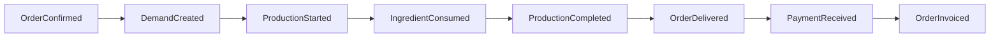

# âš¡ EVENT STORMING - SISTEMA GesN

## 🎯 Visão Geral
Event Storming é uma técnica colaborativa para mapear o domínio de negócio através de eventos, comandos, agregados e outros elementos do Domain-Driven Design (DDD). Este diretório contém o mapeamento completo dos eventos do sistema GesN.

## 📋 Estrutura por Domínio

### **🗂️ Organização dos Arquivos**

| Domínio | Arquivo | Foco Principal |
|---------|---------|----------------|
| **📦 Produto** | [`product-domain-events.md`](./product-domain-events.md) | Criação produtos, configurações, validações |
| **💰 Vendas** | [`sales-domain-events.md`](./sales-domain-events.md) | Pedidos, confirmações, integrações |
| **🏭 Produção** | [`production-domain-events.md`](./production-domain-events.md) | Demandas, execução, finalização |
| **🛒 Compras** | [`purchasing-domain-events.md`](./purchasing-domain-events.md) | Ordens compra, recebimentos, IA |
| **💳 Financeiro** | [`financial-domain-events.md`](./financial-domain-events.md) | Contas, transações, conciliação |

## 🎨 Convenções do Event Storming

### **🎭 Elementos e Cores**

| Elemento | Cor | Formato | Descrição |
|----------|-----|---------|-----------|
| **📋 Comando** | `#3b82f6` (Azul) | `[CreateOrder]` | Ação que inicia processo |
| **âš¡ Evento** | `#f59e0b` (Laranja) | `OrderCreated` | Fato que aconteceu |
| **👤 Ator** | `#10b981` (Verde) | `(Customer)` | Quem executa comando |
| **📊 Agregado** | `#8b5cf6` (Roxo) | `{OrderEntry}` | Entidade que processa |
| **📋 Read Model** | `#6b7280` (Cinza) | `[OrderSummary]` | Projeção para leitura |
| **🔗 Sistema Externo** | `#ef4444` (Vermelho) | `<GoogleCalendar>` | Dependência externa |
| **⚠️ Hotspot** | `#ec4899` (Rosa) | `(!ComplexRule!)` | Regra complexa/problema |

### **🔄 Fluxo Temporal**
```
Comando → Evento → Reação → Novo Comando → Novo Evento...
```

### **🏗️ Estrutura de Cada Domínio**

#### **1. 📋 Comandos (Commands)**
- Ações que usuários/sistemas executam
- Verbos no imperativo
- Podem falhar (validações)

#### **2. âš¡ Eventos (Domain Events)**
- Fatos que aconteceram
- Verbos no passado
- Sempre bem-sucedidos

#### **3. 📊 Agregados (Aggregates)**
- Entidades que processam comandos
- Garantem consistência
- Geram eventos

#### **4. 👥 Atores (Actors)**
- Usuários do sistema
- Sistemas externos
- Processos automáticos

#### **5. 🔄 Políticas (Policies)**
- Regras de negócio
- "Quando X acontece, então Y"
- Conectam eventos a comandos

## ⚡ Eventos de Alto Nível

### **🎯 Eventos Críticos Cross-Domain**

| Evento | Domínio Origem | Domínios Impactados | Criticidade |
|--------|----------------|-------------------|------------|
| `OrderConfirmed` | Vendas | Produção + Financeiro | 🚨 Crítico |
| `DemandCreated` | Produção | Compras (se ingredients low) | ⚠️ Alto |
| `ProductionCompleted` | Produção | Vendas + Financeiro | 🚨 Crítico |
| `PurchaseReceived` | Compras | Produção + Financeiro | ⚠️ Alto |
| `PaymentReceived` | Financeiro | Vendas | 🚨 Crítico |

### **🔗 Cadeia de Eventos Típica**

```mermaid
graph LR
    A[OrderConfirmed] --> B[DemandCreated]
    B --> C[ProductionStarted]
    C --> D[IngredientConsumed]
    D --> E[ProductionCompleted]
    E --> F[OrderDelivered]
    F --> G[PaymentReceived]
    G --> H[OrderInvoiced]
```

## 🎯 Micro-Eventos

### **📊 Granularidade Detalhada**

| Nível | Exemplo | Quando Usar |
|-------|---------|-------------|
| **Alto Nível** | `OrderConfirmed` | Integrações entre domínios |
| **Médio Nível** | `OrderItemAdded` | Dentro do domínio |
| **Micro Nível** | `ProductComponentCompleted` | Tracking detalhado |

### **⚙️ Estratégia de Implementação**
- **Alto Nível**: Event Bus para integrações
- **Médio Nível**: Domain Events locais
- **Micro Nível**: Audit log + métricas

## 📊 Padrões de Eventos

### **🔄 Padrões Identificados**

#### **1. Saga Pattern**
```
OrderConfirmed → DemandCreated → ProductionScheduled → IngredientReserved
```

#### **2. Event Sourcing Candidates**
- OrderEntry lifecycle
- Demand status changes
- Account payment history

#### **3. CQRS Opportunities**
- Product catalog (read-heavy)
- Financial reports (complex queries)
- Production dashboard (real-time)

## 🚨 Hotspots Identificados

### **⚠️ Complexidades do Negócio**

| Hotspot | Domínio | Descrição | Impacto |
|---------|---------|-----------|---------|
| **Product Configuration** | Produto/Vendas | Validação de componentes compostos | Alto |
| **Demand Explosion** | Vendas/Produção | 1 OrderItem → N Demands | Crítico |
| **Stock Reservation** | Produção/Compras | Concorrência de ingredientes | Alto |
| **Payment Reconciliation** | Financeiro | Match transação ↔ conta | Médio |

---

**Criado em**: 16/06/2025  
**Versão**: 1.0  
**Técnica**: Event Storming by Alberto Brandolini  
**Escopo**: 5 Domínios + Integrações Google Workspace
