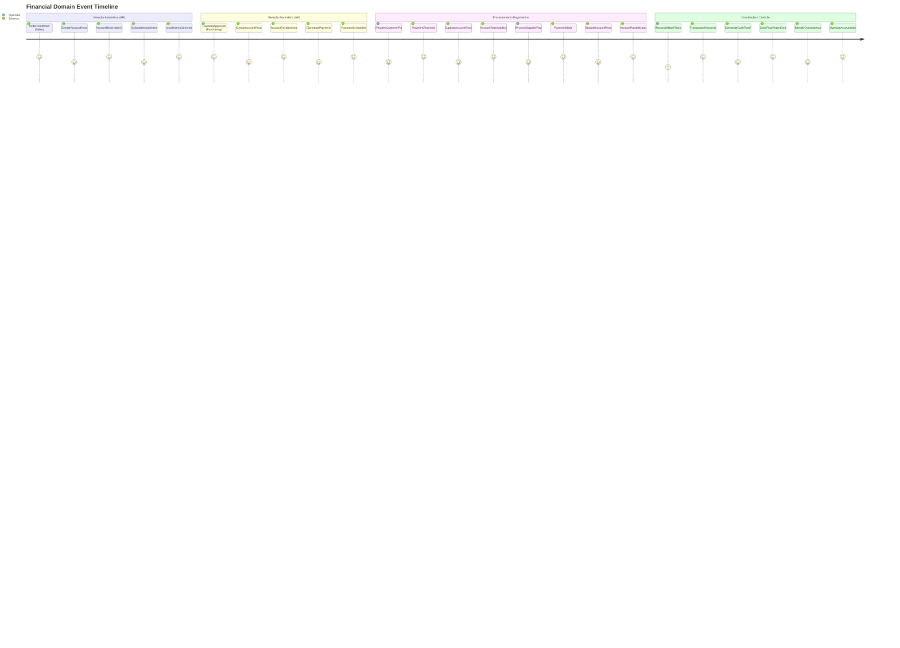

# 💳 EVENT STORMING - DOMÍNIO FINANCEIRO

## 🎯 Visão Geral
Event Storming do Domínio Financeiro mapeando todo o fluxo de gestão financeira, desde a geração automática de contas a receber e a pagar até a conciliação bancária, incluindo processamento de pagamentos, controle de fluxo de caixa, e geração de relatórios financeiros com integrações críticas com todos os outros domínios.

## 🎨 Convenções Visuais
- **📋 [Comando]** - Azul - Ação executada por usuário/sistema
- **⚡ Evento** - Laranja - Fato que aconteceu no domínio
- **👤 (Ator)** - Verde - Quem executa o comando
- **📊 {Agregado}** - Roxo - Entidade que processa comando
- **🔄 Política** - Cinza - Regra "quando X então Y"
- **⚠️ (!Hotspot!)** - Rosa - Complexidade/problema identificado
- **🏦 <Banking System>** - Vermelho - Sistema bancário externo
- **📊 <BI System>** - Vermelho - Sistema de Business Intelligence

## ⚡ Event Storming Timeline

### **🔄 Fluxo Principal - Gestão Financeira Completa**



### **📋 Comandos por Ator**

#### **🤖 Sistema (Automático - Cross-Domain Integration)**
```
[CreateAccountReceivable]
├── Trigger: OrderConfirmed event from Sales domain
├── Input: OrderEntry data, Customer info, Payment terms
├── Calculation: Total amount, Due dates, Payment method
├── Installment logic: Break down payment if needed
├── Output: AccountReceivableId
└── Events: AccountReceivableCreated, InstallmentsGenerated

[CreateAccountPayable]
├── Trigger: PaymentApproved event from Purchasing domain
├── Input: PurchaseOrder data, Supplier info, Payment terms
├── Calculation: Total amount, Due dates, Payment schedule
├── Output: AccountPayableId
└── Events: AccountPayableCreated, PaymentScheduled

[CalculateInstallments]
├── Trigger: AccountReceivableCreated (if installment payment)
├── Input: TotalAmount, PaymentTerms, InstallmentCount
├── Complex calculation: Interest rates, Due dates, Amounts per installment
├── Output: InstallmentIds[]
└── Events: InstallmentsGenerated

[UpdateCashFlow]
├── Trigger: PaymentReceived, PaymentMade, TransactionReconciled
├── Input: TransactionData, Impact type (In/Out)
├── Calculation: Current balance, Projected cash flow
├── Auto-execution: Real-time after financial events
└── Events: CashFlowUpdated

[IdentifyOverdueAccounts]
├── Trigger: Daily scheduler (end of day)
├── Input: All pending accounts, Current date
├── Overdue detection: Compare due dates with current date
├── Alert generation: Create overdue alerts with severity
├── Output: OverdueAccountIds[]
└── Events: OverdueAccountsIdentified, OverdueAlertsGenerated

[CalculateFinancialMetrics]
├── Trigger: CashFlowUpdated, MonthlyScheduler
├── Input: All financial transactions, Period data
├── Complex calculations: Revenue, Profit, Margins, Ratios
├── Output: FinancialMetrics
└── Events: FinancialMetricsCalculated

[GenerateAutoReports]
├── Trigger: Daily, Weekly, Monthly schedulers
├── Input: Report type, Period, Recipients
├── Report generation: Cash flow, Aging, Performance reports
├── Output: ReportIds[]
└── Events: AutoReportGenerated, ReportDelivered
```

#### **💰 Operadores Financeiros (Finance Team)**
```
[ProcessCustomerPayment]
├── Input: CustomerId, PaymentAmount, PaymentMethod, PaymentDate, Reference
├── Validations: Customer exists, Amount > 0, Valid payment method
├── Payment allocation: Apply to specific AR or oldest debt
├── Output: PaymentId
└── Events: PaymentReceived, AccountReceivableUpdated

[ProcessSupplierPayment]
├── Input: SupplierId, PaymentAmount, PaymentMethod, PaymentDate, Reference
├── Validations: Supplier exists, AP exists, Amount valid
├── Payment processing: Bank transfer, Check, Cash
├── Output: PaymentId
└── Events: PaymentMade, AccountPayableUpdated

[ReconcileBankTransaction]
├── Input: BankTransactionId, SystemTransactionId, ReconciliationNotes
├── Validations: Amounts match, Dates align, Not already reconciled
├── Complex matching: Fuzzy matching for similar amounts/dates
├── Output: ReconciliationId
└── Events: TransactionReconciled, BankStatementUpdated

[CreateManualTransaction]
├── Input: TransactionType, Amount, Description, Category, Date
├── Validations: Valid transaction type, Amount != 0, Required fields
├── Transaction processing: Direct cash flow impact
├── Output: TransactionId
└── Events: ManualTransactionCreated, CashFlowUpdated

[AdjustAccountBalance]
├── Input: AccountId, AdjustmentAmount, AdjustmentReason, ApprovedBy
├── Validations: Account exists, Valid reason, Proper authorization
├── Complex adjustment: Recalculate all related accounts
├── Output: AdjustmentId
└── Events: AccountBalanceAdjusted, AdjustmentAudited

[GenerateFinancialReport]
├── Input: ReportType, Period, Filters, Recipients
├── Validations: Valid period, Authorized to generate report
├── Complex generation: Aggregate data, Apply business rules
├── Output: ReportId
└── Events: FinancialReportGenerated, ReportDelivered

[ConfigurePaymentTerms]
├── Input: CustomerType/SupplierType, PaymentTermsData, ApprovedBy
├── Validations: Valid terms, Authorized to configure
├── Impact analysis: Effect on existing and future accounts
├── Output: PaymentTermsId
└── Events: PaymentTermsConfigured, TermsApplied

[ProcessRefund]
├── Input: AccountReceivableId, RefundAmount, RefundReason, ApprovedBy
├── Validations: AR exists, Amount <= original, Valid reason
├── Complex processing: Partial vs full refund, Impact on cash flow
├── Output: RefundId
└── Events: RefundProcessed, AccountReceivableAdjusted

[ManageCreditLimit]
├── Input: CustomerId, NewCreditLimit, ChangeReason, ApprovedBy
├── Validations: Customer exists, Authorized to change, Valid amount
├── Risk assessment: Credit history, Current debt
├── Output: CreditLimitChangeId
└── Events: CreditLimitUpdated, CreditRiskAssessed
```

#### **👑 Gestores Financeiros (Finance Managers)**
```
[ApproveLargeTTransactions]
├── Input: TransactionId, ApprovalNotes, ApprovalLevel
├── Validations: Transaction exists, Authorized approval level
├── Approval workflow: Multi-level approval for large amounts
├── Output: ApprovalId
└── Events: TransactionApproved, ApprovalWorkflowCompleted

[SetCreditPolicies]
├── Input: PolicyType, PolicyRules, EffectiveDate, ApprovedBy
├── Validations: Valid policy type, Rules consistent
├── Policy implementation: Apply to new and existing customers
├── Output: PolicyId
└── Events: CreditPolicyUpdated, PolicyImplemented

[ReviewFinancialPerformance]
├── Input: Period, ReviewCriteria, PerformanceTargets
├── Validations: Valid period, Appropriate metrics
├── Performance analysis: Compare actual vs targets
├── Output: PerformanceReviewId
└── Events: PerformanceReviewed, ActionsIdentified

[ConfigureAlertThresholds]
├── Input: AlertType, ThresholdValues, Recipients, Escalation
├── Validations: Valid alert types, Reasonable thresholds
├── Alert configuration: Cash flow, Overdue, Credit alerts
├── Output: AlertConfigId
└── Events: AlertThresholdsConfigured, AlertingEnabled
```

#### **🏦 Sistema Bancário (External Integration)**
```
[ImportBankStatement]
├── Input: BankStatementFile, BankAccount, StatementPeriod
├── File processing: Parse bank statement format
├── Transaction extraction: Extract all transactions
├── Output: BankTransactionIds[]
└── Events: BankStatementImported, TransactionsExtracted

[ProcessBankingWebhook]
├── Input: WebhookData, BankAccount, TransactionData
├── Real-time processing: Immediate transaction notification
├── Validation: Verify webhook authenticity
├── Output: BankTransactionId
└── Events: RealTimeBankTransactionReceived
```

### **⚡ Eventos de Alto Nível**

#### **💰 Account Receivable Events**
```
AccountReceivableCreated
├── Data: ARId, OrderId, CustomerId, TotalAmount, DueDate, PaymentTerms
├── Triggers: [CalculateInstallments] (if needed), Customer credit check
├── Integrations: Sales (AR reference), Customer management
└── Importance: 🚨 Critical - Revenue recognition

InstallmentsGenerated
├── Data: ARId, InstallmentIds[], InstallmentSchedule, TotalAmount
├── Triggers: Payment reminder scheduling, Customer notification
├── Integrations: Customer communication, Payment processing
└── Importance: ⚠️ High

PaymentReceived
├── Data: PaymentId, ARId, CustomerId, PaymentAmount, PaymentMethod, PaymentDate
├── Triggers: [UpdateAccountReceivable], [UpdateCashFlow], Customer notification
├── Integrations: Sales (order status), Cash flow management
└── Importance: 🚨 Critical - Cash flow impact

AccountReceivableUpdated
├── Data: ARId, OldBalance, NewBalance, UpdateReason, RemainingAmount
├── Triggers: AR aging calculation, Customer status update
├── Integrations: Customer management, Credit management
└── Importance: ⚠️ High

AccountReceivableFullyPaid
├── Data: ARId, OrderId, CustomerId, TotalPaid, FinalPaymentDate
├── Triggers: Order completion notification, Customer loyalty update
├── Integrations: Sales (order fulfillment), Customer management
└── Importance: 🚨 Critical

OverduePaymentIdentified
├── Data: ARId, CustomerId, OverdueAmount, DaysPastDue, SeverityLevel
├── Triggers: Customer notification, Collection workflow, Credit hold
├── Integrations: Customer communication, Credit management
└── Importance: ⚠️ High
```

#### **🧾 Account Payable Events**
```
AccountPayableCreated
├── Data: APId, PurchaseOrderId, SupplierId, TotalAmount, DueDate, PaymentTerms
├── Triggers: [SchedulePayment], Cash flow planning
├── Integrations: Purchasing (AP reference), Supplier management
└── Importance: 🚨 Critical - Financial obligation

PaymentScheduled
├── Data: APId, ScheduledDate, PaymentAmount, PaymentMethod, ApprovalRequired
├── Triggers: Approval workflow (if needed), Cash flow reservation
├── Integrations: Approval systems, Cash flow management
└── Importance: ⚠️ High

PaymentMade
├── Data: PaymentId, APId, SupplierId, PaymentAmount, PaymentMethod, PaymentDate
├── Triggers: [UpdateAccountPayable], [UpdateCashFlow], Supplier notification
├── Integrations: Purchasing (payment confirmation), Supplier management
└── Importance: 🚨 Critical - Cash flow impact

AccountPayableUpdated
├── Data: APId, OldBalance, NewBalance, UpdateReason, RemainingAmount
├── Triggers: AP aging calculation, Supplier relationship update
├── Integrations: Supplier management, Purchase planning
└── Importance: ⚠️ High

AccountPayableFullyPaid
├── Data: APId, PurchaseOrderId, SupplierId, TotalPaid, FinalPaymentDate
├── Triggers: Purchase completion notification, Supplier performance update
├── Integrations: Purchasing (purchase closure), Supplier evaluation
└── Importance: 🚨 Critical

OverduePaymentToSupplier
├── Data: APId, SupplierId, OverdueAmount, DaysPastDue, RiskLevel
├── Triggers: Supplier notification, Relationship risk assessment
├── Integrations: Supplier management, Purchase planning
└── Importance: ⚠️ High
```

#### **💸 Cash Flow Events**
```
CashFlowUpdated
├── Data: CurrentBalance, PreviousBalance, TransactionType, Impact, Timestamp
├── Triggers: [CalculateFinancialMetrics], Cash flow alerts
├── Integrations: Business intelligence, Executive dashboards
└── Importance: 🚨 Critical - Business health indicator

CashFlowProjectionCalculated
├── Data: ProjectionPeriod, ProjectedInflows, ProjectedOutflows, NetCashFlow
├── Triggers: Business planning, Investment decisions
├── Integrations: Strategic planning, Budget management
└── Importance: ⚠️ High

LowCashFlowAlertTriggered
├── Data: CurrentBalance, MinimumThreshold, ProjectedShortfall, Urgency
├── Triggers: Management notification, Emergency cash actions
├── Integrations: Management dashboards, Alert systems
└── Importance: 🚨 Critical

CashFlowReportGenerated
├── Data: ReportId, Period, InFlows, OutFlows, NetFlow, Trends
├── Triggers: Stakeholder distribution, Performance analysis
├── Integrations: Reporting systems, Business intelligence
└── Importance: 📊 Medium
```

#### **🏦 Banking and Reconciliation Events**
```
BankStatementImported
├── Data: StatementId, BankAccount, Period, TransactionCount, ImportStatus
├── Triggers: [ReconcileBankTransaction] for each transaction
├── Integrations: Banking systems, Reconciliation workflows
└── Importance: ⚠️ High

TransactionReconciled
├── Data: ReconciliationId, BankTransactionId, SystemTransactionId, MatchType
├── Triggers: Reconciliation reporting, Discrepancy identification
├── Integrations: Audit trails, Financial reporting
└── Importance: ⚠️ High

ReconciliationDiscrepancyFound
├── Data: DiscrepancyId, BankTransaction, SystemTransaction, Difference, Severity
├── Triggers: Investigation workflow, Finance team notification
├── Integrations: Audit processes, Error resolution
└── Importance: ⚠️ High

BankStatementFullyReconciled
├── Data: StatementId, ReconciliationSummary, UnmatchedTransactions, CompletionDate
├── Triggers: Period closing, Audit preparation
├── Integrations: Financial reporting, Audit systems
└── Importance: 📊 Medium
```

### **🔍 Micro-Eventos (Tracking Detalhado)**

#### **📊 Performance Tracking**
```
PaymentProcessingTimeTracked
├── Data: PaymentId, ProcessingStage, StartTime, EndTime, Duration
├── Purpose: Track payment processing efficiency
├── Used by: Process optimization, Performance monitoring
└── Frequency: Every payment transaction

AccountAgingCalculated
├── Data: AccountId, AccountType, AgingBucket, Amount, CalculationDate
├── Purpose: Track receivables and payables aging
├── Used by: Collections, Cash flow planning, Risk management
└── Frequency: Daily aging calculation

FinancialRatioCalculated
├── Data: RatioType, RatioValue, CalculationPeriod, ComparisonData
├── Purpose: Track key financial performance indicators
├── Used by: Performance monitoring, Business intelligence
└── Frequency: Monthly calculations

CashConversionCycleCalculated
├── Data: Period, DSO, DPO, DIO, CashConversionDays, Trend
├── Purpose: Monitor working capital efficiency
├── Used by: Working capital management, Performance optimization
└── Frequency: Monthly cycle calculations
```

#### **🔧 Process Monitoring**
```
PaymentMethodUsageTracked
├── Data: PaymentMethod, TransactionCount, TotalAmount, SuccessRate
├── Purpose: Monitor payment method preferences and success rates
├── Used by: Payment strategy, Customer experience optimization
└── Frequency: Payment transactions

CreditLimitUtilizationMonitored
├── Data: CustomerId, CreditLimit, CurrentDebt, UtilizationRate, RiskLevel
├── Purpose: Track customer credit usage and risk
├── Used by: Credit management, Risk assessment
└── Frequency: Credit transactions

ApprovalWorkflowTracked
├── Data: WorkflowId, ApprovalLevel, ApprovalTime, ApproverID, DecisionOutcome
├── Purpose: Monitor approval process efficiency
├── Used by: Workflow optimization, Authority delegation
└── Frequency: Approval workflows

CollectionActionTracked
├── Data: AccountId, ActionType, ActionDate, Outcome, EffectivenessScore
├── Purpose: Track collections process effectiveness
├── Used by: Collections optimization, Customer relationship management
└── Frequency: Collection activities
```

#### **🌐 Integration Monitoring**
```
CrossDomainAccountCreationSynced
├── Data: AccountId, SourceDomain, CreationLatency, SyncStatus, DataIntegrity
├── Purpose: Monitor cross-domain account creation synchronization
├── Used by: Integration health, Data consistency monitoring
└── Frequency: Account creation events

BankingAPIResponseTracked
├── Data: APIEndpoint, ResponseTime, StatusCode, DataVolumeProcessed
├── Purpose: Monitor banking system integration performance
├── Used by: Integration optimization, System reliability
└── Frequency: Banking API calls

ReportGenerationPerformanceTracked
├── Data: ReportType, GenerationTime, DataVolume, DeliveryMethod, Success
├── Purpose: Monitor report generation system performance
├── Used by: Reporting optimization, System capacity planning
└── Frequency: Report generations

FinancialDataExportTracked
├── Data: ExportType, RecordCount, ExportTime, Destination, DataIntegrity
├── Purpose: Monitor financial data export to external systems
├── Used by: Integration monitoring, Data quality assurance
└── Frequency: Data export operations
```

### **📊 Agregados e Responsabilidades**

#### **💰 AccountReceivable Aggregate**
```
{AccountReceivable}
├── Entities: AccountReceivable, PaymentInstallment, Payment
├── Value Objects: PaymentStatus, PaymentTerms, PaymentMethod
├── Invariants:
│   ├── Total amount must be > 0
│   ├── Due date must be >= creation date
│   ├── Paid amount cannot exceed total amount
│   ├── Payment installments sum must equal total amount
│   └── Cannot delete AR with payments received
├── Events Published:
│   ├── AccountReceivableCreated, InstallmentsGenerated
│   ├── PaymentReceived, AccountReceivableUpdated
│   ├── AccountReceivableFullyPaid, OverduePaymentIdentified
│   └── CreditLimitUtilizationChanged
└── Commands Handled:
    ├── CreateAccountReceivable, ProcessCustomerPayment
    ├── UpdateAccountReceivable, CalculateInstallments
    ├── ProcessRefund, AdjustAccountBalance
    └── IdentifyOverduePayments
```

#### **🧾 AccountPayable Aggregate**
```
{AccountPayable}
├── Entities: AccountPayable, ScheduledPayment, Payment
├── Value Objects: PaymentStatus, PaymentTerms, PaymentMethod
├── Invariants:
│   ├── Total amount must be > 0
│   ├── Due date must be >= creation date
│   ├── Paid amount cannot exceed total amount
│   ├── Scheduled payments sum must equal total amount
│   └── Cannot delete AP without proper approval
├── Events Published:
│   ├── AccountPayableCreated, PaymentScheduled
│   ├── PaymentMade, AccountPayableUpdated
│   ├── AccountPayableFullyPaid, OverduePaymentToSupplier
│   └── SupplierPaymentImpact
└── Commands Handled:
    ├── CreateAccountPayable, ProcessSupplierPayment
    ├── UpdateAccountPayable, SchedulePayment
    ├── ApprovePayment, AdjustAccountBalance
    └── IdentifyOverduePayments
```

#### **💸 Transaction Aggregate**
```
{Transaction}
├── Entities: Transaction, BankTransaction
├── Value Objects: TransactionType, TransactionStatus, ReconciliationStatus
├── Invariants:
│   ├── Amount cannot be zero
│   ├── Transaction date must be valid
│   ├── Transaction type must be defined
│   ├── Reconciled transactions cannot be modified
│   └── Manual transactions must have proper authorization
├── Events Published:
│   ├── TransactionCreated, ManualTransactionCreated
│   ├── TransactionReconciled, ReconciliationDiscrepancyFound
│   ├── BankStatementImported, CashFlowUpdated
│   └── TransactionAudited
└── Commands Handled:
    ├── CreateManualTransaction, ReconcileBankTransaction
    ├── ImportBankStatement, ProcessBankingWebhook
    ├── IdentifyReconciliationDiscrepancies
    └── AuditTransaction
```

#### **📊 FinancialReport Aggregate**
```
{FinancialReport}
├── Entities: FinancialReport, ReportSection, ReportMetric
├── Value Objects: ReportType, ReportPeriod, ReportStatus
├── Invariants:
│   ├── Report period must be valid
│   ├── Report data must be consistent
│   ├── Generated reports cannot be modified
│   ├── Automated reports must have valid schedules
│   └── Report access must be authorized
├── Events Published:
│   ├── FinancialReportGenerated, AutoReportGenerated
│   ├── ReportDelivered, ReportAccessGranted
│   ├── FinancialMetricsCalculated, PerformanceReviewed
│   └── ReportingPolicyUpdated
└── Commands Handled:
    ├── GenerateFinancialReport, ScheduleAutoReport
    ├── DeliverReport, CalculateFinancialMetrics
    ├── ReviewFinancialPerformance
    └── ConfigureReportingPolicy
```

### **🔄 Políticas de Negócio (Business Rules)**

#### **💰 Account Management Policies**
```
"Quando OrderConfirmed (Sales), então CreateAccountReceivable"
├── Automatic AR creation: Based on order data and payment terms
├── Payment terms application: Customer-specific or default terms
├── Installment calculation: Break down payments if configured
├── Auto-execution: Immediate after order confirmation
└── Integration: Sales domain order data, Customer payment terms

"Quando PaymentApproved (Purchasing), então CreateAccountPayable"
├── Automatic AP creation: Based on purchase data and supplier terms
├── Payment scheduling: According to supplier payment terms
├── Cash flow impact: Schedule outflows for cash planning
├── Auto-execution: Immediate after payment approval
└── Integration: Purchasing domain purchase data, Supplier terms

"Quando PaymentReceived, então UpdateAccountReceivableAndCashFlow"
├── Payment allocation: Apply to specific AR or oldest debt
├── Cash flow update: Immediate cash inflow impact
├── Customer status update: Update credit status and payment history
├── Auto-execution: Real-time payment processing
└── Integration: Customer management, Cash flow planning
```

#### **📊 Cash Flow Management Policies**
```
"Quando CashFlowUpdated, então CheckCashFlowThresholds"
├── Threshold monitoring: Compare current balance with minimum levels
├── Alert generation: Trigger low cash flow alerts
├── Projection calculation: Update cash flow projections
├── Auto-execution: Real-time after cash flow changes
└── Integration: Alert systems, Management dashboards

"Quando LowCashFlowAlertTriggered, então NotifyManagementAndSuggestActions"
├── Escalation workflow: Immediate notification to finance managers
├── Action suggestions: Accelerate collections, delay payments
├── Scenario analysis: Provide cash flow projections
├── Auto-execution: Immediate when thresholds breached
└── Integration: Management notification, Action planning

"Quando FinancialMetricsCalculated, então UpdateBusinessIntelligence"
├── KPI updating: Revenue, profit margins, efficiency ratios
├── Trend analysis: Compare with historical data
├── Performance alerts: Identify significant deviations
├── Auto-execution: Monthly calculation cycles
└── Integration: Business intelligence systems, Executive dashboards
```

#### **🏦 Reconciliation and Control Policies**
```
"Quando BankStatementImported, então AutoReconcileMatchingTransactions"
├── Automatic matching: Exact amount and date matches
├── Fuzzy matching: Similar amounts within tolerance
├── Exception handling: Flag unmatched transactions
├── Auto-execution: Immediate after statement import
└── Integration: Banking systems, Reconciliation workflows

"Quando ReconciliationDiscrepancyFound, então TriggerInvestigationWorkflow"
├── Discrepancy classification: Amount, timing, missing transactions
├── Investigation assignment: Route to appropriate finance team member
├── Resolution tracking: Monitor investigation progress
├── Auto-execution: When discrepancies identified
└── Integration: Investigation workflows, Audit trails

"Quando OverdueAccountsIdentified, então InitiateCollectionActions"
├── Collection strategy: Email reminders, phone calls, escalation
├── Customer segmentation: Different approaches per customer type
├── Impact assessment: Credit holds, delivery restrictions
├── Auto-execution: Daily overdue processing
└── Integration: Customer communication, Credit management
```

#### **⚠️ Risk Management Policies**
```
"Quando CreditLimitExceeded, então TriggerCreditHoldProcess"
├── Credit evaluation: Review customer payment history
├── Business impact: Hold new orders, require payment
├── Escalation workflow: Manager approval for exceptions
├── Auto-execution: When credit limits exceeded
└── Integration: Sales domain order blocking, Customer management

"Quando SupplierPaymentOverdue, então AssessSupplierRisk"
├── Relationship impact: Evaluate effect on supplier relationship
├── Supply chain risk: Assess impact on procurement
├── Resolution prioritization: Focus on critical suppliers
├── Auto-execution: When supplier payments become overdue
└── Integration: Purchasing domain, Supplier management
```

### **⚠️ Hotspots e Complexidades**

#### **🚨 Complexidades Críticas**

##### **(!CrossDomainFinancialSync!)**
```
Problema: Real-time synchronization of financial data across all domains
Cenário: Sales creates AR, Purchasing creates AP, Production affects costs
Impacto: Financial data consistency, reporting accuracy, cash flow precision
Solução: Event-driven architecture with eventual consistency
Prioridade: Critical - Financial data integrity
```

##### **(!BankReconciliationComplexity!)**
```
Problema: Complex bank reconciliation with multiple matching strategies
Cenário: Similar amounts, timing differences, bank fees, currency conversions
Impacto: Manual reconciliation workload, audit compliance, accuracy
Solução: ML-based matching with human oversight
Prioridade: High - Operational efficiency and compliance
```

##### **(!CashFlowProjectionAccuracy!)**
```
Problema: Accurate cash flow projections considering all business variables
Cenário: Seasonal patterns, customer payment behavior, supplier terms
Impacto: Business planning, investment decisions, liquidity management
Solução: Predictive analytics with business intelligence
Prioridade: High - Strategic business decisions
```

##### **(!FinancialReportingCompliance!)**
```
Problema: Ensuring financial reports comply with accounting standards
Cenário: Revenue recognition, expense matching, audit requirements
Impacto: Compliance risk, audit findings, financial accuracy
Solução: Built-in compliance rules with audit trails
Prioridade: Critical - Regulatory compliance
```

##### **(!PaymentProcessingResilience!)**
```
Problema: Resilient payment processing with multiple payment methods
Cenário: Payment gateway failures, bank system downtime, large volumes
Impacto: Customer experience, cash flow delays, operational disruption
Solução: Multi-gateway strategy with fallback mechanisms
Prioridade: High - Operational continuity
```

#### **📊 Métricas e Alertas**

##### **🎯 Financial Performance Metrics**
```
Days Sales Outstanding (DSO):
├── Metric: Average time to collect receivables
├── Alert: DSO > 45 days
├── Dashboard: Collections efficiency
└── Usage: Credit policy optimization

Days Payable Outstanding (DPO):
├── Metric: Average time to pay suppliers
├── Alert: DPO < supplier terms - 5 days
├── Dashboard: Supplier relationship management
└── Usage: Cash flow optimization

Operating Cash Flow Ratio:
├── Metric: Cash flow from operations / Current liabilities
├── Alert: Ratio < 0.4 (poor liquidity)
├── Dashboard: Financial health monitoring
└── Usage: Liquidity management

Account Receivable Turnover:
├── Metric: Annual sales / Average accounts receivable
├── Alert: Turnover declining > 10%
├── Dashboard: Collections effectiveness
└── Usage: Credit and collections optimization
```

##### **⚡ Technical Performance Metrics**
```
Cross-Domain Sync Latency:
├── Metric: Time from source event to financial account creation
├── Alert: Latency > 60 seconds
├── Dashboard: Integration health
└── Usage: System optimization

Payment Processing Success Rate:
├── Metric: % successful payment transactions
├── Alert: Success rate < 98%
├── Dashboard: Payment system health
└── Usage: Payment gateway optimization

Bank Reconciliation Accuracy:
├── Metric: % automatically reconciled transactions
├── Alert: Auto-reconciliation rate < 85%
├── Dashboard: Reconciliation efficiency
└── Usage: Process automation improvement

Financial Report Generation Time:
├── Metric: Time to generate standard financial reports
├── Alert: Generation time > 5 minutes
├── Dashboard: Reporting system performance
└── Usage: Infrastructure optimization
```

##### **🔍 Business Intelligence Metrics**
```
Revenue Recognition Accuracy:
├── Metric: % revenue correctly recognized per accounting standards
├── Alert: Accuracy < 99%
├── Dashboard: Compliance monitoring
└── Usage: Audit preparation, Process improvement

Cash Flow Forecasting Accuracy:
├── Metric: Variance between forecasted and actual cash flow
├── Alert: Variance > 15%
├── Dashboard: Planning accuracy
└── Usage: Forecasting model improvement

Customer Payment Behavior Analysis:
├── Metric: Payment patterns by customer segment
├── Alert: Deteriorating payment patterns
├── Dashboard: Customer risk monitoring
└── Usage: Credit policy and collection strategy

Supplier Payment Optimization:
├── Metric: Savings from payment timing optimization
├── Alert: Missed early payment discounts
├── Dashboard: Supplier relationship value
└── Usage: Payment strategy optimization
```

---

**Arquivo**: `financial-domain-events.md`  
**Domínio**: Financeiro (#083e61)  
**Tipo**: Event Storming  
**Granularidade**: Alto nível + Micro-eventos + Cross-domain integrations  
**Atualização**: 16/06/2025
