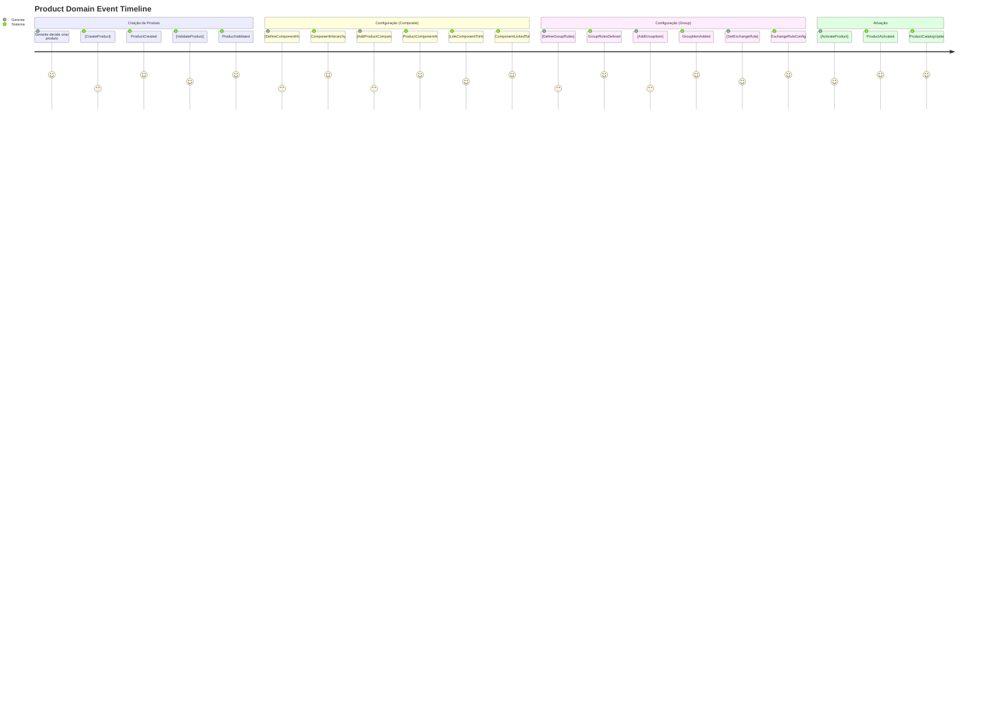

# 📦 EVENT STORMING - DOMÍNIO DE PRODUTO

## 🎯 Visão Geral
Event Storming do Domínio de Produto mapeando comandos, eventos, agregados e políticas relacionados ao gerenciamento de catálogo de produtos, incluindo produtos simples, compostos e grupos. Inclui eventos de alto nível e micro-eventos para tracking detalhado.

## 🎨 Convenções Visuais
- **📋 [Comando]** - Azul - Ação executada por usuário/sistema
- **⚡ Evento** - Laranja - Fato que aconteceu no domínio
- **👤 (Ator)** - Verde - Quem executa o comando
- **📊 {Agregado}** - Roxo - Entidade que processa comando
- **🔄 Política** - Cinza - Regra "quando X então Y"
- **⚠️ (!Hotspot!)** - Rosa - Complexidade/problema identificado

## ⚡ Event Storming Timeline

### **🔄 Fluxo Principal - Gestão de Produtos**



### **📋 Comandos por Ator**

#### **👑 Gestores (Product Managers)**
```
[CreateProduct]
├── Input: ProductType, Name, Description, Price
├── Validations: Name unique, Price > 0, Valid ProductType
├── Output: ProductId
└── Events: ProductCreated

[UpdateProduct] 
├── Input: ProductId, UpdateData
├── Validations: Product exists, Business rules
├── Output: Success/Failure
└── Events: ProductUpdated

[ActivateProduct]
├── Input: ProductId
├── Validations: Product valid, Complete configuration
├── Output: Success/Failure
└── Events: ProductActivated, ProductCatalogUpdated

[DeactivateProduct]
├── Input: ProductId, Reason
├── Validations: No active orders using product
├── Output: Success/Failure
└── Events: ProductDeactivated, ProductCatalogUpdated

[DefineComponentHierarchy]
├── Input: HierarchyName, Description, ProductId
├── Validations: Unique hierarchy name per product
├── Output: HierarchyId
└── Events: ComponentHierarchyDefined

[AddProductComponent]
├── Input: ComponentName, HierarchyId, AdditionalCost
├── Validations: Component name unique in hierarchy
├── Output: ComponentId
└── Events: ProductComponentAdded

[SetExchangeRule]
├── Input: SourceItemId, TargetItemId, ExchangeRatio
├── Validations: Valid items, Logical ratio
├── Output: RuleId
└── Events: ExchangeRuleConfigured
```

#### **⚙️ Sistema (Automático)**
```
[ValidateProduct]
├── Trigger: ProductCreated, ProductUpdated
├── Business Rules: Type-specific validation
├── Auto-execution: Background process
└── Events: ProductValidated, ProductValidationFailed

[UpdateProductCatalog]
├── Trigger: ProductActivated, ProductDeactivated
├── Actions: Refresh cache, Update search index
├── Auto-execution: Event-driven
└── Events: ProductCatalogUpdated

[CalculateProductCost]
├── Trigger: ProductComponentAdded, IngredientCostChanged
├── Actions: Recalculate total cost
├── Auto-execution: Event-driven
└── Events: ProductCostRecalculated

[LinkComponentToHierarchy]
├── Trigger: ProductComponentAdded
├── Actions: Create relationship record
├── Auto-execution: Immediately after component creation
└── Events: ComponentLinkedToProduct
```

#### **👥 Clientes (Indiretamente via Vendas)**
```
[SelectProductConfiguration] (via Sales Domain)
├── Input: ProductId, ComponentSelections
├── Validations: Valid configuration, Component availability
├── Cross-domain: Validates against Product domain
└── Events: ProductConfigurationSelected
```

### **⚡ Eventos de Alto Nível**

#### **📦 Product Lifecycle Events**
```
ProductCreated
├── Data: ProductId, ProductType, Name, Price, CreatedBy
├── Triggers: [ValidateProduct], Cache refresh
├── Integrations: Sales (catalog update), Reporting
└── Importance: 🚨 Critical

ProductValidated
├── Data: ProductId, ValidationResult, ValidationRules
├── Triggers: [ActivateProduct] (if valid)
├── Integrations: Sales (availability update)
└── Importance: ⚠️ High

ProductActivated
├── Data: ProductId, ActivatedBy, ActivationDate
├── Triggers: [UpdateProductCatalog], Cache invalidation
├── Integrations: Sales (make available), Reporting
└── Importance: 🚨 Critical

ProductDeactivated
├── Data: ProductId, Reason, DeactivatedBy
├── Triggers: [UpdateProductCatalog], Order validation updates
├── Integrations: Sales (remove availability), Production (stop usage)
└── Importance: 🚨 Critical

ProductCatalogUpdated
├── Data: UpdateType, ProductIds, Timestamp
├── Triggers: Cache refresh, Search index update
├── Integrations: Sales (catalog sync), External APIs
└── Importance: ⚠️ High
```

#### **🧩 Component Configuration Events**
```
ComponentHierarchyDefined
├── Data: HierarchyId, ProductId, HierarchyName, Description
├── Triggers: [AddProductComponent] availability
├── Integrations: Sales (configuration options)
└── Importance: ⚠️ High

ProductComponentAdded  
├── Data: ComponentId, HierarchyId, ComponentName, AdditionalCost
├── Triggers: [LinkComponentToHierarchy], [CalculateProductCost]
├── Integrations: Sales (configuration update), Cost calculation
└── Importance: ⚠️ High

ComponentLinkedToProduct
├── Data: ProductId, ComponentId, HierarchyId, LinkRules
├── Triggers: Configuration validation, Price recalculation
├── Integrations: Sales (available options update)
└── Importance: 📊 Medium
```

#### **📦 Group Management Events**
```
GroupRulesDefined
├── Data: ProductId, RuleType, RuleParameters
├── Triggers: [AddGroupItem] validation rules
├── Integrations: Sales (group configuration logic)
└── Importance: ⚠️ High

GroupItemAdded
├── Data: GroupItemId, ProductId, ItemType (Product/Category), Quantity
├── Triggers: [ValidateGroupConfiguration], Price recalculation
├── Integrations: Sales (group options), Inventory
└── Importance: ⚠️ High

ExchangeRuleConfigured
├── Data: RuleId, SourceItemId, TargetItemId, ExchangeRatio
├── Triggers: Group validation update, Sales rule sync
├── Integrations: Sales (exchange options)
└── Importance: 📊 Medium
```

### **🔍 Micro-Eventos (Tracking Detalhado)**

#### **📊 Configuration Micro-Events**
```
ComponentSelectionValidated
├── Data: ComponentId, ProductId, ValidationResult, SelectionContext
├── Purpose: Detailed tracking of configuration attempts
├── Used by: Analytics, Error tracking, User experience
└── Frequency: High (every configuration attempt)

PriceCalculationTriggered
├── Data: ProductId, CalculationType, InputParameters, Timestamp
├── Purpose: Track pricing calculation requests
├── Used by: Performance monitoring, Business analytics
└── Frequency: Medium (price calculations)

ProductConfigurationCached
├── Data: ProductId, CacheKey, ConfigurationData, ExpirationTime
├── Purpose: Cache management and performance optimization
├── Used by: Cache invalidation, Performance monitoring
└── Frequency: High (caching operations)

ValidationRuleApplied
├── Data: ProductId, RuleName, RuleResult, ValidationContext
├── Purpose: Detailed validation tracking for compliance
├── Used by: Audit trail, Business rule analysis
└── Frequency: Medium (validation operations)
```

#### **🔧 System Micro-Events**
```
ProductSearchIndexed
├── Data: ProductId, IndexType, IndexedFields, IndexingTime
├── Purpose: Search functionality monitoring
├── Used by: Performance monitoring, Search optimization
└── Frequency: Medium (indexing operations)

CategoryRelationshipUpdated
├── Data: ProductId, CategoryId, RelationshipType, UpdatedBy
├── Purpose: Track category assignments
├── Used by: Catalog organization, Analytics
└── Frequency: Low (category changes)

SKUGenerationRequested
├── Data: ProductId, SKUPattern, GenerationResult, RequestedBy
├── Purpose: Track SKU generation for inventory
├── Used by: Inventory tracking, Audit
└── Frequency: Low (new products)

IngredientLinkageUpdated
├── Data: ProductId, IngredientId, LinkageType, Quantity
├── Purpose: Track product-ingredient relationships
├── Used by: Cost calculation, Production planning
└── Frequency: Medium (recipe changes)
```

### **📊 Agregados e Responsabilidades**

#### **🎯 Product Aggregate**
```
{Product}
├── Entities: Product (Simple/Composite/Group)
├── Value Objects: ProductType, Price, SKU
├── Invariants: 
│   ├── Name must be unique
│   ├── Price must be positive
│   ├── SKU must be unique if provided
│   └── ProductType cannot change after creation
├── Events Published:
│   ├── ProductCreated, ProductUpdated
│   ├── ProductActivated, ProductDeactivated
│   └── ProductValidated, ProductValidationFailed
└── Commands Handled:
    ├── CreateProduct, UpdateProduct
    ├── ActivateProduct, DeactivateProduct
    └── ValidateProduct
```

#### **🧩 ProductComponentHierarchy Aggregate**
```
{ProductComponentHierarchy}
├── Entities: ProductComponentHierarchy, ProductComponent
├── Value Objects: HierarchyName, ComponentName, AdditionalCost
├── Invariants:
│   ├── Hierarchy name unique per product
│   ├── Component name unique per hierarchy
│   ├── AdditionalCost >= 0
│   └── Cannot delete hierarchy with linked components
├── Events Published:
│   ├── ComponentHierarchyDefined
│   ├── ProductComponentAdded
│   └── ComponentLinkedToProduct
└── Commands Handled:
    ├── DefineComponentHierarchy
    ├── AddProductComponent
    └── LinkComponentToHierarchy
```

#### **📦 ProductGroup Aggregate**
```
{ProductGroup}
├── Entities: ProductGroup, ProductGroupItem, ProductGroupExchangeRule
├── Value Objects: GroupConfiguration, ExchangeRatio
├── Invariants:
│   ├── Group must have at least one item
│   ├── Exchange rules must be logical (ratio > 0)
│   ├── Cannot have circular exchange rules
│   └── Group items must reference valid products/categories
├── Events Published:
│   ├── GroupRulesDefined
│   ├── GroupItemAdded
│   └── ExchangeRuleConfigured
└── Commands Handled:
    ├── DefineGroupRules
    ├── AddGroupItem
    └── SetExchangeRule
```

#### **📂 ProductCategory Aggregate**
```
{ProductCategory}
├── Entities: ProductCategory
├── Value Objects: CategoryName, CategoryDescription
├── Invariants:
│   ├── Category name must be unique
│   ├── Cannot delete category with linked products
│   └── Category hierarchy must be acyclic
├── Events Published:
│   ├── CategoryCreated, CategoryUpdated
│   ├── CategoryActivated, CategoryDeactivated
│   └── CategoryHierarchyChanged
└── Commands Handled:
    ├── CreateCategory, UpdateCategory
    ├── ActivateCategory, DeactivateCategory
    └── ReorganizeCategoryHierarchy
```

### **🔄 Políticas de Negócio (Business Rules)**

#### **⚙️ Product Validation Policies**
```
"Quando ProductCreated, então ValidateProduct"
├── Rule Engine: Check product type specific rules
├── Auto-execution: Background service
├── Failure handling: Mark as invalid, notify creator
└── Integration: Blocks activation until valid

"Quando ProductComponentAdded, então CalculateProductCost"
├── Cost calculation: Base price + sum of component costs
├── Auto-execution: Immediate
├── Cache invalidation: Clear pricing cache
└── Integration: Update pricing in Sales domain

"Quando ProductValidated successfully, então Enable for activation"
├── Validation check: All business rules passed
├── State change: Ready for activation
├── Notification: Notify product manager
└── Integration: Make available for sales configuration
```

#### **🔗 Cross-Domain Integration Policies**
```
"Quando ProductActivated, então Update Sales Catalog"
├── Event propagation: ProductActivated → Sales domain
├── Sales action: Add to available products
├── Cache update: Refresh product catalog cache
└── Search update: Update product search index

"Quando ProductDeactivated, então Block New Orders"
├── Event propagation: ProductDeactivated → Sales domain
├── Sales action: Remove from available products
├── Order validation: Reject new orders with this product
└── Production: Complete existing demands, block new ones

"Quando ComponentLinkedToProduct, então Update Configuration Options"
├── Event propagation: ComponentLinkedToProduct → Sales domain
├── Sales action: Update available configuration options
├── Validation rules: Update component selection validation
└── Price calculation: Update dynamic pricing rules
```

### **⚠️ Hotspots e Complexidades**

#### **🚨 Complexidades Identificadas**

##### **(!ProductTypeStrategy!)**
```
Problema: Different validation logic per ProductType
Impacto: Complex branching logic, hard to extend
Solução: Strategy pattern por ProductType
Prioridade: High - Affects extensibility
```

##### **(!ComponentConfigurationValidation!)**
```
Problema: Complex validation rules for Composite Products
Impacto: Performance issues, hard to maintain
Solução: Rule engine with cacheable validation
Prioridade: High - Affects user experience
```

##### **(!GroupExchangeCalculation!)**
```
Problema: Complex exchange ratio calculations for Groups
Impacto: Business logic scattered across layers
Solução: Domain service for exchange calculations
Prioridade: Medium - Business critical but contained
```

##### **(!CrossDomainEventOrdering!)**
```
Problema: Event ordering between Product and Sales domains
Impacto: Race conditions, inconsistent state
Solução: Event sequencing and idempotency
Prioridade: High - Data integrity risk
```

#### **📊 Métricas e Alertas**

##### **🎯 Business Metrics**
```
Product Creation Rate:
├── Metric: Products created per day
├── Alert: < 1 product/day (business slowdown)
├── Dashboard: Product management KPIs
└── Usage: Business health monitoring

Configuration Error Rate:
├── Metric: % failed product configurations
├── Alert: > 5% error rate (UX issue)
├── Dashboard: Product quality metrics
└── Usage: Product manager feedback

Validation Processing Time:
├── Metric: Average time to validate product
├── Alert: > 10 seconds (performance issue)
├── Dashboard: System performance
└── Usage: Technical optimization
```

##### **⚡ Technical Metrics**
```
Event Processing Latency:
├── Metric: Time from command to event published
├── Alert: > 1 second (system performance)
├── Dashboard: Event system health
└── Usage: Performance optimization

Cache Hit Ratio:
├── Metric: % product data served from cache
├── Alert: < 80% hit ratio (cache efficiency)
├── Dashboard: Caching performance
└── Usage: Infrastructure optimization

Cross-Domain Event Failures:
├── Metric: Failed event propagations to other domains
├── Alert: > 1% failure rate (integration issue)
├── Dashboard: Domain integration health
└── Usage: System reliability monitoring
```

---

**Arquivo**: `product-domain-events.md`  
**Domínio**: Produto (#00a86b)  
**Tipo**: Event Storming  
**Granularidade**: Alto nível + Micro-eventos  
**Atualização**: 16/06/2025
