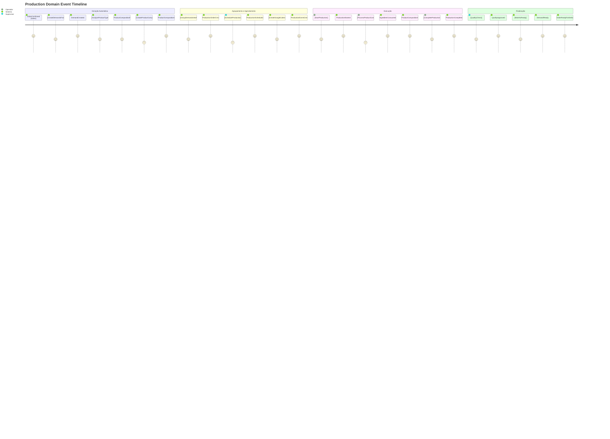

# 🏭 EVENT STORMING - DOMÍNIO DE PRODUÇÃO

## 🎯 Visão Geral
Event Storming do Domínio de Produção mapeando o fluxo desde a geração automática de demandas até a finalização da produção, incluindo orquestração de tarefas complexas, consumo de ingredientes, integração com Google Calendar, e coordenação com domínios de Vendas e Compras.

## 🎨 Convenções Visuais
- **📋 [Comando]** - Azul - Ação executada por usuário/sistema
- **⚡ Evento** - Laranja - Fato que aconteceu no domínio
- **👤 (Ator)** - Verde - Quem executa o comando
- **📊 {Agregado}** - Roxo - Entidade que processa comando
- **🔄 Política** - Cinza - Regra "quando X então Y"
- **⚠️ (!Hotspot!)** - Rosa - Complexidade/problema identificado
- **🌐 <Sistema Externo>** - Vermelho - Integração externa

## ⚡ Event Storming Timeline

### **🔄 Fluxo Principal - Da Demanda à Produção**



### **📋 Comandos por Ator**

#### **🤖 Sistema (Automático - Triggered by Sales)**
```
[CreateDemandsFromOrderItems]
├── Trigger: OrderConfirmed event from Sales domain
├── Input: OrderItems[], OrderEntry data
├── Complex Logic: Different strategy per ProductType
├── Simple: 1 OrderItem → 1 Demand
├── Composite: 1 OrderItem → 1 Demand + N ProductComposition
├── Group: 1 OrderItem → N Demands (exploded products)
├── Output: DemandIds[]
└── Events: DemandCreated (per demand)

[AnalyzeProductType]
├── Trigger: DemandCreated
├── Input: DemandId, ProductId, ProductConfiguration
├── Cross-domain: Query Product domain for type and configuration
├── Decision: Determine production strategy
├── Output: ProductionStrategy
└── Events: ProductCompositionRequired (if Composite)

[CreateProductComposition]
├── Trigger: ProductCompositionRequired
├── Input: DemandId, ProductConfiguration JSON
├── Complex parsing: Extract component selections and quantities
├── Cross-domain: Validate components with Product domain
├── Output: ProductCompositionIds[]
└── Events: ProductCompositionCreated (per task)

[GroupDemandsIntoProductionOrder]
├── Trigger: Multiple DemandCreated events (batch processing)
├── Input: DemandIds[], Grouping criteria
├── Grouping logic: By delivery date, product type, capacity
├── Output: ProductionOrderId
└── Events: ProductionOrderCreated

[ReserveIngredients]
├── Trigger: ProductionScheduled
├── Input: ProductionOrderId, Ingredient requirements
├── Cross-domain: Check availability with Purchasing domain
├── Reserve logic: Allocate ingredients for production
├── Output: ReservationIds[]
└── Events: IngredientsReserved, LowStockAlert (if needed)

[UpdateOrderStatus]
├── Trigger: DemandReady, ProductionCompleted
├── Input: DemandId, NewStatus
├── Cross-domain: Update order status in Sales domain
├── Sync logic: All demands ready → Order ready
├── Output: StatusUpdateResult
└── Events: OrderStatusSyncRequested
```

#### **👥 Supervisores (Production Managers)**
```
[ScheduleProduction]
├── Input: ProductionOrderId, ScheduledDate, AssignedTeam
├── Validations: Team availability, Resource capacity, Ingredient availability
├── Capacity check: Production line availability
├── Output: ScheduleId
└── Events: ProductionScheduled

[StartProductionOrder]
├── Input: ProductionOrderId
├── Validations: All resources ready, Team assigned, Ingredients available
├── Pre-checks: Quality control setup, Equipment ready
├── Output: ProductionSessionId
└── Events: ProductionStarted

[AssignProductionTasks]
├── Input: ProductionOrderId, TaskAssignments[], OperatorIds[]
├── Validations: Operator qualifications, Task dependencies
├── Workflow: Define task execution order
├── Output: TaskAssignmentIds[]
└── Events: ProductionTasksAssigned

[PerformQualityCheck]
├── Input: DemandId, QualityMetrics, CheckResults
├── Validations: Meets quality standards, Compliance requirements
├── Decision: Approve, Reject, or Request rework
├── Output: QualityCheckId
└── Events: QualityApproved, QualityRejected, ReworkRequired

[RescheduleProduction]
├── Input: ProductionOrderId, NewSchedule, RescheduleReason
├── Validations: New schedule feasible, Impact on other orders
├── Complex logic: Cascade rescheduling of dependent orders
├── Output: NewScheduleId
└── Events: ProductionRescheduled

[CancelProduction]
├── Input: ProductionOrderId, CancellationReason
├── Validations: Order not yet started, Valid cancellation reason
├── Cleanup: Release reserved ingredients, Cancel calendar events
├── Output: CancellationId
└── Events: ProductionCancelled
```

#### **⚙️ Operadores (Production Workers)**
```
[StartDemandProduction]
├── Input: DemandId, OperatorId, WorkstationId
├── Validations: Demand assigned to operator, Workstation available
├── Time tracking: Start production timer
├── Output: ProductionSessionId
└── Events: DemandProductionStarted

[ProcessProductComposition]
├── Input: ProductCompositionId, OperatorId, ProcessingData
├── Validations: Task assigned, Prerequisites completed
├── Step tracking: Track individual component processing
├── Output: ProcessingResultId
└── Events: ComponentProcessingStarted, IngredientConsumed

[CompleteProductComposition]
├── Input: ProductCompositionId, CompletionData, QualityNotes
├── Validations: All steps completed, Quality requirements met
├── Time tracking: Record actual processing time
├── Output: CompletionId
└── Events: ProductCompositionCompleted

[ReportProductionIssue]
├── Input: DemandId, IssueType, IssueDescription, Severity
├── Validations: Valid issue type, Appropriate severity
├── Escalation: Auto-escalate critical issues
├── Output: IssueId
└── Events: ProductionIssueReported

[ConsumeIngredient]
├── Input: IngredientId, Quantity, DemandId, ConsumptionReason
├── Validations: Sufficient stock, Valid consumption reason
├── Cross-domain: Update inventory in Purchasing domain
├── Output: ConsumptionId
└── Events: IngredientConsumed

[CompleteDemandProduction]
├── Input: DemandId, CompletionData, ActualTime, ActualCost
├── Validations: All compositions completed, Quality approved
├── Finalization: Calculate final metrics, Package product
├── Output: CompletionId
└── Events: DemandProductionCompleted
```

#### **🌐 Sistema (Google Calendar Integration)**
```
[CreateGoogleCalendarEvent]
├── Trigger: ProductionScheduled
├── Input: ProductionOrderId, ScheduledDate, Duration, Team
├── External API: Google Calendar API integration
├── Event details: Title, description, attendees, location
├── Output: GoogleEventId
└── Events: ProductionEventCreated

[UpdateGoogleCalendarEvent]
├── Trigger: ProductionRescheduled, ProductionCancelled
├── Input: GoogleEventId, UpdateData
├── External API: Google Calendar API
├── Update logic: Change time, cancel, or modify details
├── Output: UpdateResult
└── Events: ProductionEventUpdated, ProductionEventCancelled
```

### **⚡ Eventos de Alto Nível**

#### **🏭 Demand Lifecycle Events**
```
DemandCreated
├── Data: DemandId, OrderItemId, ProductId, Quantity, RequiredDate, ProductType
├── Triggers: [AnalyzeProductType], Production planning
├── Integrations: Sales (demand tracking), Reporting
└── Importance: 🚨 Critical - Core production trigger

ProductCompositionRequired
├── Data: DemandId, ProductId, ConfigurationData, ComponentRequirements
├── Triggers: [CreateProductComposition], Component scheduling
├── Integrations: Product (component validation), Scheduling
└── Importance: ⚠️ High

ProductCompositionCreated
├── Data: ProductCompositionId, DemandId, ComponentId, HierarchyName, Quantity
├── Triggers: Task scheduling, Resource allocation
├── Integrations: Scheduling, Resource management
└── Importance: ⚠️ High

DemandProductionStarted
├── Data: DemandId, OperatorId, WorkstationId, StartTime, EstimatedDuration
├── Triggers: Time tracking, Progress monitoring
├── Integrations: Analytics, Performance monitoring
└── Importance: ⚠️ High

DemandProductionCompleted
├── Data: DemandId, CompletionTime, ActualDuration, ActualCost, QualityScore
├── Triggers: [MarkAsReady], Status updates, Performance calculation
├── Integrations: Sales (status update), Analytics, Costing
└── Importance: 🚨 Critical

DemandReady
├── Data: DemandId, ReadyTime, FinalQualityCheck, PackagingComplete
├── Triggers: [UpdateOrderStatus], Delivery preparation
├── Integrations: Sales (order status), Logistics
└── Importance: 🚨 Critical
```

#### **📋 Production Order Events**
```
ProductionOrderCreated
├── Data: ProductionOrderId, DemandIds[], EstimatedTime, EstimatedCost, Priority
├── Triggers: [ScheduleProduction], Resource planning
├── Integrations: Scheduling, Resource management, Costing
└── Importance: 🚨 Critical

ProductionScheduled
├── Data: ProductionOrderId, ScheduledDate, AssignedTeam, ResourceAllocation
├── Triggers: [CreateGoogleCalendarEvent], [ReserveIngredients]
├── Integrations: Google Calendar, Purchasing (ingredient reservation)
└── Importance: 🚨 Critical

ProductionStarted
├── Data: ProductionOrderId, StartTime, Team, InitialSetup
├── Triggers: Time tracking, Progress monitoring, Status updates
├── Integrations: Analytics, Real-time dashboards
└── Importance: ⚠️ High

ProductionCompleted
├── Data: ProductionOrderId, CompletionTime, TotalCost, QualityMetrics
├── Triggers: [UpdateGoogleCalendarEvent], Performance analysis
├── Integrations: Google Calendar, Analytics, Costing
└── Importance: 🚨 Critical

ProductionRescheduled
├── Data: ProductionOrderId, OldSchedule, NewSchedule, RescheduleReason
├── Triggers: [UpdateGoogleCalendarEvent], Cascade rescheduling
├── Integrations: Google Calendar, Sales (delivery date updates)
└── Importance: ⚠️ High

ProductionCancelled
├── Data: ProductionOrderId, CancellationReason, CancelledBy, Impact
├── Triggers: [ReleaseReservedIngredients], [CancelGoogleEvent]
├── Integrations: Purchasing (release ingredients), Google Calendar
└── Importance: ⚠️ High
```

#### **🧩 Task Execution Events**
```
ComponentProcessingStarted
├── Data: ProductCompositionId, ComponentId, OperatorId, StartTime
├── Triggers: Ingredient consumption tracking, Progress updates
├── Integrations: Real-time monitoring, Analytics
└── Importance: 📊 Medium

IngredientConsumed
├── Data: IngredientId, Quantity, DemandId, ConsumptionTime, OperatorId
├── Triggers: [UpdateIngredientStock], Cost tracking
├── Integrations: Purchasing (stock update), Costing
└── Importance: ⚠️ High

ProductCompositionCompleted
├── Data: ProductCompositionId, CompletionTime, QualityNotes, ActualTime
├── Triggers: Progress calculation, Quality tracking
├── Integrations: Progress monitoring, Quality analytics
└── Importance: 📊 Medium

QualityApproved
├── Data: DemandId, QualityMetrics, ApprovedBy, ApprovalTime
├── Triggers: [MarkAsReady], Final packaging
├── Integrations: Quality management, Final production steps
└── Importance: ⚠️ High

QualityRejected
├── Data: DemandId, RejectionReason, QualityIssues, RequiredActions
├── Triggers: [InitiateRework], Issue escalation
├── Integrations: Quality management, Rework processes
└── Importance: ⚠️ High
```

### **🔍 Micro-Eventos (Tracking Detalhado)**

#### **📊 Performance Tracking**
```
ProductionEfficiencyCalculated
├── Data: ProductionOrderId, PlannedTime, ActualTime, EfficiencyRatio
├── Purpose: Track production efficiency metrics
├── Used by: Performance optimization, Resource planning
└── Frequency: After each production completion

WorkstationUtilizationTracked
├── Data: WorkstationId, UsageTime, IdleTime, UtilizationRate
├── Purpose: Monitor equipment and workspace efficiency
├── Used by: Capacity planning, Equipment optimization
└── Frequency: Continuous during production hours

OperatorProductivityMeasured
├── Data: OperatorId, TasksCompleted, AverageTime, QualityScore
├── Purpose: Track individual operator performance
├── Used by: Training needs, Performance reviews
└── Frequency: After each task completion

CostVarianceCalculated
├── Data: DemandId, EstimatedCost, ActualCost, VarianceAmount, VarianceReason
├── Purpose: Track cost accuracy and identify improvement areas
├── Used by: Cost management, Process optimization
└── Frequency: After demand completion
```

#### **🔧 Process Monitoring**
```
ProductionStepExecuted
├── Data: DemandId, StepName, ExecutionTime, OperatorId, Result
├── Purpose: Detailed process step tracking
├── Used by: Process optimization, Training
└── Frequency: High (each production step)

IngredientLevelAlertTriggered
├── Data: IngredientId, CurrentLevel, MinimumLevel, AlertSeverity
├── Purpose: Proactive ingredient management
├── Used by: Purchasing planning, Production scheduling
└── Frequency: Continuous monitoring

ProductionLineStatusChanged
├── Data: LineId, OldStatus, NewStatus, ChangeReason, Timestamp
├── Purpose: Track production line availability and issues
├── Used by: Scheduling optimization, Maintenance planning
└── Frequency: Status changes

QualityControlPointChecked
├── Data: DemandId, CheckPointName, CheckResult, OperatorId, Notes
├── Purpose: Detailed quality tracking throughout production
├── Used by: Quality improvement, Compliance
└── Frequency: Each quality checkpoint
```

#### **🌐 Integration Monitoring**
```
GoogleCalendarEventSynced
├── Data: ProductionOrderId, GoogleEventId, SyncStatus, SyncTime
├── Purpose: Monitor Google Calendar integration health
├── Used by: Integration monitoring, Event management
└── Frequency: Calendar operations

InventoryLevelSynced
├── Data: IngredientId, SyncedQuantity, SyncStatus, SyncTime
├── Purpose: Track inventory synchronization with Purchasing
├── Used by: Data consistency monitoring, Inventory accuracy
└── Frequency: Ingredient consumption events

OrderStatusSyncRequested
├── Data: OrderId, DemandId, NewStatus, SyncStatus, RequestTime
├── Purpose: Monitor cross-domain status synchronization
├── Used by: Integration health, Data consistency
└── Frequency: Status update events

ExternalAPICallMade
├── Data: APIName, Endpoint, RequestData, ResponseTime, Status
├── Purpose: Monitor external API usage and performance
├── Used by: API monitoring, Performance optimization
└── Frequency: All external API calls
```

### **📊 Agregados e Responsabilidades**

#### **🎯 Demand Aggregate**
```
{Demand}
├── Entities: Demand, ProductComposition
├── Value Objects: DemandStatus, Priority, EstimatedCost
├── Invariants:
│   ├── Quantity must be > 0
│   ├── RequiredDate must be >= CreatedDate
│   ├── ProductComposition only for Composite products
│   ├── Cannot start production without ingredient availability
│   └── Cannot complete without all compositions finished
├── Events Published:
│   ├── DemandCreated, DemandProductionStarted
│   ├── DemandProductionCompleted, DemandReady
│   ├── ProductCompositionRequired, ProductCompositionCreated
│   └── ProductCompositionCompleted
└── Commands Handled:
    ├── CreateDemand, StartDemandProduction, CompleteDemandProduction
    ├── CreateProductComposition, ProcessProductComposition
    └── CompleteProductComposition
```

#### **🏭 ProductionOrder Aggregate**
```
{ProductionOrder}
├── Entities: ProductionOrder
├── Value Objects: ProductionStatus, Schedule, ResourceAllocation
├── Invariants:
│   ├── Must contain at least one Demand
│   ├── All demands must have same priority level (or compatible)
│   ├── Schedule must be feasible given resource constraints
│   ├── Cannot start without all ingredients reserved
│   └── Cannot be cancelled once production starts
├── Events Published:
│   ├── ProductionOrderCreated, ProductionScheduled
│   ├── ProductionStarted, ProductionCompleted
│   ├── ProductionRescheduled, ProductionCancelled
│   └── ResourcesAllocated
└── Commands Handled:
    ├── CreateProductionOrder, ScheduleProduction
    ├── StartProductionOrder, CompleteProductionOrder
    ├── RescheduleProduction, CancelProduction
    └── AllocateResources
```

#### **🧩 ProductComposition Aggregate**
```
{ProductComposition}
├── Entities: ProductComposition
├── Value Objects: ComponentStatus, ProcessingTime, QualityMetrics
├── Invariants:
│   ├── Must reference valid Product Component
│   ├── Quantity must align with product configuration
│   ├── Cannot start without operator assignment
│   ├── Must complete in sequence defined by hierarchy
│   └── Quality check required before completion
├── Events Published:
│   ├── ProductCompositionCreated
│   ├── ComponentProcessingStarted, ComponentProcessingCompleted
│   ├── IngredientConsumed, QualityChecked
│   └── ProductCompositionCompleted
└── Commands Handled:
    ├── CreateProductComposition, StartComponentProcessing
    ├── CompleteComponentProcessing, ConsumeIngredient
    └── PerformQualityCheck
```

### **🔄 Políticas de Negócio (Business Rules)**

#### **⚙️ Demand Processing Policies**
```
"Quando DemandCreated, então AnalyzeProductType"
├── Product type detection: Simple, Composite, or Group
├── Strategy selection: Different production approaches per type
├── Resource estimation: Calculate time and ingredient needs
├── Auto-execution: Immediate after demand creation
└── Integration: Product domain for type and configuration

"Quando ProductCompositionRequired, então CreateProductComposition"
├── Configuration parsing: Extract component selections from JSON
├── Task decomposition: Create individual tasks per component
├── Dependency analysis: Determine task execution order
├── Auto-execution: Immediate after composition requirement
└── Integration: Product domain for component validation

"Quando IngredientConsumed, então UpdateInventoryLevel"
├── Cross-domain update: Reduce ingredient stock in Purchasing
├── Low stock detection: Trigger alerts if below minimum
├── Cost tracking: Track ingredient costs for demand costing
├── Auto-execution: Real-time during production
└── Integration: Purchasing domain inventory management
```

#### **📅 Scheduling and Resource Policies**
```
"Quando ProductionScheduled, então CreateGoogleCalendarEvent"
├── Calendar integration: Create event in Google Calendar
├── Team notification: Invite assigned team members
├── Resource blocking: Reserve production line and equipment
├── Auto-execution: Immediate after scheduling
└── Integration: Google Calendar API

"Quando ProductionRescheduled, então UpdateAllRelatedEvents"
├── Cascade updating: Update Google Calendar event
├── Impact analysis: Check effect on other scheduled productions
├── Notification: Inform affected teams and stakeholders
├── Auto-execution: Immediate after rescheduling
└── Integration: Google Calendar API, Notification system

"Quando IngredientsReserved, então ValidateProductionFeasibility"
├── Availability check: Ensure all required ingredients available
├── Capacity validation: Confirm production line availability
├── Team assignment: Verify required skills available
├── Auto-execution: Before production start
└── Integration: Purchasing (ingredients), HR (team skills)
```

#### **📊 Quality and Completion Policies**
```
"Quando QualityApproved, então MarkDemandAsReady"
├── Status transition: Move demand to ready state
├── Packaging preparation: Prepare for delivery
├── Cross-domain update: Update order status in Sales
├── Auto-execution: After quality approval
└── Integration: Sales domain status synchronization

"Quando AllDemandsReady, então UpdateOrderStatus"
├── Order completion check: Verify all demands completed
├── Status synchronization: Update order status in Sales domain
├── Customer notification: Prepare delivery notification
├── Auto-execution: When last demand becomes ready
└── Integration: Sales domain, Customer notification

"Quando ProductionCompleted, então CalculateActualCosts"
├── Cost aggregation: Sum all ingredient and labor costs
├── Variance analysis: Compare actual vs estimated costs
├── Performance metrics: Calculate efficiency ratios
├── Auto-execution: After production completion
└── Integration: Financial domain cost tracking
```

### **⚠️ Hotspots e Complexidades**

#### **🚨 Complexidades Críticas**

##### **(!DemandTypeStrategies!)**
```
Problema: Complex logic for different product types in production
Cenário: Simple vs Composite vs Group require different production approaches
Impacto: Core production logic, extensibility, maintainability
Solução: Strategy pattern with type-specific production handlers
Prioridade: Critical - Core business logic
```

##### **(!IngredientReservationConcurrency!)**
```
Problema: Concurrent access to limited ingredient inventory
Cenário: Multiple productions trying to reserve same ingredients
Impacto: Production blocking, ingredient conflicts, scheduling issues
Solução: Distributed locking + reservation system
Prioridade: Critical - Production blocking risk
```

##### **(!ProductCompositionOrchestration!)**
```
Problema: Complex orchestration of parallel composition tasks
Cenário: Multiple operators working on different components simultaneously
Impacto: Task coordination, quality control, timing synchronization
Solução: Workflow engine with task dependencies
Prioridade: High - Production efficiency
```

##### **(!CrossDomainStatusSynchronization!)**
```
Problema: Keeping status synchronized across Sales, Production, Financial
Cenário: Status updates in Production need to propagate correctly
Impacto: Data consistency, customer experience, business integrity
Solução: Event-driven synchronization with compensating actions
Prioridade: Critical - Data integrity
```

##### **(!GoogleCalendarAPIResilience!)**
```
Problema: Dependency on Google Calendar for production scheduling
Cenário: API downtime affecting production planning and team coordination
Impacto: Production scheduling, team coordination, planning disruption
Solução: Circuit breaker + local scheduling fallback
Prioridade: High - Operational continuity
```

#### **📊 Métricas e Alertas**

##### **🎯 Production Performance Metrics**
```
Production Efficiency Rate:
├── Metric: (Planned Time / Actual Time) * 100
├── Alert: < 80% efficiency rate
├── Dashboard: Production performance KPIs
└── Usage: Process optimization

Demand Completion Rate:
├── Metric: % demands completed on time
├── Alert: < 90% on-time completion
├── Dashboard: Production reliability
└── Usage: Scheduling optimization

Quality Pass Rate:
├── Metric: % demands passing quality control on first check
├── Alert: < 95% pass rate
├── Dashboard: Quality metrics
└── Usage: Quality improvement

Ingredient Waste Rate:
├── Metric: % ingredient waste vs planned consumption
├── Alert: > 5% waste rate
├── Dashboard: Cost optimization
└── Usage: Process improvement
```

##### **⚡ Technical Performance Metrics**
```
Demand Generation Latency:
├── Metric: Time from OrderConfirmed to DemandCreated
├── Alert: > 10 seconds latency
├── Dashboard: Integration performance
└── Usage: System optimization

Google Calendar API Response Time:
├── Metric: Average response time for calendar operations
├── Alert: > 5 seconds response time
├── Dashboard: External dependency health
└── Usage: API performance monitoring

Cross-Domain Event Processing Time:
├── Metric: Time to propagate status updates to Sales
├── Alert: > 30 seconds processing time
├── Dashboard: Integration health
└── Usage: Synchronization optimization

Production Task Queue Length:
├── Metric: Number of pending production tasks
├── Alert: Queue length > 100 tasks
├── Dashboard: System load monitoring
└── Usage: Capacity planning
```

##### **🔍 Business Intelligence Metrics**
```
Resource Utilization Rate:
├── Metric: % time production resources are actively used
├── Alert: < 70% utilization rate
├── Dashboard: Capacity management
└── Usage: Resource planning

Peak Production Load:
├── Metric: Maximum concurrent demands in production
├── Alert: Approaching capacity limits
├── Dashboard: Capacity planning
└── Usage: Infrastructure scaling

Production Cost Variance:
├── Metric: % difference between estimated and actual costs
├── Alert: > 15% cost variance
├── Dashboard: Cost management
└── Usage: Estimation improvement

Customer Delivery Promise Accuracy:
├── Metric: % orders delivered on promised date
├── Alert: < 85% delivery accuracy
├── Dashboard: Customer satisfaction
└── Usage: Promise accuracy improvement
```

---

**Arquivo**: `production-domain-events.md`  
**Domínio**: Produção (#fba81d)  
**Tipo**: Event Storming  
**Granularidade**: Alto nível + Micro-eventos + Integrações Google Calendar  
**Atualização**: 16/06/2025
