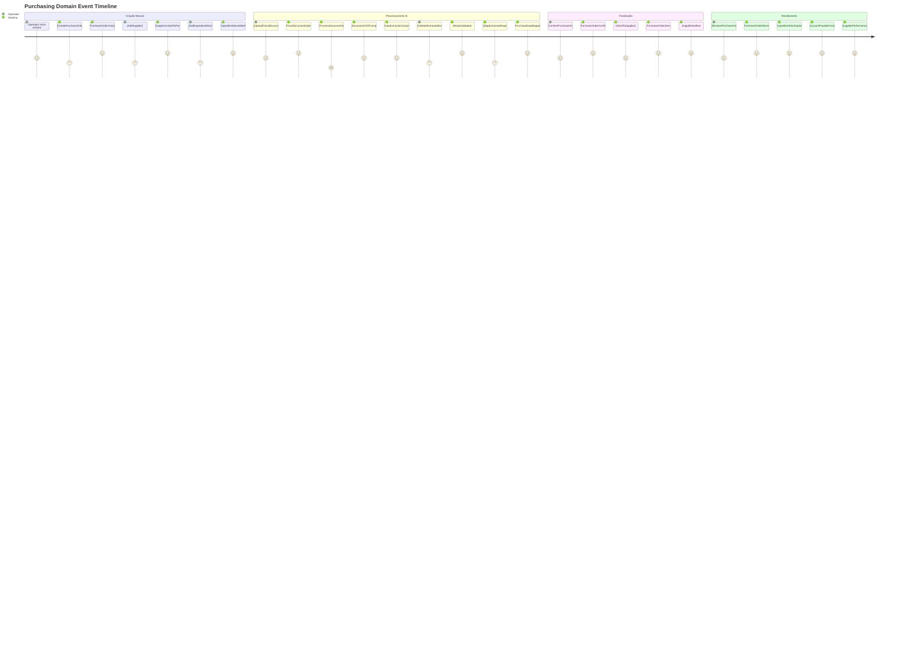

# 🛒 EVENT STORMING - DOMÍNIO DE COMPRAS

## 🎯 Visão Geral
Event Storming do Domínio de Compras mapeando desde a gestão de fornecedores até o processamento inteligente de notas fiscais com IA, incluindo controle de estoque de ingredientes, alertas automáticos de reposição, e integrações críticas com Produção e Financeiro.

## 🎨 Convenções Visuais
- **📋 [Comando]** - Azul - Ação executada por usuário/sistema
- **⚡ Evento** - Laranja - Fato que aconteceu no domínio
- **👤 (Ator)** - Verde - Quem executa o comando
- **📊 {Agregado}** - Roxo - Entidade que processa comando
- **🔄 Política** - Cinza - Regra "quando X então Y"
- **⚠️ (!Hotspot!)** - Rosa - Complexidade/problema identificado
- **🤖 <IA Service>** - Rosa - Processamento com inteligência artificial
- **🌐 <Sistema Externo>** - Vermelho - Integração externa

## ⚡ Event Storming Timeline

### **🔄 Fluxo Principal - Gestão de Compras**



### **📋 Comandos por Ator**

#### **⚙️ Operadores (Purchasing Team)**
```
[CreatePurchaseOrder]
├── Input: PurchaseType (Manual/AI), InitialData, Priority
├── Validations: Valid purchase type, Required fields
├── Output: PurchaseOrderId
└── Events: PurchaseOrderCreated

[AddSupplier]
├── Input: SupplierData or SupplierId
├── Validations: Supplier active, Not blocked, Valid data
├── Integration: Supplier performance check
└── Events: SupplierAdded, SupplierLinkedToPurchase

[AddIngredientItem]
├── Input: IngredientId, Quantity, UnitPrice, Notes
├── Validations: Ingredient exists, Quantity > 0, Price >= 0
├── Calculation: Line total = Quantity * UnitPrice
└── Events: IngredientItemAdded, PurchaseTotalRecalculated

[RemoveIngredientItem]
├── Input: ItemId, RemovalReason
├── Validations: Item exists, Purchase not confirmed
├── Cleanup: Recalculate purchase total
└── Events: IngredientItemRemoved, PurchaseTotalRecalculated

[UpdateIngredientItem]
├── Input: ItemId, NewQuantity, NewPrice, UpdateReason
├── Validations: Purchase editable, Valid values
├── Recalculation: Update line total and purchase total
└── Events: IngredientItemUpdated, PurchaseTotalRecalculated

[UploadFiscalDocument]
├── Input: PurchaseOrderId, DocumentFile (PDF/Image), DocumentType
├── Validations: Valid file format, File size limits, Not duplicate
├── Storage: Store document in file system
└── Events: FiscalDocumentUploaded

[ValidateExtractedData]
├── Input: ExtractionId, ValidationResults, Corrections
├── Complex validation: Human review of AI extraction
├── Data correction: Manual fixes to AI extracted data
└── Events: AIDataValidated, AIDataCorrected (if needed)

[ConfirmPurchaseOrder]
├── Input: PurchaseOrderId, FinalReview, PaymentTerms
├── Validations: All items valid, Supplier confirmed, Budget approved
├── Complex validation: Business rules, Budget limits
└── Events: PurchaseOrderConfirmed

[SendToSupplier]
├── Input: PurchaseOrderId, DeliveryDetails, SpecialInstructions
├── Validations: Purchase confirmed, Supplier contact valid
├── Communication: Email/system integration to supplier
└── Events: PurchaseOrderSent, SupplierNotified

[ReceivePurchaseOrder]
├── Input: PurchaseOrderId, ReceivedItems[], ActualQuantities[], QualityNotes
├── Validations: Received quantities <= ordered quantities
├── Complex processing: Partial receipts, Quality control
└── Events: PurchaseOrderReceived, IngredientStockUpdated

[RejectDelivery]
├── Input: PurchaseOrderId, RejectionReason, RejectedItems[]
├── Validations: Valid rejection reason, Items match order
├── Complex logic: Partial rejections, Quality issues
└── Events: DeliveryRejected, SupplierPerformanceImpacted

[ApprovePurchasePayment]
├── Input: PurchaseOrderId, ApprovalNotes, PaymentSchedule
├── Validations: Purchase received, Budget available
├── Financial trigger: Create AccountPayable
└── Events: PaymentApproved, AccountPayableCreated

[ManageSupplier]
├── Input: SupplierData, Action (Create/Update/Block/Activate)
├── Validations: Valid supplier data, Action permissions
├── Complex logic: Supplier evaluation, Performance tracking
└── Events: SupplierCreated/Updated/Blocked/Activated
```

#### **🤖 Sistema (IA Processing)**
```
[ProcessDocumentWithAI]
├── Trigger: FiscalDocumentUploaded
├── Input: DocumentFile, DocumentType
├── AI Pipeline: OCR → ML Classification → Data Extraction
├── Complex processing: Document type detection, Entity recognition
├── Output: ExtractedData, ConfidenceScores
└── Events: DocumentOCRCompleted, DataExtractionCompleted

[PerformOCR]
├── Input: DocumentFile
├── OCR Processing: Extract raw text from PDF/image
├── Text preprocessing: Clean and structure extracted text
├── Output: RawTextData, OCRConfidence
└── Events: DocumentOCRCompleted

[ExtractPurchaseData]
├── Input: RawTextData, DocumentType
├── ML Processing: Named Entity Recognition, Data mapping
├── Complex extraction: Supplier info, items, prices, dates
├── Output: StructuredData, ExtractionConfidence
└── Events: DataExtractionCompleted

[MapExtractedData]
├── Trigger: AIDataValidated
├── Input: ValidatedData, SystemMappings
├── Data mapping: Map to system entities (Suppliers, Ingredients)
├── Complex logic: Fuzzy matching, New entity detection
├── Output: MappedData, UnmappedEntities
└── Events: PurchaseDataMapped, NewEntitiesDetected

[ValidateAIAccuracy]
├── Input: ExtractedData, ActualData (human validated)
├── ML feedback: Compare AI results with human corrections
├── Model improvement: Update ML models based on feedback
├── Output: AccuracyMetrics, ModelUpdateData
└── Events: AIAccuracyMeasured, ModelTrainingDataCollected
```

#### **🔄 Sistema (Automático)**
```
[CalculatePurchaseTotal]
├── Trigger: IngredientItemAdded, IngredientItemUpdated, IngredientItemRemoved
├── Calculation: Sum of all line totals + taxes + shipping
├── Auto-execution: Immediate after item changes
└── Events: PurchaseTotalCalculated

[UpdateIngredientStock]
├── Trigger: PurchaseOrderReceived
├── Input: ReceivedItems[], Quantities[]
├── Stock calculation: Current stock + received quantities
├── Auto-execution: Immediate after receipt
└── Events: IngredientStockUpdated

[CheckLowStockIngredients]
├── Trigger: IngredientConsumed (from Production), IngredientStockUpdated
├── Threshold check: Compare current stock with minimum levels
├── Alert generation: Create low stock alerts
├── Auto-execution: Real-time monitoring
└── Events: LowStockAlertTriggered, PurchaseSuggestionGenerated

[CreateAccountPayable]
├── Trigger: PaymentApproved
├── Input: PurchaseOrderId, PaymentTerms, Amount
├── Financial calculation: Payment schedule, Due dates
├── Auto-execution: Immediate after payment approval
└── Events: AccountPayableCreated

[SyncWithProduction]
├── Trigger: IngredientConsumed (from Production domain)
├── Input: IngredientId, ConsumedQuantity, DemandId
├── Stock update: Reduce available stock
├── Auto-execution: Real-time during production
└── Events: IngredientStockReduced, ProductionStockSynced

[EvaluateSupplierPerformance]
├── Trigger: PurchaseOrderReceived, DeliveryRejected
├── Input: DeliveryData, QualityMetrics, TimeMetrics
├── Performance calculation: On-time delivery, Quality scores
├── Auto-execution: After each delivery event
└── Events: SupplierPerformanceUpdated
```

### **⚡ Eventos de Alto Nível**

#### **📋 Purchase Order Lifecycle Events**
```
PurchaseOrderCreated
├── Data: PurchaseOrderId, CreatedBy, PurchaseType, Priority, EstimatedTotal
├── Triggers: Supplier addition, Item addition workflows
├── Integrations: Budget validation, Approval workflows
└── Importance: 🚨 Critical

PurchaseOrderConfirmed
├── Data: PurchaseOrderId, SupplierId, TotalAmount, PaymentTerms, ExpectedDelivery
├── Triggers: [SendToSupplier], Budget allocation
├── Integrations: Financial (budget), Supplier communication
└── Importance: 🚨 Critical

PurchaseOrderSent
├── Data: PurchaseOrderId, SentToSupplier, SentDate, DeliveryExpected
├── Triggers: Delivery tracking, Supplier follow-up
├── Integrations: Supplier systems, Delivery tracking
└── Importance: ⚠️ High

PurchaseOrderReceived
├── Data: PurchaseOrderId, ReceivedDate, ReceivedItems[], QualityReport
├── Triggers: [UpdateIngredientStock], [CreateAccountPayable]
├── Integrations: Production (stock availability), Financial (payment)
└── Importance: 🚨 Critical

PurchaseOrderCancelled
├── Data: PurchaseOrderId, CancellationReason, CancelledBy, Impact
├── Triggers: Supplier notification, Budget release
├── Integrations: Supplier systems, Financial systems
└── Importance: ⚠️ High
```

#### **🤖 AI Processing Events**
```
FiscalDocumentUploaded
├── Data: DocumentId, PurchaseOrderId, DocumentType, FileSize, UploadedBy
├── Triggers: [ProcessDocumentWithAI], AI processing queue
├── Integrations: File storage, AI processing pipeline
└── Importance: ⚠️ High

DocumentOCRCompleted
├── Data: DocumentId, OCRResult, RawText, OCRConfidence, ProcessingTime
├── Triggers: [ExtractPurchaseData], Text analysis pipeline
├── Integrations: AI pipeline, Text processing
└── Importance: 📊 Medium

DataExtractionCompleted
├── Data: ExtractionId, ExtractedData, ConfidenceScores, ExtractionTime
├── Triggers: [ValidateExtractedData] (human review queue)
├── Integrations: Human validation workflow, Data mapping
└── Importance: ⚠️ High

AIDataValidated
├── Data: ExtractionId, ValidationResult, CorrectedData, ValidatedBy
├── Triggers: [MapExtractedData], Data processing continuation
├── Integrations: Data mapping, Purchase order update
└── Importance: ⚠️ High

PurchaseDataMapped
├── Data: PurchaseOrderId, MappedSupplier, MappedItems[], UnmappedEntities[]
├── Triggers: Purchase order auto-population, New entity creation
├── Integrations: Purchase order workflow, Master data management
└── Importance: ⚠️ High

AIAccuracyMeasured
├── Data: ModelVersion, AccuracyScore, FeedbackData, MeasurementDate
├── Triggers: Model improvement, Training data collection
├── Integrations: ML model management, Performance monitoring
└── Importance: 📊 Medium
```

#### **📦 Inventory Management Events**
```
IngredientStockUpdated
├── Data: IngredientId, OldQuantity, NewQuantity, UpdateReason, UpdatedBy
├── Triggers: [CheckLowStockIngredients], Production notifications
├── Integrations: Production (availability), Analytics
└── Importance: ⚠️ High

LowStockAlertTriggered
├── Data: IngredientId, CurrentStock, MinimumLevel, AlertSeverity, SuggestedAction
├── Triggers: [PurchaseSuggestionGenerated], Procurement notifications
├── Integrations: Procurement planning, Notification system
└── Importance: ⚠️ High

PurchaseSuggestionGenerated
├── Data: IngredientId, SuggestedQuantity, SuggestedSupplier, Urgency, CalculationBasis
├── Triggers: Procurement approval workflow, Auto-purchasing (if configured)
├── Integrations: Approval workflows, Auto-purchase systems
└── Importance: 📊 Medium

IngredientStockReduced
├── Data: IngredientId, ConsumedQuantity, DemandId, ProductionOrderId, ConsumedBy
├── Triggers: Stock level recalculation, Low stock checking
├── Integrations: Production tracking, Analytics
└── Importance: 📊 Medium

StockCountDiscrepancyDetected
├── Data: IngredientId, SystemStock, PhysicalStock, Discrepancy, DetectedBy
├── Triggers: Stock adjustment workflow, Investigation process
├── Integrations: Inventory management, Audit processes
└── Importance: ⚠️ High
```

#### **🏢 Supplier Management Events**
```
SupplierAdded
├── Data: SupplierId, SupplierData, AddedBy, PerformanceRating, Status
├── Triggers: Supplier setup, Performance tracking initialization
├── Integrations: Supplier onboarding, Performance systems
└── Importance: 📊 Medium

SupplierPerformanceUpdated
├── Data: SupplierId, NewRating, PerformanceMetrics, UpdateReason, Period
├── Triggers: Supplier ranking update, Preferred supplier evaluation
├── Integrations: Supplier selection, Procurement strategy
└── Importance: 📊 Medium

SupplierBlocked
├── Data: SupplierId, BlockReason, BlockedBy, BlockDuration, Impact
├── Triggers: Active purchase order review, Alternative supplier search
├── Integrations: Purchase order management, Supplier alternatives
└── Importance: ⚠️ High

DeliveryRejected
├── Data: PurchaseOrderId, RejectionReason, RejectedItems[], QualityIssues[]
├── Triggers: [EvaluateSupplierPerformance], Supplier notification
├── Integrations: Supplier communication, Quality management
└── Importance: ⚠️ High
```

### **🔍 Micro-Eventos (Tracking Detalhado)**

#### **🤖 AI Performance Tracking**
```
OCRProcessingTimeRecorded
├── Data: DocumentId, DocumentType, FileSize, ProcessingTime, OCREngine
├── Purpose: Track OCR performance and optimization opportunities
├── Used by: AI performance monitoring, Infrastructure optimization
└── Frequency: Every OCR operation

DataExtractionAccuracyMeasured
├── Data: ExtractionId, FieldName, ExtractedValue, ActualValue, AccuracyScore
├── Purpose: Track field-level extraction accuracy for model improvement
├── Used by: ML model training, Accuracy improvement
└── Frequency: Every human validation

AIModelConfidenceDistributed
├── Data: ModelVersion, ConfidenceRange, PredictionCount, AccuracyInRange
├── Purpose: Analyze confidence score distribution and calibration
├── Used by: Model calibration, Confidence threshold optimization
└── Frequency: Aggregated daily

DocumentTypeClassificationPerformed
├── Data: DocumentId, PredictedType, ActualType, ConfidenceScore, ClassificationTime
├── Purpose: Track document classification accuracy
├── Used by: Classification model improvement, Type-specific processing
└── Frequency: Every document classification
```

#### **📊 Process Efficiency Tracking**
```
PurchaseOrderProcessingTimeTracked
├── Data: PurchaseOrderId, Stage, StartTime, EndTime, ProcessingDuration
├── Purpose: Track time spent in each stage of purchase process
├── Used by: Process optimization, Bottleneck identification
└── Frequency: Stage transitions

SupplierResponseTimeRecorded
├── Data: PurchaseOrderId, SupplierId, RequestSent, ResponseReceived, ResponseTime
├── Purpose: Track supplier responsiveness and communication efficiency
├── Used by: Supplier performance evaluation, SLA monitoring
└── Frequency: Supplier communications

HumanValidationEfficiencyMeasured
├── Data: ValidatorId, ExtractionId, ValidationTime, CorrectionsMade, Complexity
├── Purpose: Track human validation efficiency and training needs
├── Used by: Training optimization, Workload balancing
└── Frequency: Every validation session

BudgetApprovalTimeTracked
├── Data: PurchaseOrderId, ApprovalLevel, SubmittedTime, ApprovedTime, ApprovalDuration
├── Purpose: Track approval process efficiency
├── Used by: Approval process optimization, Delegation decisions
└── Frequency: Approval workflows
```

#### **🔧 System Integration Monitoring**
```
ProductionIngredientSyncPerformed
├── Data: IngredientId, SyncType, OldQuantity, NewQuantity, SyncStatus, SyncTime
├── Purpose: Monitor synchronization with Production domain
├── Used by: Data consistency monitoring, Integration health
└── Frequency: Production ingredient consumption

FinancialAccountCreationSynced
├── Data: PurchaseOrderId, AccountPayableId, SyncStatus, SyncTime, Amount
├── Purpose: Track financial integration for account payable creation
├── Used by: Financial integration monitoring, Payment tracking
└── Frequency: Payment approval events

SupplierSystemIntegrationAttempted
├── Data: SupplierId, IntegrationType, RequestData, ResponseStatus, ResponseTime
├── Purpose: Monitor external supplier system integrations
├── Used by: Integration health monitoring, Supplier system reliability
└── Frequency: External supplier communications

FileStorageOperationPerformed
├── Data: DocumentId, Operation, FileSize, ProcessingTime, StorageLocation
├── Purpose: Monitor file storage performance and capacity
├── Used by: Storage optimization, Performance monitoring
└── Frequency: File operations
```

### **📊 Agregados e Responsabilidades**

#### **🎯 PurchaseOrder Aggregate**
```
{PurchaseOrder}
├── Entities: PurchaseOrder, PurchaseOrderItem
├── Value Objects: PurchaseStatus, PaymentTerms, DeliveryTerms
├── Invariants:
│   ├── Must have at least one item to be confirmed
│   ├── Total amount must equal sum of item totals
│   ├── Cannot modify after sending to supplier
│   ├── Received quantities cannot exceed ordered quantities
│   └── Must have valid supplier before confirmation
├── Events Published:
│   ├── PurchaseOrderCreated, PurchaseOrderConfirmed
│   ├── PurchaseOrderSent, PurchaseOrderReceived
│   ├── PurchaseOrderCancelled, PurchaseTotalCalculated
│   └── PaymentApproved, AccountPayableCreated
└── Commands Handled:
    ├── CreatePurchaseOrder, ConfirmPurchaseOrder, CancelPurchaseOrder
    ├── AddIngredientItem, UpdateIngredientItem, RemoveIngredientItem
    ├── SendToSupplier, ReceivePurchaseOrder
    └── ApprovePurchasePayment
```

#### **📄 FiscalDocument Aggregate**
```
{FiscalDocument}
├── Entities: FiscalDocument, AIExtraction
├── Value Objects: DocumentType, ExtractionStatus, ConfidenceScore
├── Invariants:
│   ├── Document file must be valid format (PDF/Image)
│   ├── Extraction results must have confidence scores
│   ├── Human validation required for low confidence extractions
│   ├── Cannot reprocess document without reason
│   └── Extraction data must be mappable to purchase order
├── Events Published:
│   ├── FiscalDocumentUploaded, DocumentOCRCompleted
│   ├── DataExtractionCompleted, AIDataValidated
│   ├── PurchaseDataMapped, AIAccuracyMeasured
│   └── NewEntitiesDetected
└── Commands Handled:
    ├── UploadFiscalDocument, ProcessDocumentWithAI
    ├── ValidateExtractedData, MapExtractedData
    └── ValidateAIAccuracy
```

#### **🏢 Supplier Aggregate**
```
{Supplier}
├── Entities: Supplier
├── Value Objects: SupplierStatus, PerformanceRating, ContactInfo
├── Invariants:
│   ├── Supplier name must be unique
│   ├── Contact information must be valid
│   ├── Performance rating must be between 0-5
│   ├── Cannot delete supplier with active purchase orders
│   └── Blocked suppliers cannot receive new purchase orders
├── Events Published:
│   ├── SupplierCreated, SupplierUpdated
│   ├── SupplierActivated, SupplierBlocked
│   ├── SupplierPerformanceUpdated
│   └── SupplierNotified
└── Commands Handled:
    ├── CreateSupplier, UpdateSupplier
    ├── ActivateSupplier, BlockSupplier
    ├── EvaluateSupplierPerformance
    └── NotifySupplier
```

#### **📦 Ingredient Aggregate**
```
{Ingredient}
├── Entities: Ingredient, IngredientStock
├── Value Objects: Unit, StockLevel, MinimumLevel
├── Invariants:
│   ├── Stock quantity cannot be negative
│   ├── Minimum level must be >= 0
│   ├── Unit must be valid measurement unit
│   ├── Cannot consume more than available stock
│   └── Stock adjustments must have valid reason
├── Events Published:
│   ├── IngredientCreated, IngredientUpdated
│   ├── IngredientStockUpdated, IngredientStockReduced
│   ├── LowStockAlertTriggered, PurchaseSuggestionGenerated
│   └── StockCountDiscrepancyDetected
└── Commands Handled:
    ├── CreateIngredient, UpdateIngredient
    ├── UpdateIngredientStock, AdjustStock
    ├── CheckLowStockIngredients
    └── ResolveStockDiscrepancy
```

### **🔄 Políticas de Negócio (Business Rules)**

#### **🤖 AI Processing Policies**
```
"Quando FiscalDocumentUploaded, então ProcessDocumentWithAI"
├── AI pipeline activation: OCR → Classification → Extraction
├── Processing priority: Based on document type and urgency
├── Quality assurance: Confidence score calculation for each field
├── Auto-execution: Immediate background processing
└── Integration: AI/ML services, File storage

"Quando DataExtractionCompleted, então ValidateIfLowConfidence"
├── Confidence threshold: < 80% requires human validation
├── Field-level validation: Different thresholds per field type
├── Queue management: Priority based on purchase urgency
├── Auto-execution: Route to validation queue if needed
└── Integration: Human validation workflow

"Quando AIDataValidated, então MapExtractedData"
├── Entity mapping: Match suppliers and ingredients to system entities
├── Fuzzy matching: Use similarity algorithms for matching
├── New entity detection: Identify unknown suppliers/ingredients
├── Auto-execution: Immediate after validation
└── Integration: Master data management, Entity creation
```

#### **📦 Inventory Management Policies**
```
"Quando IngredientConsumed (from Production), então UpdateStock"
├── Real-time synchronization: Immediate stock reduction
├── Stock validation: Ensure sufficient stock before consumption
├── Cross-domain consistency: Sync between Production and Purchasing
├── Auto-execution: Real-time during production
└── Integration: Production domain synchronization

"Quando IngredientStockUpdated, então CheckLowStockLevels"
├── Threshold monitoring: Compare with configured minimum levels
├── Alert generation: Create low stock alerts with urgency levels
├── Purchase suggestions: Generate automatic purchase recommendations
├── Auto-execution: Immediate after stock updates
└── Integration: Procurement planning, Alert systems

"Quando LowStockAlertTriggered, então GeneratePurchaseSuggestion"
├── Suggestion algorithm: Calculate optimal purchase quantities
├── Supplier selection: Recommend best performing suppliers
├── Lead time consideration: Factor in supplier delivery times
├── Auto-execution: Immediate after low stock detection
└── Integration: Procurement planning, Supplier management
```

#### **🏢 Supplier Management Policies**
```
"Quando PurchaseOrderReceived, então EvaluateSupplierPerformance"
├── Performance metrics: On-time delivery, Quality, Completeness
├── Rating calculation: Update overall supplier rating
├── Trend analysis: Track performance over time
├── Auto-execution: After each delivery event
└── Integration: Supplier ranking, Procurement strategy

"Quando DeliveryRejected, então ImpactSupplierRating"
├── Negative impact: Reduce supplier performance rating
├── Severity assessment: Impact based on rejection reason
├── Pattern detection: Identify recurring quality issues
├── Auto-execution: Immediate after rejection
└── Integration: Supplier evaluation, Quality management

"Quando SupplierPerformanceUpdated, então UpdatePreferredSuppliers"
├── Ranking update: Reorder preferred supplier lists
├── Procurement guidance: Update buyer recommendations
├── Contract review: Flag suppliers for contract renegotiation
├── Auto-execution: After performance updates
└── Integration: Procurement strategy, Contract management
```

#### **💰 Financial Integration Policies**
```
"Quando PaymentApproved, então CreateAccountPayable"
├── Financial calculation: Payment amount, terms, due dates
├── Installment handling: Break down payments if needed
├── Cross-domain integration: Create financial obligation
├── Auto-execution: Immediate after approval
└── Integration: Financial domain AccountPayable creation

"Quando PurchaseOrderCancelled, então CancelAccountPayable"
├── Financial cleanup: Cancel related financial obligations
├── Budget release: Return allocated budget amounts
├── Supplier notification: Inform supplier of cancellation
├── Auto-execution: Immediate after cancellation
└── Integration: Financial domain, Supplier communication
```

### **⚠️ Hotspots e Complexidades**

#### **🚨 Complexidades Críticas**

##### **(!AIExtractionAccuracy!)**
```
Problema: AI extraction accuracy varies significantly by document type and quality
Cenário: Poor quality scans, unusual document formats, handwritten notes
Impacto: Requires extensive human validation, reduces automation benefits
Solução: Model training with domain-specific data, confidence thresholds
Prioridade: Critical - Core value proposition of AI feature
```

##### **(!RealTimeInventorySync!)**
```
Problema: Real-time synchronization between Production and Purchasing domains
Cenário: Concurrent ingredient consumption and stock updates
Impacto: Stock inconsistencies, production blocking, data integrity issues
Solução: Event-driven synchronization with eventual consistency
Prioridade: Critical - Data integrity and production continuity
```

##### **(!SupplierSystemIntegration!)**
```
Problema: Integration with external supplier systems for order status
Cenário: Different APIs, formats, and reliability levels across suppliers
Impacto: Manual follow-up required, delayed delivery information
Solução: Adapter pattern with fallback to manual processes
Prioridade: High - Operational efficiency
```

##### **(!HumanAIValidationWorkflow!)**
```
Problema: Complex workflow for human validation of AI extractions
Cenário: High volume of documents requiring validation, varying complexity
Impacto: Bottleneck in processing, user experience issues
Solução: Intelligent routing and validation UX optimization
Prioridade: High - User experience and throughput
```

##### **(!DocumentStorageAndRetrieval!)**
```
Problema: Efficient storage and retrieval of fiscal documents for compliance
Cenário: Large document volumes, compliance requirements, search needs
Impacto: Storage costs, retrieval performance, compliance risks
Solução: Tiered storage with intelligent archiving
Prioridade: Medium - Cost and compliance
```

#### **📊 Métricas e Alertas**

##### **🎯 Business Metrics**
```
AI Processing Accuracy:
├── Metric: % accuracy of AI data extraction vs human validation
├── Alert: < 85% accuracy rate
├── Dashboard: AI performance monitoring
└── Usage: Model improvement, Process optimization

Purchase Order Cycle Time:
├── Metric: Average time from creation to receipt
├── Alert: > 10 days average cycle time
├── Dashboard: Procurement efficiency
└── Usage: Process improvement, Supplier performance

Supplier Performance Score:
├── Metric: Average supplier rating across all suppliers
├── Alert: Average score < 3.5/5.0
├── Dashboard: Supplier management
└── Usage: Supplier relationship management

Inventory Turnover Rate:
├── Metric: How quickly ingredients are consumed and replenished
├── Alert: Turnover rate declining > 20%
├── Dashboard: Inventory management
└── Usage: Procurement planning, Cost optimization
```

##### **⚡ Technical Metrics**
```
Document Processing Throughput:
├── Metric: Documents processed per hour by AI pipeline
├── Alert: Throughput < 50 documents/hour
├── Dashboard: AI system performance
└── Usage: Capacity planning, Performance optimization

Human Validation Queue Length:
├── Metric: Number of documents waiting for human validation
├── Alert: Queue length > 100 documents
├── Dashboard: Workflow monitoring
└── Usage: Resource allocation, Process optimization

Cross-Domain Sync Latency:
├── Metric: Time for inventory updates to sync with Production
├── Alert: Sync latency > 30 seconds
├── Dashboard: Integration health
└── Usage: System optimization, Data consistency

File Storage Performance:
├── Metric: Average time for document upload and retrieval
├── Alert: Operations taking > 5 seconds
├── Dashboard: Infrastructure performance
└── Usage: Storage optimization, User experience
```

##### **🔍 Operational Metrics**
```
Low Stock Alert Response Time:
├── Metric: Time from alert to purchase order creation
├── Alert: Response time > 24 hours
├── Dashboard: Inventory management
└── Usage: Procurement process optimization

Supplier Communication Success Rate:
├── Metric: % successful communications with suppliers
├── Alert: Success rate < 95%
├── Dashboard: Supplier integration health
└── Usage: Communication system optimization

Budget Approval Processing Time:
├── Metric: Average time for purchase approvals
├── Alert: Approval time > 48 hours
├── Dashboard: Approval workflow efficiency
└── Usage: Process streamlining, Authority delegation

Document Compliance Rate:
├── Metric: % documents meeting compliance requirements
├── Alert: Compliance rate < 98%
├── Dashboard: Compliance monitoring
└── Usage: Compliance process improvement
```

---

**Arquivo**: `purchasing-domain-events.md`  
**Domínio**: Compras (#0562aa)  
**Tipo**: Event Storming  
**Granularidade**: Alto nível + Micro-eventos + IA Processing pipeline  
**Atualização**: 16/06/2025
