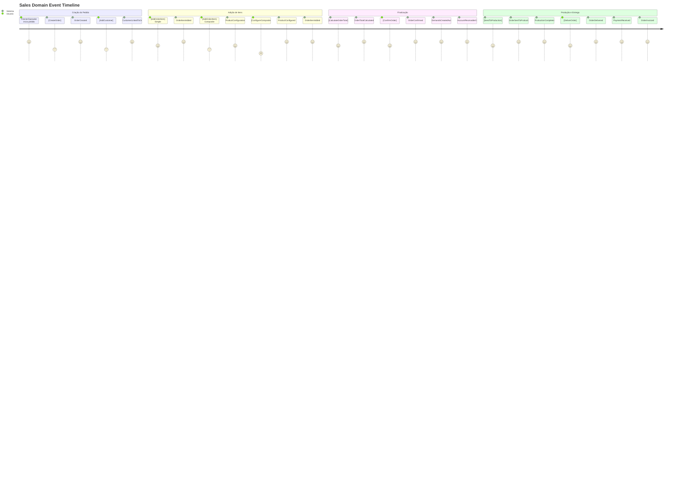

# 💰 EVENT STORMING - DOMÍNIO DE VENDAS

## 🎯 Visão Geral
Event Storming do Domínio de Vendas mapeando o fluxo completo desde a criação de pedidos até a entrega, incluindo gestão de clientes, configuração de produtos complexos, e integrações críticas com Produção e Financeiro. Inclui eventos de alto nível e micro-eventos para máximo controle.

## 🎨 Convenções Visuais
- **📋 [Comando]** - Azul - Ação executada por usuário/sistema
- **⚡ Evento** - Laranja - Fato que aconteceu no domínio
- **👤 (Ator)** - Verde - Quem executa o comando
- **📊 {Agregado}** - Roxo - Entidade que processa comando
- **🔄 Política** - Cinza - Regra "quando X então Y"
- **⚠️ (!Hotspot!)** - Rosa - Complexidade/problema identificado
- **🌐 <Sistema Externo>** - Vermelho - Integração externa

## ⚡ Event Storming Timeline

### **🔄 Fluxo Principal - Jornada do Pedido**



### **📋 Comandos por Ator**

#### **👤 Clientes**
```
[RequestOrder]
├── Input: DeliveryDate, DeliveryAddress, SpecialRequests
├── Validations: Valid delivery date (future), Valid address
├── Output: OrderRequestId
└── Events: OrderRequested

[SelectProducts]
├── Input: ProductIds[], Quantities[], Configurations[]
├── Validations: Products active, Valid quantities
├── Cross-domain: Validate with Product domain
└── Events: ProductsSelected

[ConfirmDeliveryDetails]
├── Input: DeliveryAddress, ContactInfo, PreferredTime
├── Validations: Address reachable, Contact valid
├── Integration: Google Maps API for address validation
└── Events: DeliveryDetailsConfirmed

[RequestOrderChange]
├── Input: OrderId, ChangeType, NewData
├── Validations: Order not in production, Valid changes
├── Business rules: Change fees may apply
└── Events: OrderChangeRequested
```

#### **⚙️ Operadores (Sales Team)**
```
[CreateOrder]
├── Input: CustomerId (optional), OrderType, InitialData
├── Validations: Customer exists (if provided)
├── Output: OrderId
└── Events: OrderCreated

[AddCustomer]
├── Input: CustomerData or CustomerId
├── Validations: Customer data valid, Not duplicate
├── Integration: Google Contacts sync
└── Events: CustomerAdded, CustomerLinkedToOrder

[AddOrderItem]
├── Input: OrderId, ProductId, Quantity, SpecialInstructions
├── Validations: Product active, Quantity > 0, Order editable
├── Cross-domain: Product availability check
└── Events: OrderItemAdded, ProductConfigurationRequired (if Composite/Group)

[ConfigureCompositeProduct]
├── Input: OrderItemId, ComponentSelections[], Quantities[]
├── Validations: Valid selections, Within min/max limits
├── Complex validation: Component compatibility rules
└── Events: ProductConfigured, OrderItemConfigurationUpdated

[ConfigureGroupProduct]
├── Input: OrderItemId, GroupItemSelections[], ExchangeRules[]
├── Validations: Valid group items, Exchange rules respected
├── Complex calculation: Group pricing with exchanges
└── Events: GroupConfigured, ExchangeRulesApplied

[UpdateOrderItem]
├── Input: OrderItemId, UpdateData
├── Validations: Order editable, Valid update data
├── Recalculations: Item price, Order total
└── Events: OrderItemUpdated, OrderTotalRecalculated

[RemoveOrderItem]
├── Input: OrderItemId, RemovalReason
├── Validations: Order editable, Item exists
├── Cleanup: Remove related configurations
└── Events: OrderItemRemoved, OrderTotalRecalculated

[ConfirmOrder]
├── Input: OrderId, PaymentTerms, FinalReview
├── Validations: Order complete, Customer valid, Payment terms valid
├── Critical validation: All items configured properly
└── Events: OrderConfirmed

[SendToProduction]
├── Input: OrderId
├── Validations: Order confirmed, Not already sent
├── Auto-execution: Triggered by OrderConfirmed
└── Events: OrderSentToProduction

[DeliverOrder]
├── Input: OrderId, DeliveryConfirmation, ActualDeliveryTime
├── Validations: Order ready for delivery, Valid confirmation
├── Optional: Customer signature, Photo proof
└── Events: OrderDelivered

[CancelOrder]
├── Input: OrderId, CancellationReason, RefundPolicy
├── Validations: Order cancellable, Valid reason
├── Complex logic: Partial cancellation handling
└── Events: OrderCancelled, RefundInitiated (if applicable)
```

#### **🤖 Sistema (Automático)**
```
[CalculateOrderTotal]
├── Trigger: OrderItemAdded, OrderItemUpdated, OrderItemRemoved
├── Calculation: Sum of all item totals + taxes + delivery
├── Auto-execution: Immediate after item changes
└── Events: OrderTotalCalculated

[ValidateOrderConfiguration]
├── Trigger: ProductConfigured, GroupConfigured
├── Validation: Business rules, Component compatibility
├── Auto-execution: Background validation
└── Events: OrderConfigurationValidated, ValidationFailed

[CreateDemandsForOrder]
├── Trigger: OrderConfirmed
├── Complex logic: 1 OrderItem → 1:N Demands (depends on ProductType)
├── Auto-execution: Immediate after confirmation
└── Events: DemandsCreatedAutomatically

[CreateAccountReceivable]
├── Trigger: OrderConfirmed
├── Financial calculation: Payment terms, Installments
├── Auto-execution: Immediate after confirmation
└── Events: AccountReceivableCreated

[UpdateOrderStatus]
├── Trigger: Production events, Delivery events, Payment events
├── Status synchronization: Keep order status up-to-date
├── Auto-execution: Event-driven
└── Events: OrderStatusUpdated

[CalculateDeliveryRoute]
├── Trigger: DeliveryDetailsConfirmed
├── Integration: Google Maps Directions API
├── Calculation: Distance, time, delivery cost
└── Events: DeliveryRouteCalculated, DeliveryCostUpdated
```

### **⚡ Eventos de Alto Nível**

#### **📋 Order Lifecycle Events**
```
OrderCreated
├── Data: OrderId, CustomerId (optional), CreatedBy, OrderDate
├── Triggers: [AddCustomer], [AddOrderItem] availability
├── Integrations: Reporting, Analytics
└── Importance: 🚨 Critical

OrderConfirmed
├── Data: OrderId, CustomerId, TotalValue, DeliveryDate, PaymentTerms
├── Triggers: [CreateDemandsForOrder], [CreateAccountReceivable], [SendToProduction]
├── Integrations: Production (demand creation), Financial (AR creation)
└── Importance: 🚨 Critical - Primary cross-domain trigger

OrderSentToProduction
├── Data: OrderId, ProductionOrderId, DemandIds[], ScheduledDate
├── Triggers: Production domain orchestration
├── Integrations: Production (order processing), Google Calendar (scheduling)
└── Importance: 🚨 Critical

OrderDelivered
├── Data: OrderId, DeliveryDate, DeliveryAddress, DeliveredBy, CustomerConfirmation
├── Triggers: [ProcessPayment], Status updates across domains
├── Integrations: Financial (payment processing), Customer notification
└── Importance: 🚨 Critical

OrderCancelled
├── Data: OrderId, CancellationReason, CancelledBy, RefundAmount
├── Triggers: Reverse operations in Production and Financial domains
├── Integrations: Production (cancel demands), Financial (cancel AR)
└── Importance: 🚨 Critical
```

#### **📦 Order Item Management Events**
```
OrderItemAdded
├── Data: OrderItemId, OrderId, ProductId, Quantity, UnitPrice, TotalPrice
├── Triggers: [CalculateOrderTotal], Configuration requirements (if needed)
├── Integrations: Product (availability check), Inventory
└── Importance: ⚠️ High

ProductConfigurationRequired
├── Data: OrderItemId, ProductId, ProductType, ConfigurationOptions
├── Triggers: [ConfigureCompositeProduct] or [ConfigureGroupProduct]
├── Integrations: Product (configuration rules)
└── Importance: ⚠️ High

ProductConfigured
├── Data: OrderItemId, ProductId, ConfigurationData, CalculatedPrice
├── Triggers: [OrderItemConfigurationUpdated], [CalculateOrderTotal]
├── Integrations: Product (validation), Pricing engine
└── Importance: ⚠️ High

OrderItemConfigurationUpdated
├── Data: OrderItemId, OldConfiguration, NewConfiguration, PriceDifference
├── Triggers: [CalculateOrderTotal], Configuration validation
├── Integrations: Product (validation), Pricing
└── Importance: 📊 Medium

OrderTotalCalculated
├── Data: OrderId, SubTotal, Taxes, DeliveryFee, TotalAmount, CalculationDetails
├── Triggers: UI updates, Order validation
├── Integrations: Financial (pricing validation), Customer notification
└── Importance: ⚠️ High
```

#### **👤 Customer Management Events**
```
CustomerAdded
├── Data: CustomerId, CustomerData, AddedBy, SyncToGoogle
├── Triggers: [SyncWithGoogleContacts], Credit check
├── Integrations: Google Contacts, Financial (credit validation)
└── Importance: ⚠️ High

CustomerLinkedToOrder
├── Data: OrderId, CustomerId, LinkTimestamp
├── Triggers: Customer history update, Credit limit check
├── Integrations: Financial (credit verification), Reporting
└── Importance: 📊 Medium

CustomerCreditValidated
├── Data: CustomerId, OrderId, CreditLimit, CurrentDebt, ValidationResult
├── Triggers: Order continuation or credit hold
├── Integrations: Financial (credit check)
└── Importance: ⚠️ High

DeliveryDetailsConfirmed
├── Data: OrderId, DeliveryAddress, ContactInfo, RouteData
├── Triggers: [CalculateDeliveryRoute], Delivery scheduling
├── Integrations: Google Maps (route calculation), Logistics
└── Importance: 📊 Medium
```

### **🔍 Micro-Eventos (Tracking Detalhado)**

#### **📊 Configuration Tracking**
```
CompositeProductValidationStarted
├── Data: OrderItemId, ProductId, ComponentSelections[], ValidationRules
├── Purpose: Track complex validation processes
├── Used by: Performance monitoring, UX optimization
└── Frequency: High (every composite configuration)

ComponentSelectionValidated
├── Data: OrderItemId, ComponentId, HierarchyName, ValidationResult, ResponseTime
├── Purpose: Individual component validation tracking
├── Used by: Component usage analytics, Validation performance
└── Frequency: High (each component selection)

GroupExchangeCalculationPerformed
├── Data: OrderItemId, ExchangeRules[], CalculationResult, ProcessingTime
├── Purpose: Track complex group exchange calculations
├── Used by: Pricing accuracy monitoring, Performance optimization
└── Frequency: Medium (group configurations with exchanges)

PricingRecalculationTriggered
├── Data: OrderId, TriggerReason, OldTotal, NewTotal, CalculationTime
├── Purpose: Track pricing calculation frequency and performance
├── Used by: Pricing system monitoring, User experience analysis
└── Frequency: High (any item changes)
```

#### **🔄 Process Tracking**
```
OrderEditSessionStarted
├── Data: OrderId, UserId, SessionId, EditType
├── Purpose: Track editing sessions for UX analysis
├── Used by: User experience optimization, Training needs
└── Frequency: Medium (order editing)

CrossDomainValidationRequested
├── Data: OrderId, TargetDomain, ValidationData, RequestId
├── Purpose: Track cross-domain validation calls
├── Used by: Integration monitoring, Performance optimization
└── Frequency: High (product validation, customer validation)

CustomerSearchPerformed
├── Data: SearchTerm, ResultsCount, SearchTime, SelectedCustomer
├── Purpose: Customer search optimization
├── Used by: Search improvement, Customer data quality
└── Frequency: High (customer selection)

ProductCatalogFiltered
├── Data: FilterCriteria, ResultsCount, FilterTime, UserSelection
├── Purpose: Product catalog usage analysis
├── Used by: Catalog optimization, Product positioning
└── Frequency: High (product selection)
```

#### **🌐 Integration Tracking**
```
GoogleMapsApiCalled
├── Data: OrderId, ApiEndpoint, RequestData, ResponseTime, Result
├── Purpose: Track external API usage and performance
├── Used by: API monitoring, Cost optimization
└── Frequency: Medium (address validation, route calculation)

GoogleContactsSyncTriggered
├── Data: CustomerId, SyncType, SyncResult, SyncTime
├── Purpose: Track customer data synchronization
├── Used by: Integration health monitoring, Data consistency
└── Frequency: Low (new customers, updates)

ProductCatalogSyncRequested
├── Data: OrderId, ProductIds[], SyncReason, SyncResult
├── Purpose: Track product data synchronization
├── Used by: Data consistency monitoring, Cache optimization
└── Frequency: Medium (product availability checks)
```

### **📊 Agregados e Responsabilidades**

#### **🎯 OrderEntry Aggregate**
```
{OrderEntry}
├── Entities: OrderEntry, OrderItem
├── Value Objects: OrderStatus, OrderType, DeliveryInfo
├── Invariants:
│   ├── Order must have at least one item to be confirmed
│   ├── DeliveryDate must be >= OrderDate
│   ├── TotalValue = Sum of OrderItem totals
│   ├── Cannot edit confirmed orders
│   └── Customer required for confirmation
├── Events Published:
│   ├── OrderCreated, OrderConfirmed, OrderDelivered
│   ├── OrderCancelled, OrderStatusUpdated
│   ├── OrderItemAdded, OrderItemUpdated, OrderItemRemoved
│   └── OrderTotalCalculated
└── Commands Handled:
    ├── CreateOrder, ConfirmOrder, CancelOrder
    ├── AddOrderItem, UpdateOrderItem, RemoveOrderItem
    ├── DeliverOrder, UpdateOrderStatus
    └── CalculateOrderTotal
```

#### **📦 OrderItem Aggregate**
```
{OrderItem}
├── Entities: OrderItem
├── Value Objects: ProductConfiguration, ItemStatus
├── Invariants:
│   ├── Quantity must be > 0
│   ├── UnitPrice must be >= 0
│   ├── Product must be active
│   ├── Configuration required for Composite/Group products
│   └── Configuration must be valid per product rules
├── Events Published:
│   ├── OrderItemAdded, OrderItemUpdated, OrderItemRemoved
│   ├── ProductConfigurationRequired, ProductConfigured
│   ├── OrderItemConfigurationUpdated
│   └── ItemPriceCalculated
└── Commands Handled:
    ├── AddOrderItem, UpdateOrderItem, RemoveOrderItem
    ├── ConfigureCompositeProduct, ConfigureGroupProduct
    └── ValidateItemConfiguration
```

#### **👤 Customer Aggregate**
```
{Customer}
├── Entities: Customer
├── Value Objects: CustomerType, ContactInfo, Address
├── Invariants:
│   ├── Email must be unique (if provided)
│   ├── Document (CPF/CNPJ) must be valid
│   ├── Name cannot be empty
│   ├── Customer type must match document type
│   └── Active customers only can place orders
├── Events Published:
│   ├── CustomerCreated, CustomerUpdated
│   ├── CustomerActivated, CustomerDeactivated
│   ├── CustomerLinkedToOrder
│   └── CustomerCreditValidated
└── Commands Handled:
    ├── CreateCustomer, UpdateCustomer
    ├── ActivateCustomer, DeactivateCustomer
    ├── LinkCustomerToOrder
    └── ValidateCustomerCredit
```

### **🔄 Políticas de Negócio (Business Rules)**

#### **⚙️ Order Processing Policies**
```
"Quando OrderConfirmed, então CreateDemandsAutomatically"
├── Rule Engine: Analyze OrderItems and create demands per ProductType
├── Simple Product: 1 OrderItem → 1 Demand
├── Composite Product: 1 OrderItem → 1 Demand + N ProductComposition
├── Group Product: 1 OrderItem → N Demands (one per concrete product)
├── Auto-execution: Immediate and atomic
└── Integration: Production domain demand creation

"Quando OrderConfirmed, então CreateAccountReceivable"
├── Payment terms analysis: À vista vs Parcelado
├── Financial calculation: Total amount, installments, due dates
├── Auto-execution: Immediate after demand creation
└── Integration: Financial domain AR creation

"Quando OrderItemAdded, então ValidateProductAvailability"
├── Cross-domain check: Product active status
├── Inventory check: Component availability (for Composite)
├── Business rules: Customer-specific restrictions
└── Failure handling: Block item addition, notify user
```

#### **🧩 Product Configuration Policies**
```
"Quando ProductConfigurationRequired, então LoadConfigurationOptions"
├── Cross-domain query: Get product configuration rules
├── Composite logic: Load hierarchies and components
├── Group logic: Load group items and exchange rules
├── Cache optimization: Cache configuration options
└── Integration: Product domain configuration rules

"Quando ComponentSelected, então ValidateComponentCompatibility"
├── Business rules: Component compatibility matrix
├── Quantity validation: Min/max per hierarchy
├── Pricing calculation: Base price + component costs
├── Real-time validation: Immediate feedback to user
└── Integration: Product domain validation rules

"Quando GroupExchangeApplied, então RecalculateGroupPricing"
├── Exchange ratio calculation: Source to target conversions
├── Price adjustment: Apply exchange cost differences
├── Quantity validation: Ensure minimum quantities met
├── Complex calculation: Multi-step exchange chains
└── Integration: Product domain exchange rules
```

#### **🚚 Delivery and Integration Policies**
```
"Quando DeliveryDetailsConfirmed, então CalculateDeliveryRoute"
├── External API call: Google Maps Directions API
├── Route optimization: Distance, time, cost calculation
├── Delivery fee calculation: Based on distance and time
├── Cache strategy: Cache routes for common addresses
└── Integration: Google Maps Platform

"Quando OrderDelivered, então TriggerPaymentProcessing"
├── Financial integration: Update AccountReceivable status
├── Payment notification: Notify customer for payment
├── Status synchronization: Update order status across domains
└── Integration: Financial domain payment processing

"Quando CustomerAdded, então SyncWithGoogleContacts"
├── External sync: Add/update customer in Google Contacts
├── Bidirectional sync: Handle Google-originated changes
├── Conflict resolution: Prefer system data over Google data
├── Async processing: Don't block order creation
└── Integration: Google People API
```

### **⚠️ Hotspots e Complexidades**

#### **🚨 Complexidades Críticas**

##### **(!OrderItemDemandGeneration!)**
```
Problema: Complex 1:N mapping from OrderItems to Demands
Cenário: Group products can generate multiple demands of different types
Impacto: Core business logic, affects Production domain
Solução: Demand Generation Service with Strategy pattern
Prioridade: Critical - Core business functionality
```

##### **(!CompositeProductConfiguration!)**
```
Problema: Complex validation and pricing for composite products
Cenário: Multiple hierarchies, component dependencies, dynamic pricing
Impacto: User experience, order accuracy, pricing integrity
Solução: Configuration Engine with rule caching
Prioridade: High - Direct customer impact
```

##### **(!CrossDomainEventOrdering!)**
```
Problema: Event ordering between Sales → Production → Financial
Cenário: Race conditions in demand creation vs AR creation
Impacto: Data consistency, financial accuracy
Solução: Saga pattern with compensating actions
Prioridade: Critical - Data integrity
```

##### **(!GoogleAPIResilience!)**
```
Problema: Dependency on Google APIs for core functionality
Cenário: API downtime affecting order creation and delivery
Impacto: Order processing blocked, customer experience
Solução: Circuit breaker + fallback mechanisms
Prioridade: High - System availability
```

#### **📊 Métricas e Alertas**

##### **🎯 Business Metrics**
```
Order Conversion Rate:
├── Metric: (Confirmed Orders / Created Orders) * 100
├── Alert: < 70% conversion rate
├── Dashboard: Sales performance KPIs
└── Usage: Sales process optimization

Average Order Value (AOV):
├── Metric: Total order value / Number of orders
├── Alert: AOV declining > 10% week-over-week
├── Dashboard: Revenue analytics
└── Usage: Pricing strategy evaluation

Configuration Completion Rate:
├── Metric: % orders with successful product configuration
├── Alert: < 90% completion rate
├── Dashboard: UX metrics
└── Usage: Configuration flow optimization

Time to Confirm Order:
├── Metric: Average time from creation to confirmation
├── Alert: > 30 minutes average time
├── Dashboard: Process efficiency
└── Usage: Process improvement
```

##### **⚡ Technical Metrics**
```
Cross-Domain Event Latency:
├── Metric: Time from OrderConfirmed to DemandsCreated
├── Alert: > 5 seconds latency
├── Dashboard: Integration performance
└── Usage: System optimization

Google API Response Time:
├── Metric: Average response time for Maps/Contacts APIs
├── Alert: > 3 seconds response time
├── Dashboard: External dependency health
└── Usage: API performance monitoring

Order Processing Error Rate:
├── Metric: % orders with processing errors
├── Alert: > 1% error rate
├── Dashboard: System reliability
└── Usage: Error reduction initiatives

Cache Hit Ratio (Product Catalog):
├── Metric: % product requests served from cache
├── Alert: < 85% hit ratio
├── Dashboard: Performance optimization
└── Usage: Caching strategy tuning
```

##### **🔍 Operational Metrics**
```
Peak Order Processing Load:
├── Metric: Maximum concurrent orders being processed
├── Alert: Approaching system capacity limits
├── Dashboard: Capacity planning
└── Usage: Infrastructure scaling decisions

Customer Data Sync Success Rate:
├── Metric: % successful Google Contacts synchronizations
├── Alert: < 95% success rate
├── Dashboard: Integration health
└── Usage: Data consistency monitoring

Order Cancellation Rate:
├── Metric: % orders cancelled after confirmation
├── Alert: > 5% cancellation rate
├── Dashboard: Business health indicators
└── Usage: Process and quality improvement
```

---

**Arquivo**: `sales-domain-events.md`  
**Domínio**: Vendas (#f36b21)  
**Tipo**: Event Storming  
**Granularidade**: Alto nível + Micro-eventos + Integrações críticas  
**Atualização**: 16/06/2025
