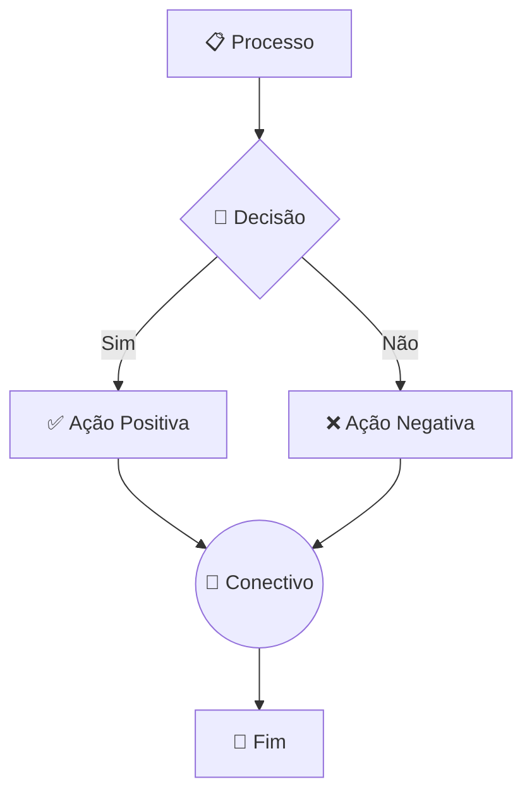

# 🎨 CONVENÇÕES VISUAIS E LEGENDAS - DIAGRAMAS GesN

## 🎯 Visão Geral
Este documento define as convenções visuais, cores e simbologias utilizadas em todos os diagramas do sistema GesN, garantindo consistência e facilidade de interpretação.

## 🌈 Cores por Domínio

### **🎨 Paleta Principal**
| Domínio | Cor Hex | Cor RGB | Exemplo Visual | Uso |
|---------|---------|---------|----------------|-----|
| **📦 Produto** | `#00a86b` | RGB(0, 168, 107) |  | Entidades, backgrounds, borders |
| **💰 Vendas** | `#f36b21` | RGB(243, 107, 33) |  | Entidades, backgrounds, borders |
| **🏭 Produção** | `#fba81d` | RGB(251, 168, 29) |  | Entidades, backgrounds, borders |
| **🛒 Compras** | `#0562aa` | RGB(5, 98, 170) |  | Entidades, backgrounds, borders |
| **💳 Financeiro** | `#083e61` | RGB(8, 62, 97) |  | Entidades, backgrounds, borders |

### **🎨 Variações Tonais**

#### **Produto (Verde)**
- **Escuro**: `#00a86b` - Entidades principais
- **Médio**: `#2dd4aa` - Entidades relacionadas  
- **Claro**: `#a7f3d0` - Interfaces/serviços
- **Extra Claro**: `#6ee7b7` - Implementações

#### **Vendas (Laranja)**
- **Escuro**: `#f36b21` - Entidades principais
- **Médio**: `#ff8a50` - Entidades relacionadas
- **Claro**: `#fed7aa` - Processos secundários
- **Extra Claro**: `#fef3c7` - Estados pendentes

#### **Produção (Dourado)**
- **Escuro**: `#fba81d` - Entidades principais
- **Médio**: `#fcd34d` - Processos ativos
- **Claro**: `#fed7aa` - Processos em andamento
- **Extra Claro**: `#fef3c7` - Estados iniciais

#### **Compras (Azul)**
- **Escuro**: `#0562aa` - Entidades principais
- **Médio**: `#3b82f6` - Processos ativos
- **Claro**: `#93c5fd` - Estados intermediários
- **Extra Claro**: `#dbeafe` - Estados iniciais

#### **Financeiro (Azul Escuro)**
- **Escuro**: `#083e61` - Entidades principais
- **Médio**: `#1e40af` - Transações
- **Claro**: `#3b82f6` - Estados parciais
- **Extra Claro**: `#dbeafe` - Estados pendentes

### **🎨 Cores Especiais**

#### **Estados e Status**
| Estado | Cor | Uso |
|--------|-----|-----|
| **✅ Sucesso/Completo** | `#10b981` (Verde claro) | Estados finalizados |
| **⚠️ Atenção/Parcial** | `#f59e0b` (Amarelo) | Estados intermediários |
| **🚨 Erro/Crítico** | `#ef4444` (Vermelho) | Estados de erro |
| **⏰ Pendente** | `#6b7280` (Cinza) | Estados aguardando |
| **❌ Cancelado** | `#e5e7eb` (Cinza claro) | Estados cancelados |

#### **Tipos Especiais**
| Tipo | Cor | Uso |
|------|-----|-----|
| **🤖 Automático** | `#8b5cf6` (Roxo) | Processos automáticos |
| **👤 Manual** | `#3b82f6` (Azul) | Ações do usuário |
| **🔗 Integração** | `#64748b` (Cinza escuro) | Conexões entre domínios |
| **📊 Métrica** | `#059669` (Verde escuro) | Indicadores e KPIs |

## 📊 Simbolos e Relacionamentos

### **🔗 Tipos de Relacionamentos (ERD)**

#### **Cardinalidade**
```
1:1 (Um para Um)
Entity1 ||--|| Entity2

1:N (Um para Muitos)  
Entity1 ||--o{ Entity2

N:N (Muitos para Muitos)
Entity1 }o--o{ Entity2

Opcional
Entity1 ||--o| Entity2

Obrigatório
Entity1 ||--|| Entity2
```

#### **Herança e Especialização**
```
Herança (TPH)
ParentEntity <|-- ChildEntity

Implementação de Interface
Interface <|.. Implementation

Composição
Container ||--o{ Component

Agregação
Whole o--o{ Part
```

### **⚡ Símbolos de Estado (State Diagrams)**

#### **Transições**
| Símbolo | Significado | Exemplo |
|---------|-------------|---------|
| `→` | Transição automática | `Pending → Confirmed` |
| `↗️` | Transição manual | `Draft ↗️ Sent` |
| `⚠️` | Transição condicional | `InProgress ⚠️ Completed` |
| `🚨` | Transição de exceção | `Any 🚨 Cancelled` |
| `🔄` | Transição bidirecional | `Active 🔄 Inactive` |

#### **Estados Especiais**
| Símbolo | Estado | Cor | Descrição |
|---------|--------|-----|-----------|
| `[*]` | Estado inicial | `#e5e7eb` | Início do fluxo |
| `[*]` | Estado final | `#10b981` | Fim bem-sucedido |
| `⚠️` | Estado de warning | `#f59e0b` | Atenção necessária |
| `🚨` | Estado crítico | `#ef4444` | Intervenção urgente |
| `⏰` | Estado temporizado | `#6b7280` | Com timeout |

### **🔄 Símbolos de Processo (Flowcharts)**

#### **Elementos de Fluxo**


#### **Tipos de Elementos**
| Forma | Uso | Exemplo |
|-------|-----|---------|
| `[Retângulo]` | Processo/Ação | `[Criar OrderItem]` |
| `{Losango}` | Decisão | `{Produto ativo?}` |
| `((Círculo))` | Conectivo | `((Consolidação))` |
| `[/Paralelogramo/]` | Input/Output | `[/Dados do usuário/]` |
| `((Círculo Duplo))` | Estado final | `((Finalizado))` |

### **🎭 Ícones e Emojis por Contexto**

#### **Domínios**
- **📦 Produto**: Caixa, pacote, item
- **💰 Vendas**: Dinheiro, carrinho, pedido
- **🏭 Produção**: Fábrica, engrenagem, produção
- **🛒 Compras**: Carrinho de compras, fornecedor
- **💳 Financeiro**: Cartão, transação, conta

#### **Entidades Principais**
- **👤 Customer**: Cliente, usuário
- **📋 Order**: Pedido, lista
- **🏷️ Product**: Produto, item
- **🏭 Demand**: Demanda de produção
- **🛒 Purchase**: Compra, aquisição
- **💰 Account**: Conta financeira
- **💳 Transaction**: Transação, pagamento

#### **Estados e Ações**
- **🆕 Novo**: Criação, início
- **⚡ Automático**: Processo automático
- **👤 Manual**: Ação do usuário
- **✅ Sucesso**: Completado, OK
- **⚠️ Atenção**: Warning, cuidado
- **🚨 Crítico**: Erro, problema
- **❌ Cancelado**: Cancelamento
- **🔄 Em andamento**: Processando
- **⏰ Aguardando**: Pendente, timeout

#### **Tecnologias e Sistemas**
- **🤖 IA**: Inteligência artificial
- **📄 Documento**: Arquivo, nota fiscal
- **🔍 Busca**: Pesquisa, localização
- **📊 Métrica**: Indicador, KPI
- **🔔 Notificação**: Alerta, comunicação
- **🏦 Banco**: Conta bancária, financeiro

## 📏 Dimensões e Espaçamento

### **Tamanhos Padrão**
```
Caixas de Entidade: 120x60px
Losangos de Decisão: 100x80px  
Círculos de Estado: 80x80px
Conectores: 60x60px
```

### **Espaçamento**
```
Entre elementos: 40px
Entre níveis: 60px
Margens do diagrama: 20px
Largura de linha: 2px (padrão), 3px (destaque)
```

### **Fontes e Textos**
```
Título do diagrama: 18px, Bold
Labels de entidade: 14px, Bold  
Propriedades: 12px, Normal
Descrições: 11px, Italic
Anotações: 10px, Normal
```

## 🛠️ Aplicação por Tipo de Diagrama

### **📊 Entity-Relationship Diagrams (ERD)**
- **Background**: Cor do domínio (escura)
- **Texto**: Branco ou preto (contraste)
- **Bordas**: Cor do domínio (mesma do background)
- **Relacionamentos**: Linhas cinza escuro (`#374151`)
- **Entidades externas**: Cinza claro (`#e5e7eb`)

### **🏗️ Class Diagrams**
- **Classes principais**: Cor escura do domínio
- **Classes relacionadas**: Cor média do domínio
- **Interfaces**: Cor clara do domínio
- **Implementações**: Cor extra clara do domínio
- **Herança**: Linhas com seta triangular
- **Implementação**: Linhas tracejadas

### **🔄 Process Flowcharts**
- **Processos principais**: Cor do domínio responsável
- **Decisões**: Amarelo (`#fef3c7`)
- **Integrações**: Cor do domínio destino
- **Estados finais**: Verde (`#d1fae5`) ou vermelho (`#fecaca`)

### **📈 State Diagrams**
- **Estados normais**: Cores tonais por fase
- **Estados finais de sucesso**: Verde (`#d1fae5`)
- **Estados de erro**: Vermelho (`#fecaca`)
- **Estados pendentes**: Amarelo (`#fef3c7`)
- **Transições**: Linhas com labels descritivos

## 🔧 Implementação Técnica

### **Mermaid CSS Classes**
```css
classDef productStyle fill:#00a86b,stroke:#00a86b,stroke-width:2px,color:white
classDef salesStyle fill:#f36b21,stroke:#f36b21,stroke-width:2px,color:white  
classDef productionStyle fill:#fba81d,stroke:#fba81d,stroke-width:2px,color:black
classDef purchasingStyle fill:#0562aa,stroke:#0562aa,stroke-width:2px,color:white
classDef financialStyle fill:#083e61,stroke:#083e61,stroke-width:2px,color:white

classDef successStyle fill:#d1fae5,stroke:#10b981,stroke-width:2px,color:black
classDef warningStyle fill:#fef3c7,stroke:#f59e0b,stroke-width:2px,color:black
classDef errorStyle fill:#fecaca,stroke:#ef4444,stroke-width:2px,color:black
classDef pendingStyle fill:#e5e7eb,stroke:#6b7280,stroke-width:2px,color:black
```

### **Aplicação de Classes**
```mermaid
graph TD
    A[Entidade Principal]
    B[Entidade Relacionada]
    C[Estado Sucesso]
    D[Estado Erro]
    
    class A productStyle
    class B salesStyle  
    class C successStyle
    class D errorStyle
```

---

**Arquivo**: `colors-and-conventions.md`  
**Versão**: 1.0  
**Atualização**: 16/06/2025  
**Uso**: Referência para todos os diagramas do sistema GesN
