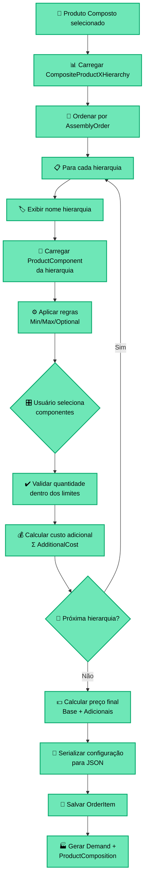
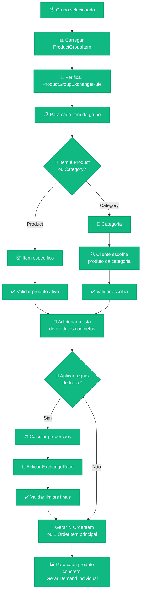
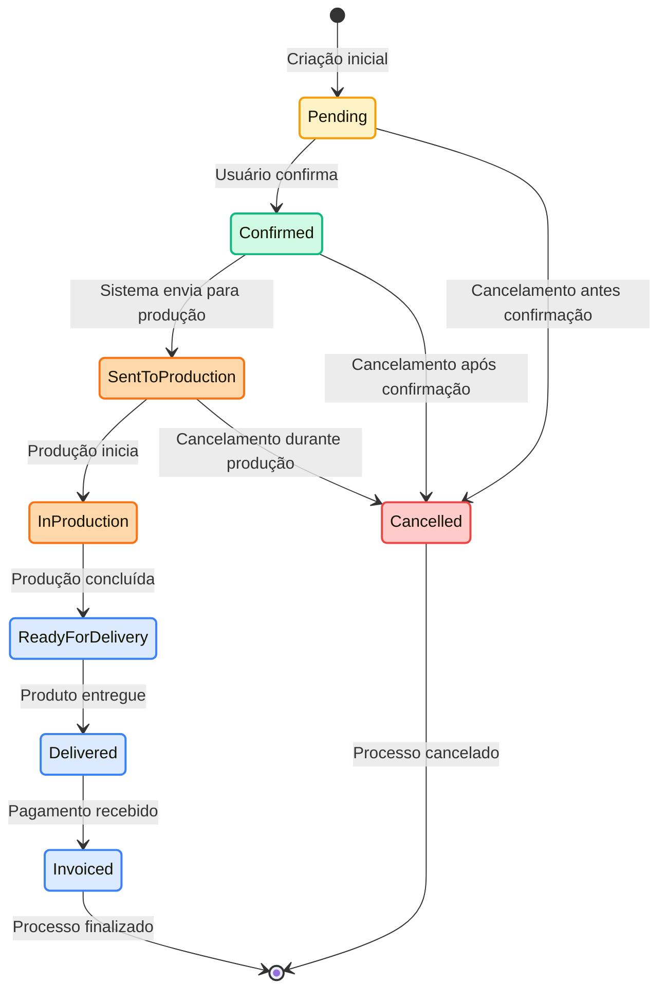

# 💰 FLUXOGRAMA - PROCESSO DE VENDAS

## 🎯 Visão Geral
Fluxograma completo do processo de criação de vendas/pedidos no Domínio de Vendas, mostrando como diferentes tipos de produtos (Simple, Composite, Group) impactam o fluxo e geram automaticamente registros em outros domínios (Produção e Financeiro).

## 🔄 Fluxo Principal de Criação de Venda/Pedido

```mermaid
flowchart TD
    %% === INÍCIO DO PROCESSO ===
    A[🚀 Usuário inicia novo pedido] --> B[📝 Modal Criação Rápida]
    
    %% === CRIAÇÃO RÁPIDA ===
    B --> C[🔍 Seleção de Customer<br/>via autocomplete]
    C --> D[📅 Definição de datas<br/>Pedido e Entrega]
    D --> E[🚚 Tipo de pedido<br/>Delivery/Pickup]
    E --> F[💾 Salvar OrderEntry<br/>Status: Pending]
    
    %% === ABERTURA EM ABA ===
    F --> G[📑 Abertura automática<br/>em nova aba dinâmica]
    
    %% === SELEÇÃO DE PRODUTO ===
    G --> H[🛍️ Buscar produto<br/>para adicionar]
    H --> I{🎯 Identificar<br/>ProductType}
    
    %% === FLUXOS POR TIPO DE PRODUTO ===
    
    %% PRODUTO SIMPLES
    I -->|Simple| J1[📦 Produto Simples]
    J1 --> J2[⚡ Definir quantidade]
    J2 --> J3[💰 Aplicar preço padrão]
    J3 --> J4[✅ Criar OrderItem<br/>imediatamente]
    J4 --> J5[🏭 Gerar 1 Demand<br/>Status: Pending]
    
    %% PRODUTO COMPOSTO
    I -->|Composite| K1[🧩 Produto Composto]
    K1 --> K2[🎨 Carregar hierarquias<br/>via CompositeProductXHierarchy]
    K2 --> K3[📋 Apresentar configuração<br/>por camadas sequenciais]
    K3 --> K4{⚙️ Usuário configura<br/>componentes}
    K4 --> K5[✔️ Validar regras<br/>Min/Max, Opcionalidade]
    K5 --> K6[💵 Calcular preço dinâmico<br/>Base + AdditionalCost]
    K6 --> K7[📄 Salvar configuração<br/>JSON em OrderItem]
    K7 --> K8[🏭 Gerar 1 Demand +<br/>N ProductComposition]
    
    %% PRODUTO GRUPO
    I -->|Group| L1[📦 Grupo de Produtos]
    L1 --> L2[📊 Carregar itens do grupo<br/>via ProductGroupItem]
    L2 --> L3[🔄 Verificar regras de troca<br/>ProductGroupExchangeRule]
    L3 --> L4{🎛️ Cliente configura<br/>quantidades e trocas}
    L4 --> L5[⚖️ Validar proporções<br/>e limites de quantidade]
    L5 --> L6[💰 Calcular preço<br/>proporcional do kit]
    L6 --> L7[📝 Criar OrderItem principal]
    L7 --> L8[🏭 Explodir grupo:<br/>Gerar N Demands<br/>uma por produto concreto]
    
    %% === CONSOLIDAÇÃO ===
    J5 --> M[📊 Recalcular totais<br/>OrderEntry.TotalValue]
    K8 --> M
    L8 --> M
    
    M --> N{➕ Adicionar mais<br/>produtos?}
    N -->|Sim| H
    N -->|Não| O[💳 Definir condições<br/>de pagamento]
    
    %% === FINALIZAÇÃO ===
    O --> P[👀 Revisão final<br/>do pedido]
    P --> Q[✅ Confirmar pedido<br/>OrderStatus: Confirmed]
    
    %% === INTEGRAÇÕES AUTOMÁTICAS ===
    Q --> R1[🏭 PRODUÇÃO:<br/>Todas Demands → Confirmed]
    Q --> R2[💰 FINANCEIRO:<br/>Gerar AccountReceivable]
    
    R1 --> S[🎉 Pedido finalizado<br/>e pronto para produção]
    R2 --> S
    
    %% === STYLING POR DOMÍNIO ===
    
    %% VENDAS = Laranja
    classDef salesStyle fill:#f36b21,stroke:#f36b21,stroke-width:2px,color:white
    class A,B,C,D,E,F,G,H,I,M,N,O,P,Q,S salesStyle
    
    %% PRODUTO SIMPLES = Verde claro
    classDef simpleStyle fill:#a7f3d0,stroke:#00a86b,stroke-width:2px,color:black
    class J1,J2,J3,J4,J5 simpleStyle
    
    %% PRODUTO COMPOSTO = Verde médio
    classDef compositeStyle fill:#6ee7b7,stroke:#00a86b,stroke-width:2px,color:black
    class K1,K2,K3,K4,K5,K6,K7,K8 compositeStyle
    
    %% PRODUTO GRUPO = Verde escuro
    classDef groupStyle fill:#10b981,stroke:#00a86b,stroke-width:2px,color:white
    class L1,L2,L3,L4,L5,L6,L7,L8 groupStyle
    
    %% INTEGRAÇÕES = Cores dos domínios
    classDef productionStyle fill:#fba81d,stroke:#fba81d,stroke-width:2px,color:black
    class R1 productionStyle
    
    classDef financialStyle fill:#083e61,stroke:#083e61,stroke-width:2px,color:white
    class R2 financialStyle
```



## 📋 Detalhamento dos Fluxos por Tipo de Produto

### **🔷 Fluxo: Produto Simples**

#### **Características do Processo:**
```
1. Processo mais direto e rápido
2. Sem configurações adicionais
3. Geração automática de 1 Demand
4. Tempo médio: 30 segundos
```

#### **Dados Propagados:**
```
OrderItem → Demand:
├── ProductId: Copiado diretamente
├── Quantity: Quantidade solicitada
├── RequiredDate: OrderEntry.DeliveryDate
├── DemandStatus: "Pending"
└── ProductConfiguration: null (não aplicável)
```

#### **Exemplo Prático:**
```
Cliente solicita: 50x "Coxinha Comum"

Fluxo:
1. OrderItem criado: 50x Coxinha, R$ 175,00
2. Demand gerada: 50x Coxinha, Status: Pending
3. Sem ProductComposition (produto simples)
```

### **🔶 Fluxo: Produto Composto**

#### **Processo de Configuração Detalhado:**


#### **Estrutura de ProductComposition Gerada:**
```
Para cada componente selecionado:

ProductComposition {
  DemandId: Demand criada,
  ProductComponentId: Componente escolhido,
  HierarchyName: Nome da hierarquia,
  ComponentName: Nome do componente,
  Quantity: Quantidade do componente,
  Status: "Pending"
}
```

#### **Exemplo Prático:**
```
Cliente configura: 1x "Bolo p/ 20 pessoas"
Configuração:
├── Massa: Chocolate
├── Recheio: Brigadeiro + Morango  
├── Cobertura: Chantilly
└── Opcional: Frutas Vermelhas

Resultado:
1. OrderItem: 1x Bolo, R$ 78,00 (45 + 8 + 5 + 20)
2. Demand: 1x Bolo p/ 20 pessoas
3. ProductComposition geradas:
   ├── Massa Chocolate (Hierarquia: Massa)
   ├── Recheio Brigadeiro (Hierarquia: Recheio)
   ├── Recheio Morango (Hierarquia: Recheio)
   ├── Cobertura Chantilly (Hierarquia: Cobertura)
   └── Frutas Vermelhas (Hierarquia: Opcionais)
```

### **🔸 Fluxo: Grupo de Produtos**

#### **Processo de Explosão do Grupo:**


#### **Exemplo Prático Complexo:**
```
Cliente solicita: 1x "Kit Festa 50 pessoas"

Configuração base:
├── 1x Bolo p/ 50 pessoas (Product)
├── 500x Salgados Tradicionais (Category)  
├── 200x Doces Tradicionais (Category)
└── 3x Refrigerante 2L (Product)

Cliente aplica trocas:
├── 100x Salgados Tradicionais → 50x Salgados Especiais (ratio 2:1)
├── 50x Doces Tradicionais → 25x Tortas Individuais (ratio 2:1)

Configuração final:
├── 1x Bolo p/ 50 pessoas (Composite)
├── 400x Coxinha (Simple) - restante dos salgados
├── 50x Torta de Frango (Simple) - salgados especiais
├── 150x Cajuzinho (Simple) - restante dos doces  
├── 25x Torta de Morango (Simple) - tortas individuais
└── 3x Refrigerante 2L (Simple)

Demands geradas:
1. Demand: 1x Bolo p/ 50 pessoas + ProductComposition detalhada
2. Demand: 400x Coxinha
3. Demand: 50x Torta de Frango
4. Demand: 150x Cajuzinho
5. Demand: 25x Torta de Morango  
6. Demand: 3x Refrigerante 2L

Total: 6 Demands de produção
```

## 🔄 Ciclo de Vida do Pedido (OrderStatus)



### **Impactos das Mudanças de Status:**

#### **Pending → Confirmed**
```
Ações automáticas:
1. Todas Demands relacionadas: Status → "Confirmed"
2. Gerar AccountReceivable no Financeiro
3. Bloquear edições de OrderItem
4. Enviar notificação para produção
```

#### **Confirmed → SentToProduction**
```
Ações automáticas:
1. Criar ProductionOrder agrupando Demands
2. ProductionOrder.Status → "Scheduled"
3. Todas Demands: DemandStatus → "Confirmed"
4. Reservar ingredientes no estoque
```

#### **SentToProduction → InProduction**
```
Ações automáticas:
1. ProductionOrder.Status → "InProgress"
2. Demands podem iniciar produção
3. Consumo de ingredientes liberado
4. Rastreamento de tempo iniciado
```

#### **InProduction → ReadyForDelivery**
```
Condições:
1. Todas Demands: DemandStatus = "Ready"
2. Todas ProductComposition: Status = "Completed"

Ações automáticas:
1. Notificar cliente sobre conclusão
2. Preparar para logística
3. Atualizar previsão de entrega
```

#### **ReadyForDelivery → Delivered**
```
Ações manuais:
1. Usuário marca como entregue
2. Confirma data/hora de entrega
3. Opcional: coleta assinatura cliente

Ações automáticas:
1. Liberar AccountReceivable para cobrança
2. Finalizar ProductionOrder
3. Atualizar métricas de entrega
```

#### **Delivered → Invoiced**
```
Condições:
1. AccountReceivable.AccountStatus = "Paid"

Ações automáticas:
1. Processar transação financeira
2. Gerar comprovante fiscal
3. Arquivar pedido como concluído
```

## 🚨 Regras de Validação e Alertas

### **Validações por Tipo de Produto:**

#### **Produto Simples:**
- ✅ Product.StateCode = "Active"
- ✅ Quantity > 0
- ✅ UnitPrice >= Product.Cost (margem mínima)

#### **Produto Composto:**
- ✅ Todas validações de Simple +
- ✅ Pelo menos 1 componente por hierarquia obrigatória
- ✅ Quantidade de componentes dentro de Min/Max
- ✅ Componentes selecionados estão ativos
- ✅ ProductConfiguration é válida

#### **Grupo de Produtos:**
- ✅ Todas validações de Simple +
- ✅ Pelo menos 1 item configurado
- ✅ Regras de troca respeitadas
- ✅ Quantidades dentro dos limites
- ✅ Produtos escolhidos em categorias estão ativos

### **Alertas Críticos:**
- 🚨 **Demand sem ProductionOrder**: Demand confirmada > 2 horas sem agrupamento
- 🚨 **Produto Indisponível**: Tentativa de usar produto inativo
- 🚨 **Configuração Inválida**: ProductComposition violando regras
- 🚨 **Estoque Insuficiente**: Ingredientes necessários indisponíveis

---

**Arquivo**: `02-sales-order-flow.md`  
**Domínio**: Vendas (#f36b21)  
**Tipo**: Process Flowchart  
**Complexidade**: Produtos Simple, Composite e Group + Integrações
