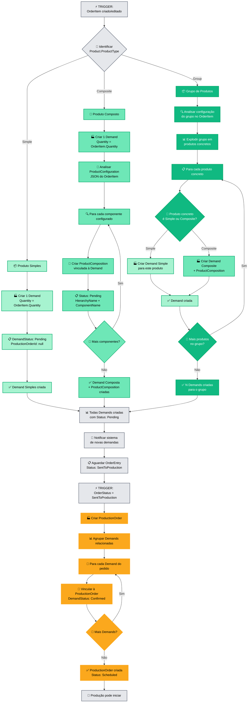
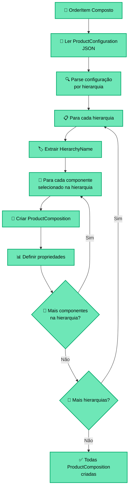
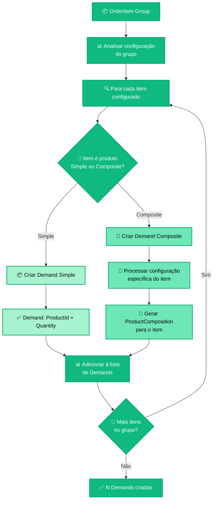
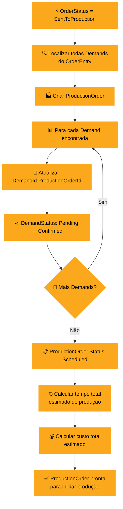
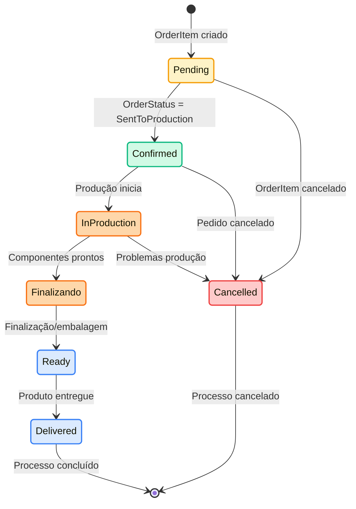
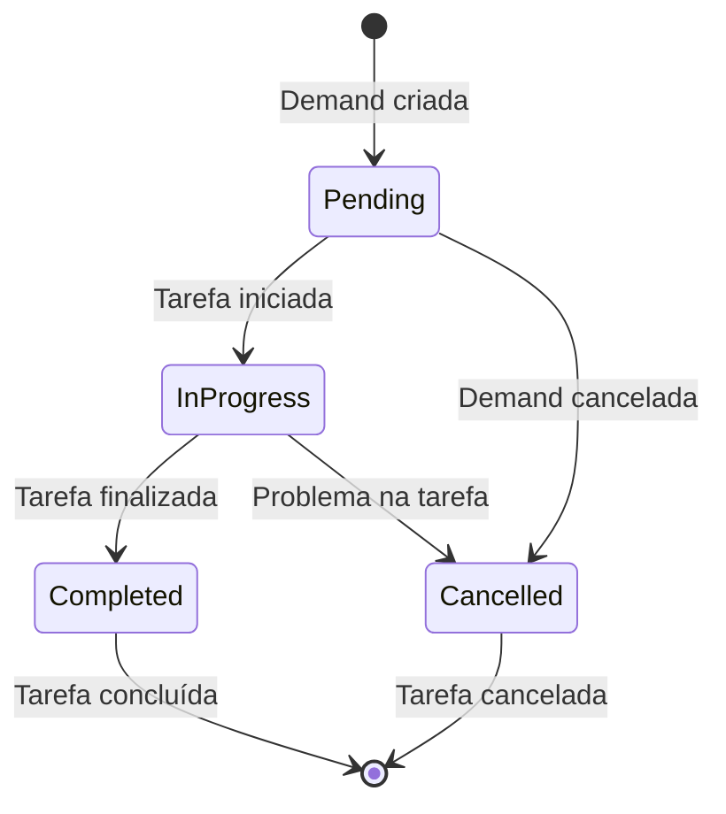

# 🏭 FLUXOGRAMA - PROCESSO DE PRODUÇÃO

## 🎯 Visão Geral
Fluxograma completo do processo de criação automática de demandas a partir de OrderItems e gerenciamento de produção através de ProductComposition e ProductionOrder. Mostra como 1 OrderItem pode gerar 1:N Demands dependendo do tipo de produto.

## 🔄 Fluxo de Criação Automática de Demandas



## 📋 Detalhamento da Geração por Tipo de Produto

### **🔷 Geração para Produto Simples**

#### **Regra de Conversão 1:1:**
```
1 OrderItem (Simple) → 1 Demand

Exemplo:
OrderItem: 50x "Coxinha Comum"
↓
Demand: {
  OrderItemId: OrderItem.Id,
  ProductId: "coxinha-comum",
  Quantity: 50,
  RequiredDate: OrderEntry.DeliveryDate,
  DemandStatus: "Pending",
  ProductionOrderId: null
}
```

#### **Características:**
- ✅ Processo mais direto
- ✅ Sem ProductComposition necessária
- ✅ Tempo de processamento: ~50ms
- ✅ Não requer configuração adicional

### **🔶 Geração para Produto Composto**

#### **Processo Detalhado:**


#### **Estrutura ProductConfiguration (JSON):**
```json
{
  "massa": {
    "hierarchyId": "hierarchy-massa-id",
    "componentId": "component-chocolate-id",
    "componentName": "Massa de Chocolate",
    "quantity": 1,
    "additionalCost": 0.00
  },
  "recheio": {
    "hierarchyId": "hierarchy-recheio-id", 
    "components": [
      {
        "componentId": "component-brigadeiro-id",
        "componentName": "Recheio de Brigadeiro",
        "quantity": 1,
        "additionalCost": 0.00
      },
      {
        "componentId": "component-morango-id", 
        "componentName": "Recheio de Morango",
        "quantity": 1,
        "additionalCost": 5.00
      }
    ]
  },
  "cobertura": {
    "hierarchyId": "hierarchy-cobertura-id",
    "componentId": "component-chantilly-id",
    "componentName": "Cobertura Chantilly",
    "quantity": 1,
    "additionalCost": 0.00
  }
}
```

#### **ProductComposition Resultante:**
```
Para o exemplo acima, gera 4 ProductComposition:

1. ProductComposition {
     DemandId: demand-id,
     ProductComponentId: "component-chocolate-id",
     HierarchyName: "Massa",
     ComponentName: "Massa de Chocolate", 
     Quantity: 1,
     Status: "Pending"
   }

2. ProductComposition {
     DemandId: demand-id,
     ProductComponentId: "component-brigadeiro-id",
     HierarchyName: "Recheio",
     ComponentName: "Recheio de Brigadeiro",
     Quantity: 1, 
     Status: "Pending"
   }

3. ProductComposition {
     DemandId: demand-id,
     ProductComponentId: "component-morango-id",
     HierarchyName: "Recheio", 
     ComponentName: "Recheio de Morango",
     Quantity: 1,
     Status: "Pending"
   }

4. ProductComposition {
     DemandId: demand-id,
     ProductComponentId: "component-chantilly-id",
     HierarchyName: "Cobertura",
     ComponentName: "Cobertura Chantilly",
     Quantity: 1,
     Status: "Pending"
   }
```

### **🔸 Geração para Grupo de Produtos**

#### **Processo de Explosão:**


#### **Exemplo Prático Completo:**
```
OrderItem: 1x "Kit Festa 50 pessoas"

Configuração final do grupo:
├── 1x Bolo p/ 50 pessoas (Composite)
│   ├── Massa: Chocolate
│   ├── Recheio: Brigadeiro + Morango
│   └── Cobertura: Chantilly
├── 400x Coxinha (Simple)
├── 50x Torta de Frango (Simple) 
├── 150x Cajuzinho (Simple)
├── 25x Torta de Morango (Simple)
└── 3x Refrigerante 2L (Simple)

Demands geradas:

1. Demand (Composite): 1x Bolo p/ 50 pessoas
   ├── ProductComposition: Massa Chocolate
   ├── ProductComposition: Recheio Brigadeiro
   ├── ProductComposition: Recheio Morango
   └── ProductComposition: Cobertura Chantilly

2. Demand (Simple): 400x Coxinha
3. Demand (Simple): 50x Torta de Frango  
4. Demand (Simple): 150x Cajuzinho
5. Demand (Simple): 25x Torta de Morango
6. Demand (Simple): 3x Refrigerante 2L

Total: 6 Demands (1 Composite + 5 Simple)
```

## 🏭 Processo de Execução de Produção

### **📋 Agrupamento em ProductionOrder**



### **⚙️ Execução de Demandas**

```mermaid
flowchart TD
    A[🚀 Produção inicia<br/>ProductionOrder] --> B[📋 Selecionar Demand<br/>Status: Confirmed]
    B --> C[📈 DemandStatus: Confirmed → InProduction]
    
    C --> D{🎯 Demand é Simple<br/>ou Composite?}
    
    %% SIMPLE
    D -->|Simple| E1[📦 Produção direta]
    E1 --> E2[⏰ Registrar StartTime]
    E2 --> E3[🏭 Executar produção]
    E3 --> E4[⏰ Registrar CompletionTime]
    E4 --> E5[📈 DemandStatus: InProduction → Ready]
    
    %% COMPOSITE  
    D -->|Composite| F1[🧩 Listar ProductComposition<br/>da Demand]
    F1 --> F2[📊 Ordenar por HierarchyName<br/>conforme AssemblyOrder]
    F2 --> F3[🔧 Para cada ProductComposition]
    
    F3 --> F4[📈 Status: Pending → InProgress]
    F4 --> F5[⏰ StartTime = now()]
    F5 --> F6[🏭 Executar tarefa específica]
    F6 --> F7[⏰ CompletionTime = now()]
    F7 --> F8[📈 Status: InProgress → Completed]
    F8 --> F9{🔄 Mais ProductComposition?}
    
    F9 -->|Sim| F3
    F9 -->|Não| F10[✔️ Verificar se todas<br/>estão Completed]
    F10 --> F11[📈 DemandStatus: InProduction → Ready]
    
    %% CONSOLIDAÇÃO
    E5 --> G[✅ Demand concluída]
    F11 --> G
    
    G --> H{🔄 Mais Demands<br/>na ProductionOrder?}
    H -->|Sim| B
    H -->|Não| I[📈 ProductionOrder.Status:<br/>InProgress → Completed]
    I --> J[🎉 Produção finalizada]
    
    %% STYLING
    classDef productionStyle fill:#fba81d,stroke:#fba81d,stroke-width:2px,color:black
    class A,B,C,D,G,H,I,J productionStyle
    
    classDef simpleStyle fill:#a7f3d0,stroke:#00a86b,stroke-width:2px,color:black
    class E1,E2,E3,E4,E5 simpleStyle
    
    classDef compositeStyle fill:#6ee7b7,stroke:#00a86b,stroke-width:2px,color:black
    class F1,F2,F3,F4,F5,F6,F7,F8,F9,F10,F11 compositeStyle
```

## 📊 Estados e Transições de Status

### **🎯 Demand Status Flow:**


### **🔧 ProductComposition Status Flow:**


## 🚨 Regras de Negócio e Validações

### **Criação de Demands:**
- ✅ OrderItem deve ter Product ativo
- ✅ ProductConfiguration deve ser válida (para Composite)
- ✅ RequiredDate = OrderEntry.DeliveryDate - Product.AssemblyTime
- ✅ Uma Demand só pode ter uma ProductionOrder

### **ProductComposition:**
- ✅ Só criada para ProductType.Composite
- ✅ HierarchyName preservado mesmo se hierarquia for alterada
- ✅ Quantidade deve respeitar configuração do OrderItem
- ✅ Status individual por componente

### **ProductionOrder:**
- ✅ Só pode agrupar Demands com status Confirmed
- ✅ Todas Demands devem ter mesmo RequiredDate (±1 dia)
- ✅ Capacidade máxima de produção respeitada
- ✅ Ingredientes disponíveis validados

### **Consumo de Ingredientes:**
- ✅ Validar estoque antes de iniciar produção
- ✅ Reservar ingredientes ao confirmar Demand
- ✅ Consumir ingredientes ao completar ProductComposition
- ✅ Atualizar IngredientStock automaticamente

## 🎯 Eventos de Domínio Gerados

- **DemandCreated**: Nova demanda gerada automaticamente
- **ProductCompositionCreated**: Tarefa específica criada
- **DemandStatusChanged**: Mudança de status de demanda
- **ProductionOrderCreated**: Agrupamento de demandas
- **ProductionStarted**: Início de processamento
- **ComponentCompleted**: Componente específico finalizado
- **DemandCompleted**: Demanda totalmente finalizada
- **IngredientConsumed**: Consumo de ingrediente registrado

---

**Arquivo**: `03-production-demand-flow.md`  
**Domínio**: Produção (#fba81d)  
**Tipo**: Process Flowchart  
**Foco**: Geração Automática de Demands + Execução de Produção
