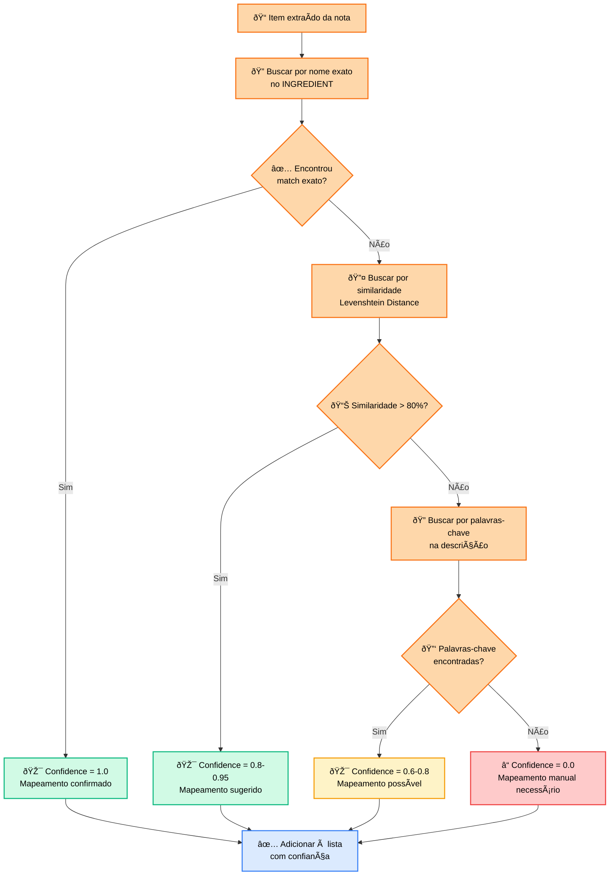
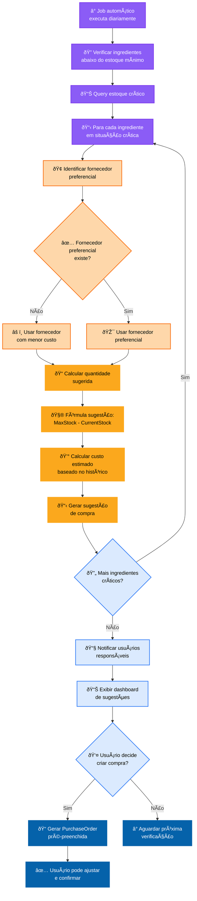
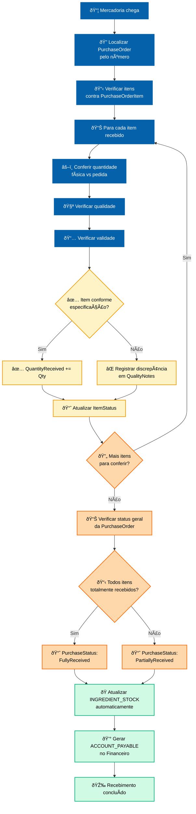
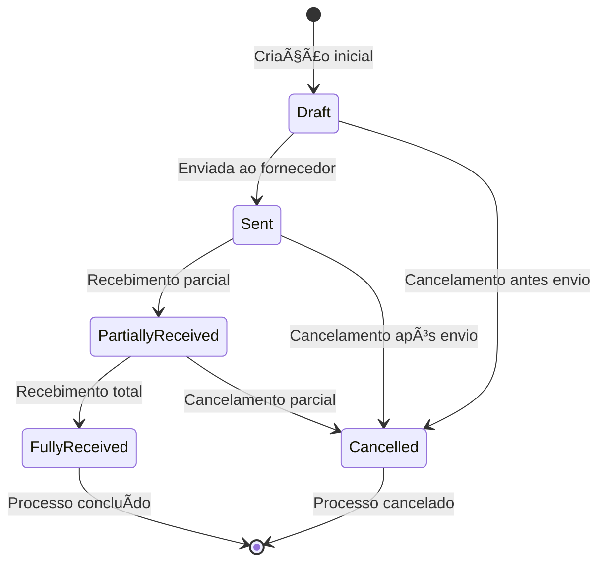

# 🛒 FLUXOGRAMA - PROCESSO DE COMPRAS

## 🎯 Visão Geral
Fluxograma completo do processo de criação manual de compras com apoio de IA para interpretação de notas fiscais, incluindo extração automática de dados, validação, conferência pelo usuário e persistência final no sistema. Também abrange sugestões automáticas de compra baseadas em estoque mínimo.

## 🤖 Fluxo Principal: Criação Manual com IA


```mermaid
flowchart TD
    %% === INÍCIO DO PROCESSO ===
    A[🚀 Usuário inicia<br/>nova compra] --> B{📋 Tipo de criação}
    
    B -->|Manual tradicional| Manual[📝 Formulário manual]
    B -->|Com IA| C[📄 Upload nota fiscal]
    
    %% === PROCESSAMENTO DE IA ===
    C --> D[💾 Salvar documento<br/>em FISCAL_DOCUMENT]
    D --> E[🤖 IA inicia processamento<br/>DocumentStatus: Processing]
    
    E --> F[🔍 Extrair dados do documento]
    F --> G[📊 OCR + Machine Learning]
    G --> H[🧠 Identificar campos-chave]
    
    H --> I[📋 Dados extraídos]
    I --> J{✅ Processamento<br/>bem-sucedido?}
    
    J -->|Erro| K[❌ DocumentStatus: Error<br/>Mostrar erro ao usuário]
    K --> L[🔄 Usuário pode tentar novamente<br/>ou ir para modo manual]
    L --> B
    
    J -->|Sucesso| M[✅ DocumentStatus: Processed<br/>AIExtractedData preenchida]
    
    %% === IDENTIFICAÇÃO E MAPEAMENTO ===
    M --> N[🔍 Identificar fornecedor<br/>por CNPJ/Nome]
    N --> O{🏢 Fornecedor existe<br/>no sistema?}
    
    O -->|Não| P[➕ Criar registro temporário<br/>de Supplier]
    O -->|Sim| Q[✅ Supplier identificado]
    P --> Q
    
    Q --> R[🥘 Para cada item extraído]
    R --> S[🔍 Mapear ingrediente<br/>por nome/código]
    S --> T{🧪 Ingrediente existe<br/>no sistema?}
    
    T -->|Não| U[⚠️ Marcar para revisão<br/>manual obrigatória]
    T -->|Sim| V[✅ Ingredient mapeado]
    
    U --> W[📊 Adicionar à lista<br/>de itens para revisão]
    V --> W
    W --> X{🔄 Mais itens<br/>extraídos?}
    
    X -->|Sim| R
    X -->|Não| Y[📋 Gerar formulário<br/>pré-preenchido]
    
    %% === CONFERÊNCIA PELO USUÁRIO ===
    Y --> Z[👀 Exibir formulário<br/>com dados extraídos]
    Z --> AA[🔍 Usuário revisa dados]
    
    AA --> BB{🏢 Fornecedor correto?}
    BB -->|Não| CC[✏️ Corrigir/selecionar fornecedor]
    CC --> DD
    BB -->|Sim| DD[📦 Revisar itens]
    
    DD --> EE[📋 Para cada item]
    EE --> FF{🧪 Ingrediente<br/>mapeado corretamente?}
    
    FF -->|Não| GG[🔍 Buscar ingrediente correto<br/>ou criar novo]
    FF -->|Sim| HH[💱 Validar quantidade<br/>e unidade de medida]
    
    GG --> HH
    HH --> II[💰 Validar preço unitário]
    II --> JJ{🔄 Mais itens<br/>para revisar?}
    
    JJ -->|Sim| EE
    JJ -->|Não| KK[📝 Adicionar observações<br/>de qualidade/entrega]
    
    KK --> LL[✅ Usuário confirma<br/>dados revisados]
    
    %% === PERSISTÊNCIA FINAL ===
    LL --> MM[💾 Criar PurchaseOrder]
    MM --> NN[📦 Criar PurchaseOrderItem<br/>para cada item]
    NN --> OO[🔗 Vincular FISCAL_DOCUMENT<br/>à PurchaseOrder]
    OO --> PP[📈 PurchaseStatus: Draft]
    PP --> QQ[🎉 Compra criada<br/>pronta para envio]
    
    %% === FLUXO MANUAL TRADICIONAL ===
    Manual --> ManualForm[📝 Formulário em branco]
    ManualForm --> ManualFill[👤 Usuário preenche tudo]
    ManualFill --> MM
    
    %% === STYLING ===
    
    classDef startStyle fill:#e5e7eb,stroke:#6b7280,stroke-width:2px,color:black
    class A,B startStyle
    
    classDef aiStyle fill:#8b5cf6,stroke:#7c3aed,stroke-width:2px,color:white
    class C,D,E,F,G,H,I,J,M aiStyle
    
    classDef errorStyle fill:#fecaca,stroke:#ef4444,stroke-width:2px,color:black
    class K,L errorStyle
    
    classDef mappingStyle fill:#fed7aa,stroke:#f97316,stroke-width:2px,color:black
    class N,O,P,Q,R,S,T,U,V,W,X,Y mappingStyle
    
    classDef userStyle fill:#dbeafe,stroke:#3b82f6,stroke-width:2px,color:black
    class Z,AA,BB,CC,DD,EE,FF,GG,HH,II,JJ,KK,LL userStyle
    
    classDef persistStyle fill:#0562aa,stroke:#0562aa,stroke-width:2px,color:white
    class MM,NN,OO,PP,QQ persistStyle
    
    classDef manualStyle fill:#d1fae5,stroke:#10b981,stroke-width:2px,color:black
    class Manual,ManualForm,ManualFill manualStyle
```

## 🤖 Detalhamento do Processamento de IA

### **📄 Estrutura de Dados Extraídos (AIExtractedData JSON):**

```json
{
  "supplier": {
    "name": "Fornecedor ABC Ltda",
    "cnpj": "12.345.678/0001-99",
    "address": "Rua das Flores, 123, Centro",
    "phone": "(11) 99999-9999",
    "confidence": 0.95
  },
  "document": {
    "number": "000123456",
    "date": "2025-01-15",
    "totalValue": 1250.75,
    "confidence": 0.98
  },
  "items": [
    {
      "description": "Farinha de Trigo Especial 25kg",
      "quantity": 10,
      "unitOfMeasure": "saco",
      "unitCost": 35.50,
      "totalCost": 355.00,
      "confidence": 0.92,
      "mappedIngredientId": "ingredient-farinha-trigo-id",
      "mappingConfidence": 0.88
    },
    {
      "description": "Açúcar Cristal 50kg", 
      "quantity": 5,
      "unitOfMeasure": "saco",
      "unitCost": 95.15,
      "totalCost": 475.75,
      "confidence": 0.94,
      "mappedIngredientId": null,
      "mappingConfidence": 0.0
    }
  ],
  "processingStats": {
    "processingTime": "2.3s",
    "ocrQuality": "high",
    "documentType": "nota_fiscal",
    "totalConfidence": 0.93
  }
}
```

### **🔍 Algoritmo de Mapeamento de Ingredientes:**


```mermaid
flowchart TD
    A[📝 Item extraído da nota] --> B[🔍 Buscar por nome exato<br/>no INGREDIENT]
    B --> C{✅ Encontrou<br/>match exato?}
    
    C -->|Sim| D[🎯 Confidence = 1.0<br/>Mapeamento confirmado]
    
    C -->|Não| E[🔤 Buscar por similaridade<br/>Levenshtein Distance]
    E --> F{📊 Similaridade > 80%?}
    
    F -->|Sim| G[🎯 Confidence = 0.8-0.95<br/>Mapeamento sugerido]
    
    F -->|Não| H[🔍 Buscar por palavras-chave<br/>na descrição]
    H --> I{🔑 Palavras-chave<br/>encontradas?}
    
    I -->|Sim| J[🎯 Confidence = 0.6-0.8<br/>Mapeamento possível]
    
    I -->|Não| K[❓ Confidence = 0.0<br/>Mapeamento manual necessário]
    
    D --> L[✅ Adicionar à lista<br/>com confiança]
    G --> L
    J --> L
    K --> L
    
    classDef searchStyle fill:#fed7aa,stroke:#f97316,stroke-width:2px,color:black
    class A,B,C,E,F,H,I searchStyle
    
    classDef highConfStyle fill:#d1fae5,stroke:#10b981,stroke-width:2px,color:black
    class D,G highConfStyle
    
    classDef lowConfStyle fill:#fef3c7,stroke:#f59e0b,stroke-width:2px,color:black
    class J lowConfStyle
    
    classDef noConfStyle fill:#fecaca,stroke:#ef4444,stroke-width:2px,color:black
    class K noConfStyle
    
    classDef resultStyle fill:#dbeafe,stroke:#3b82f6,stroke-width:2px,color:black
    class L resultStyle
```

## 📋 Processo de Conferência e Validação

### **👤 Interface de Conferência:**

```mermaid
flowchart TD
    A[📋 Formulário pré-preenchido] --> B[🏢 Seção Fornecedor]
    B --> C[📦 Seção Itens]
    
    %% FORNECEDOR
    B --> B1[👀 Nome: Fornecedor ABC Ltda ✅]
    B1 --> B2[🆔 CNPJ: 12.345.678/0001-99 ✅]
    B2 --> B3[📞 Contato: (11) 99999-9999 ⚠️ Validar]
    B3 --> B4{📝 Dados do fornecedor<br/>precisam correção?}
    
    B4 -->|Sim| B5[✏️ Editar dados<br/>ou criar novo fornecedor]
    B4 -->|Não| C
    B5 --> C
    
    %% ITENS
    C --> C1[📋 Lista de itens extraídos]
    C1 --> C2[📦 Para cada item]
    
    C2 --> C3[🎯 Status do mapeamento]
    C3 --> C4{🧪 Ingrediente<br/>mapeado automaticamente?}
    
    C4 -->|✅ Sim, confidence > 80%| C5[👀 Revisar mapeamento<br/>Farinha Trigo ✅]
    C4 -->|⚠️ Sim, confidence < 80%| C6[🔍 Validar mapeamento<br/>sugerido]
    C4 -->|❌ Não mapeado| C7[🔍 Buscar ingrediente<br/>ou criar novo]
    
    C5 --> C8[💱 Validar quantidade<br/>e unidade]
    C6 --> C8
    C7 --> C8
    
    C8 --> C9[💰 Validar preço<br/>unitário]
    C9 --> C10{🔄 Mais itens?}
    
    C10 -->|Sim| C2
    C10 -->|Não| D[📝 Observações finais]
    
    D --> E[✅ Confirmar e salvar]
    
    classDef formStyle fill:#dbeafe,stroke:#3b82f6,stroke-width:2px,color:black
    class A,B,C,C1,C2,D,E formStyle
    
    classDef supplierStyle fill:#fed7aa,stroke:#f97316,stroke-width:2px,color:black
    class B1,B2,B3,B4,B5 supplierStyle
    
    classDef itemValidStyle fill:#d1fae5,stroke:#10b981,stroke-width:2px,color:black
    class C3,C5,C8,C9 itemValidStyle
    
    classDef itemWarnStyle fill:#fef3c7,stroke:#f59e0b,stroke-width:2px,color:black
    class C6 itemWarnStyle
    
    classDef itemErrorStyle fill:#fecaca,stroke:#ef4444,stroke-width:2px,color:black
    class C7 itemErrorStyle
```

## 🔄 Fluxo de Sugestões Automáticas

### **📊 Sistema de Alerta de Estoque Mínimo:**


```mermaid
flowchart TD
    A[⏰ Job automático<br/>executa diariamente] --> B[🔍 Verificar ingredientes<br/>abaixo do estoque mínimo]
    
    B --> C[📊 Query estoque crítico]
    C --> D[📋 Para cada ingrediente<br/>em situação crítica]
    
    D --> E[🏢 Identificar fornecedor<br/>preferencial]
    E --> F{✅ Fornecedor preferencial<br/>existe?}
    
    F -->|Não| G[⚠️ Usar fornecedor<br/>com menor custo]
    F -->|Sim| H[🎯 Usar fornecedor preferencial]
    
    G --> I[📏 Calcular quantidade<br/>sugerida]
    H --> I
    
    I --> J[🧮 Fórmula sugestão:<br/>MaxStock - CurrentStock]
    J --> K[💰 Calcular custo estimado<br/>baseado no histórico]
    K --> L[📋 Gerar sugestão<br/>de compra]
    
    L --> M{🔄 Mais ingredientes<br/>críticos?}
    M -->|Sim| D
    M -->|Não| N[📧 Notificar usuários<br/>responsáveis]
    
    N --> O[📊 Exibir dashboard<br/>de sugestões]
    O --> P{👤 Usuário decide<br/>criar compra?}
    
    P -->|Sim| Q[📝 Gerar PurchaseOrder<br/>pré-preenchida]
    P -->|Não| R[⏰ Aguardar próxima<br/>verificação]
    
    Q --> S[✅ Usuário pode ajustar<br/>e confirmar]
    
    classDef autoStyle fill:#8b5cf6,stroke:#7c3aed,stroke-width:2px,color:white
    class A,B,C,D autoStyle
    
    classDef supplierStyle fill:#fed7aa,stroke:#f97316,stroke-width:2px,color:black
    class E,F,G,H supplierStyle
    
    classDef calcStyle fill:#fba81d,stroke:#fba81d,stroke-width:2px,color:black
    class I,J,K,L calcStyle
    
    classDef notifyStyle fill:#dbeafe,stroke:#3b82f6,stroke-width:2px,color:black
    class M,N,O,P notifyStyle
    
    classDef resultStyle fill:#0562aa,stroke:#0562aa,stroke-width:2px,color:white
    class Q,R,S resultStyle
```

### **📏 Algoritmo de Cálculo de Quantidade:**

```sql
-- Query para ingredientes críticos
SELECT 
    i.Id,
    i.Name,
    s.CurrentQuantity,
    s.MinimumStockLevel,
    s.MaximumStockLevel,
    (s.MaximumStockLevel - s.CurrentQuantity) AS SuggestedQuantity,
    si.PreferredUnitCost,
    si.SupplierId AS PreferredSupplierId
FROM INGREDIENT i
JOIN INGREDIENT_STOCK s ON i.Id = s.IngredientId
LEFT JOIN SUPPLIER_INGREDIENT si ON i.Id = si.IngredientId 
    AND si.IsPreferredSupplier = 1
WHERE s.CurrentQuantity <= s.MinimumStockLevel
    AND i.StateCode = 'Active'
ORDER BY (s.CurrentQuantity / s.MinimumStockLevel) ASC
```

## 🚚 Processo de Recebimento

### **📦 Fluxo de Recebimento de Compra:**


```mermaid
flowchart TD
    A[📦 Mercadoria chega] --> B[🔍 Localizar PurchaseOrder<br/>pelo número]
    B --> C[📋 Verificar itens<br/>contra PurchaseOrderItem]
    
    C --> D[📊 Para cada item recebido]
    D --> E[⚖️ Conferir quantidade<br/>física vs pedida]
    E --> F[🧪 Verificar qualidade]
    F --> G[📅 Verificar validade]
    
    G --> H{✅ Item conforme<br/>especificação?}
    
    H -->|Sim| I[✅ QuantityReceived += Qty]
    H -->|Não| J[❌ Registrar discrepância<br/>em QualityNotes]
    
    I --> K[📈 Atualizar ItemStatus]
    J --> K
    
    K --> L{🔄 Mais itens<br/>para conferir?}
    L -->|Sim| D
    L -->|Não| M[📊 Verificar status geral<br/>da PurchaseOrder]
    
    M --> N{📋 Todos itens<br/>totalmente recebidos?}
    
    N -->|Sim| O[📈 PurchaseStatus:<br/>FullyReceived]
    N -->|Não| P[📈 PurchaseStatus:<br/>PartiallyReceived]
    
    O --> Q[🏭 Atualizar INGREDIENT_STOCK<br/>automaticamente]
    P --> Q
    
    Q --> R[💰 Gerar ACCOUNT_PAYABLE<br/>no Financeiro]
    R --> S[🎉 Recebimento concluído]
    
    classDef receiveStyle fill:#0562aa,stroke:#0562aa,stroke-width:2px,color:white
    class A,B,C,D,E,F,G receiveStyle
    
    classDef qualityStyle fill:#fef3c7,stroke:#f59e0b,stroke-width:2px,color:black
    class H,I,J,K qualityStyle
    
    classDef statusStyle fill:#fed7aa,stroke:#f97316,stroke-width:2px,color:black
    class L,M,N,O,P statusStyle
    
    classDef integrationStyle fill:#d1fae5,stroke:#10b981,stroke-width:2px,color:black
    class Q,R,S integrationStyle
```

## 🎯 Estados e Validações

### **📈 Ciclo de Status da PurchaseOrder:**


```mermaid
stateDiagram-v2
    [*] --> Draft : Criação inicial
    Draft --> Sent : Enviada ao fornecedor
    Sent --> PartiallyReceived : Recebimento parcial
    PartiallyReceived --> FullyReceived : Recebimento total
    FullyReceived --> [*] : Processo concluído
    
    Draft --> Cancelled : Cancelamento antes envio
    Sent --> Cancelled : Cancelamento após envio
    PartiallyReceived --> Cancelled : Cancelamento parcial
    
    Cancelled --> [*] : Processo cancelado
```

### **🧪 Validações Críticas:**

#### **Durante Processamento IA:**
- ✅ Documento deve ser PDF ou imagem (JPG/PNG)
- ✅ Tamanho máximo: 10MB
- ✅ Qualidade OCR mínima: 70%
- ✅ CNPJ do fornecedor deve ser válido

#### **Durante Conferência:**
- ✅ Fornecedor deve existir ou ser criado
- ✅ Ingredientes devem estar ativos
- ✅ Quantidades > 0
- ✅ Preços unitários > 0
- ✅ Unidades de medida consistentes

#### **Durante Recebimento:**
- ✅ Quantidade recebida ≤ quantidade pedida
- ✅ Validade deve ser futura
- ✅ Qualidade dentro dos padrões
- ✅ Estoque suficiente para armazenagem

## 🎯 Eventos de Domínio Gerados

- **FiscalDocumentUploaded**: Documento fiscal enviado
- **FiscalDocumentProcessed**: IA processou documento
- **PurchaseOrderCreated**: Nova ordem de compra criada
- **PurchaseOrderSent**: Ordem enviada ao fornecedor
- **ItemReceived**: Item específico recebido
- **StockUpdated**: Estoque atualizado automaticamente
- **LowStockAlert**: Alerta de estoque mínimo
- **SupplierEvaluated**: Avaliação de fornecedor

## 🚨 Alertas e Monitoramento

### **Alertas Críticos:**
- 🚨 **IA Processing Error**: Falha no processamento de documento
- 🚨 **Estoque Crítico**: Ingrediente abaixo de 10% do mínimo
- 🚨 **Fornecedor Atrasado**: Entrega > 3 dias do prazo
- 🚨 **Qualidade Rejeitada**: Item reprovado na conferência

### **Métricas de Performance:**
- **Accuracy IA**: % de dados extraídos corretamente
- **Tempo Processamento**: Média de tempo para processar documentos
- **Taxa Conferência**: % de itens que precisam correção manual
- **Pontualidade Fornecedores**: % entregas no prazo

---

**Arquivo**: `04-purchasing-flow.md`  
**Domínio**: Compras (#0562aa)  
**Tipo**: Process Flowchart  
**Foco**: IA Integration + Manual Creation + Stock Management
