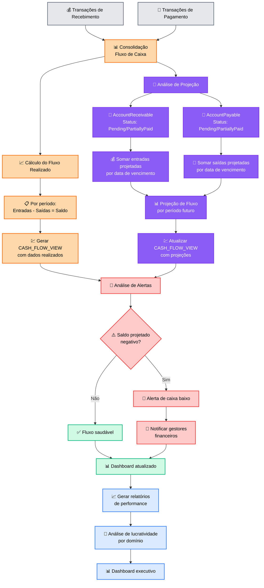
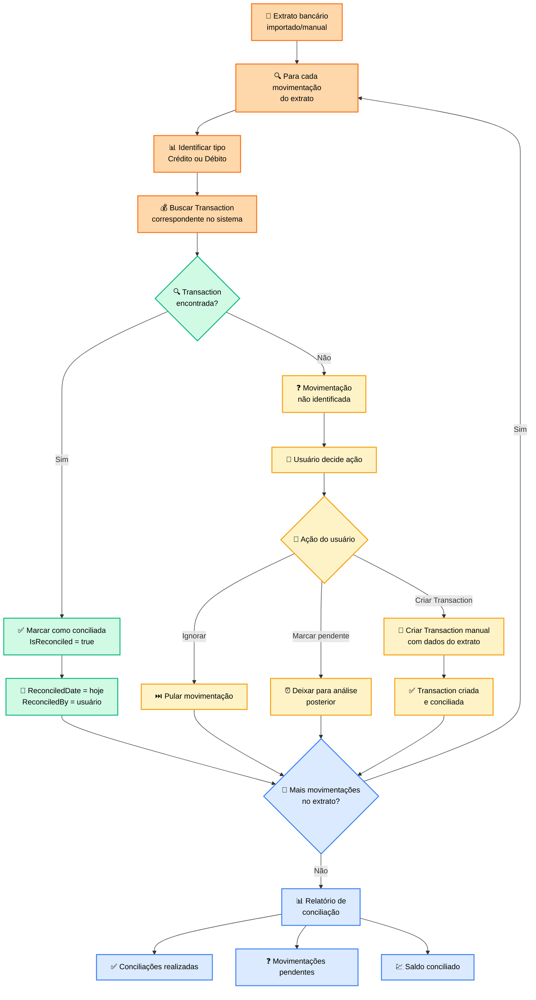
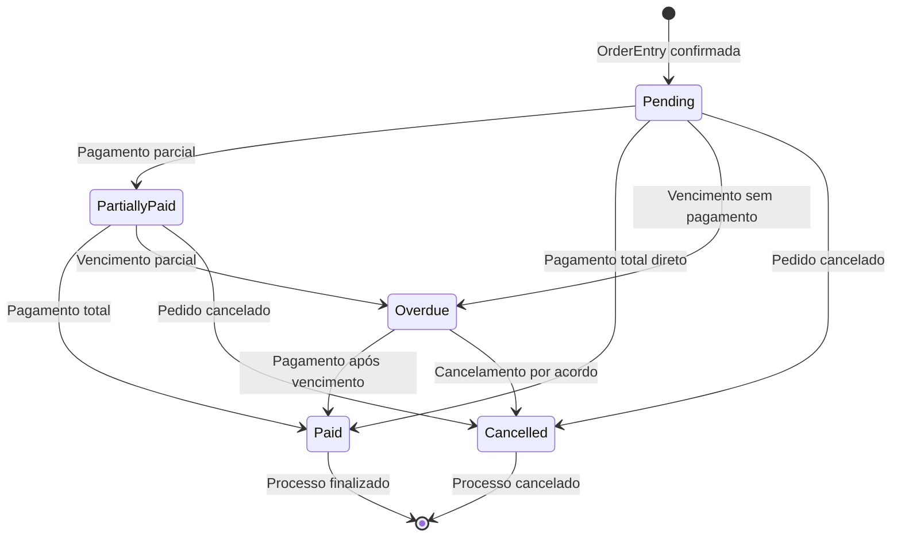
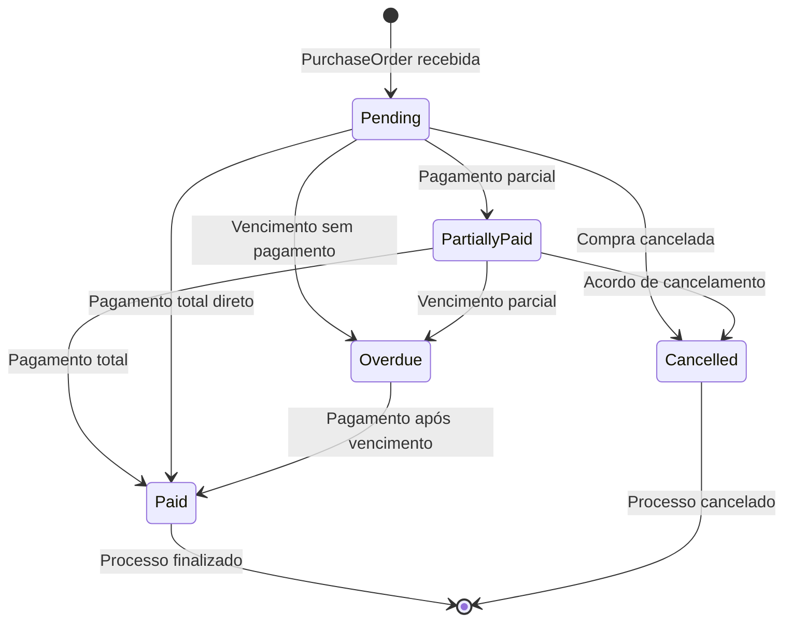

# 💳 FLUXOGRAMA - PROCESSO FINANCEIRO

## 🎯 Visão Geral
Fluxograma completo dos processos financeiros, mostrando o controle de fluxo de caixa através de contas a receber (originadas das vendas) e contas a pagar (originadas das compras), com rastreamento detalhado de transações e análise de lucratividade.

## 💰 Fluxo de Contas a Receber

```mermaid
flowchart TD
    %% === ORIGEM: VENDAS ===
    A[🛍️ OrderEntry confirmada<br/>no Domínio Vendas] --> B[📊 Analisar PaymentTerms<br/>do pedido]
    
    B --> C{💳 Tipo de<br/>pagamento?}
    
    %% PAGAMENTO À VISTA
    C -->|À Vista| D1[💰 Pagamento à vista]
    D1 --> D2[💾 Criar 1 AccountReceivable<br/>DueDate = DeliveryDate]
    D2 --> D3[💵 TotalAmount = OrderEntry.TotalValue<br/>InstallmentNumber = 1]
    
    %% PAGAMENTO PARCELADO
    C -->|Parcelado| E1[📋 Pagamento parcelado]
    E1 --> E2[🔢 Dividir valor total<br/>pelo número de parcelas]
    E2 --> E3[📅 Para cada parcela]
    E3 --> E4[💾 Criar AccountReceivable<br/>DueDate = DeliveryDate + (30 * N)]
    E4 --> E5[💵 TotalAmount = Valor/Parcelas<br/>InstallmentNumber = N]
    E5 --> E6{🔄 Mais parcelas?}
    E6 -->|Sim| E3
    E6 -->|Não| F
    
    D3 --> F[📈 AccountStatus: Pending<br/>Aguardar recebimento]
    
    %% === PROCESSO DE RECEBIMENTO ===
    F --> G[⏰ Vencimento se aproxima<br/>ou cliente paga]
    G --> H[👤 Usuário registra<br/>recebimento]
    
    H --> I[🔍 Localizar AccountReceivable<br/>pelo cliente/pedido]
    I --> J[💰 Informar valor recebido<br/>e forma de pagamento]
    J --> K[🏦 Selecionar conta bancária<br/>de destino]
    
    K --> L[💾 Criar Transaction]
    L --> M[📊 Atualizar AccountReceivable<br/>PaidAmount += Valor]
    M --> N[🧮 Calcular RemainingAmount<br/>= TotalAmount - PaidAmount]
    
    N --> O{💯 Valor pago<br/>completamente?}
    
    O -->|Sim| P1[✅ AccountStatus: Paid]
    O -->|Não| P2[⚠️ AccountStatus: PartiallyPaid]
    
    P1 --> Q[🎉 Conta recebida<br/>com sucesso]
    P2 --> Q
    
    %% === CONTROLE DE INADIMPLÊNCIA ===
    F --> R[📅 Job automático verifica<br/>vencimentos diários]
    R --> S{⏰ Conta vencida<br/>e não paga?}
    
    S -->|Sim| T[📈 AccountStatus: Overdue]
    T --> U[📧 Notificar cliente<br/>sobre vencimento]
    U --> V[📊 Aplicar juros/multa<br/>se configurado]
    
    S -->|Não| Q
    V --> Q
    
    %% === STYLING ===
    
    classDef salesOriginStyle fill:#f36b21,stroke:#f36b21,stroke-width:2px,color:white
    class A salesOriginStyle
    
    classDef paymentTypeStyle fill:#fed7aa,stroke:#f97316,stroke-width:2px,color:black
    class B,C paymentTypeStyle
    
    classDef cashStyle fill:#d1fae5,stroke:#10b981,stroke-width:2px,color:black
    class D1,D2,D3 cashStyle
    
    classDef installmentStyle fill:#fef3c7,stroke:#f59e0b,stroke-width:2px,color:black
    class E1,E2,E3,E4,E5,E6 installmentStyle
    
    classDef receivingStyle fill:#dbeafe,stroke:#3b82f6,stroke-width:2px,color:black
    class F,G,H,I,J,K,L,M,N,O,P1,P2,Q receivingStyle
    
    classDef overdueStyle fill:#fecaca,stroke:#ef4444,stroke-width:2px,color:black
    class R,S,T,U,V overdueStyle
```

## 💸 Fluxo de Contas a Pagar

```mermaid
flowchart TD
    %% === ORIGEM: COMPRAS ===
    A[📦 PurchaseOrder totalmente<br/>recebida no Domínio Compras] --> B[📊 Analisar PaymentTerms<br/>do fornecedor]
    
    B --> C[📅 Calcular DueDate<br/>= ActualDeliveryDate + PaymentTerms]
    C --> D[💾 Criar AccountPayable]
    D --> E[💵 TotalAmount = PurchaseOrder.TotalValue<br/>AccountStatus: Pending]
    
    %% === PLANEJAMENTO DE PAGAMENTO ===
    E --> F[📋 Conta criada<br/>aguardando pagamento]
    F --> G[📊 Dashboard de contas a pagar<br/>mostra vencimentos]
    
    G --> H[⏰ Vencimento se aproxima<br/>ou usuário decide pagar]
    H --> I[👤 Usuário inicia<br/>processo de pagamento]
    
    %% === PROCESSO DE PAGAMENTO ===
    I --> J[🔍 Localizar AccountPayable<br/>pelo fornecedor/compra]
    J --> K[💰 Definir valor a pagar<br/>(total ou parcial)]
    K --> L[💳 Selecionar método<br/>de pagamento]
    L --> M[🏦 Selecionar conta bancária<br/>de origem]
    
    M --> N{💯 Valor pago<br/>completamente?}
    
    N -->|Sim| O1[💾 Criar Transaction<br/>Amount = TotalAmount]
    N -->|Não| O2[💾 Criar Transaction<br/>Amount = ValorParcial]
    
    O1 --> P1[📊 PaidAmount = TotalAmount<br/>RemainingAmount = 0]
    O2 --> P2[📊 PaidAmount += ValorParcial<br/>RemainingAmount = Total - Paid]
    
    P1 --> Q1[✅ AccountStatus: Paid]
    P2 --> Q2[⚠️ AccountStatus: PartiallyPaid]
    
    Q1 --> R[🎉 Pagamento realizado<br/>com sucesso]
    Q2 --> R
    
    %% === CONTROLE DE VENCIMENTOS ===
    F --> S[📅 Job automático verifica<br/>vencimentos diários]
    S --> T{⏰ Conta vencida<br/>e não paga?}
    
    T -->|Sim| U[📈 AccountStatus: Overdue]
    U --> V[📧 Alertar responsável<br/>financeiro]
    V --> W[📊 Aplicar multa/juros<br/>se contrato prevê]
    
    T -->|Não| R
    W --> R
    
    %% === STYLING ===
    
    classDef purchaseOriginStyle fill:#0562aa,stroke:#0562aa,stroke-width:2px,color:white
    class A purchaseOriginStyle
    
    classDef creationStyle fill:#fed7aa,stroke:#f97316,stroke-width:2px,color:black
    class B,C,D,E creationStyle
    
    classDef planningStyle fill:#fef3c7,stroke:#f59e0b,stroke-width:2px,color:black
    class F,G,H,I planningStyle
    
    classDef paymentStyle fill:#dbeafe,stroke:#3b82f6,stroke-width:2px,color:black
    class J,K,L,M,N,O1,O2,P1,P2,Q1,Q2,R paymentStyle
    
    classDef overdueStyle fill:#fecaca,stroke:#ef4444,stroke-width:2px,color:black
    class S,T,U,V,W overdueStyle
```

## 📊 Fluxo de Análise e Controle de Caixa



## 🔄 Processo de Conciliação Bancária



## 📈 Análise de Lucratividade

### **💹 Cálculo de Lucratividade por Pedido:**

```mermaid
flowchart TD
    A[📋 OrderEntry finalizada] --> B[💰 Receita Total<br/>= OrderEntry.TotalValue]
    B --> C[📊 Buscar custos associados]
    
    C --> D[🏭 Custo de Produção<br/>= Σ Demand.ActualCost]
    C --> E[🛒 Custo de Ingredientes<br/>= Σ IngredientConsumption]
    C --> F[💼 Custos Operacionais<br/>= Overhead alocado]
    
    D --> G[🧮 Custo Total<br/>= Produção + Ingredientes + Operacional]
    E --> G
    F --> G
    
    G --> H[💵 Lucro Bruto<br/>= Receita - Custo Total]
    H --> I[📊 Margem Bruta<br/>= (Lucro / Receita) * 100]
    
    I --> J[📈 Salvar análise<br/>para relatórios]
    
    classDef revenueStyle fill:#d1fae5,stroke:#10b981,stroke-width:2px,color:black
    class A,B revenueStyle
    
    classDef costStyle fill:#fecaca,stroke:#ef4444,stroke-width:2px,color:black
    class C,D,E,F,G costStyle
    
    classDef profitStyle fill:#dbeafe,stroke:#3b82f6,stroke-width:2px,color:black
    class H,I,J profitStyle
```

## 🎯 Estados e Validações

### **📈 Ciclo de Status AccountReceivable:**



### **📉 Ciclo de Status AccountPayable:**



## 🚨 Regras de Validação e Alertas

### **Validações Críticas:**

#### **AccountReceivable:**
- ✅ DueDate ≥ OrderEntry.DeliveryDate
- ✅ TotalAmount = OrderEntry.TotalValue (soma de parcelas)
- ✅ InstallmentNumber único por OrderEntry
- ✅ PaidAmount ≤ TotalAmount

#### **AccountPayable:**
- ✅ DueDate ≥ PurchaseOrder.ActualDeliveryDate
- ✅ TotalAmount = PurchaseOrder.TotalValue
- ✅ SupplierId = PurchaseOrder.SupplierId
- ✅ PaidAmount ≤ TotalAmount

#### **Transaction:**
- ✅ Deve referenciar AccountReceivable OU AccountPayable
- ✅ Amount > 0
- ✅ TransactionDate ≤ hoje
- ✅ BankAccount deve existir e estar ativa

### **Alertas Automáticos:**

#### **🚨 Alertas Críticos:**
- **Fluxo Negativo**: Saldo projetado < 0 nos próximos 30 dias
- **Alta Inadimplência**: % contas vencidas > 15%
- **Concentração de Risco**: 1 cliente representa > 30% do AR
- **Descasamento**: Movimentação bancária não conciliada > 7 dias

#### **⚠️ Alertas de Atenção:**
- **Vencimento Próximo**: Contas vencendo em 3 dias
- **Pagamento Atrasado**: Fornecedor com prazo vencido
- **Baixa Lucratividade**: Margem < 20% em pedidos
- **Crescimento AR**: Contas a receber crescendo > 50% mês

## 🎯 Eventos de Domínio Gerados

- **AccountReceivableCreated**: Nova conta a receber gerada
- **PaymentReceived**: Pagamento de cliente recebido
- **PaymentMade**: Pagamento a fornecedor efetuado
- **AccountOverdue**: Conta vencida detectada
- **CashFlowAlert**: Alerta de fluxo baixo
- **ProfitabilityCalculated**: Lucratividade calculada
- **BankReconciled**: Conciliação bancária realizada

## 📊 Métricas e KPIs

### **Indicadores de Recebimento:**
- **DSO (Days Sales Outstanding)**: Prazo médio de recebimento
- **Taxa de Inadimplência**: % valor vencido vs total AR
- **Eficiência de Cobrança**: % contas pagas no prazo

### **Indicadores de Pagamento:**
- **DPO (Days Payable Outstanding)**: Prazo médio de pagamento
- **Desconto Obtido**: % economia em pagamentos antecipados
- **Pontualidade**: % pagamentos realizados no prazo

### **Indicadores de Lucratividade:**
- **Margem Bruta**: (Receita - Custo) / Receita
- **ROI por Pedido**: Retorno sobre investimento
- **Contribuição por Domínio**: Receita líquida por área

---

**Arquivo**: `05-financial-flow.md`  
**Domínio**: Financeiro (#083e61)  
**Tipo**: Process Flowchart  
**Foco**: Contas a Receber vs Pagar + Análise de Lucratividade
