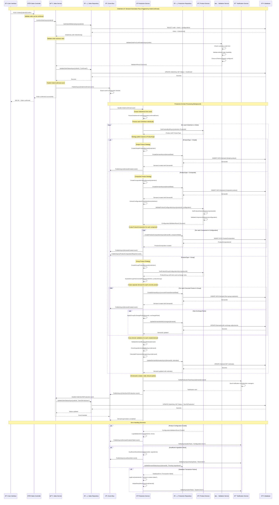

# 🔄 SEQUENCE DIAGRAM - OrderItem → Demand Generation Flow

## 🎯 Visão Geral
Diagrama de sequência detalhado mostrando o fluxo automático de geração de demands a partir de OrderItems quando um pedido é confirmado. Este é um dos fluxos mais críticos do sistema, envolvendo integração entre domínios de Vendas e Produção, com lógica complexa dependendo do tipo de produto (Simple, Composite, Group).

## 📊 Complexidade do Fluxo
- **🚨 Alta Complexidade**: Multiple product types, cross-domain integration, complex business rules
- **👥 Participantes**: 8+ system components
- **🔄 Interações**: 20+ interactions per order item
- **🌐 Cross-Domain**: Sales → Production integration
- **📋 Validações**: Product availability, configuration validation, business rules

## 🎯 Trigger Event
**OrderConfirmed** (Sales Domain) → Automatic demand generation for all OrderItems

## 📝 Sequence Diagram


```mermaid
sequenceDiagram
    participant UI as 👤 User Interface
    participant SC as 🎮 Sales Controller
    participant SS as ⚙️ Sales Service  
    participant SR as 🗄️ Sales Repository
    participant EB as 📡 Event Bus
    participant PS as 🏭 Production Service
    participant PR as 🗄️ Production Repository
    participant ProdS as 📦 Product Service
    participant VS as ✅ Validation Service
    participant NS as 🔔 Notification Service
    participant DB as 💾 Database
    
    Note over UI, DB: OrderItem → Demand Generation Flow (Triggered by OrderConfirmed)
    
    %% ==========================================
    %% SALES DOMAIN - ORDER CONFIRMATION
    %% ==========================================
    
    UI->>SC: POST /Order/{orderId}/Confirm
    Note over SC: Validate order can be confirmed
    
    SC->>SS: ConfirmOrderAsync(orderId)
    activate SS
    
    SS->>SR: GetOrderWithItemsAsync(orderId)
    activate SR
    SR->>DB: SELECT order + items + configurations
    DB-->>SR: Order + OrderItems[]
    SR-->>SS: OrderEntry with OrderItems[]
    deactivate SR
    
    Note over SS: Validate order business rules
    SS->>VS: ValidateOrderForConfirmationAsync(order)
    activate VS
    VS->>VS: Check customer credit limit
    VS->>VS: Validate delivery date feasibility
    VS->>VS: Ensure all items properly configured
    VS-->>SS: ValidationResult (Success)
    deactivate VS
    
    SS->>SR: UpdateOrderStatusAsync(orderId, "Confirmed")
    activate SR
    SR->>DB: UPDATE OrderEntry SET Status = 'Confirmed'
    DB-->>SR: Success
    SR-->>SS: Success
    deactivate SR
    
    Note over SS: Publish OrderConfirmed event
    SS->>EB: PublishAsync(OrderConfirmed event)
    activate EB
    EB->>EB: Route event to Production domain
    deactivate EB
    
    SS-->>SC: Order confirmed successfully
    deactivate SS
    SC-->>UI: 200 OK - Order confirmed
    
    %% ==========================================
    %% PRODUCTION DOMAIN - DEMAND GENERATION
    %% ==========================================
    
    Note over EB, DB: Production Domain Processing (Background)
    
    EB->>PS: Handle OrderConfirmed event
    activate PS
    
    Note over PS: Extract OrderItems from event
    PS->>PS: ParseOrderItemsFromEvent(orderConfirmedEvent)
    
    Note over PS: Process each OrderItem individually
    loop For each OrderItem in Order
        PS->>ProdS: GetProductByIdAsync(orderItem.ProductId)
        activate ProdS
        ProdS-->>PS: Product with ProductType
        deactivate ProdS
        
        Note over PS: Strategy pattern based on ProductType
        alt ProductType = Simple
            Note over PS: Simple Product Strategy
            PS->>PS: CreateSimpleProductDemand(orderItem)
            PS->>PR: CreateDemandAsync(demandData)
            activate PR
            PR->>DB: INSERT INTO Demand (Simple product)
            DB-->>PR: DemandId
            PR-->>PS: Demand created with DemandId
            deactivate PR
            
            PS->>EB: PublishAsync(DemandCreated event)
            
        else ProductType = Composite
            Note over PS: Composite Product Strategy
            PS->>PS: CreateCompositeProductDemand(orderItem)
            
            %% Create main Demand
            PS->>PR: CreateDemandAsync(demandData)
            activate PR
            PR->>DB: INSERT INTO Demand (Composite product)
            DB-->>PR: DemandId
            PR-->>PS: Demand created with DemandId
            deactivate PR
            
            %% Extract configuration and create ProductCompositions
            PS->>PS: ExtractConfigurationFromOrderItem(orderItem)
            PS->>ProdS: ValidateProductConfigurationAsync(productId, configuration)
            activate ProdS
            
            ProdS->>ProdS: GetProductHierarchiesAsync(productId)
            ProdS->>ProdS: ValidateComponentSelections(configuration)
            ProdS-->>PS: ConfigurationValidationResult (Success)
            deactivate ProdS
            
            Note over PS: Create ProductComposition for each component
            loop For each Component in Configuration
                PS->>PR: CreateProductCompositionAsync(demandId, componentData)
                activate PR
                PR->>DB: INSERT INTO ProductComposition
                DB-->>PR: ProductCompositionId
                PR-->>PS: ProductComposition created
                deactivate PR
            end
            
            PS->>EB: PublishAsync(DemandCreated event)
            PS->>EB: PublishAsync(ProductCompositionRequired event)
            
        else ProductType = Group
            Note over PS: Group Product Strategy
            PS->>PS: CreateGroupProductDemands(orderItem)
            
            %% Get group configuration
            PS->>ProdS: GetProductGroupConfigurationAsync(productId)
            activate ProdS
            ProdS-->>PS: ProductGroup with items and exchange rules
            deactivate ProdS
            
            PS->>PS: ExplodeGroupIntoConcreteProducts(orderItem, productGroup)
            
            Note over PS: Create separate Demand for each concrete product
            loop For each Concrete Product in Group
                PS->>PR: CreateDemandAsync(concreteProductDemandData)
                activate PR
                PR->>DB: INSERT INTO Demand (from group explosion)
                DB-->>PR: DemandId
                PR-->>PS: Demand created with DemandId
                deactivate PR
                
                PS->>EB: PublishAsync(DemandCreated event)
            end
            
            %% Apply exchange rules if any
            opt Has Exchange Rules
                PS->>PS: ApplyGroupExchangeRules(demands, exchangeRules)
                PS->>PR: UpdateDemandsWithExchanges(demands)
                activate PR
                PR->>DB: UPDATE Demands with exchange adjustments
                DB-->>PR: Success
                PR-->>PS: Demands updated
                deactivate PR
            end
        end
        
        %% ==========================================
        %% CROSS-DOMAIN VALIDATIONS
        %% ==========================================
        
        Note over PS: Cross-domain validations for each created demand
        PS->>PS: ValidateDemandBusinessRules(demand)
        
        %% Check ingredient availability (for Production planning)
        PS->>PS: CheckIngredientAvailabilityAsync(demand)
        
        %% Estimate production time and cost
        PS->>PS: CalculateProductionEstimatesAsync(demand)
        
        %% Update demand with estimates
        PS->>PR: UpdateDemandEstimatesAsync(demandId, estimates)
        activate PR
        PR->>DB: UPDATE Demand SET estimates
        DB-->>PR: Success
        PR-->>PS: Demand updated with estimates
        deactivate PR
    end
    
    %% ==========================================
    %% NOTIFICATIONS AND STATUS UPDATES
    %% ==========================================
    
    Note over PS: All demands created, notify relevant parties
    PS->>NS: NotifyProductionTeamAsync(demandsCreated)
    activate NS
    NS->>NS: Send notification to production managers
    NS-->>PS: Notification sent
    deactivate NS
    
    %% Update order status in Sales domain
    PS->>EB: PublishAsync(OrderSentToProduction event)
    activate EB
    EB->>SS: Handle OrderSentToProduction event
    activate SS
    SS->>SR: UpdateOrderStatusAsync(orderId, "SentToProduction")
    activate SR
    SR->>DB: UPDATE OrderEntry SET Status = 'SentToProduction'
    DB-->>SR: Success
    SR-->>SS: Status updated
    deactivate SR
    SS-->>EB: Event handled
    deactivate SS
    deactivate EB
    
    PS-->>EB: Demand generation completed
    deactivate PS
    
    %% ==========================================
    %% ERROR HANDLING SCENARIOS
    %% ==========================================
    
    Note over UI, DB: Error Handling Scenarios
    
    alt Product Configuration Invalid
        ProdS-->>PS: ConfigurationValidationResult (Failed)
        PS->>PS: LogValidationError(orderItemId, errors)
        PS->>EB: PublishAsync(DemandCreationFailed event)
        PS->>NS: NotifyAsync(salesTeam, "Configuration Error")
    end
    
    alt Insufficient Ingredient Stock
        PS->>PS: InsufficientStockDetected(demandId, ingredients)
        PS->>EB: PublishAsync(LowStockAlert event)
        PS->>NS: NotifyAsync(purchasingTeam, "Stock Alert")
        PS->>PR: UpdateDemandStatusAsync(demandId, "Pending-Ingredients")
    end
    
    alt Database Transaction Failure
        PR-->>PS: DatabaseError (Transaction failed)
        PS->>PS: LogError(orderItemId, "Demand creation failed")
        PS->>PS: InitiateRetryMechanism(orderItemId)
        PS->>NS: NotifyAsync(techTeam, "System Error")
    end
```

## 🎯 Detailed Component Responsibilities

### **🎮 Sales Controller**
```
Responsibilities:
├── 🔐 Authentication and authorization validation
├── 📋 HTTP request validation and sanitization
├── 🎯 Route confirmation request to Sales Service
├── 📊 Return appropriate HTTP response codes
└── 🔍 Log controller-level events and errors

Validation Points:
├── ✅ User has permission to confirm orders
├── ✅ Order ID format is valid
├── ✅ Request payload is properly formatted
└── ✅ Rate limiting and security checks
```

### **⚙️ Sales Service**
```
Core Business Logic:
├── 📋 Order confirmation workflow orchestration
├── ✅ Complex business rule validation
├── 📊 Order status management
├── 📡 Event publishing coordination
└── 🔄 Cross-domain integration management

Validation Rules:
├── 🏦 Customer credit limit verification
├── 📅 Delivery date feasibility check
├── 🧩 Product configuration completeness
├── 📦 Order item consistency validation
└── 💰 Pricing and total amount verification

Event Management:
├── 📤 Publish OrderConfirmed event
├── 📥 Handle OrderSentToProduction event
├── 🔄 Coordinate event sequencing
└── 📊 Track event processing status
```

### **🏭 Production Service**
```
Demand Generation Strategy:
├── 🎯 ProductType-based strategy selection
├── 📊 Demand data model construction
├── 🧩 Complex configuration processing
├── 🔄 Cross-domain data validation
└── 📈 Production estimates calculation

Product Type Strategies:
├── 🔹 Simple: 1:1 OrderItem to Demand mapping
├── 🔶 Composite: 1:N with ProductComposition creation
├── 🔸 Group: 1:N with product explosion and exchange rules
└── ⚙️ Strategy pattern for extensibility

Cross-Domain Validations:
├── 📦 Product availability verification
├── 🧩 Configuration validation with Product domain
├── 🥘 Ingredient availability checking
├── ⏰ Production capacity assessment
└── 💰 Cost estimation and validation
```

### **📦 Product Service Integration**
```
Product Data Retrieval:
├── 🔍 Product lookup by ID
├── 📊 ProductType determination
├── 🧩 Configuration rules retrieval
├── 📋 Component hierarchy access
└── 🔸 Group explosion logic

Validation Services:
├── ✅ Product configuration validation
├── 🏗️ Component compatibility checking
├── 📊 Quantity and constraint validation
├── 💰 Pricing rule application
└── 🔄 Business rule enforcement
```

## 💡 Business Rules and Constraints

### **📋 Order Confirmation Rules**
```
Pre-Confirmation Validations:
├── 🏦 Customer credit limit must not be exceeded
├── 📅 Delivery date must be achievable
├── 🧩 All composite products must be fully configured
├── 📦 All products must be active and available
├── 💰 Order total must match sum of item totals
└── 📋 Minimum order requirements must be met

Post-Confirmation Rules:
├── 🔒 Confirmed orders cannot be modified (only cancelled)
├── 📊 Order status must progress through defined states
├── 🎯 All order items must generate production demands
├── 📡 Financial accounts must be created automatically
└── 📅 Delivery commitments become binding
```

### **🏭 Demand Generation Rules**
```
Universal Demand Rules:
├── 📊 One OrderItem may generate 1:N Demands
├── 🎯 Each Demand represents one concrete product
├── 📅 Demand due date = Order delivery date - production time
├── 📦 Demand quantity respects OrderItem quantity
└── 🔄 Demand status starts as "Pending"

Product Type Specific Rules:
├── 🔹 Simple Products:
│   ├── 1 OrderItem → 1 Demand (exact mapping)
│   ├── No composition tasks required
│   └── Straightforward production workflow
├── 🔶 Composite Products:
│   ├── 1 OrderItem → 1 Demand + N ProductComposition
│   ├── Configuration must be validated
│   ├── Component availability must be checked
│   └── Production tasks created per component
└── 🔸 Product Groups:
    ├── 1 OrderItem → N Demands (one per concrete product)
    ├── Group configuration exploded into concrete products
    ├── Exchange rules applied if configured
    └── Separate production workflows per concrete product
```

### **🔄 Integration Rules**
```
Cross-Domain Consistency:
├── 📊 Order status updates must be synchronized
├── 🎯 Demand creation must be atomic per OrderItem
├── 📡 Event publishing must follow correct sequence
├── 🔄 Failure in Production must notify Sales
└── 📋 All state changes must be auditable

Data Integrity Rules:
├── 🎯 Demand must always reference valid OrderItem
├── 📦 Product references must be consistent across domains
├── 🧩 Configuration data must be preserved exactly
├── 💰 Quantity and pricing must remain consistent
└── 📅 Dates and timelines must be logically consistent
```

## âš¡ Performance Considerations

### **🚀 Optimization Strategies**
```
Batch Processing:
├── 📊 Process multiple OrderItems in single transaction
├── 🎯 Bulk database operations where possible
├── 📡 Batch event publishing to reduce overhead
└── 🔄 Group similar operations together

Caching Strategies:
├── 📦 Cache Product data and configurations
├── 🧩 Cache component hierarchies and rules
├── 💰 Cache pricing calculations
└── ✅ Cache validation results for repeated patterns

Async Processing:
├── 📡 Event-driven asynchronous processing
├── 🔄 Non-blocking cross-domain calls
├── 📊 Background demand generation processing
└── 🎯 Parallel processing of independent OrderItems
```

### **📊 Performance Metrics**
```
Target SLAs:
├── 🎯 OrderItem → Demand creation: < 2 seconds per item
├── 📊 Order confirmation response: < 5 seconds total
├── 🔄 Cross-domain event propagation: < 10 seconds
└── 💾 Database transaction completion: < 1 second

Scalability Targets:
├── 📈 Support 1000+ OrderItems per order
├── 🎯 Handle 100+ concurrent order confirmations
├── 📊 Process 10,000+ demands per hour
└── 🔄 Maintain < 1% error rate under load
```

## 🚨 Error Handling and Recovery

### **🔧 Error Scenarios**
```
Product Configuration Errors:
├── ❌ Invalid component selections
├── ❌ Incompatible component combinations
├── ❌ Missing required components
└── 🔄 Recovery: Reject confirmation, notify user

Resource Availability Errors:
├── ❌ Insufficient ingredient stock
├── ❌ Production capacity exceeded
├── ❌ Component temporarily unavailable
└── 🔄 Recovery: Create demand with "Pending" status

System Integration Errors:
├── ❌ Database transaction failures
├── ❌ Event publishing failures
├── ❌ Cross-domain communication timeouts
└── 🔄 Recovery: Retry mechanism with exponential backoff

Business Rule Violations:
├── ❌ Credit limit exceeded
├── ❌ Delivery date impossible
├── ❌ Product restrictions violated
└── 🔄 Recovery: Block confirmation, provide clear error message
```

### **🔄 Recovery Mechanisms**
```
Retry Strategies:
├── 🔁 Exponential backoff for transient failures
├── 🎯 Circuit breaker for external service failures
├── 📊 Dead letter queue for failed events
└── 🚨 Manual intervention queue for complex errors

Compensation Actions:
├── 🔄 Reverse demand creation on failure
├── 📊 Restore order status on rollback
├── 📡 Publish compensation events
└── 🔔 Notify relevant parties of failures

Data Consistency Recovery:
├── 📊 Eventual consistency through event replay
├── 🎯 Reconciliation processes for data drift
├── 🔄 Audit trail for manual correction
└── 📋 Health check monitoring for early detection
```

## 📋 Validation Matrix

### **🎯 Validation Layers**
| Validation Type | Layer | Scope | Error Handling |
|----------------|-------|-------|----------------|
| **Input Validation** | Controller | HTTP request format | 400 Bad Request |
| **Business Rules** | Service | Order confirmation rules | Business exception |
| **Product Config** | Cross-Domain | Component compatibility | Configuration error |
| **Resource Check** | Production | Ingredient availability | Resource warning |
| **Data Integrity** | Repository | Database constraints | Transaction rollback |

### **✅ Validation Checklist**
```
Order Level:
├── ✅ Order exists and is in correct status
├── ✅ Customer is active and has sufficient credit
├── ✅ Delivery date is feasible
├── ✅ All required fields are populated
└── ✅ Order total matches calculated total

OrderItem Level:
├── ✅ Product is active and available
├── ✅ Quantity is positive and within limits
├── ✅ Configuration is complete and valid
├── ✅ Pricing is accurate and current
└── ✅ Special requirements are achievable

Demand Level:
├── ✅ Production capacity is available
├── ✅ Required ingredients are in stock
├── ✅ Production lead time allows delivery date
├── ✅ All components are available
└── ✅ Cost estimates are within budgets
```

---

**Arquivo**: `01-orderitem-to-demand-flow.md`  
**Fluxo**: OrderItem → Demand (Automático)  
**Domínios**: Sales → Production  
**Complexidade**: 🚨 Alta (8+ participantes, 20+ interações)  
**Atualização**: 16/06/2025
