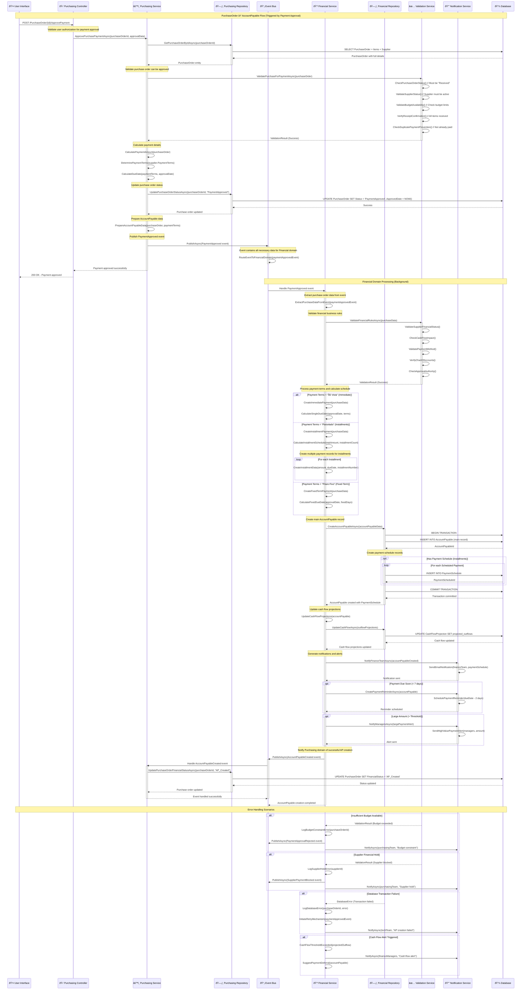

# 🔄 SEQUENCE DIAGRAM - PurchaseOrder → AccountPayable Flow

## 🎯 Visão Geral
Diagrama de sequência detalhado mostrando o fluxo automático de criação de contas a pagar a partir da aprovação de pagamento de ordens de compra. Este fluxo crítico conecta os domínios de Compras e Financeiro, garantindo que todas as obrigações financeiras sejam devidamente registradas e programadas para pagamento.

## 📊 Complexidade do Fluxo
- **⚠️ Média Complexidade**: Cross-domain integration, payment scheduling, financial calculations
- **👥 Participantes**: 6+ system components
- **🔄 Interações**: 15+ interactions per purchase order
- **🌐 Cross-Domain**: Purchasing → Financial integration
- **📋 Validações**: Payment approval, budget validation, supplier verification

## 🎯 Trigger Event
**PaymentApproved** (Purchasing Domain) → Automatic AccountPayable creation

## 📝 Sequence Diagram


```mermaid
sequenceDiagram
    participant UI as 👤 User Interface
    participant PC as 🛒 Purchasing Controller
    participant PS as ⚙️ Purchasing Service
    participant PR as 🗄️ Purchasing Repository
    participant EB as 📡 Event Bus
    participant FS as 💳 Financial Service
    participant FR as 🗄️ Financial Repository
    participant VS as ✅ Validation Service
    participant NS as 🔔 Notification Service
    participant DB as 💾 Database
    
    Note over UI, DB: PurchaseOrder → AccountPayable Flow (Triggered by Payment Approval)
    
    %% ==========================================
    %% PURCHASING DOMAIN - PAYMENT APPROVAL
    %% ==========================================
    
    UI->>PC: POST /PurchaseOrder/{id}/ApprovePayment
    Note over PC: Validate user authorization for payment approval
    
    PC->>PS: ApprovePurchasePaymentAsync(purchaseOrderId, approvalData)
    activate PS
    
    PS->>PR: GetPurchaseOrderByIdAsync(purchaseOrderId)
    activate PR
    PR->>DB: SELECT PurchaseOrder + Items + Supplier
    DB-->>PR: PurchaseOrder with full details
    PR-->>PS: PurchaseOrder entity
    deactivate PR
    
    Note over PS: Validate purchase order can be approved
    PS->>VS: ValidatePurchaseForPaymentAsync(purchaseOrder)
    activate VS
    
    VS->>VS: CheckPurchaseOrderStatus() // Must be "Received"
    VS->>VS: ValidateSupplierStatus() // Supplier must be active
    VS->>VS: ValidateBudgetAvailability() // Check budget limits
    VS->>VS: VerifyReceiptConfirmation() // All items received
    VS->>VS: CheckDuplicatePaymentPrevention() // Not already paid
    
    VS-->>PS: ValidationResult (Success)
    deactivate VS
    
    Note over PS: Calculate payment details
    PS->>PS: CalculatePaymentAmount(purchaseOrder)
    PS->>PS: DeterminePaymentTerms(supplier.PaymentTerms)
    PS->>PS: CalculateDueDate(paymentTerms, approvalDate)
    
    Note over PS: Update purchase order status
    PS->>PR: UpdatePurchaseOrderStatusAsync(purchaseOrderId, "PaymentApproved")
    activate PR
    PR->>DB: UPDATE PurchaseOrder SET Status = 'PaymentApproved', ApprovedDate = NOW()
    DB-->>PR: Success
    PR-->>PS: Purchase order updated
    deactivate PR
    
    Note over PS: Prepare AccountPayable data
    PS->>PS: PrepareAccountPayableData(purchaseOrder, paymentTerms)
    
    %% ==========================================
    %% EVENT PUBLISHING - CROSS DOMAIN
    %% ==========================================
    
    Note over PS: Publish PaymentApproved event
    PS->>EB: PublishAsync(PaymentApproved event)
    activate EB
    
    Note over EB: Event contains all necessary data for Financial domain
    EB->>EB: RouteEventToFinancialDomain(paymentApprovedEvent)
    deactivate EB
    
    PS-->>PC: Payment approved successfully
    deactivate PS
    PC-->>UI: 200 OK - Payment approved
    
    %% ==========================================
    %% FINANCIAL DOMAIN - ACCOUNT PAYABLE CREATION
    %% ==========================================
    
    Note over EB, DB: Financial Domain Processing (Background)
    
    EB->>FS: Handle PaymentApproved event
    activate FS
    
    Note over FS: Extract purchase order data from event
    FS->>FS: ExtractPurchaseDataFromEvent(paymentApprovedEvent)
    
    Note over FS: Validate financial business rules
    FS->>VS: ValidateFinancialRulesAsync(purchaseData)
    activate VS
    
    VS->>VS: ValidateSupplierFinancialStatus()
    VS->>VS: CheckCashFlowImpact()
    VS->>VS: ValidatePaymentMethod()
    VS->>VS: VerifyChartOfAccounts()
    VS->>VS: CheckApprovalAuthority()
    
    VS-->>FS: ValidationResult (Success)
    deactivate VS
    
    %% ==========================================
    %% PAYMENT TERMS PROCESSING
    %% ==========================================
    
    Note over FS: Process payment terms and calculate schedule
    alt Payment Terms = "À Vista" (Immediate)
        FS->>FS: CreateImmediatePayment(purchaseData)
        FS->>FS: CalculateSingleDueDate(approvalDate, terms)
        
    else Payment Terms = "Parcelado" (Installments)
        FS->>FS: CreateInstallmentPayment(purchaseData)
        FS->>FS: CalculateInstallmentSchedule(totalAmount, installmentCount)
        
        Note over FS: Create multiple payment records for installments
        loop For each Installment
            FS->>FS: CreateInstallmentData(amount, dueDate, installmentNumber)
        end
        
    else Payment Terms = "Prazo Fixo" (Fixed Term)
        FS->>FS: CreateFixedTermPayment(purchaseData)
        FS->>FS: CalculateFixedDueDate(approvalDate, fixedDays)
    end
    
    %% ==========================================
    %% ACCOUNT PAYABLE CREATION
    %% ==========================================
    
    Note over FS: Create main AccountPayable record
    FS->>FR: CreateAccountPayableAsync(accountPayableData)
    activate FR
    
    FR->>DB: BEGIN TRANSACTION
    
    FR->>DB: INSERT INTO AccountPayable (main record)
    DB-->>FR: AccountPayableId
    
    Note over FR: Create payment schedule records
    opt Has Payment Schedule (Installments)
        loop For each Scheduled Payment
            FR->>DB: INSERT INTO PaymentSchedule
            DB-->>FR: PaymentScheduleId
        end
    end
    
    FR->>DB: COMMIT TRANSACTION
    DB-->>FR: Transaction committed
    
    FR-->>FS: AccountPayable created with PaymentSchedule
    deactivate FR
    
    %% ==========================================
    %% CASH FLOW AND FINANCIAL UPDATES
    %% ==========================================
    
    Note over FS: Update cash flow projections
    FS->>FS: UpdateCashFlowProjections(accountPayable)
    
    FS->>FR: UpdateCashFlowAsync(outflowProjections)
    activate FR
    FR->>DB: UPDATE CashFlowProjection SET projected_outflows
    DB-->>FR: Cash flow updated
    FR-->>FS: Cash flow projections updated
    deactivate FR
    
    %% ==========================================
    %% NOTIFICATIONS AND ALERTS
    %% ==========================================
    
    Note over FS: Generate notifications and alerts
    FS->>NS: NotifyFinanceTeamAsync(accountPayableCreated)
    activate NS
    NS->>NS: SendEmailNotification(financeTeam, paymentSchedule)
    NS-->>FS: Notification sent
    deactivate NS
    
    opt Payment Due Soon (< 7 days)
        FS->>NS: CreatePaymentReminderAsync(accountPayable)
        activate NS
        NS->>NS: SchedulePaymentReminder(dueDate - 2 days)
        NS-->>FS: Reminder scheduled
        deactivate NS
    end
    
    opt Large Amount (> Threshold)
        FS->>NS: NotifyManagersAsync(largePaymentAlert)
        activate NS
        NS->>NS: SendHighValuePaymentAlert(managers, amount)
        NS-->>FS: Alert sent
        deactivate NS
    end
    
    %% ==========================================
    %% CROSS-DOMAIN STATUS UPDATE
    %% ==========================================
    
    Note over FS: Notify Purchasing domain of successful AP creation
    FS->>EB: PublishAsync(AccountPayableCreated event)
    activate EB
    EB->>PS: Handle AccountPayableCreated event
    activate PS
    
    PS->>PR: UpdatePurchaseOrderFinancialStatusAsync(purchaseOrderId, "AP_Created")
    activate PR
    PR->>DB: UPDATE PurchaseOrder SET FinancialStatus = 'AP_Created'
    DB-->>PR: Status updated
    PR-->>PS: Purchase order updated
    deactivate PR
    
    PS-->>EB: Event handled successfully
    deactivate PS
    deactivate EB
    
    FS-->>EB: AccountPayable creation completed
    deactivate FS
    
    %% ==========================================
    %% ERROR HANDLING SCENARIOS
    %% ==========================================
    
    Note over UI, DB: Error Handling Scenarios
    
    alt Insufficient Budget Available
        VS-->>FS: ValidationResult (Budget exceeded)
        FS->>FS: LogBudgetConstraintError(purchaseOrderId)
        FS->>EB: PublishAsync(PaymentApprovalRejected event)
        FS->>NS: NotifyAsync(purchasingTeam, "Budget constraint")
    end
    
    alt Supplier Financial Hold
        VS-->>FS: ValidationResult (Supplier blocked)
        FS->>FS: LogSupplierHoldError(supplierId)
        FS->>EB: PublishAsync(SupplierPaymentBlocked event)
        FS->>NS: NotifyAsync(purchasingTeam, "Supplier hold")
    end
    
    alt Database Transaction Failure
        FR-->>FS: DatabaseError (Transaction failed)
        FS->>FS: LogDatabaseError(purchaseOrderId, error)
        FS->>FS: InitiateRetryMechanism(paymentApprovedEvent)
        FS->>NS: NotifyAsync(techTeam, "AP creation failed")
    end
    
    alt Cash Flow Alert Triggered
        FS->>FS: CashFlowThresholdExceeded(projectedOutflow)
        FS->>NS: NotifyAsync(financeManagers, "Cash flow alert")
        FS->>FS: SuggestPaymentDeferral(accountPayable)
    end
```

## 🎯 Detailed Component Responsibilities

### **🛒 Purchasing Controller**
```
Responsibilities:
├── 🔐 Validate user authorization for payment approval
├── 📋 HTTP request validation and routing
├── 💰 Payment approval workflow initiation
├── 📊 Return appropriate response codes
└── 🔍 Log approval-related activities

Authorization Levels:
├── 👤 Standard User: < $1,000
├── 👑 Manager: < $10,000
├── 💼 Director: < $50,000
└── 🏢 Executive: Any amount
```

### **⚙️ Purchasing Service**
```
Payment Approval Logic:
├── 📋 Purchase order validation and verification
├── 💰 Payment amount calculation and verification
├── 📅 Payment terms interpretation and application
├── 📊 Supplier status and relationship validation
└── 📡 Cross-domain event coordination

Calculation Responsibilities:
├── 💰 Net payment amount (total - discounts)
├── 📅 Due date calculation based on terms
├── 🏦 Payment method determination
├── 💸 Early payment discount evaluation
└── 📊 Budget impact assessment

Data Preparation:
├── 📦 AccountPayable entity data mapping
├── 📅 Payment schedule data preparation
├── 🏢 Supplier financial information compilation
├── 📊 Purchase order reference data
└── 💾 Audit trail data preparation
```

### **💳 Financial Service**
```
AccountPayable Creation Logic:
├── 📊 Financial validation and business rules
├── 💰 Payment terms processing and interpretation
├── 📅 Payment schedule generation
├── 💸 Cash flow impact calculation
└── 🔔 Alert and notification management

Payment Terms Handling:
├── 💵 À Vista: Immediate payment processing
├── 📊 Parcelado: Installment schedule creation
├── 📅 Prazo Fixo: Fixed term due date calculation
├── 💰 Early Payment: Discount calculation
└── 🏦 Custom Terms: Flexible payment arrangements

Financial Impact Analysis:
├── 💸 Cash flow projection updates
├── 📊 Budget utilization tracking
├── 🏦 Working capital impact assessment
├── 📈 Financial ratio impact evaluation
└── ⚠️ Alert threshold monitoring
```

## 💰 Payment Terms Processing

### **📅 Payment Terms Types**
```
À Vista (Immediate Payment):
├── 📅 Due Date: Approval date + 0-3 days
├── 💰 Discount: Often includes early payment discount
├── 🏦 Method: Bank transfer, cash, check
├── 💸 Cash Flow: Immediate outflow
└── 📊 Frequency: Common for small suppliers

Parcelado (Installment Payment):
├── 📅 Due Dates: Monthly installments
├── 💰 Interest: May include interest charges
├── 📊 Installments: 2-12 payments typically
├── 💸 Cash Flow: Spread over time
└── 📋 Use Case: Large purchases, equipment

Prazo Fixo (Fixed Term):
├── 📅 Due Date: Approval date + fixed days (30/60/90)
├── 💰 Standard: Most common business terms
├── 🏦 Method: Bank transfer typically
├── 💸 Cash Flow: Single future outflow
└── 📊 Supplier Relationship: Standard terms

Custom Terms:
├── 📅 Due Date: Negotiated terms
├── 💰 Complex: May include milestones
├── 📊 Special Cases: Large contracts
├── 💸 Cash Flow: Varies by agreement
└── 📋 Approval: Requires special authorization
```

### **💰 Calculation Logic**
```
Payment Amount Calculation:
├── 🧮 Base Amount = Sum of all received items
├── 💸 Discounts Applied = Early payment, volume, etc.
├── 📊 Taxes Included = As per local regulations
├── 💰 Final Amount = Base - Discounts + Taxes
└── ✅ Validation = Amount matches purchase order

Due Date Calculation:
├── 📅 Start Date = Payment approval date
├── ⏰ Business Days = Exclude weekends/holidays
├── 📊 Supplier Terms = Apply negotiated terms
├── 📅 Final Due Date = Start + Terms (business days)
└── ✅ Validation = Date is in future and reasonable

Installment Calculation:
├── 💰 Principal = Total amount / installment count
├── 📊 Interest = Applied to remaining balance
├── 📅 Schedule = Monthly intervals from approval
├── 💸 Final Amount = Principal + accrued interest
└── ✅ Validation = Sum equals total amount
```

## 🔒 Validation and Security

### **✅ Purchase Order Validations**
```
Status Validations:
├── ✅ Purchase order exists and is accessible
├── ✅ Status is "Received" (items confirmed received)
├── ✅ Not already approved for payment
├── ✅ Not cancelled or voided
└── ✅ All required fields are populated

Financial Validations:
├── 💰 Total amount is positive and reasonable
├── 🏦 Supplier bank details are valid
├── 📊 Budget allocation is sufficient
├── 💸 Payment method is supported
└── 📅 Payment terms are valid

Supplier Validations:
├── 🏢 Supplier is active and not blocked
├── 💰 No outstanding issues or disputes
├── 🏦 Banking information is current
├── 📊 Credit status is acceptable
└── 📋 Contract terms are valid
```

### **🔐 Authorization Matrix**
```
Approval Limits by Role:
├── 👤 Purchasing Agent: $0 - $1,000
├── 👑 Purchasing Manager: $1,001 - $10,000
├── 💼 Department Director: $10,001 - $50,000
├── 🏢 Finance Director: $50,001 - $250,000
└── 👔 Executive: $250,001+

Additional Requirements:
├── 🔏 Dual approval for amounts > $25,000
├── 📊 Budget owner approval for budget impact
├── 👑 Department head approval for new suppliers
├── 💼 Finance approval for payment term changes
└── 🏢 Executive approval for policy exceptions
```

## 📊 Financial Impact Analysis

### **💸 Cash Flow Calculations**
```
Immediate Impact:
├── 💰 Current Cash Position Assessment
├── 📊 Available Credit Line Evaluation
├── 💸 Immediate Liquidity Requirements
├── 📅 Other Payments Due Same Period
└── ⚠️ Cash Flow Alert Thresholds

Projected Impact:
├── 📈 7-day cash flow projection update
├── 📊 30-day cash flow projection update
├── 💰 90-day cash flow trend analysis
├── 📅 Seasonal payment pattern consideration
└── 🎯 Working capital impact assessment

Risk Assessment:
├── ⚠️ Liquidity risk evaluation
├── 📊 Concentration risk (single supplier)
├── 💰 Credit risk (supplier default)
├── 📅 Timing risk (payment clustering)
└── 🏦 Banking relationship impact
```

### **📋 Alert Thresholds**
```
Cash Flow Alerts:
├── 🚨 Critical: Available cash < 7 days operating expense
├── ⚠️ Warning: Available cash < 15 days operating expense
├── 📊 Notice: Single payment > 5% of monthly budget
├── 💰 Large: Single payment > $50,000
└── 📅 Timing: Multiple large payments same week

Operational Alerts:
├── 🏢 Supplier Concentration: > 20% of monthly spend
├── 📊 Budget Variance: Payment exceeds budget by > 10%
├── 💸 Payment Terms: Terms longer than 60 days
├── 🏦 Banking: Payment method change from standard
└── 📅 Timing: Payment due during cash flow shortage
```

## 🔄 Error Handling and Recovery

### **❌ Error Scenarios**
```
Financial Validation Failures:
├── 💰 Insufficient budget allocation
├── 🏦 Supplier account blocked/frozen
├── 📊 Payment amount exceeds limits
├── 📅 Invalid payment terms specified
└── 💸 Cash flow constraint violation

Technical Failures:
├── 🗄️ Database transaction timeout
├── 📡 Event publishing failure
├── 💾 Data consistency violation
├── 🔌 External service unavailable
└── 🚨 System resource exhaustion

Business Logic Errors:
├── 📋 Purchase order status inconsistency
├── 🏢 Supplier status change during processing
├── 💰 Concurrent payment approval conflict
├── 📊 Budget allocation race condition
└── 📅 Due date calculation error
```

### **🔧 Recovery Mechanisms**
```
Retry Strategies:
├── 🔁 Exponential backoff for transient failures
├── 🎯 Circuit breaker for external services
├── 📊 Dead letter queue for failed events
├── 🚨 Manual intervention for business errors
└── 🔄 Automatic reconciliation processes

Compensation Actions:
├── 🔄 Reverse AccountPayable creation on failure
├── 📊 Restore purchase order status
├── 💰 Release budget allocation
├── 📡 Publish compensation events
└── 🔔 Notify relevant stakeholders

Data Integrity Recovery:
├── 📊 Cross-domain consistency checks
├── 🎯 Reconciliation reporting
├── 🔄 Manual correction workflows
├── 📋 Audit trail maintenance
└── 🚨 Health check monitoring
```

## 📈 Performance and Monitoring

### **âš¡ Performance Targets**
```
Response Time SLAs:
├── 🎯 Payment approval response: < 3 seconds
├── 📊 AccountPayable creation: < 5 seconds
├── 💸 Cash flow update: < 2 seconds
├── 🔔 Notification delivery: < 10 seconds
└── 📋 Cross-domain sync: < 15 seconds

Throughput Targets:
├── 📊 100+ payment approvals per hour
├── 💰 1000+ AccountPayable records per day
├── 📈 Support 50+ concurrent approvals
└── 🎯 Maintain > 99.5% success rate
```

### **📊 Monitoring Metrics**
```
Business Metrics:
├── 💰 Average payment approval time
├── 📊 Payment approval success rate
├── 💸 Cash flow projection accuracy
├── 🏦 Supplier payment compliance
└── 📅 Due date accuracy

Technical Metrics:
├── 🔌 Cross-domain event latency
├── 📊 Database transaction performance
├── 💾 System resource utilization
├── 🚨 Error rate by component
└── 📈 Alert response effectiveness
```

---

**Arquivo**: `02-purchase-to-payable-flow.md`  
**Fluxo**: PurchaseOrder → AccountPayable (Automático)  
**Domínios**: Purchasing → Financial  
**Complexidade**: ⚠️ Média (6+ participantes, 15+ interações)  
**Atualização**: 16/06/2025
