# 🔄 SEQUENCE DIAGRAM - OrderEntry → AccountReceivable Flow

## 🎯 Visão Geral
Diagrama de sequência detalhado mostrando o fluxo automático de criação de contas a receber a partir da confirmação de pedidos de venda. Este fluxo fundamental conecta os domínios de Vendas e Financeiro, garantindo que toda receita seja devidamente registrada e acompanhada para cobrança.

## 📊 Complexidade do Fluxo
- **⚠️ Média Complexidade**: Cross-domain integration, payment terms processing, installment calculations
- **👥 Participantes**: 7+ system components
- **🔄 Interações**: 15+ interactions per order
- **🌐 Cross-Domain**: Sales → Financial integration
- **📋 Validações**: Customer credit, payment terms, installment calculations

## 🎯 Trigger Event
**OrderConfirmed** (Sales Domain) → Automatic AccountReceivable creation

## 📝 Sequence Diagram

```mermaid
sequenceDiagram
    participant UI as 👤 User Interface
    participant SC as 🎮 Sales Controller
    participant SS as ⚙️ Sales Service
    participant SR as 🗄️ Sales Repository
    participant EB as 📡 Event Bus
    participant FS as 💳 Financial Service
    participant FR as 🗄️ Financial Repository
    participant VS as ✅ Validation Service
    participant CS as 👤 Customer Service
    participant NS as 🔔 Notification Service
    participant DB as 💾 Database
    
    Note over UI, DB: OrderEntry → AccountReceivable Flow (Triggered by Order Confirmation)
    
    %% ==========================================
    %% SALES DOMAIN - ORDER CONFIRMATION
    %% ==========================================
    
    UI->>SC: POST /Order/{orderId}/Confirm
    Note over SC: Validate user authorization for order confirmation
    
    SC->>SS: ConfirmOrderAsync(orderId, confirmationData)
    activate SS
    
    SS->>SR: GetOrderWithCustomerAsync(orderId)
    activate SR
    SR->>DB: SELECT OrderEntry + Customer + PaymentTerms
    DB-->>SR: Order with customer details
    SR-->>SS: OrderEntry with Customer
    deactivate SR
    
    Note over SS: Validate order for confirmation
    SS->>VS: ValidateOrderForConfirmationAsync(order)
    activate VS
    
    VS->>CS: ValidateCustomerCreditAsync(customerId, orderTotal)
    activate CS
    CS->>CS: CheckCurrentDebt()
    CS->>CS: CalculateAvailableCredit()
    CS->>CS: AssessCreditRisk()
    CS-->>VS: CreditValidationResult (Approved)
    deactivate CS
    
    VS->>VS: ValidateDeliveryDateFeasibility()
    VS->>VS: ValidatePaymentTermsValidity()
    VS->>VS: CheckBusinessRuleCompliance()
    
    VS-->>SS: ValidationResult (Success)
    deactivate VS
    
    Note over SS: Update order status
    SS->>SR: UpdateOrderStatusAsync(orderId, "Confirmed")
    activate SR
    SR->>DB: UPDATE OrderEntry SET Status = 'Confirmed', ConfirmedDate = NOW()
    DB-->>SR: Success
    SR-->>SS: Order status updated
    deactivate SR
    
    Note over SS: Prepare financial data for AR creation
    SS->>SS: CalculateOrderFinancials(order)
    SS->>SS: DeterminePaymentTerms(customer.PaymentTerms)
    SS->>SS: PrepareAccountReceivableData(order, paymentTerms)
    
    %% ==========================================
    %% EVENT PUBLISHING - CROSS DOMAIN
    %% ==========================================
    
    Note over SS: Publish OrderConfirmed event
    SS->>EB: PublishAsync(OrderConfirmed event)
    activate EB
    
    Note over EB: Event contains order, customer, and payment data
    EB->>EB: RouteEventToFinancialDomain(orderConfirmedEvent)
    EB->>EB: RouteEventToProductionDomain(orderConfirmedEvent)
    deactivate EB
    
    SS-->>SC: Order confirmed successfully
    deactivate SS
    SC-->>UI: 200 OK - Order confirmed
    
    %% ==========================================
    %% FINANCIAL DOMAIN - ACCOUNT RECEIVABLE CREATION
    %% ==========================================
    
    Note over EB, DB: Financial Domain Processing (Background)
    
    EB->>FS: Handle OrderConfirmed event
    activate FS
    
    Note over FS: Extract order and customer data from event
    FS->>FS: ExtractOrderDataFromEvent(orderConfirmedEvent)
    
    Note over FS: Validate financial business rules
    FS->>VS: ValidateFinancialRulesAsync(orderData)
    activate VS
    
    VS->>VS: ValidateCustomerAccountStatus()
    VS->>VS: CheckCustomerCreditLimits()
    VS->>VS: ValidateRevenueRecognitionRules()
    VS->>VS: VerifyChartOfAccountsMapping()
    VS->>VS: CheckTaxCalculationRequirements()
    
    VS-->>FS: ValidationResult (Success)
    deactivate VS
    
    %% ==========================================
    %% PAYMENT TERMS AND INSTALLMENT PROCESSING
    %% ==========================================
    
    Note over FS: Process payment terms and create payment schedule
    alt Payment Terms = "À Vista" (Cash)
        FS->>FS: CreateCashPayment(orderData)
        FS->>FS: CalculateImmediateDueDate(orderDate, terms)
        FS->>FS: ApplyCashDiscountIfApplicable()
        
    else Payment Terms = "Parcelado" (Installments)
        FS->>FS: CreateInstallmentPayment(orderData)
        FS->>FS: CalculateInstallmentSchedule(totalAmount, installmentCount)
        
        Note over FS: Create installment breakdown
        loop For each Installment
            FS->>FS: CalculateInstallmentAmount(principal, interest, installmentNumber)
            FS->>FS: CalculateInstallmentDueDate(orderDate, installmentNumber)
            FS->>FS: CreateInstallmentData(amount, dueDate, installmentNumber)
        end
        
    else Payment Terms = "Prazo" (Credit Term)
        FS->>FS: CreateCreditTermPayment(orderData)
        FS->>FS: CalculateCreditDueDate(orderDate, creditDays)
        FS->>FS: ApplyCreditTermsAndConditions()
        
    else Payment Terms = "Customizado" (Custom)
        FS->>FS: CreateCustomPayment(orderData)
        FS->>FS: ApplyCustomPaymentRules(customer.CustomTerms)
        FS->>FS: ValidateCustomTermsCompliance()
    end
    
    %% ==========================================
    %% ACCOUNT RECEIVABLE CREATION
    %% ==========================================
    
    Note over FS: Create main AccountReceivable record
    FS->>FR: CreateAccountReceivableAsync(accountReceivableData)
    activate FR
    
    FR->>DB: BEGIN TRANSACTION
    
    FR->>DB: INSERT INTO AccountReceivable (main record)
    DB-->>FR: AccountReceivableId
    
    Note over FR: Create installment records if applicable
    opt Has Installment Schedule
        loop For each Installment
            FR->>DB: INSERT INTO PaymentInstallment
            DB-->>FR: InstallmentId
        end
    end
    
    Note over FR: Create payment tracking records
    FR->>DB: INSERT INTO PaymentTracking (initial status)
    DB-->>FR: PaymentTrackingId
    
    FR->>DB: COMMIT TRANSACTION
    DB-->>FR: Transaction committed successfully
    
    FR-->>FS: AccountReceivable created with installments
    deactivate FR
    
    %% ==========================================
    %% CUSTOMER CREDIT AND FINANCIAL UPDATES
    %% ==========================================
    
    Note over FS: Update customer credit utilization
    FS->>FS: UpdateCustomerCreditUtilization(customerId, orderAmount)
    
    FS->>FR: UpdateCustomerFinancialStatusAsync(customerId, creditUpdate)
    activate FR
    FR->>DB: UPDATE CustomerFinancial SET current_debt, credit_utilization
    DB-->>FR: Customer credit updated
    FR-->>FS: Customer financial status updated
    deactivate FR
    
    Note over FS: Update cash flow projections
    FS->>FS: UpdateCashFlowProjections(accountReceivable)
    
    FS->>FR: UpdateCashFlowAsync(inflowProjections)
    activate FR
    FR->>DB: UPDATE CashFlowProjection SET projected_inflows
    DB-->>FR: Cash flow projections updated
    FR-->>FS: Cash flow updated
    deactivate FR
    
    %% ==========================================
    %% REVENUE RECOGNITION AND ACCOUNTING
    %% ==========================================
    
    Note over FS: Handle revenue recognition based on delivery terms
    alt Delivery Terms = "FOB Destination"
        FS->>FS: DeferRevenueRecognition(accountReceivable)
        FS->>FS: CreateDeferredRevenueEntry()
        
    else Delivery Terms = "FOB Origin"
        FS->>FS: RecognizeRevenueImmediately(accountReceivable)
        FS->>FS: CreateRevenueJournalEntry()
        
    else Delivery Terms = "Custom Terms"
        FS->>FS: ApplyCustomRevenueRules(deliveryTerms)
        FS->>FS: CreateConditionalRevenueEntry()
    end
    
    FS->>FR: CreateAccountingEntriesAsync(revenueEntries)
    activate FR
    FR->>DB: INSERT INTO GeneralLedgerEntry (revenue recognition)
    DB-->>FR: Accounting entries created
    FR-->>FS: Revenue properly recognized
    deactivate FR
    
    %% ==========================================
    %% NOTIFICATIONS AND CUSTOMER COMMUNICATION
    %% ==========================================
    
    Note over FS: Generate customer notifications and documents
    FS->>NS: GenerateInvoiceAsync(accountReceivable)
    activate NS
    NS->>NS: CreateInvoiceDocument(orderData, paymentTerms)
    NS->>NS: SendInvoiceToCustomer(customerId, invoice)
    NS-->>FS: Invoice generated and sent
    deactivate NS
    
    opt Has Installment Schedule
        FS->>NS: CreatePaymentReminderScheduleAsync(installments)
        activate NS
        loop For each Installment
            NS->>NS: SchedulePaymentReminder(dueDate - 3 days)
        end
        NS-->>FS: Payment reminders scheduled
        deactivate NS
    end
    
    FS->>NS: NotifyFinanceTeamAsync(accountReceivableCreated)
    activate NS
    NS->>NS: SendARCreationNotification(financeTeam, arDetails)
    NS-->>FS: Finance team notified
    deactivate NS
    
    opt Large Order (> Threshold)
        FS->>NS: NotifyManagementAsync(largeOrderAlert)
        activate NS
        NS->>NS: SendHighValueOrderAlert(management, orderAmount)
        NS-->>FS: Management alerted
        deactivate NS
    end
    
    %% ==========================================
    %% CROSS-DOMAIN STATUS UPDATE
    %% ==========================================
    
    Note over FS: Notify Sales domain of successful AR creation
    FS->>EB: PublishAsync(AccountReceivableCreated event)
    activate EB
    EB->>SS: Handle AccountReceivableCreated event
    activate SS
    
    SS->>SR: UpdateOrderFinancialStatusAsync(orderId, "AR_Created")
    activate SR
    SR->>DB: UPDATE OrderEntry SET FinancialStatus = 'AR_Created'
    DB-->>SR: Financial status updated
    SR-->>SS: Order financial status updated
    deactivate SR
    
    SS-->>EB: Event handled successfully
    deactivate SS
    deactivate EB
    
    FS-->>EB: AccountReceivable creation completed
    deactivate FS
    
    %% ==========================================
    %% ERROR HANDLING SCENARIOS
    %% ==========================================
    
    Note over UI, DB: Error Handling Scenarios
    
    alt Customer Credit Limit Exceeded
        CS-->>VS: CreditValidationResult (Credit exceeded)
        VS-->>SS: ValidationResult (Credit limit exceeded)
        SS->>SS: LogCreditLimitError(customerId, orderAmount)
        SS->>NS: NotifyAsync(salesTeam, "Credit limit exceeded")
        SS-->>SC: 400 Bad Request - Credit limit exceeded
    end
    
    alt Invalid Payment Terms
        VS-->>FS: ValidationResult (Invalid payment terms)
        FS->>FS: LogPaymentTermsError(customerId, terms)
        FS->>EB: PublishAsync(ARCreationFailed event)
        FS->>NS: NotifyAsync(salesTeam, "Payment terms invalid")
    end
    
    alt Database Transaction Failure
        FR-->>FS: DatabaseError (Transaction failed)
        FS->>FS: LogDatabaseError(orderId, error)
        FS->>FS: InitiateRetryMechanism(orderConfirmedEvent)
        FS->>NS: NotifyAsync(techTeam, "AR creation failed")
    end
    
    alt Revenue Recognition Rule Violation
        FS->>FS: RevenueRecognitionError(orderId, violation)
        FS->>NS: NotifyAsync(accountingTeam, "Revenue recognition issue")
        FS->>FS: CreateManualReviewTask(accountReceivable)
    end
    
    alt Customer Account Inactive
        VS-->>FS: ValidationResult (Customer account inactive)
        FS->>FS: LogInactiveCustomerError(customerId)
        FS->>EB: PublishAsync(CustomerAccountIssue event)
        FS->>NS: NotifyAsync(salesTeam, "Customer account inactive")
    end
```



## 🎯 Detailed Component Responsibilities

### **🎮 Sales Controller**
```
Responsibilities:
├── 🔐 Validate user authorization for order confirmation
├── 📋 HTTP request validation and sanitization  
├── 💰 Order confirmation workflow coordination
├── 📊 Return appropriate HTTP response codes
└── 🔍 Log confirmation-related activities

Authorization Validation:
├── 👤 User role verification
├── 💰 Order amount vs authorization limits
├── 🏢 Customer account access permissions
├── 📅 Business hours confirmation rules
└── 🚨 Fraud detection checks
```

### **⚙️ Sales Service**
```
Order Confirmation Logic:
├── 📋 Comprehensive order validation
├── 👤 Customer credit verification
├── 💰 Financial calculations and verification
├── 📅 Delivery date validation and commitment
└── 📡 Cross-domain event orchestration

Financial Data Preparation:
├── 💰 Order total calculation and verification
├── 📊 Tax calculation and application
├── 💸 Discount application and validation
├── 📅 Payment terms determination
└── 🏦 Revenue recognition rule application

Customer Relationship Management:
├── 👤 Customer status verification
├── 💳 Credit limit and utilization checking
├── 📊 Payment history analysis
├── 🎯 Customer risk assessment
└── 📈 Customer lifetime value updates
```

### **💳 Financial Service**
```
AccountReceivable Creation Logic:
├── 📊 Financial validation and compliance
├── 💰 Payment terms processing and application
├── 📅 Installment schedule generation
├── 💸 Revenue recognition processing
└── 📈 Financial metrics and projections

Payment Processing Strategy:
├── 💵 Cash payments: Immediate processing
├── 📊 Installments: Complex schedule creation
├── 📅 Credit terms: Due date calculations
├── 🎯 Custom terms: Flexible rule application
└── 🏦 Payment method validation

Financial Impact Management:
├── 💸 Cash flow projection updates
├── 📊 Customer credit utilization tracking
├── 📈 Revenue recognition compliance
├── 🎯 Financial ratio impact assessment
└── ⚠️ Risk threshold monitoring
```

### **👤 Customer Service**
```
Credit Management:
├── 💳 Credit limit verification and management
├── 📊 Payment history analysis and scoring
├── 🎯 Risk assessment and categorization
├── 💰 Current debt calculation and tracking
└── 📈 Credit utilization monitoring

Customer Validation:
├── ✅ Account status verification (active/inactive)
├── 🚨 Fraud detection and prevention
├── 📋 KYC (Know Your Customer) compliance
├── 🏦 Banking and payment information validation
└── 📊 Customer relationship health assessment
```

## 💰 Payment Terms and Revenue Recognition

### **📅 Payment Terms Processing**
```
À Vista (Cash Payment):
├── 📅 Due Date: Order date + 0-7 days
├── 💰 Discount: 2-5% early payment discount typically
├── 🏦 Method: Cash, debit, immediate bank transfer
├── 💸 Cash Flow: Immediate or near-immediate inflow
└── 📊 Risk: Lowest credit risk, immediate recognition

Parcelado (Installment Payment):
├── 📅 Due Dates: Monthly payments over 2-24 months
├── 💰 Interest: 1-3% monthly compound interest
├── 📊 Installments: Equal payments with interest
├── 💸 Cash Flow: Spread over installment period
└── 📋 Risk: Medium risk, payment tracking required

Prazo (Credit Terms):
├── 📅 Due Date: 15/30/45/60 days from order date
├── 💰 Standard: Most common B2B payment terms
├── 🏦 Method: Bank transfer, check, credit
├── 💸 Cash Flow: Single future inflow
└── 📊 Risk: Standard business credit risk

Customizado (Custom Terms):
├── 📅 Due Date: Negotiated based on customer relationship
├── 💰 Complex: May include milestones, conditions
├── 📊 Special Cases: Large customers, strategic accounts
├── 💸 Cash Flow: Varies by agreement terms
└── 📋 Approval: Requires manager/director approval
```

### **📊 Revenue Recognition Rules**
```
Immediate Recognition (FOB Origin):
├── 🚚 Recognition: When goods shipped from warehouse
├── 📅 Timing: Order confirmation + shipping
├── 💰 Amount: Full order amount recognized
├── 📊 Risk: Standard revenue recognition
└── 📋 Compliance: GAAP/IFRS standard approach

Deferred Recognition (FOB Destination):
├── 🚚 Recognition: When goods delivered to customer
├── 📅 Timing: Delivery confirmation required
├── 💰 Amount: Revenue held in deferred account
├── 📊 Risk: Delivery completion required
└── 📋 Compliance: Conservative approach

Milestone Recognition (Custom):
├── 🎯 Recognition: Based on completion milestones
├── 📅 Timing: Percentage completion method
├── 💰 Amount: Proportional to milestone completion
├── 📊 Risk: Complex tracking required
└── 📋 Compliance: Project accounting standards

Service Recognition (Ongoing):
├── ⏰ Recognition: Over service delivery period
├── 📅 Timing: Monthly/periodic recognition
├── 💰 Amount: Straight-line over service period
├── 📊 Risk: Service delivery performance risk
└── 📋 Compliance: Subscription revenue standards
```

## 🔒 Credit Management and Risk Assessment

### **💳 Customer Credit Framework**
```
Credit Limit Determination:
├── 📊 Credit Score: External credit bureau data
├── 💰 Financial Statements: Customer financial health
├── 📈 Payment History: Past payment performance
├── 🏢 Business Relationship: Length and depth
└── 🎯 Industry Risk: Sector-specific risk factors

Credit Utilization Monitoring:
├── 💰 Current Outstanding: All unpaid invoices
├── 📊 Available Credit: Limit - outstanding
├── 📈 Utilization Ratio: Outstanding / limit
├── ⚠️ Alert Thresholds: 75%, 90%, 100% utilization
└── 🚨 Actions: Hold orders, require payment

Risk Assessment Categories:
├── 🟢 Low Risk: Excellent credit, long relationship
├── 🟡 Medium Risk: Good credit, standard terms
├── 🟠 High Risk: Fair credit, restricted terms
├── 🔴 Very High Risk: Poor credit, cash only
└── ⚫ Blocked: No new orders, collection required
```

### **📊 Credit Decision Matrix**
| Credit Score | Payment History | Order Amount | Decision | Terms |
|--------------|----------------|--------------|----------|-------|
| **Excellent (750+)** | Perfect | Any | Auto-Approve | Standard |
| **Good (650-749)** | Good | < $50K | Auto-Approve | Standard |
| **Fair (550-649)** | Mixed | < $25K | Manager Review | Restricted |
| **Poor (< 550)** | Poor | Any | Director Review | Cash Only |

### **🚨 Alert and Action Framework**
```
Credit Alerts:
├── 🟡 Warning: 75% credit utilization reached
├── 🟠 Caution: 90% credit utilization reached
├── 🔴 Critical: 100% credit utilization reached
├── ⚫ Block: Payment overdue > 30 days
└── 🚨 Escalate: Manager review required

Automated Actions:
├── 📧 Email: Customer payment reminder
├── 📞 Call: Sales team follow-up required
├── 🚫 Hold: New orders temporarily suspended
├── 🔒 Block: No new orders until payment
└── 📋 Review: Manual credit review triggered
```

## 📊 Financial Calculations and Metrics

### **💰 Order Financial Calculations**
```
Base Calculations:
├── 🧮 Subtotal = Sum of (quantity × unit_price) for all items
├── 💸 Discounts = Customer discounts + promotional discounts
├── 📊 Taxes = Subtotal × applicable tax rates
├── 🚚 Shipping = Based on delivery terms and distance
└── 💰 Total = Subtotal - Discounts + Taxes + Shipping

Installment Calculations:
├── 📊 Principal = Total amount / number of installments
├── 💰 Interest = Principal × monthly interest rate
├── 📅 Payment = Principal + accrued interest
├── 🧮 Total Interest = Sum of all interest payments
└── ✅ Validation = Sum of payments = total + total interest

Tax Calculations:
├── 📊 Sales Tax = Subtotal × local sales tax rate
├── 💰 VAT = (Subtotal + shipping) × VAT rate
├── 🎯 Service Tax = Service items × service tax rate
├── 📋 Compliance = Tax jurisdiction determination
└── ✅ Validation = Tax calculations per regulations
```

### **📈 Cash Flow Impact**
```
Immediate Impact:
├── 💰 Expected Inflow = Order total amount
├── 📅 Expected Date = Based on payment terms
├── 🎯 Probability = Based on customer credit score
├── 💸 Present Value = Discounted for time value
└── 📊 Confidence = Risk-adjusted expected value

Projected Impact:
├── 📈 7-day projection: Payment due this week
├── 📊 30-day projection: Payment due this month
├── 💰 90-day projection: Quarterly cash impact
├── 📅 Annual projection: Yearly revenue impact
└── 🎯 Scenario Analysis: Best/worst/likely cases
```

## 🔄 Error Handling and Business Rules

### **❌ Common Error Scenarios**
```
Customer Credit Issues:
├── 💳 Credit limit exceeded by order amount
├── 📊 Customer payment history poor
├── 🚨 Customer account flagged for collection
├── 💰 Outstanding invoices past due
└── 🔒 Customer account temporarily suspended

Payment Terms Issues:
├── 📅 Invalid payment terms for customer type
├── 💰 Installment terms exceed maximum allowed
├── 🏦 Payment method not supported for customer
├── 📊 Custom terms require additional approval
└── 💸 Early payment discount calculation error

Financial Validation Issues:
├── 🧮 Order total calculation mismatch
├── 📊 Tax calculation errors or missing rates
├── 💰 Revenue recognition rule violations
├── 📅 Due date calculation outside business rules
└── 🏦 Chart of accounts mapping errors
```

### **🔧 Recovery and Resolution**
```
Credit Resolution Process:
├── 🔄 Automatic retry after payment received
├── 👤 Sales team customer contact for resolution
├── 💳 Temporary credit increase approval process
├── 💰 Payment plan negotiation and setup
└── 📋 Escalation to finance manager for decisions

Financial Error Resolution:
├── 🧮 Automatic recalculation triggers
├── 📊 Manual review queue for complex cases
├── 💰 Finance team notification and intervention
├── 🔄 Transaction rollback and retry mechanisms
└── 📋 Audit trail maintenance for all corrections

Business Rule Updates:
├── 📋 Dynamic rule engine updates
├── 🎯 A/B testing for new rule implementations
├── 📊 Impact analysis before rule changes
├── 🔄 Rollback capabilities for failed changes
└── 📈 Performance monitoring post-changes
```

## 📈 Performance and Monitoring

### **⚡ Performance Targets**
```
Response Time SLAs:
├── 🎯 Order confirmation: < 3 seconds
├── 📊 Credit validation: < 2 seconds
├── 💰 AR creation: < 5 seconds
├── 📧 Customer notification: < 10 seconds
└── 🔄 Cross-domain sync: < 15 seconds

Business Process SLAs:
├── 💳 Credit decision: < 30 seconds automated
├── 📊 Invoice generation: < 2 minutes
├── 📧 Customer communication: < 5 minutes
├── 💰 Payment processing: < 1 hour
└── 📋 Financial reporting: < 4 hours
```

### **📊 Key Metrics and KPIs**
```
Business Metrics:
├── 💰 Order-to-cash cycle time
├── 📊 Customer payment compliance rate
├── 💳 Credit utilization efficiency
├── 📈 Revenue recognition accuracy
└── 🎯 Customer satisfaction scores

Technical Metrics:
├── 🔌 API response times and reliability
├── 💾 Database transaction performance
├── 📡 Event processing latency
├── 🚨 Error rates by component
└── 📈 System throughput under load

Financial Metrics:
├── 💰 Days Sales Outstanding (DSO)
├── 📊 Bad debt write-off percentage
├── 💳 Credit limit utilization trends
├── 📈 Revenue per order trends
└── 🎯 Cash flow forecast accuracy
```

---

**Arquivo**: `03-order-to-receivable-flow.md`  
**Fluxo**: OrderEntry → AccountReceivable (Automático)  
**Domínios**: Sales → Financial  
**Complexidade**: ⚠️ Média (7+ participantes, 15+ interações)  
**Atualização**: 16/06/2025
