# 🤖 SEQUENCE DIAGRAM - IA Processing Flow (Fiscal Document)

## 🎯 Visão Geral
Diagrama de sequência detalhado mostrando o fluxo completo de processamento inteligente de documentos fiscais com IA, desde o upload até o pré-preenchimento do formulário de compra. Este fluxo inovador utiliza OCR, Machine Learning e validação humana para automatizar a criação de ordens de compra.

## 📊 Complexidade do Fluxo
- **🚨 Alta Complexidade**: AI processing pipeline, human validation workflow, complex data mapping
- **👥 Participantes**: 10+ system components including AI services
- **🔄 Interações**: 25+ interactions per document
- **🤖 AI Integration**: OCR, ML classification, entity extraction
- **👤 Human Validation**: Manual review and correction workflow

## 🎯 Trigger Event
**FiscalDocumentUploaded** (Purchasing Domain) → AI processing pipeline activation

## 📝 Sequence Diagram

```mermaid
sequenceDiagram
    participant UI as 👤 User Interface
    participant PC as 🛒 Purchasing Controller
    participant PS as ⚙️ Purchasing Service
    participant FS as 📁 File Storage
    participant AIS as 🤖 AI Service
    participant OCRS as 📄 OCR Service
    participant MLS as 🧠 ML Service
    participant VS as ✅ Validation Service
    participant BGS as ⚙️ Background Service
    participant NS as 🔔 Notification Service
    participant PR as 🗄️ Purchasing Repository
    participant DB as 💾 Database
    
    Note over UI, DB: AI Processing Flow for Fiscal Document (PDF/Image Upload)
    
    %% ==========================================
    %% DOCUMENT UPLOAD AND INITIAL PROCESSING
    %% ==========================================
    
    UI->>PC: POST /PurchaseOrder/UploadFiscalDocument
    Note over UI, PC: User uploads PDF or image file
    
    PC->>PC: ValidateFileFormat(file)
    PC->>PC: ValidateFileSize(file) // Max 10MB
    PC->>PC: ValidateFileType(file) // PDF, JPG, PNG
    
    PC->>PS: UploadFiscalDocumentAsync(file, metadata)
    activate PS
    
    PS->>FS: StoreDocumentAsync(file, documentId)
    activate FS
    FS->>FS: GenerateUniqueDocumentId()
    FS->>FS: SaveToSecureStorage(file, documentId)
    FS->>FS: CreateMetadataRecord(documentId, fileName, fileSize)
    FS-->>PS: DocumentStorageResult (documentId, filePath)
    deactivate FS
    
    PS->>PR: CreateFiscalDocumentRecordAsync(documentId, metadata)
    activate PR
    PR->>DB: INSERT INTO FiscalDocument (status = 'Uploaded')
    DB-->>PR: FiscalDocumentId
    PR-->>PS: Document record created
    deactivate PR
    
    Note over PS: Queue document for AI processing
    PS->>BGS: QueueForAIProcessingAsync(documentId, priority)
    activate BGS
    BGS->>BGS: AddToProcessingQueue(documentId, 'High')
    BGS-->>PS: Queued for processing
    deactivate BGS
    
    PS-->>PC: 200 OK - Document uploaded, processing started
    deactivate PS
    PC-->>UI: Upload successful, processing in background
    
    %% ==========================================
    %% AI PROCESSING PIPELINE
    %% ==========================================
    
    Note over BGS, DB: Background AI Processing Pipeline
    
    BGS->>AIS: ProcessDocumentAsync(documentId)
    activate AIS
    
    AIS->>FS: GetDocumentAsync(documentId)
    activate FS
    FS-->>AIS: DocumentFile (binary data)
    deactivate FS
    
    Note over AIS: Step 1 - Document Type Classification
    AIS->>MLS: ClassifyDocumentTypeAsync(documentFile)
    activate MLS
    MLS->>MLS: RunClassificationModel(documentBytes)
    MLS->>MLS: AnalyzeDocumentStructure()
    MLS-->>AIS: DocumentType (Invoice, Receipt, etc.) + Confidence
    deactivate MLS
    
    AIS->>PR: UpdateDocumentStatusAsync(documentId, "Classified")
    activate PR
    PR->>DB: UPDATE FiscalDocument SET status = 'Classified', document_type
    DB-->>PR: Status updated
    PR-->>AIS: Document status updated
    deactivate PR
    
    Note over AIS: Step 2 - OCR Text Extraction
    AIS->>OCRS: ExtractTextFromDocumentAsync(documentFile, documentType)
    activate OCRS
    
    OCRS->>OCRS: PreprocessImage(documentFile) // Enhance quality
    OCRS->>OCRS: DetectTextRegions() // Find text areas
    OCRS->>OCRS: ExtractRawText() // OCR processing
    OCRS->>OCRS: PostprocessText() // Clean and structure
    
    OCRS-->>AIS: OCRResult (rawText, confidence, textRegions)
    deactivate OCRS
    
    AIS->>PR: UpdateDocumentOCRAsync(documentId, ocrResult)
    activate PR
    PR->>DB: UPDATE FiscalDocument SET ocr_text, ocr_confidence
    DB-->>PR: OCR data saved
    PR-->>AIS: OCR results saved
    deactivate PR
    
    Note over AIS: Step 3 - Data Extraction using ML
    AIS->>MLS: ExtractStructuredDataAsync(rawText, documentType)
    activate MLS
    
    MLS->>MLS: RunNamedEntityRecognition(rawText)
    Note over MLS: Extract key entities from text
    
    MLS->>MLS: ExtractSupplierInfo() // Company name, CNPJ, address
    MLS->>MLS: ExtractItemDetails() // Product names, quantities, prices
    MLS->>MLS: ExtractFinancialData() // Total amount, taxes, discounts
    MLS->>MLS: ExtractDatesAndNumbers() // Issue date, due date, invoice number
    
    MLS->>MLS: ValidateExtractedData() // Business logic validation
    MLS->>MLS: CalculateConfidenceScores() // Per field confidence
    
    MLS-->>AIS: ExtractedData (structured JSON) + FieldConfidences
    deactivate MLS
    
    AIS->>PR: SaveExtractedDataAsync(documentId, extractedData)
    activate PR
    PR->>DB: INSERT INTO AIExtraction (document_id, extracted_data, confidence_scores)
    DB-->>PR: Extraction saved with ID
    PR-->>AIS: Extracted data saved
    deactivate PR
    
    %% ==========================================
    %% CONFIDENCE EVALUATION AND ROUTING
    %% ==========================================
    
    Note over AIS: Evaluate extraction confidence
    AIS->>AIS: CalculateOverallConfidence(fieldConfidences)
    
    alt Overall Confidence >= 85%
        Note over AIS: High confidence - proceed with automatic mapping
        AIS->>AIS: ProceedToAutomaticMapping(extractedData)
        
    else Overall Confidence < 85%
        Note over AIS: Low confidence - requires human validation
        AIS->>NS: QueueForHumanValidationAsync(documentId, extractedData)
        activate NS
        NS->>NS: CreateValidationTask(documentId, extractedData)
        NS->>NS: NotifyValidationTeam(urgency = 'Normal')
        NS-->>AIS: Validation task created
        deactivate NS
        
        AIS->>PR: UpdateDocumentStatusAsync(documentId, "AwaitingValidation")
        activate PR
        PR->>DB: UPDATE FiscalDocument SET status = 'AwaitingValidation'
        DB-->>PR: Status updated
        PR-->>AIS: Status updated
        deactivate PR
        
        Note over AIS: Wait for human validation...
        AIS-->>BGS: Processing paused - awaiting validation
        deactivate AIS
        
        %% ==========================================
        %% HUMAN VALIDATION WORKFLOW
        %% ==========================================
        
        Note over UI, DB: Human Validation Process
        
        UI->>PC: GET /PurchaseOrder/ValidationQueue
        PC->>PS: GetPendingValidationsAsync(userId)
        activate PS
        PS->>PR: GetDocumentsAwaitingValidationAsync()
        activate PR
        PR->>DB: SELECT FiscalDocument WHERE status = 'AwaitingValidation'
        DB-->>PR: Documents requiring validation
        PR-->>PS: Validation queue
        deactivate PR
        PS-->>PC: Pending validations list
        deactivate PS
        PC-->>UI: Validation queue with extracted data
        
        UI->>PC: POST /PurchaseOrder/ValidateExtraction
        Note over UI, PC: User reviews and corrects extracted data
        
        PC->>PS: ValidateExtractionAsync(documentId, correctedData, userId)
        activate PS
        
        PS->>VS: ValidateBusinessRulesAsync(correctedData)
        activate VS
        VS->>VS: ValidateSupplierData() // CNPJ format, etc.
        VS->>VS: ValidateItemData() // Quantities, prices reasonable
        VS->>VS: ValidateFinancialData() // Totals add up correctly
        VS-->>PS: ValidationResult (Success)
        deactivate VS
        
        PS->>PR: SaveValidatedDataAsync(documentId, correctedData, userId)
        activate PR
        PR->>DB: UPDATE AIExtraction SET validated_data, validated_by, validated_at
        DB-->>PR: Validated data saved
        PR-->>PS: Validation saved
        deactivate PR
        
        PS->>BGS: ResumeAIProcessingAsync(documentId)
        activate BGS
        BGS->>AIS: ContinueProcessingWithValidatedData(documentId)
        activate AIS
        
        PS-->>PC: Validation completed successfully
        deactivate PS
        PC-->>UI: Data validated, processing continues
    end
    
    %% ==========================================
    %% DATA MAPPING AND ENTITY RESOLUTION
    %% ==========================================
    
    Note over AIS: Continue with validated or high-confidence data
    AIS->>AIS: GetFinalDataForMapping(documentId) // Validated or original
    
    Note over AIS: Step 4 - Map extracted data to system entities
    AIS->>PS: MapExtractedDataToEntitiesAsync(extractedData)
    activate PS
    
    Note over PS: Map supplier information
    PS->>PR: FindSupplierByIdentifierAsync(cnpj, name)
    activate PR
    PR->>DB: SELECT Supplier WHERE cnpj = ? OR name LIKE ?
    DB-->>PR: Supplier matches or empty
    PR-->>PS: Supplier search results
    deactivate PR
    
    alt Supplier Found
        PS->>PS: MapToExistingSupplier(supplier)
    else Supplier Not Found
        PS->>PS: CreateNewSupplierData(extractedSupplierInfo)
        PS->>PS: FlagForSupplierCreation()
    end
    
    Note over PS: Map ingredient/item information
    loop For each extracted item
        PS->>PR: FindIngredientByNameAsync(itemName)
        activate PR
        PR->>DB: SELECT Ingredient WHERE name LIKE ? OR sku = ?
        DB-->>PR: Ingredient matches or empty
        PR-->>PS: Ingredient search results
        deactivate PR
        
        alt Ingredient Found (Fuzzy Match)
            PS->>PS: MapToExistingIngredient(ingredient, confidence)
        else Ingredient Not Found
            PS->>PS: CreateNewIngredientData(extractedItemInfo)
            PS->>PS: FlagForIngredientCreation()
        end
    end
    
    PS->>PS: CompileMappingResults(supplierMapping, ingredientMappings)
    PS-->>AIS: EntityMappingResult (mapped entities + unmapped items)
    deactivate PS
    
    %% ==========================================
    %% PURCHASE ORDER PRE-POPULATION
    %% ==========================================
    
    Note over AIS: Create purchase order pre-filled data
    AIS->>AIS: CreatePurchaseOrderTemplate(mappingResult, extractedData)
    
    AIS->>PR: SavePrefilledPurchaseOrderAsync(documentId, purchaseOrderTemplate)
    activate PR
    PR->>DB: INSERT INTO PrefilledPurchaseOrder (document_id, prefilled_data)
    DB-->>PR: Prefilled PO saved with ID
    PR-->>AIS: Prefilled purchase order saved
    deactivate PR
    
    AIS->>PR: UpdateDocumentStatusAsync(documentId, "ProcessingComplete")
    activate PR
    PR->>DB: UPDATE FiscalDocument SET status = 'ProcessingComplete', completed_at = NOW()
    DB-->>PR: Document status updated
    PR-->>AIS: Processing marked complete
    deactivate PR
    
    %% ==========================================
    %% NOTIFICATIONS AND USER INTERACTION
    %% ==========================================
    
    Note over AIS: Notify user of completion
    AIS->>NS: NotifyProcessingCompleteAsync(documentId, userId)
    activate NS
    NS->>NS: CreateCompletionNotification()
    NS->>NS: SendEmailToUser(userId, "Document processing complete")
    NS->>NS: CreateInAppNotification(userId, documentId)
    NS-->>AIS: User notified
    deactivate NS
    
    AIS-->>BGS: Document processing completed successfully
    deactivate AIS
    deactivate BGS
    
    %% ==========================================
    %% USER ACCESSES PREFILLED FORM
    %% ==========================================
    
    Note over UI, DB: User accesses prefilled purchase order form
    
    UI->>PC: GET /PurchaseOrder/CreateFromDocument/{documentId}
    PC->>PS: GetPrefilledPurchaseOrderAsync(documentId)
    activate PS
    
    PS->>PR: GetPrefilledDataAsync(documentId)
    activate PR
    PR->>DB: SELECT PrefilledPurchaseOrder WHERE document_id = ?
    DB-->>PR: Prefilled purchase order data
    PR-->>PS: Prefilled data retrieved
    deactivate PR
    
    PS->>PR: GetEntityMappingsAsync(documentId)
    activate PR
    PR->>DB: SELECT entity mappings and confidence scores
    DB-->>PR: Entity mapping results
    PR-->>PS: Mapping results with confidence indicators
    deactivate PR
    
    PS->>PS: PrepareFormDataWithConfidenceIndicators(prefilledData, mappings)
    PS-->>PC: Form data with confidence scores and flags
    deactivate PS
    
    PC-->>UI: Prefilled form with confidence indicators
    
    Note over UI: User reviews form with:
    Note over UI: - Green highlights: High confidence fields
    Note over UI: - Yellow highlights: Medium confidence fields  
    Note over UI: - Red highlights: Low confidence fields
    Note over UI: - New entity alerts: Items requiring creation
    
    %% ==========================================
    %% ERROR HANDLING SCENARIOS
    %% ==========================================
    
    Note over UI, DB: Error Handling Scenarios
    
    alt OCR Processing Failed
        OCRS-->>AIS: OCRError (Unable to extract text)
        AIS->>AIS: LogOCRError(documentId, error)
        AIS->>NS: NotifyAsync(user, "OCR processing failed")
        AIS->>PR: UpdateDocumentStatusAsync(documentId, "OCRFailed")
    end
    
    alt ML Model Confidence Too Low
        MLS-->>AIS: ExtractionResult (confidence < 40%)
        AIS->>AIS: LogLowConfidenceError(documentId, confidence)
        AIS->>NS: CreateManualProcessingTask(documentId)
        AIS->>PR: UpdateDocumentStatusAsync(documentId, "RequiresManualProcessing")
    end
    
    alt File Corruption or Invalid Format
        FS-->>PS: StorageError (File corrupted or invalid)
        PS->>PS: LogFileError(documentId, error)
        PS->>NS: NotifyAsync(user, "File upload failed")
        PS-->>PC: 400 Bad Request - Invalid file
    end
    
    alt Entity Mapping Failures
        PS-->>AIS: MappingResult (many unmapped entities)
        AIS->>NS: NotifyAsync(user, "Manual entity creation required")
        AIS->>PR: FlagForManualEntityCreation(documentId, unmappedEntities)
    end
```



## 🎯 Detailed Component Responsibilities

### **🛒 Purchasing Controller**
```
File Upload Management:
├── 📁 Multi-format file validation (PDF, JPG, PNG)
├── 🔒 File size and security validation (max 10MB)
├── 📋 Metadata extraction and validation
├── 🚨 Virus scanning and security checks
└── 📊 Upload progress tracking and user feedback

API Endpoints:
├── POST /PurchaseOrder/UploadFiscalDocument
├── GET /PurchaseOrder/ValidationQueue
├── POST /PurchaseOrder/ValidateExtraction
├── GET /PurchaseOrder/CreateFromDocument/{id}
└── GET /PurchaseOrder/ProcessingStatus/{id}
```

### **🤖 AI Service**
```
AI Processing Orchestration:
├── 🎯 Document type classification coordination
├── 📄 OCR text extraction management
├── 🧠 ML data extraction orchestration
├── 📊 Confidence score calculation and evaluation
└── 🔄 Pipeline state management and error handling

Quality Control:
├── ✅ Confidence threshold management (85% default)
├── 🎯 Field-level accuracy validation
├── 📊 Model performance monitoring
├── 🔍 Error pattern detection and reporting
└── 📈 Continuous learning from human corrections

Data Orchestration:
├── 🗂️ Structured data compilation from multiple sources
├── 🔗 Cross-field validation and consistency checking
├── 📋 Business rule application and validation
├── 🎯 Entity resolution and mapping coordination
└── 📊 Final output preparation and formatting
```

### **📄 OCR Service**
```
Text Extraction Pipeline:
├── 🖼️ Image preprocessing and enhancement
├── 📐 Text region detection and segmentation
├── 🔤 Character recognition and text extraction
├── 📝 Post-processing and text cleaning
└── 📊 Confidence scoring per text region

Document Handling:
├── 📄 PDF text layer extraction (when available)
├── 🖼️ Image-based OCR for scanned documents
├── 📐 Table structure recognition and parsing
├── 🎯 Multi-language text detection (PT/EN)
└── 📊 Layout analysis and structure preservation

Quality Optimization:
├── 🔍 Image quality assessment and enhancement
├── 📐 Skew correction and orientation normalization
├── 🎯 Noise reduction and clarity improvement
├── 📊 Multi-pass extraction for low-quality images
└── ✅ Result validation and confidence calculation
```

### **🧠 ML Service**
```
Machine Learning Models:
├── 🏷️ Document Classification Model (Invoice, Receipt, etc.)
├── 🔤 Named Entity Recognition (NER) for key fields
├── 📊 Information Extraction for structured data
├── 🎯 Entity Resolution for supplier/product mapping
└── 📈 Confidence Prediction for extraction quality

Entity Extraction:
├── 🏢 Supplier Information (Name, CNPJ, Address, Contact)
├── 📦 Item Details (Name, Quantity, Unit Price, Total)
├── 💰 Financial Data (Subtotal, Taxes, Discounts, Total)
├── 📅 Dates and Numbers (Issue Date, Due Date, Invoice Number)
└── 📋 Additional Metadata (Payment Terms, Delivery Info)

Model Management:
├── 📈 Performance monitoring and metric tracking
├── 🔄 Model versioning and deployment management
├── 📊 Training data collection from human corrections
├── 🎯 A/B testing for model improvements
└── 📋 Feedback loop integration for continuous learning
```

### **✅ Validation Service**
```
Business Rule Validation:
├── 🏢 Supplier Data Validation (CNPJ format, exists in system)
├── 📦 Product Data Validation (reasonable quantities, prices)
├── 💰 Financial Data Validation (calculations, tax compliance)
├── 📅 Date Validation (logical dates, business calendar)
└── 📋 Cross-field Consistency (totals match line items)

Data Quality Checks:
├── 🔍 Format validation (numbers, dates, identifiers)
├── 📊 Range validation (reasonable values, business limits)
├── 🎯 Completeness validation (required fields present)
├── 🔗 Relationship validation (FK constraints, dependencies)
└── 📈 Historical data comparison (price trends, supplier history)

Human Validation Workflow:
├── 👤 Task assignment and priority management
├── 📋 Validation interface and user experience
├── 🎯 Field-level correction tracking
├── 📊 Validator performance and accuracy monitoring
└── 🔄 Feedback collection for model improvement
```

## 🤖 AI Processing Pipeline Details

### **📄 Document Classification**
```
Supported Document Types:
├── 📄 Nota Fiscal Eletrônica (NFe)
├── 🧾 Nota Fiscal de Serviço (NFSe)
├── 📋 Recibo de Compra
├── 🏪 Cupom Fiscal
└── 📑 Invoice/Receipt (International)

Classification Features:
├── 📐 Layout structure analysis
├── 🔤 Header text pattern recognition
├── 🏷️ Watermark and logo detection
├── 📊 Field arrangement patterns
└── 🎯 Document format signatures

Confidence Thresholds:
├── 🟢 High Confidence: > 90% - Auto-process
├── 🟡 Medium Confidence: 70-90% - Additional validation
├── 🟠 Low Confidence: 50-70% - Manual review
└── 🔴 Very Low: < 50% - Manual processing
```

### **🔤 OCR Processing Strategy**
```
Multi-Stage OCR Pipeline:
├── 📐 Stage 1: Layout analysis and region detection
├── 🔍 Stage 2: Text region classification (header, body, footer)
├── 🔤 Stage 3: Character recognition with multiple engines
├── 📝 Stage 4: Text reconstruction and formatting
└── ✅ Stage 5: Quality assessment and validation

OCR Engine Selection:
├── 🎯 Primary: Google Vision API (high accuracy)
├── 🔄 Fallback: Tesseract (open source backup)
├── 📊 Specialized: Table extraction engine
├── 🌐 Multi-language: PT-BR optimized models
└── 📈 Adaptive: Quality-based engine selection

Quality Enhancement:
├── 🖼️ Image preprocessing (contrast, brightness, noise)
├── 📐 Geometric correction (rotation, skew, perspective)
├── 🔍 Resolution optimization (upscaling, sharpening)
├── 🎯 Region-of-interest focusing
└── 📊 Multi-pass extraction for difficult areas
```

### **🧠 Machine Learning Extraction**
```
Named Entity Recognition (NER):
├── 🏢 ORGANIZATION: Company names, suppliers
├── 👤 PERSON: Contact names, signatures
├── 💰 MONEY: Amounts, prices, totals
├── 📅 DATE: Issue dates, due dates, periods
├── 📦 PRODUCT: Item names, descriptions, codes
├── 📍 LOCATION: Addresses, delivery locations
├── 📋 IDENTIFIER: CNPJ, CPF, invoice numbers
└── 📊 QUANTITY: Amounts, units, measurements

Information Extraction Patterns:
├── 📊 Table structure recognition and parsing
├── 🎯 Key-value pair extraction (label: value)
├── 🔗 Relationship extraction (item → price → total)
├── 📋 List processing (multiple items, line items)
└── 🧮 Mathematical validation (totals, calculations)

Confidence Scoring:
├── 📊 Field-level confidence (per extracted value)
├── 🎯 Context-based confidence (surrounding text quality)
├── 🔗 Cross-validation confidence (internal consistency)
├── 📈 Historical confidence (similar document patterns)
└── 🧮 Overall document confidence (weighted average)
```

## 👤 Human Validation Workflow

### **🎯 Validation Interface Design**
```
User Experience Features:
├── 📊 Side-by-side document view and form
├── 🎨 Color-coded confidence indicators
├── 🔍 Zoom and annotation tools for document review
├── ⌨️ Keyboard shortcuts for efficient editing
└── 📋 Bulk validation for multiple documents

Confidence Visualization:
├── 🟢 Green: High confidence (> 85%) - minimal review needed
├── 🟡 Yellow: Medium confidence (60-85%) - verify accuracy
├── 🟠 Orange: Low confidence (40-60%) - likely needs correction
├── 🔴 Red: Very low confidence (< 40%) - manual entry required
└── ⚪ Gray: Not extracted - requires manual input

Validation Tracking:
├── ⏱️ Time tracking per validation task
├── 📊 Accuracy metrics per validator
├── 🎯 Common error pattern identification
├── 📈 Validator performance analytics
└── 🔄 Feedback integration for model improvement
```

### **📊 Validation Quality Control**
```
Validation Rules:
├── ✅ Required field completeness check
├── 🧮 Mathematical validation (totals, tax calculations)
├── 📅 Date logic validation (issue < due date)
├── 🏢 Supplier existence and active status
└── 📦 Product/ingredient existence or creation flags

Quality Metrics:
├── 📊 Validation accuracy rate (% correct validations)
├── ⏱️ Average validation time per document
├── 🎯 Inter-validator agreement rates
├── 📈 Validation complexity scoring
└── 🔄 Model improvement impact from validations

Validator Training:
├── 📚 Training materials and best practices
├── 🎯 Practice documents with known correct answers
├── 📊 Performance feedback and coaching
├── 🏆 Gamification and quality incentives
└── 📈 Continuous skill development tracking
```

## 🔗 Entity Mapping and Resolution

### **🏢 Supplier Mapping Strategy**
```
Supplier Identification:
├── 🎯 Exact CNPJ match (highest priority)
├── 📋 Company name fuzzy matching (Levenshtein distance)
├── 📍 Address and contact information matching
├── 🏪 Trade name and brand matching
└── 📞 Phone and email contact matching

Fuzzy Matching Algorithm:
├── 🎯 String similarity scoring (0-100%)
├── 📊 Weighted feature matching (CNPJ=50%, Name=30%, Address=20%)
├── 🔍 Threshold-based decision making (>80% = match)
├── 👥 Human review queue for 60-80% matches
└── 🆕 Auto-suggest new supplier creation for <60%

New Supplier Creation:
├── 📋 Pre-populated supplier form with extracted data
├── ✅ Mandatory field validation and completion
├── 🔍 Duplicate prevention checks
├── 📊 Credit check and risk assessment initiation
└── 🎯 Workflow routing for approval based on supplier size
```

### **📦 Product/Ingredient Mapping**
```
Product Identification:
├── 🏷️ SKU/barcode exact matching
├── 📋 Product name fuzzy matching
├── 📏 Unit of measure compatibility
├── 🏪 Supplier-specific product codes
└── 📊 Historical purchase pattern matching

Intelligent Suggestions:
├── 🎯 ML-based product recommendations
├── 📊 Purchase history analysis
├── 🔗 Category-based suggestions
├── 💰 Price range validation
└── 📈 Trending product identification

New Product Creation Workflow:
├── 📋 Product master data form pre-population
├── 🏷️ Category suggestion based on description
├── 📏 Unit of measure detection and validation
├── 💰 Price reasonableness validation
└── 📊 Integration with product catalog management
```

## 📊 Performance and Quality Metrics

### **⚡ Processing Performance**
```
Speed Targets:
├── 📄 Document upload: < 30 seconds
├── 🔤 OCR processing: < 2 minutes
├── 🧠 ML extraction: < 3 minutes
├── 👤 Validation queue time: < 4 hours
└── 🔗 Entity mapping: < 1 minute

Throughput Targets:
├── 📊 100+ documents per hour (peak processing)
├── 👥 10+ concurrent validation sessions
├── 🎯 1000+ documents per day capacity
└── 📈 99.5% uptime for AI services

Quality Targets:
├── 🎯 OCR accuracy: > 95% character accuracy
├── 🧠 ML extraction: > 85% field accuracy
├── 👤 Human validation: > 98% final accuracy
└── 🔗 Entity mapping: > 90% auto-match rate
```

### **📈 Business Impact Metrics**
```
Automation Benefits:
├── ⏱️ Time savings: 80% reduction in manual data entry
├── 🎯 Accuracy improvement: 95%+ vs 85% manual entry
├── 💰 Cost reduction: 60% lower processing costs
└── 📊 Throughput increase: 300% more documents processed

User Experience Metrics:
├── 😊 User satisfaction: > 4.5/5 rating
├── 🎯 Task completion rate: > 95%
├── ⏱️ Learning curve: < 2 hours to proficiency
└── 🔄 Feature adoption rate: > 80% regular usage

Business Process Metrics:
├── 📋 Purchase order creation time: 70% reduction
├── 🎯 Supplier onboarding speed: 50% faster
├── 💰 Error-related costs: 80% reduction
└── 📊 Compliance accuracy: > 99% regulatory compliance
```

## 🔧 Error Handling and Recovery

### **❌ Common Error Scenarios**
```
Document Processing Errors:
├── 📄 Corrupted or unreadable files
├── 🔤 OCR failure on poor quality images
├── 🧠 ML model confidence below thresholds
├── 📊 Inconsistent or contradictory data extraction
└── 🔗 Entity mapping failures

Technical Infrastructure Errors:
├── 🤖 AI service unavailability
├── 💾 Storage system failures
├── 🔌 Network connectivity issues
├── 📊 Database transaction failures
└── 🔄 Queue processing bottlenecks

Business Logic Errors:
├── ✅ Validation rule violations
├── 🏢 Supplier data inconsistencies
├── 📦 Product catalog mismatches
├── 💰 Financial calculation errors
└── 📅 Date and timeline logical conflicts
```

### **🔄 Recovery Mechanisms**
```
Automatic Recovery:
├── 🔁 Retry mechanisms with exponential backoff
├── 🎯 Fallback AI engines for processing failures
├── 💾 Data backup and restoration procedures
├── 🔄 Queue redistribution for load balancing
└── 📊 Health check monitoring and auto-scaling

Manual Recovery:
├── 👤 Human operator intervention workflows
├── 📋 Manual processing fallback procedures
├── 🔍 Error investigation and resolution tools
├── 📊 Data correction and reprocessing capabilities
└── 📈 Root cause analysis and prevention measures

Quality Assurance:
├── ✅ Multi-stage validation and verification
├── 📊 Cross-reference validation with external sources
├── 🎯 Confidence threshold management
├── 👥 Peer review for critical documents
└── 📋 Audit trail maintenance for compliance
```

---

**Arquivo**: `04-ai-processing-flow.md`  
**Fluxo**: IA Processing (Fiscal Document Upload → Purchase Order Creation)  
**Domínio**: Purchasing (with AI/ML integration)  
**Complexidade**: 🚨 Alta (10+ participantes, 25+ interações, AI pipeline)  
**Atualização**: 16/06/2025
