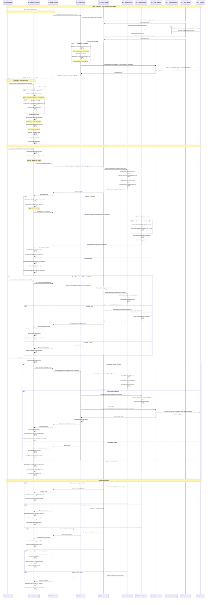

# 🧩 SEQUENCE DIAGRAM - Product Configuration Flow

## 🎯 Visão Geral
Diagrama de sequência detalhado mostrando o fluxo interativo de configuração de produtos compostos e grupos durante a criação de pedidos. Este fluxo crítico envolve validação em tempo real, cálculo dinâmico de preços, e interface rica para seleção de componentes, proporcionando uma experiência completa de customização de produtos.

## 📊 Complexidade do Fluxo
- **🚨 Alta Complexidade**: Interactive UI, real-time validation, dynamic pricing, complex business rules
- **👥 Participantes**: 8+ system components
- **🔄 Interações**: 30+ interactions per configuration session
- **🌐 Cross-Domain**: Sales ↔ Product integration
- **🎨 Frontend Heavy**: Rich JavaScript interactions, real-time updates

## 🎯 Trigger Event
**AddOrderItem** (ProductType = Composite or Group) → Configuration interface activation

## 📝 Sequence Diagram


```mermaid
sequenceDiagram
    participant UI as 👤 User Interface
    participant JS as âš¡ JavaScript (Product.js)
    participant SC as 🎮 Sales Controller  
    participant SS as ⚙️ Sales Service
    participant PS as 📦 Product Service
    participant VS as ✅ Validation Service
    participant CS as 💰 Calculation Service
    participant SR as 🗄️ Sales Repository
    participant PR as 🗄️ Product Repository
    participant Cache as 💾 Cache Service
    participant DB as 🗄️ Database
    
    Note over UI, DB: Product Configuration Flow (Composite/Group Products)
    
    %% ==========================================
    %% INITIAL PRODUCT SELECTION
    %% ==========================================
    
    UI->>SC: POST /Order/{orderId}/AddItem
    Note over UI, SC: User selects a Composite or Group product
    
    SC->>SS: AddOrderItemAsync(orderId, productId, quantity)
    activate SS
    
    SS->>PS: GetProductWithConfigurationAsync(productId)
    activate PS
    
    PS->>Cache: GetCachedProductConfiguration(productId)
    activate Cache
    Cache-->>PS: Cache miss or expired
    deactivate Cache
    
    PS->>PR: GetProductWithHierarchiesAsync(productId)
    activate PR
    PR->>DB: SELECT Product + Hierarchies + Components (Complex JOIN)
    DB-->>PR: Complete product configuration data
    PR-->>PS: Product with configuration rules
    deactivate PR
    
    PS->>Cache: CacheProductConfiguration(productId, configData)
    activate Cache
    Cache-->>PS: Configuration cached
    deactivate Cache
    
    PS-->>SS: Product configuration data
    deactivate PS
    
    alt ProductType = Composite
        SS->>SS: PrepareCompositeConfigurationData(product)
        Note over SS: Extract hierarchies, components, rules
        
    else ProductType = Group
        SS->>SS: PrepareGroupConfigurationData(product)
        Note over SS: Extract group items, exchange rules
    end
    
    SS->>SR: CreateOrderItemAsync(orderItem) // Status = 'Pending Configuration'
    activate SR
    SR->>DB: INSERT INTO OrderItem (status = 'PendingConfiguration')
    DB-->>SR: OrderItemId
    SR-->>SS: OrderItem created
    deactivate SR
    
    SS-->>SC: Configuration required (orderItemId, configData)
    deactivate SS
    
    SC-->>UI: 200 OK + Configuration modal data
    
    %% ==========================================
    %% CONFIGURATION INTERFACE INITIALIZATION
    %% ==========================================
    
    Note over UI, JS: Open product configuration modal
    UI->>JS: initializeProductConfiguration(orderItemId, configData)
    activate JS
    
    JS->>JS: renderConfigurationInterface(productType, configData)
    
    alt ProductType = Composite
        JS->>JS: renderHierarchySelection(hierarchies)
        Note over JS: Render component hierarchies as expandable tree
        
        loop For each Hierarchy
            JS->>JS: renderComponentOptions(hierarchy, components)
            JS->>JS: bindSelectionEvents(hierarchy)
        end
        
    else ProductType = Group
        JS->>JS: renderGroupItemSelection(groupItems)
        Note over JS: Render group items with quantities
        
        JS->>JS: renderExchangeRules(exchangeRules)
        Note over JS: Show possible substitutions
    end
    
    JS->>JS: bindPriceCalculationEvents()
    JS->>JS: bindValidationEvents()
    JS->>JS: initializeConfigurationState()
    
    deactivate JS
    
    %% ==========================================
    %% REAL-TIME COMPONENT SELECTION
    %% ==========================================
    
    Note over UI, DB: User interacts with configuration options
    
    UI->>JS: componentSelected(hierarchyId, componentId, quantity)
    activate JS
    
    JS->>JS: updateConfigurationState(selection)
    JS->>JS: validateSelectionRules(currentConfiguration)
    
    Note over JS: Real-time validation and pricing
    JS->>SC: POST /Product/ValidateConfiguration
    SC->>PS: ValidateConfigurationAsync(productId, currentConfiguration)
    activate PS
    
    PS->>VS: ValidateComponentSelectionAsync(configuration)
    activate VS
    
    VS->>VS: ValidateMinMaxQuantities(selection)
    VS->>VS: ValidateComponentCompatibility(selection)
    VS->>VS: ValidateBusinessRules(selection)
    VS->>VS: ValidateInventoryAvailability(selection)
    
    VS-->>PS: ValidationResult (isValid, warnings, errors)
    deactivate VS
    
    PS-->>SC: Validation result
    deactivate PS
    SC-->>JS: Validation response
    
    alt Validation Successful
        JS->>JS: markSelectionAsValid(hierarchyId, componentId)
        JS->>JS: enableRelatedOptions(affectedHierarchies)
        
        Note over JS: Calculate price impact
        JS->>SC: POST /Product/CalculatePrice
        SC->>CS: CalculateConfigurationPriceAsync(productId, configuration)
        activate CS
        
        CS->>CS: GetBaseProductPrice(productId)
        
        loop For each selected component
            CS->>CS: GetComponentAdditionalCost(componentId)
            CS->>CS: ApplyQuantityMultipliers(componentCost, quantity)
        end
        
        CS->>CS: ApplyDiscountRules(totalPrice, customer)
        CS->>CS: CalculateTaxes(finalPrice)
        
        CS-->>SC: PriceCalculationResult (itemPrice, breakdown)
        deactivate CS
        SC-->>JS: Price calculation response
        
        JS->>JS: updatePriceDisplay(priceBreakdown)
        JS->>JS: highlightPriceChanges(oldPrice, newPrice)
        
    else Validation Failed
        JS->>JS: markSelectionAsInvalid(hierarchyId, componentId)
        JS->>JS: displayValidationErrors(errors)
        JS->>JS: disableIncompatibleOptions(affectedComponents)
    end
    
    deactivate JS
    
    %% ==========================================
    %% ADVANCED CONFIGURATION (GROUP PRODUCTS)
    %% ==========================================
    
    opt ProductType = Group with Exchange Rules
        UI->>JS: exchangeItemRequested(sourceItemId, targetItemId)
        activate JS
        
        JS->>SC: POST /Product/ValidateExchange
        SC->>PS: ValidateGroupExchangeAsync(productId, exchangeData)
        activate PS
        
        PS->>PS: GetExchangeRules(sourceItem, targetItem)
        PS->>VS: ValidateExchangeCompatibility(exchangeRules)
        activate VS
        VS->>VS: CheckExchangeRatios(sourceItem, targetItem)
        VS->>VS: ValidateQuantityLimits(exchange)
        VS-->>PS: Exchange validation result
        deactivate VS
        
        alt Exchange Valid
            PS->>CS: CalculateExchangeImpact(exchangeData)
            activate CS
            CS->>CS: CalculatePriceDifference(sourceItem, targetItem)
            CS->>CS: ApplyExchangeRules(priceDifference)
            CS-->>PS: Exchange cost impact
            deactivate CS
            
            PS-->>SC: Exchange approved with cost impact
            SC-->>JS: Exchange validation success
            
            JS->>JS: updateGroupConfiguration(exchangeData)
            JS->>JS: updatePriceDisplay(newTotal)
            JS->>JS: highlightExchangedItems(sourceItem, targetItem)
            
        else Exchange Invalid
            PS-->>SC: Exchange validation failed
            SC-->>JS: Exchange error response
            JS->>JS: displayExchangeError(errorMessage)
        end
        
        deactivate PS
        deactivate JS
    end
    
    %% ==========================================
    %% CONFIGURATION COMPLETION AND VALIDATION
    %% ==========================================
    
    UI->>JS: confirmConfiguration()
    activate JS
    
    JS->>JS: validateCompleteConfiguration()
    
    alt Configuration Complete and Valid
        JS->>SC: POST /Order/{orderId}/ConfigureItem
        SC->>SS: ConfigureOrderItemAsync(orderItemId, finalConfiguration)
        activate SS
        
        SS->>VS: ValidateCompleteConfigurationAsync(configuration)
        activate VS
        VS->>VS: ValidateAllRequiredSelections()
        VS->>VS: ValidateBusinessRuleCompliance()
        VS->>VS: ValidateInventoryCommitment()
        VS-->>SS: Final validation result
        deactivate VS
        
        alt Final Validation Successful
            SS->>CS: CalculateFinalPriceAsync(orderItemId, configuration)
            activate CS
            CS->>CS: CalculateCompleteItemPrice(configuration)
            CS->>CS: ApplyCustomerDiscounts(finalPrice)
            CS-->>SS: Final item price
            deactivate CS
            
            SS->>SR: UpdateOrderItemConfigurationAsync(orderItemId, configuration, finalPrice)
            activate SR
            SR->>DB: UPDATE OrderItem SET configuration, price, status = 'Configured'
            DB-->>SR: OrderItem updated
            SR-->>SS: Configuration saved
            deactivate SR
            
            SS->>SS: RecalculateOrderTotal(orderId)
            
            SS-->>SC: Configuration completed successfully
            SC-->>JS: Configuration saved
            
            JS->>JS: closeConfigurationModal()
            JS->>JS: updateOrderItemDisplay(orderItemId, finalPrice)
            JS->>JS: showSuccessMessage("Product configured successfully")
            
        else Final Validation Failed
            SS-->>SC: Validation failed
            SC-->>JS: Configuration validation error
            JS->>JS: displayValidationErrors(errors)
            JS->>JS: highlightProblematicFields(errorFields)
        end
        
        deactivate SS
        
    else Configuration Incomplete
        JS->>JS: highlightMissingSelections(missingHierarchies)
        JS->>JS: showValidationSummary(missingItems)
        JS->>JS: focusOnFirstMissingSelection()
    end
    
    deactivate JS
    
    %% ==========================================
    %% ERROR HANDLING SCENARIOS
    %% ==========================================
    
    Note over UI, DB: Error Handling Scenarios
    
    alt Component Inventory Insufficient
        VS-->>PS: ValidationResult (Insufficient inventory)
        PS-->>SC: Inventory constraint violation
        SC-->>JS: Inventory error
        JS->>JS: markComponentAsUnavailable(componentId)
        JS->>JS: suggestAlternativeComponents(hierarchyId)
    end
    
    alt Price Calculation Timeout
        CS-->>SC: PricingError (Calculation timeout)
        SC-->>JS: Pricing service error
        JS->>JS: showPricingError("Price calculation delayed")
        JS->>JS: disableConfigurationCompletion()
        JS->>JS: retryPriceCalculation(configuration)
    end
    
    alt Product Configuration Changed
        PS-->>SS: ConfigurationError (Product rules updated)
        SS-->>SC: Configuration outdated
        SC-->>JS: Configuration refresh required
        JS->>JS: showConfigurationUpdateWarning()
        JS->>JS: refreshConfigurationData(productId)
    end
    
    alt Network Connectivity Issues
        JS->>SC: AJAX request timeout
        JS->>JS: showConnectivityError()
        JS->>JS: enableOfflineMode() // Limited functionality
        JS->>JS: cacheCurrentConfiguration()
    end
    
    alt Business Rule Violation
        VS-->>PS: ValidationResult (Business rule violation)
        PS-->>SC: Business constraint error
        SC-->>JS: Business rule violation
        JS->>JS: explainBusinessRule(ruleType, violation)
        JS->>JS: suggestComplianceActions(recommendations)
    end
```

## 🎯 Detailed Component Responsibilities

### **👤 User Interface**
```
Configuration Modal Features:
├── 🎨 Rich interactive product configuration interface
├── 🖱️ Drag-and-drop component selection (advanced mode)
├── 📊 Real-time price calculator with breakdown
├── 🔍 Component search and filtering capabilities
└── 📱 Responsive design for mobile/tablet usage

Visual Feedback:
├── 🎯 Color-coded validation states (green/yellow/red)
├── 💰 Dynamic price updates with highlighting
├── ⚠️ Warning indicators for constraints
├── ✅ Completion progress indicators
└── 🔄 Loading states for async operations

User Experience:
├── ⌨️ Keyboard navigation and shortcuts
├── 🔙 Undo/redo configuration changes
├── 💾 Auto-save draft configurations
├── 📋 Configuration templates for common setups
└── 🎯 Smart defaults and recommendations
```

### **âš¡ JavaScript (Product.js)**
```
Configuration State Management:
├── 📊 Real-time configuration state tracking
├── 🔄 Event-driven updates and validations
├── 💾 Local storage for draft configurations
├── 🎯 Optimistic UI updates with rollback
└── 📡 WebSocket integration for real-time collaboration

Dynamic Interface Rendering:
├── 🏗️ Component tree rendering and navigation
├── 🎨 Conditional display based on selections
├── 📊 Price breakdown visualization
├── ⚠️ Validation message display and formatting
└── 🔄 Progressive loading for large configurations

Client-Side Validation:
├── ✅ Input format and range validation
├── 🧮 Real-time calculation verification
├── 🎯 Business rule enforcement (client-side)
├── 📊 Dependency checking between components
└── 💾 Offline validation with cached rules
```

### **📦 Product Service**
```
Configuration Logic:
├── 🏗️ Product hierarchy management and traversal
├── 🧩 Component compatibility matrix processing
├── 📊 Business rule engine integration
├── 💰 Pricing rule application and calculation
└── 📈 Configuration analytics and optimization

Validation Engine:
├── ✅ Multi-level validation (syntax, business, inventory)
├── 🎯 Cross-component dependency validation
├── 📊 Inventory commitment and availability checking
├── 💰 Price limit and customer-specific validation
└── 📋 Configuration completeness verification

Caching Strategy:
├── 💾 Product configuration data caching
├── 🔄 Invalidation on product updates
├── 📊 Performance metrics and cache hit rates
├── 🎯 Preemptive cache warming for popular products
└── 💡 Intelligent cache partitioning by customer segment
```

### **💰 Calculation Service**
```
Pricing Engine:
├── 🧮 Base price calculation with component costs
├── 📊 Volume discount application and tiering
├── 💸 Customer-specific pricing and contracts
├── 🎯 Dynamic pricing based on demand/inventory
└── 📈 Price optimization and testing framework

Cost Calculation:
├── 💰 Component individual cost calculation
├── 🧮 Quantity-based pricing tiers
├── 📊 Bundle and package pricing logic
├── 💸 Tax calculation and jurisdiction handling
└── 🎯 Currency conversion for international pricing

Performance Optimization:
├── ⚡ Memoization of expensive calculations
├── 📊 Parallel processing for complex configurations
├── 💾 Result caching with smart invalidation
├── 🎯 Incremental calculation updates
└── 📈 Performance monitoring and optimization
```

## 🧩 Configuration Types and Rules

### **🔶 Composite Product Configuration**
```
Hierarchy-Based Selection:
├── 🌳 Component Tree Structure (parent → child relationships)
├── 📊 Selection Rules (min/max quantities per hierarchy)
├── 🎯 Dependency Rules (component A requires component B)
├── 💰 Pricing Impact (base price + component additional costs)
└── 📋 Validation Rules (business constraints and compatibility)

Example: Birthday Cake Configuration
├── 🎂 Base (Hierarchy): Massa do Bolo
│   ├── Chocolate (Component): +R$ 5.00
│   ├── Vanilla (Component): +R$ 3.00
│   └── Red Velvet (Component): +R$ 8.00
├── 🍓 Filling (Hierarchy): Recheio - Min: 1, Max: 3
│   ├── Strawberry (Component): +R$ 4.00
│   ├── Chocolate (Component): +R$ 3.00
│   └── Cream (Component): +R$ 2.00
├── 🎨 Topping (Hierarchy): Cobertura - Min: 1, Max: 1
│   ├── Chocolate Ganache (Component): +R$ 6.00
│   ├── Buttercream (Component): +R$ 4.00
│   └── Fondant (Component): +R$ 10.00
└── 🎁 Decoration (Hierarchy): Decoração - Optional
    ├── Custom Message (Component): +R$ 5.00
    └── Edible Flowers (Component): +R$ 8.00

Business Rules:
├── 🎯 Red Velvet base requires Cream Cheese filling
├── 💰 Fondant topping incompatible with Cream filling
├── 📊 Maximum 3 fillings total
└── 🎨 Custom message requires minimum 24h notice
```

### **🔸 Group Product Configuration**
```
Group Item Selection:
├── 📦 Predefined Product Bundle (multiple individual products)
├── 📊 Quantity Flexibility (min/max per group item)
├── 🔄 Exchange Rules (substitute products within limits)
├── 💰 Group Pricing (bundle discount vs individual prices)
└── 📋 Group Constraints (total quantity limits, compatibility)

Example: Party Kit for 50 People
├── 🎂 Main Item: Birthday Cake for 50 people
│   ├── Base Quantity: 1 (Fixed)
│   ├── Substitution: Wedding Cake (+R$ 50.00)
│   └── Configuration: Requires individual cake configuration
├── 🍤 Savory Items: Minimum 100 units total
│   ├── Coxinhas: 50 units (Changeable: 30-80)
│   ├── Pastéis: 30 units (Changeable: 20-50)
│   └── Exchange Option: Sfihas (+R$ 1.00 per unit)
├── 🍬 Sweet Items: Minimum 50 units total
│   ├── Brigadeiros: 30 units (Changeable: 20-60)
│   ├── Beijinhos: 20 units (Changeable: 10-40)
│   └── Exchange Option: Truffles (+R$ 2.00 per unit)
└── 🥤 Beverages: Optional
    ├── Soft Drinks: 0 units (Changeable: 0-100)
    └── Juices: 0 units (Changeable: 0-50)

Exchange Rules:
├── 🔄 1 Coxinha ↔ 1 Pastel (no cost difference)
├── 💰 1 Coxinha → 1 Sfihá (+R$ 1.00)
├── 🍬 2 Brigadeiros ↔ 1 Truffle (+R$ 2.00)
└── 📊 Maximum 30% of items can be exchanged
```

## 🔄 Real-Time Validation Framework

### **✅ Validation Layers**
```
Client-Side Validation (Immediate):
├── 🎯 Input format validation (numbers, ranges)
├── 📊 Basic business rule checking (min/max quantities)
├── 💰 Price threshold warnings
├── 🔍 Required field completion checking
└── 🎨 UI constraint enforcement

Server-Side Validation (Real-time):
├── 📦 Inventory availability checking
├── 🧩 Component compatibility validation
├── 💰 Customer-specific pricing validation
├── 📊 Business rule engine execution
└── 🎯 Cross-component dependency checking

Final Validation (Before Save):
├── ✅ Complete configuration validation
├── 📊 Final inventory commitment
├── 💰 Final price calculation and approval
├── 🎯 Customer credit limit verification
└── 📋 Regulatory compliance checking
```

### **âš¡ Real-Time Feedback**
```
Visual Indicators:
├── 🟢 Valid Selection: Green checkmark, enabled state
├── 🟡 Warning: Yellow triangle, constraint notification
├── 🔴 Invalid: Red X, disabled state, error message
├── ⏳ Processing: Spinner, "Validating..." message
└── 💾 Saved: Blue checkmark, "Configuration saved"

Interactive Elements:
├── 🎨 Hover Effects: Show additional cost/info on hover
├── 📊 Progress Bars: Configuration completion percentage
├── 💰 Price Animations: Smooth transitions for price changes
├── 🔍 Tooltips: Detailed component information
└── 📋 Context Menus: Quick actions (remove, exchange, info)

Performance Optimizations:
├── ⚡ Debounced Validation: 300ms delay for user input
├── 💾 Cached Results: Store validation results temporarily
├── 🎯 Incremental Updates: Only validate changed components
├── 📊 Batch Processing: Group multiple validations
└── 🔄 Progressive Loading: Load configuration data as needed
```

## 💰 Dynamic Pricing Calculations

### **🧮 Pricing Formula**
```
Base Product Price Calculation:
├── 💰 Base Price = Product.UnitPrice × Quantity
├── 📊 Component Costs = Σ(Component.AdditionalCost × ComponentQuantity)
├── 🎯 Configuration Total = Base Price + Component Costs
├── 💸 Customer Discount = Configuration Total × Customer.DiscountRate
├── 📊 Final Price = Configuration Total - Customer Discount + Taxes
└── ✅ Validation = Final Price >= Minimum Margin

Component Cost Calculation:
├── 🧩 Individual Component Cost = Component.AdditionalCost
├── 📊 Quantity Multiplier = ComponentQuantity × Component.QuantityMultiplier
├── 💰 Total Component Cost = Individual Cost × Quantity Multiplier
├── 🎯 Hierarchy Discounts = Apply volume discounts per hierarchy
└── 📋 Business Rules = Apply special pricing rules

Group Product Pricing:
├── 📦 Individual Item Prices = Σ(GroupItem.UnitPrice × Quantity)
├── 💸 Group Discount = Individual Total × Group.DiscountPercentage
├── 🔄 Exchange Costs = Σ(ExchangeRule.CostDifference)
├── 💰 Final Group Price = Individual Total - Group Discount + Exchange Costs
└── ✅ Bundle Savings = Individual Total - Final Group Price
```

### **📊 Price Breakdown Display**
```
Detailed Price Information:
├── 💰 Base Product: R$ 45.00
├── 📊 Components:
│   ├── Extra Chocolate Filling: +R$ 3.00
│   ├── Premium Topping: +R$ 6.00
│   └── Custom Decoration: +R$ 5.00
├── 🎯 Subtotal: R$ 59.00
├── 💸 Customer Discount (10%): -R$ 5.90
├── 📊 Taxes (12%): +R$ 6.37
└── 💰 Final Total: R$ 59.47

Interactive Elements:
├── 🖱️ Click component to see details
├── 🔍 Hover for cost breakdown explanation
├── 📊 Toggle between detailed/summary view
├── 💱 Currency format based on user locale
└── 📈 Compare with similar configurations
```

## 🔧 Error Handling and User Experience

### **❌ Error Categories**
```
Validation Errors:
├── 🎯 Missing Required Selections
│   └── "Please select a base for your cake"
├── 📊 Quantity Constraint Violations
│   └── "Maximum 3 fillings allowed"
├── 🧩 Component Compatibility Issues
│   └── "Fondant topping not compatible with cream filling"
├── 💰 Price or Credit Limit Exceeded
│   └── "Configuration exceeds customer credit limit"
└── 📦 Inventory Availability Issues
    └── "Premium chocolate currently out of stock"

Technical Errors:
├── 🔌 Network Connectivity Issues
│   └── "Unable to connect. Working in offline mode."
├── ⏱️ Timeout Errors
│   └── "Validation taking longer than expected..."
├── 💾 Data Consistency Issues
│   └── "Product configuration has been updated. Please refresh."
└── 🚨 System Errors
    └── "Unexpected error occurred. Please try again."

Business Logic Errors:
├── 📋 Configuration Rule Violations
│   └── "This combination violates business rules"
├── 🎯 Customer-Specific Restrictions
│   └── "This option not available for your customer type"
├── 📅 Time-Based Constraints
│   └── "Custom decorations require 24h advance notice"
└── 🏢 Supplier Availability Issues
    └── "Component temporarily unavailable from supplier"
```

### **🔄 Recovery Mechanisms**
```
Automatic Recovery:
├── 🔁 Auto-retry Failed Validations (3 attempts with backoff)
├── 💾 Auto-save Draft Configuration (every 30 seconds)
├── 🔄 Smart Refresh on Data Updates (reactive updates)
├── 🎯 Alternative Suggestions (when constraints violated)
└── 📊 Graceful Degradation (offline mode capabilities)

User-Assisted Recovery:
├── 🎯 Guided Error Resolution (step-by-step instructions)
├── 💡 Smart Suggestions (alternative configurations)
├── 📞 Contact Support Integration (for complex issues)
├── 🔙 Configuration History (revert to previous version)
└── 📋 Export/Import Configuration (backup/restore)

Prevention Strategies:
├── ✅ Proactive Validation (prevent invalid states)
├── 📊 Real-time Inventory Checking (prevent stock issues)
├── 🎯 Smart Defaults (reduce configuration errors)
├── 📋 Configuration Templates (proven combinations)
└── 🎓 User Education (tooltips, help documentation)
```

## 📈 Performance and Analytics

### **âš¡ Performance Optimization**
```
Frontend Performance:
├── ⚡ Virtual Scrolling for Large Component Lists
├── 💾 Component Data Lazy Loading
├── 🎯 Optimized DOM Updates (React/Vue patterns)
├── 📊 Debounced User Input Processing
└── 🔄 Smart Caching of Configuration State

Backend Performance:
├── 💾 Aggressive Caching of Product Configuration Data
├── 📊 Database Query Optimization (indexed joins)
├── 🎯 Parallel Processing of Validation Rules
├── ⚡ Microservice Architecture for Scalability
└── 📈 Load Balancing for High-Volume Operations

Network Optimization:
├── 📦 Compressed Response Payloads (gzip)
├── 🔄 HTTP/2 Server Push for Related Resources
├── 💾 CDN Distribution for Static Assets
├── 📊 API Response Caching (Redis)
└── 🎯 Optimized JSON Serialization
```

### **📊 Analytics and Insights**
```
Configuration Analytics:
├── 📈 Most Popular Component Combinations
├── 🎯 Abandonment Points in Configuration Flow
├── 💰 Average Configuration Value and Trends
├── ⏱️ Time-to-Configure Metrics by Product Type
└── 🔄 Configuration Change Patterns

Business Intelligence:
├── 💰 Revenue Impact of Configuration Features
├── 📊 Component Profitability Analysis
├── 🎯 Customer Preference Patterns
├── 📈 Seasonal Configuration Trends
└── 🧩 Cross-sell Opportunity Identification

User Experience Metrics:
├── 😊 Configuration Completion Rate
├── ⏱️ Average Configuration Time
├── 🔄 Error Rate by Configuration Step
├── 📱 Mobile vs Desktop Usage Patterns
└── 🎯 User Satisfaction Scores (post-configuration survey)
```

---

**Arquivo**: `05-product-configuration-flow.md`  
**Fluxo**: Product Configuration (Interactive Composite/Group Product Setup)  
**Domínios**: Sales ↔ Product  
**Complexidade**: 🚨 Alta (8+ participantes, 30+ interações, rica interface)  
**Atualização**: 16/06/2025
