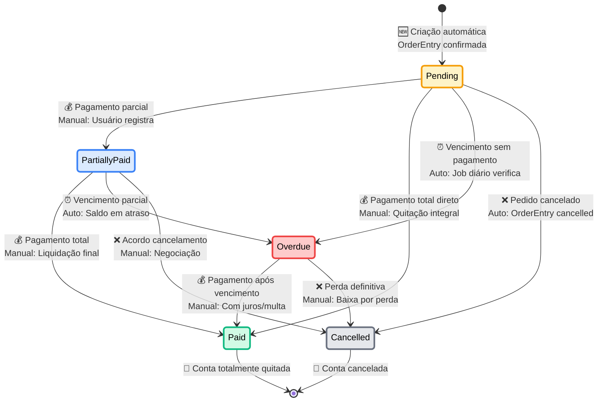
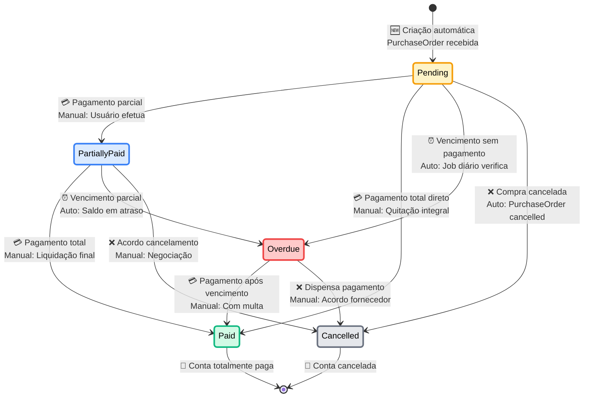
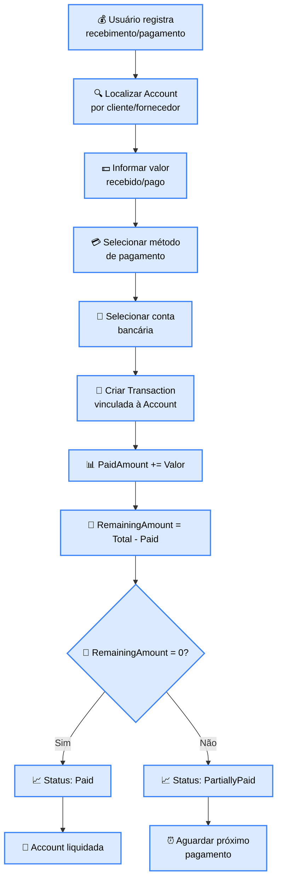
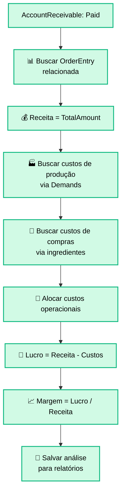
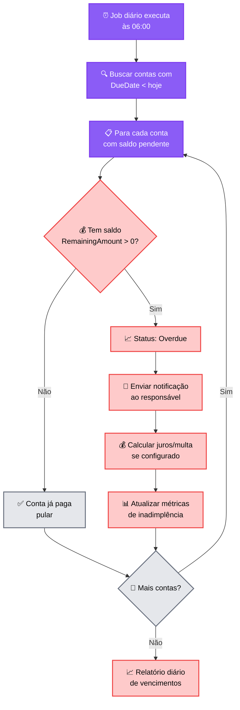
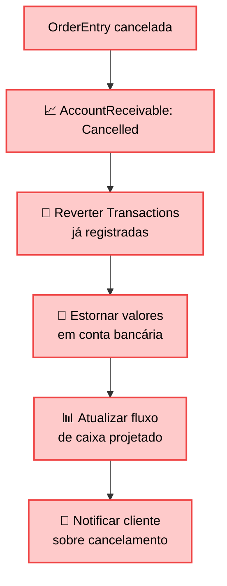
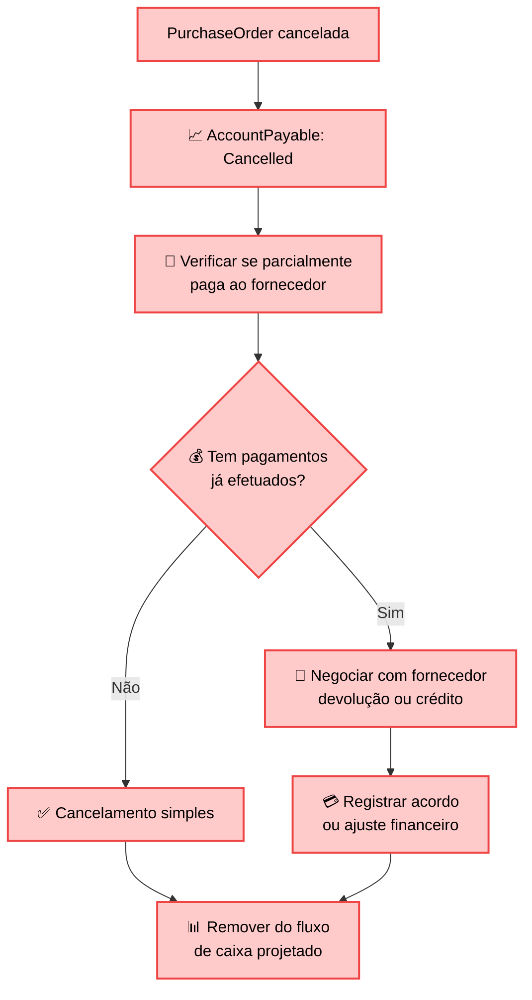
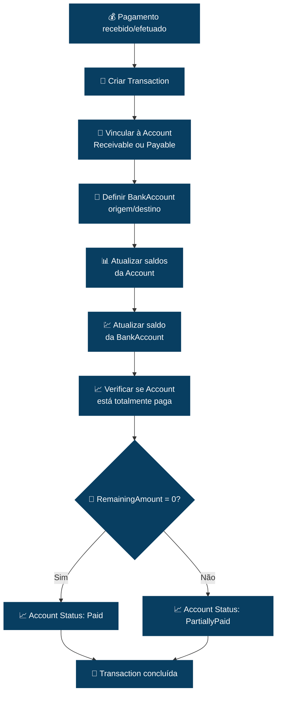

# 💳 DIAGRAMA DE ESTADOS - CICLO DE VIDA DAS CONTAS FINANCEIRAS

## 🎯 Visão Geral
Diagrama de estados completo mostrando o ciclo de vida das contas financeiras (AccountReceivable e AccountPayable), desde sua criação automática até a liquidação total, incluindo controle de vencimentos, inadimplência e conciliação bancária.

## 💰 Diagrama de Estados - Contas a Receber (AccountReceivable)



## 💸 Diagrama de Estados - Contas a Pagar (AccountPayable)



## 📋 Detalhamento dos Estados

### **🟡 PENDING (Pendente)**

#### **💰 AccountReceivable:**
```
📌 Estado Inicial para Contas a Receber
├── Origem: OrderEntry.OrderStatus = "Confirmed"
├── Descrição: Valor devido pelo cliente
├── Permitido: Aguardar pagamento ou registrar recebimento
├── Bloqueado: Não pode ser alterado diretamente
└── Próximo Estado: PartiallyPaid, Paid, Overdue ou Cancelled

Criação Automática:
├── 🔗 OrderEntryId: Pedido origem
├── 👤 CustomerId: Cliente devedor  
├── 💵 TotalAmount: OrderEntry.TotalValue
├── 📅 DueDate: DeliveryDate + PaymentTerms
└── 📄 InstallmentNumber: 1..N (se parcelado)
```

#### **💸 AccountPayable:**
```
📌 Estado Inicial para Contas a Pagar
├── Origem: PurchaseOrder.PurchaseStatus = "FullyReceived"
├── Descrição: Valor devido ao fornecedor
├── Permitido: Agendar ou efetuar pagamento
├── Bloqueado: Não pode ser alterado diretamente
└── Próximo Estado: PartiallyPaid, Paid, Overdue ou Cancelled

Criação Automática:
├── 🔗 PurchaseOrderId: Compra origem
├── 🏢 SupplierId: Fornecedor credor
├── 💵 TotalAmount: PurchaseOrder.TotalValue  
├── 📅 DueDate: ActualDeliveryDate + PaymentTerms
└── 📄 PaymentMethod: Baseado no fornecedor
```

**Cálculo de DueDate:**
```mermaid
flowchart TD
    A[Account criada] --> B[📊 Analisar PaymentTerms]
    B --> C{💳 Tipo de<br/>pagamento?}
    
    C -->|À vista| D[📅 DueDate = ReferenceDate]
    C -->|15 dias| E[📅 DueDate = ReferenceDate + 15]
    C -->|30 dias| F[📅 DueDate = ReferenceDate + 30]
    C -->|Parcelado| G[📅 DueDate = ReferenceDate + (30 * N)]
    
    D --> H[✅ DueDate calculada]
    E --> H
    F --> H  
    G --> H
    
    classDef calcStyle fill:#fed7aa,stroke:#f97316,stroke-width:2px,color:black
    class A,B,C,D,E,F,G,H calcStyle
```

### **🔵 PARTIALLY_PAID (Parcialmente Paga)**

#### **Processo de Pagamento Parcial:**


**Controle de Parcelas:**
```
Para AccountReceivable parcelada:

Pedido R$ 3.000 em 3x:
├── Parcela 1: R$ 1.000 (venc: 30 dias) → PartiallyPaid
├── Parcela 2: R$ 1.000 (venc: 60 dias) → PartiallyPaid  
└── Parcela 3: R$ 1.000 (venc: 90 dias) → Paid (final)

Cada parcela é uma AccountReceivable separada
Status individual por parcela
```

### **🟢 PAID (Paga)**
```
📌 Estado Final de Sucesso
├── Trigger: RemainingAmount = 0
├── Descrição: Conta totalmente liquidada
├── Permitido: Consulta e análise histórica
├── Bloqueado: Qualquer alteração
└── Próximo Estado: [Finalizado]

Atualizações Automáticas:
├── 📊 Atualizar métricas de cobrança/pagamento
├── 💹 Calcular lucratividade (para AR)
├── 🤝 Avaliar relacionamento cliente/fornecedor
└── 📈 Atualizar fluxo de caixa realizado
```

**Análise de Lucratividade (AccountReceivable):**


### **🔴 OVERDUE (Vencida)**
```
📌 Estado de Inadimplência
├── Trigger: DueDate < hoje E RemainingAmount > 0
├── Descrição: Conta vencida não paga
├── Permitido: Ações de cobrança ou negociação
├── Bloqueado: Novos créditos (AR) ou atraso acumulado (AP)
└── Próximo Estado: Paid ou Cancelled

Ações Automáticas no Vencimento:
├── 📧 Notificar responsáveis
├── 💰 Aplicar juros/multa (se configurado)
├── 🚨 Gerar alertas críticos
└── 📊 Atualizar score de inadimplência
```

**Job de Verificação de Vencimentos:**


**Cálculo de Juros e Multa:**
```
Configuração por tipo de conta:

AccountReceivable (cliente inadimplente):
├── 💰 Multa: 2% sobre valor em atraso
├── 📈 Juros: 1% ao mês pro-rata
├── 📅 Base: dias em atraso
└── 🧮 Valor atualizado = Original + Multa + Juros

AccountPayable (fornecedor):  
├── 💰 Multa: Conforme contrato (se aplicável)
├── 📈 Juros: Conforme contrato
├── 📊 Impacto: Rating da empresa com fornecedor
└── 🤝 Relacionamento: Pode impactar futuros pedidos
```

### **❌ CANCELLED (Cancelada)**
```
📌 Estado Final de Cancelamento
├── Trigger: Cancelamento da origem ou acordo
├── Descrição: Conta cancelada por motivo específico
├── Permitido: Consulta e auditoria
├── Bloqueado: Reativação
└── Próximo Estado: [Finalizado]

Motivos de Cancelamento:
├── 🚫 OrderEntry/PurchaseOrder cancelada (automático)
├── 🤝 Acordo de cancelamento entre partes
├── 💔 Perda definitiva (baixa por perda)
└── 📄 Erro na criação (estorno)
```

**Impactos do Cancelamento:**

#### **AccountReceivable Cancelada:**


#### **AccountPayable Cancelada:**


## 🔄 Sincronização entre Domínios

### **🛍️ Vendas → AccountReceivable:**
```
OrderEntry Status Changes → AccountReceivable Actions:

OrderEntry: Confirmed
├── 🆕 Criar AccountReceivable(s)
├── 📅 Calcular DueDate(s)
├── 💵 Definir TotalAmount por parcela
└── 📈 Status inicial: Pending

OrderEntry: Delivered  
├── 🔓 Liberar para cobrança
├── 📧 Notificar financeiro
└── ⏰ Iniciar tracking de vencimento

OrderEntry: Cancelled
├── 📈 AccountReceivable: Cancelled
├── 🔄 Reverter Transactions
└── 📊 Ajustar projeções
```

### **🛒 Compras → AccountPayable:**
```
PurchaseOrder Status Changes → AccountPayable Actions:

PurchaseOrder: FullyReceived
├── 🆕 Criar AccountPayable
├── 📅 DueDate = ActualDeliveryDate + PaymentTerms
├── 💵 TotalAmount = PurchaseOrder.TotalValue
└── 📈 Status inicial: Pending

PurchaseOrder: Cancelled
├── 📈 AccountPayable: Cancelled
├── 🔄 Tratar pagamentos já efetuados
└── 📊 Ajustar projeções
```

## 💳 Integração com Transações Bancárias

### **Registro de Transação:**


### **Conciliação Bancária:**
```
Transaction.IsReconciled = false → Pendente conciliação

Processo de conciliação:
├── 📄 Import extrato bancário
├── 🔍 Match automático por valor/data
├── ✅ Marcar Transaction.IsReconciled = true
├── 📅 Transaction.ReconciledDate = hoje
└── 📊 Gerar relatório de conciliação
```

## 🚨 Validações e Regras de Negócio

### **Validações Críticas:**
```
AccountReceivable:
├── ✅ DueDate ≥ OrderEntry.DeliveryDate
├── ✅ TotalAmount = OrderEntry.TotalValue (soma parcelas)
├── ✅ PaidAmount ≤ TotalAmount
├── ✅ CustomerId = OrderEntry.CustomerId

AccountPayable:
├── ✅ DueDate ≥ PurchaseOrder.ActualDeliveryDate  
├── ✅ TotalAmount = PurchaseOrder.TotalValue
├── ✅ PaidAmount ≤ TotalAmount
├── ✅ SupplierId = PurchaseOrder.SupplierId

Transaction:
├── ✅ Amount > 0
├── ✅ Deve referenciar AccountReceivable OU AccountPayable
├── ✅ TransactionDate ≤ hoje
├── ✅ BankAccount deve existir e estar ativa
```

### **Regras de Inadimplência:**
```
AccountReceivable Overdue:
├── 🚫 Cliente não pode fazer novos pedidos
├── ⚠️ Alertas escalados por tempo de atraso
├── 📞 Ações de cobrança automatizadas
└── 💰 Juros/multa aplicados conforme configuração

AccountPayable Overdue:
├── 🚨 Alerta crítico para financeiro
├── 📉 Impacto no rating com fornecedor
├── 🤝 Pode afetar relacionamento comercial
└── 💰 Multas contratuais se aplicáveis
```

## 🎯 Eventos de Domínio e Alertas

### **Eventos Gerados:**
```
AccountStatusChanged:
├── AccountId: ID da conta
├── AccountType: Receivable ou Payable
├── From: Status anterior
├── To: Novo status
├── Amount: Valor da transação (se aplicável)
├── RemainingAmount: Saldo restante
└── Timestamp: Data/hora da mudança

Eventos Específicos:
├── AccountCreated: Nova conta criada
├── PaymentReceived: Pagamento de cliente
├── PaymentMade: Pagamento a fornecedor  
├── AccountOverdue: Conta vencida
├── AccountPaid: Conta totalmente quitada
├── AccountCancelled: Conta cancelada
└── CashFlowUpdated: Fluxo de caixa atualizado
```

### **Sistema de Alertas:**
```
🚨 Alertas Críticos:
├── Conta vencida > 30 dias
├── Cliente com múltiplas contas vencidas
├── Fluxo de caixa negativo projetado
├── Fornecedor não pago no prazo

⚠️ Alertas de Atenção:
├── Conta vencendo em 3 dias
├── Pagamento recebido para conciliar
├── Cliente atingindo limite de crédito
├── Fornecedor com desconto por antecipação

💡 Alertas Informativos:
├── Recebimento antecipado de cliente
├── Oportunidade de desconto fornecedor
├── Meta de recebimento atingida
├── Fluxo de caixa positivo acima do esperado
```

## 📊 Métricas e KPIs

### **Indicadores de Recebimento:**
```
DSO (Days Sales Outstanding):
├── Fórmula: (AR médio / Vendas diárias)
├── Meta: ≤ 30 dias
├── Cálculo: Média móvel 12 meses

Taxa de Inadimplência:
├── Fórmula: (Valor vencido / Total AR) * 100
├── Meta: ≤ 5%
├── Segmentação: Por cliente, produto, região

Eficiência de Cobrança:
├── Fórmula: (Recebido no prazo / Total devido) * 100
├── Meta: ≥ 95%
├── Tracking: Mensal e acumulado
```

### **Indicadores de Pagamento:**
```
DPO (Days Payable Outstanding):
├── Fórmula: (AP médio / Compras diárias)
├── Estratégia: Maximizar sem prejudicar relacionamento
├── Balance: Fluxo de caixa vs desconto por antecipação

Pontualidade de Pagamentos:
├── Fórmula: (Pagos no prazo / Total devido) * 100
├── Meta: ≥ 98%
├── Impacto: Rating creditício da empresa

Economia com Descontos:
├── Fórmula: Σ descontos obtidos por antecipação
├── Oportunidade: vs custo do dinheiro
├── ROI: Desconto vs juros de caixa
```

---

**Arquivo**: `account-lifecycle.md`  
**Domínio**: Financeiro (#083e61)  
**Tipo**: State Diagram  
**Foco**: Ciclo Completo AR/AP + Inadimplência + Conciliação Bancária
