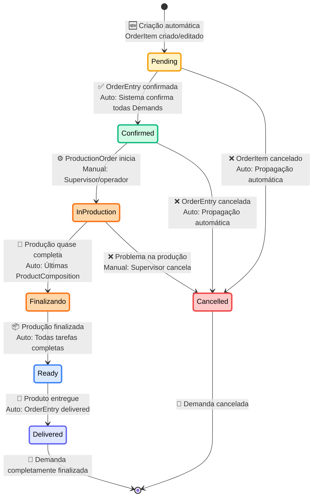
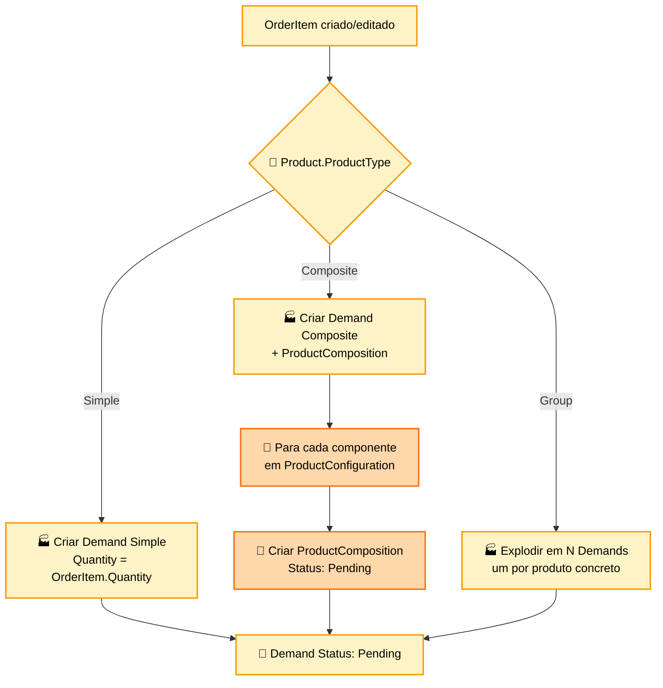
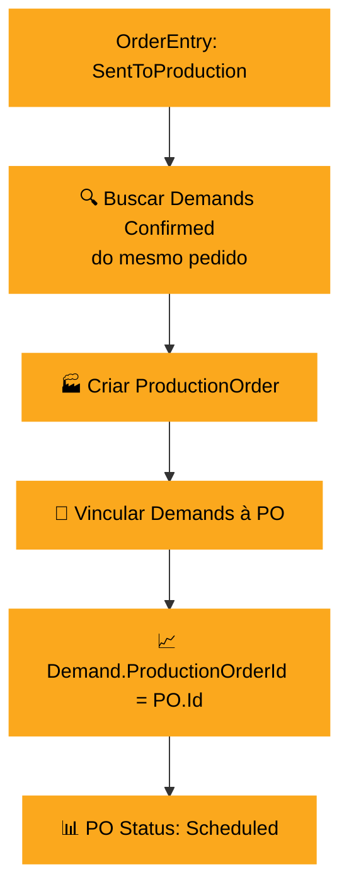
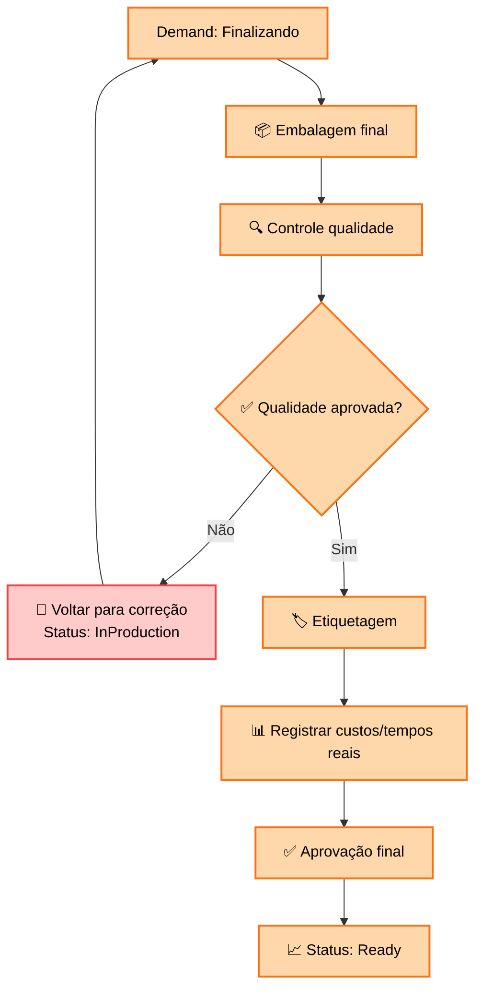
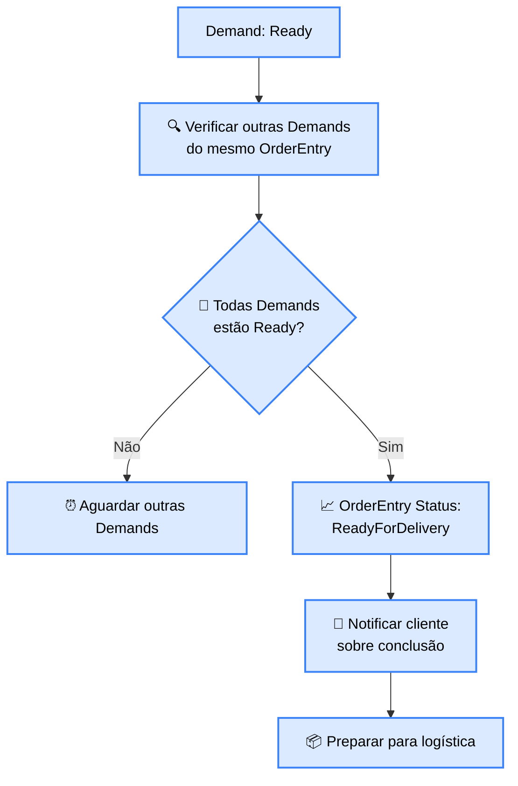

# 🏭 DIAGRAMA DE ESTADOS - CICLO DE VIDA DA DEMANDA

## 🎯 Visão Geral
Diagrama de estados completo mostrando o ciclo de vida de uma Demand (Demanda de Produção), desde sua criação automática a partir de OrderItem até a entrega final, incluindo sincronização com ProductComposition e ProductionOrder.

## 🔄 Diagrama Principal de Estados



## 📋 Detalhamento dos Estados

### **🟡 PENDING (Pendente)**
```
📌 Estado Inicial
├── Origem: OrderItem criado automaticamente
├── Descrição: Demanda criada mas não confirmada
├── Permitido: Aguardar confirmação do pedido
├── Bloqueado: Não inicia produção
└── Próximo Estado: Confirmed ou Cancelled

Criação Automática:
├── 🔗 OrderItemId: Vinculada ao item origem
├── 📦 ProductId: Produto a ser produzido
├── 🔢 Quantity: Quantidade solicitada
├── 📅 RequiredDate: OrderEntry.DeliveryDate
└── 🏭 ProductionOrderId: null (ainda não agrupada)
```

**Dados Iniciais da Demand:**


**Relacionamento com ProductComposition:**
```
Para ProductType.Composite:

Demand 1:N ProductComposition
├── HierarchyName: "Massa"
│   └── ComponentName: "Massa de Chocolate"
├── HierarchyName: "Recheio"  
│   ├── ComponentName: "Recheio Brigadeiro"
│   └── ComponentName: "Recheio Morango"
└── HierarchyName: "Cobertura"
    └── ComponentName: "Cobertura Chantilly"

Todas ProductComposition iniciam com Status: Pending
```

### **🟢 CONFIRMED (Confirmada)**
```
📌 Estado de Aprovação
├── Trigger: OrderEntry.OrderStatus = "Confirmed"
├── Descrição: Demanda aprovada para produção
├── Permitido: Agrupar em ProductionOrder
├── Bloqueado: Ainda não pode iniciar produção física
└── Próximo Estado: InProduction ou Cancelled

Sincronização Automática:
├── 🔄 Todas Demands do OrderEntry → Confirmed
├── 🏭 Disponíveis para agrupamento em ProductionOrder
└── 📊 Estimativas de custo e tempo calculadas
```

**Ações no Estado Confirmed:**
- ✅ Aguardar agrupamento em ProductionOrder
- ✅ Cálculo de estimativas (tempo/custo)
- ✅ Validação de ingredientes disponíveis
- ✅ Cancelar se OrderEntry for cancelada
- ⛔ Iniciar produção sem ProductionOrder

**Agrupamento em ProductionOrder:**


### **🔴 IN_PRODUCTION (Em Produção)**
```
📌 Estado de Produção Ativa
├── Trigger: ProductionOrder iniciada manualmente
├── Descrição: Produção física em andamento
├── Permitido: Executar ProductComposition sequencialmente
├── Bloqueado: Editar configurações
└── Próximo Estado: Finalizando ou Cancelled

Execução por Tipo:
├── 📦 Simple: Produção direta sem decomposição
├── 🧩 Composite: Executar ProductComposition em ordem
└── 📊 Tracking em tempo real de progresso
```

**Fluxo de Execução por Tipo:**

#### **Simple Product:**
```mermaid
flowchart TD
    A[Demand Simple: InProduction] --> B[⏰ StartTime = now()]
    B --> C[🏭 Executar produção direta]
    C --> D[🥘 Consumir ingredientes]
    D --> E[⏰ CompletionTime = now()]
    E --> F[📈 Status: Finalizando]
    
    classDef simpleStyle fill:#a7f3d0,stroke:#00a86b,stroke-width:2px,color:black
    class A,B,C,D,E,F simpleStyle
```

#### **Composite Product:**
```mermaid
flowchart TD
    A[Demand Composite: InProduction] --> B[📋 Listar ProductComposition<br/>ordenadas por HierarchyName]
    B --> C[🔧 Para cada ProductComposition]
    
    C --> D[📈 Status: Pending → InProgress]
    D --> E[⏰ StartTime = now()]
    E --> F[🏭 Executar tarefa específica]
    F --> G[🥘 Consumir ingredientes]
    G --> H[⏰ CompletionTime = now()]
    H --> I[📈 Status: InProgress → Completed]
    
    I --> J{🔄 Mais ProductComposition?}
    J -->|Sim| C
    J -->|Não| K[✅ Todas Completed]
    K --> L[📈 Demand Status: Finalizando]
    
    classDef compositeStyle fill:#6ee7b7,stroke:#00a86b,stroke-width:2px,color:black
    class A,B,C,D,E,F,G,H,I,J,K,L compositeStyle
```

**Monitoramento em Tempo Real:**
```
Dashboard mostra para cada Demand InProduction:
├── ⏰ Tempo decorrido vs estimado
├── 💰 Custo acumulado vs estimado  
├── 📊 % progresso (ProductComposition completed)
├── 🧑‍🏭 Operador(es) responsável(is)
├── 🥘 Ingredientes consumidos
└── 🚨 Alertas de atraso ou problemas
```

### **🟠 FINALIZANDO (Finalizando)**
```
📌 Estado de Finalização
├── Trigger: Produção física completa
├── Descrição: Embalagem, controle qualidade final
├── Permitido: Últimos ajustes e validações
├── Bloqueado: Alterar produção principal
└── Próximo Estado: Ready

Atividades de Finalização:
├── 📦 Embalagem final do produto
├── 🔍 Controle de qualidade final
├── 🏷️ Etiquetagem e identificação
├── 📊 Registro de custos e tempos reais
└── ✅ Aprovação final para entrega
```

**Validações de Finalização:**
- ✅ Todas ProductComposition com Status "Completed"
- ✅ Controle de qualidade aprovado
- ✅ Produto corretamente embalado
- ✅ Etiquetas e documentação prontas
- ✅ Custos reais registrados

**Processo de Finalização:**


### **🔵 READY (Pronta)**
```
📌 Estado de Produto Finalizado
├── Trigger: Finalização aprovada automaticamente
├── Descrição: Produto pronto para entrega
├── Permitido: Expedição e entrega
├── Bloqueado: Alterações de produção
└── Próximo Estado: Delivered

Integração com OrderEntry:
├── 🔍 Verificar se todas Demands do pedido estão Ready
├── 📈 Se sim: OrderEntry Status → ReadyForDelivery
└── 📧 Notificar cliente sobre conclusão
```

**Verificação de Conclusão do Pedido:**


### **🟣 DELIVERED (Entregue)**
```
📌 Estado Final de Sucesso
├── Trigger: OrderEntry marcada como Delivered
├── Descrição: Produto entregue ao cliente
├── Permitido: Consulta e análise
├── Bloqueado: Qualquer alteração
└── Próximo Estado: [Finalizado]

Sincronização Automática:
├── 🔄 Todas Demands do OrderEntry → Delivered
├── 📊 Atualizar métricas de produção
├── 💰 Calcular lucratividade por Demand
└── 📈 Atualizar histórico de performance
```

### **❌ CANCELLED (Cancelada)**
```
📌 Estado Final de Cancelamento
├── Trigger: OrderItem/OrderEntry cancelados ou problema produção
├── Descrição: Demanda cancelada em qualquer fase
├── Permitido: Consulta e auditoria
├── Bloqueado: Reativação
└── Próximo Estado: [Finalizado]

Reversões Necessárias:
├── 🥘 Reverter consumo de ingredientes (se aplicável)
├── 🏭 Liberar recursos de produção
├── 📊 Cancelar ProductComposition relacionadas
└── 📈 Atualizar ProductionOrder (se agrupada)
```

## ⚡ Sincronização entre Estados

### **🔄 Sincronização com OrderEntry:**
```
OrderEntry Status Changed → Demand Status Changes:

OrderEntry: Confirmed
├── 🔄 Todas Demands relacionadas: Pending → Confirmed
└── ⚡ Automático e instantâneo

OrderEntry: SentToProduction  
├── 🏭 Criar ProductionOrder
├── 🔗 Agrupar Demands
└── 📊 PO Status: Scheduled

OrderEntry: Cancelled
├── 🔄 Todas Demands relacionadas: [Any] → Cancelled  
├── 🥘 Reverter consumos de ingrediente
└── 🏭 Cancelar ProductionOrder se existir
```

### **🧩 Sincronização com ProductComposition:**
```
Demand: InProduction
├── 📋 Listar ProductComposition relacionadas
├── 🔄 Executar sequencialmente
└── ⏰ Tracking individual de cada tarefa

Todas ProductComposition: Completed
├── 📈 Demand Status: InProduction → Finalizando
└── ⚡ Verificação automática contínua
```

### **🏭 Sincronização com ProductionOrder:**
```
ProductionOrder: InProgress
├── 🔄 Todas Demands vinculadas podem iniciar
└── 📊 Tracking consolidado de progresso

Todas Demands: Ready
├── 📈 ProductionOrder Status: Completed
└── 📊 Calcular métricas finais da PO
```

## 🚨 Validações e Restrições

### **Restrições por Estado:**
```
Estado          │ Editar Config │ Cancelar │ Iniciar Prod │ Entregar
═══════════════════════════════════════════════════════════════════
Pending         │      ⚠️       │    ✅    │      ⛔      │    ⛔
Confirmed       │      ⛔       │    ✅    │      ⚠️      │    ⛔
InProduction    │      ⛔       │    ⚠️    │      N/A     │    ⛔
Finalizando     │      ⛔       │    ⚠️    │      N/A     │    ⛔
Ready           │      ⛔       │    ⛔    │      N/A     │    ✅
Delivered       │      ⛔       │    ⛔    │      N/A     │    N/A

Legenda: ✅ Permitido | ⛔ Bloqueado | ⚠️ Com restrições | N/A Não aplicável
```

### **Condições para Mudança de Estado:**
```
Pending → Confirmed:
├── ✅ OrderEntry deve estar Confirmed
├── ✅ Product deve estar ativo
└── ✅ Ingredientes suficientes (warning se não)

Confirmed → InProduction:
├── ✅ Deve estar vinculada a ProductionOrder
├── ✅ ProductionOrder deve estar InProgress
└── ✅ Recursos de produção disponíveis

InProduction → Finalizando:
├── ✅ Todas ProductComposition devem estar Completed
├── ✅ Tempos de produção registrados
└── ✅ Ingredientes consumidos registrados

Finalizando → Ready:
├── ✅ Controle de qualidade aprovado
├── ✅ Produto corretamente embalado
└── ✅ Custos reais registrados
```

## 🎯 Eventos de Domínio por Transição

```
DemandStatusChanged:
├── DemandId: ID da demanda
├── From: Estado anterior
├── To: Novo estado
├── Timestamp: Data/hora da mudança
├── TriggeredBy: Usuário ou sistema
├── Reason: Motivo da mudança
└── ProductionOrderId: PO relacionada (se aplicável)

Eventos Específicos:
├── DemandCreated: Nova demanda gerada
├── DemandConfirmed: Demanda confirmada para produção
├── ProductionStarted: Início da produção física
├── ComponentCompleted: ProductComposition finalizada
├── DemandFinalized: Demanda pronta para entrega
├── DemandDelivered: Demanda entregue
└── DemandCancelled: Demanda cancelada
```

---

**Arquivo**: `demand-lifecycle.md`  
**Domínio**: Produção (#fba81d)  
**Tipo**: State Diagram  
**Foco**: Ciclo Completo Demand + Sincronização com ProductComposition
