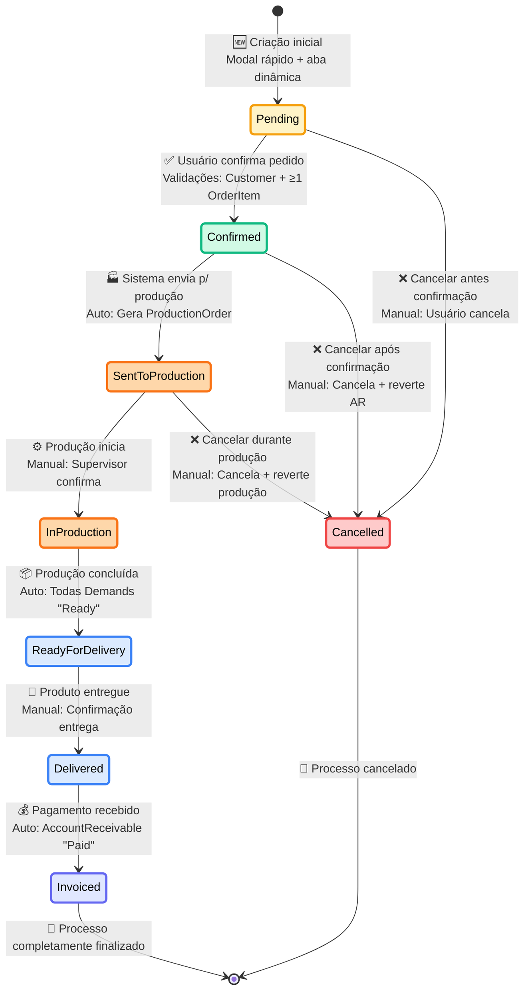
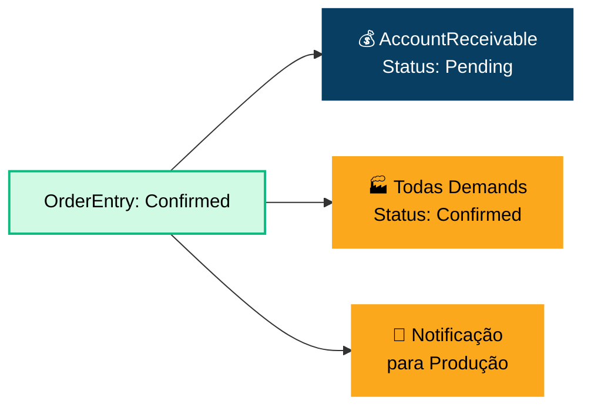
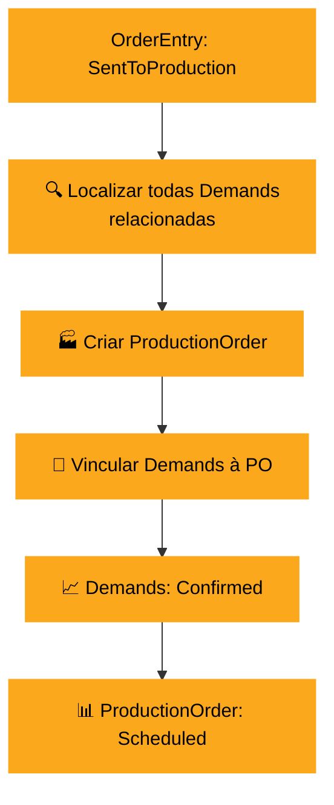
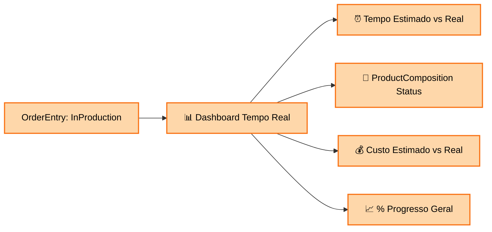
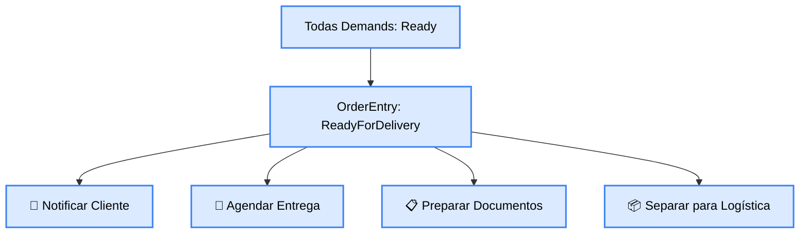
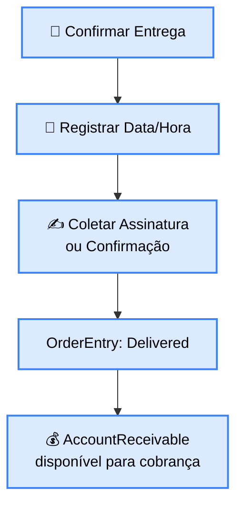

# 📋 DIAGRAMA DE ESTADOS - CICLO DE VIDA DO PEDIDO

## 🎯 Visão Geral
Diagrama de estados completo mostrando o ciclo de vida de uma OrderEntry (Pedido de Venda), incluindo todas as transições possíveis, condições para mudança de estado, e impactos automáticos em outros domínios (Produção e Financeiro).

## 🔄 Diagrama Principal de Estados



## 📋 Detalhamento dos Estados

### **🟡 PENDING (Pendente)**
```
📌 Estado Inicial
├── Descrição: OrderEntry criada mas não confirmada
├── Permitido: Edição livre de itens e dados
├── Bloqueado: Não gera produção nem financeiro
└── Próximo Estado: Confirmed ou Cancelled
```

**Ações Disponíveis:**
- ✅ Adicionar/remover OrderItem
- ✅ Editar quantidades e configurações
- ✅ Alterar Customer
- ✅ Modificar datas e endereço
- ✅ Cancelar pedido
- ✅ Confirmar pedido

**Validações para Confirmação:**
- ✅ Customer deve estar selecionado
- ✅ Pelo menos 1 OrderItem ativo
- ✅ DeliveryDate ≥ OrderDate
- ✅ Todos OrderItem com Product ativo
- ✅ Configurações válidas (para Composite/Group)

### **🟢 CONFIRMED (Confirmado)**
```
📌 Estado de Aprovação
├── Descrição: Pedido confirmado pelo cliente
├── Permitido: Visualização e envio para produção
├── Bloqueado: Edição de itens e dados críticos
└── Próximo Estado: SentToProduction ou Cancelled

Integrações Automáticas:
├── 💰 Gerar AccountReceivable no Financeiro
├── 🏭 Demands ficam disponíveis para produção  
└── 📧 Notificar produção sobre novo pedido
```

**Ações Disponíveis:**
- ✅ Enviar para produção
- ✅ Cancelar (com reversão)
- ✅ Visualizar detalhes
- ⛔ Editar itens
- ⛔ Alterar Customer

**Impactos da Confirmação:**


### **🟠 SENT_TO_PRODUCTION (Enviado para Produção)**
```
📌 Estado de Produção Agendada
├── Descrição: Pedido enviado para fila de produção
├── Permitido: Acompanhar status de produção
├── Bloqueado: Edições e cancelamento simples
└── Próximo Estado: InProduction ou Cancelled

Integrações Automáticas:
├── 🏭 Criar ProductionOrder agrupando Demands
├── 📊 Reservar ingredientes no estoque
└── ⏰ Agendar produção baseada em RequiredDate
```

**Ações Disponíveis:**
- ✅ Acompanhar progresso produção
- ✅ Cancelar (com impacto na produção)
- ⛔ Editar qualquer dado
- ⛔ Adicionar/remover itens

**Criação de ProductionOrder:**


### **🔴 IN_PRODUCTION (Em Produção)**
```
📌 Estado de Produção Ativa
├── Descrição: Produção efetivamente iniciada
├── Permitido: Acompanhar progresso em tempo real
├── Bloqueado: Cancelamento só com supervisor
└── Próximo Estado: ReadyForDelivery ou Cancelled

Integrações Automáticas:
├── ⚙️ ProductionOrder: InProgress
├── 🧩 ProductComposition: InProgress → Completed
└── 🥘 Consumo automático de ingredientes
```

**Ações Disponíveis:**
- ✅ Monitorar ProductComposition
- ✅ Ver tempo estimado vs real
- ✅ Cancelar (com aprovação supervisor)
- ⛔ Qualquer edição

**Monitoramento de Progresso:**


### **🔵 READY_FOR_DELIVERY (Pronto para Entrega)**
```
📌 Estado de Produto Finalizado
├── Descrição: Produção concluída, aguardando entrega
├── Permitido: Agendar/confirmar entrega
├── Bloqueado: Alterações de produção
└── Próximo Estado: Delivered

Integrações Automáticas:
├── 🏭 ProductionOrder: Completed
├── 📦 Todas Demands: Ready
└── 📧 Notificar cliente sobre conclusão
```

**Ações Disponíveis:**
- ✅ Agendar entrega
- ✅ Confirmar entrega
- ✅ Gerar etiquetas/documentos
- ⛔ Alterar produção

**Preparação para Entrega:**


### **🟣 DELIVERED (Entregue)**
```
📌 Estado de Entrega Confirmada
├── Descrição: Produto entregue ao cliente
├── Permitido: Processar pagamento
├── Bloqueado: Alterações de produto
└── Próximo Estado: Invoiced

Integrações Automáticas:
├── 📅 Registrar data/hora entrega real
├── 💰 Liberar AccountReceivable para cobrança
└── 📊 Atualizar métricas de entrega
```

**Ações Disponíveis:**
- ✅ Processar pagamento
- ✅ Gerar comprovante entrega
- ✅ Avaliar satisfação cliente
- ⛔ Alterar produto/produção

**Confirmação de Entrega:**


### **🟦 INVOICED (Faturado)**
```
📌 Estado Final - Pago
├── Descrição: Pagamento totalmente recebido
├── Permitido: Consulta e análise
├── Bloqueado: Qualquer alteração
└── Próximo Estado: [Finalizado]

Integrações Automáticas:
├── 💰 AccountReceivable: Paid
├── 📊 Calcular lucratividade final
└── 📈 Atualizar métricas de negócio
```

**Ações Disponíveis:**
- ✅ Consultar dados históricos
- ✅ Analisar lucratividade
- ✅ Gerar relatórios
- ⛔ Qualquer alteração

### **❌ CANCELLED (Cancelado)**
```
📌 Estado Final - Cancelado
├── Descrição: Pedido cancelado em qualquer fase
├── Permitido: Consulta e auditoria
├── Bloqueado: Reativação
└── Próximo Estado: [Finalizado]

Integrações de Reversão:
├── 💰 Cancelar AccountReceivable pendentes
├── 🏭 Cancelar Demands e ProductionOrder
└── 📊 Registrar motivo do cancelamento
```

## ⚡ Transições Automáticas vs Manuais

### **🤖 Transições Automáticas:**
```
Confirmed → SentToProduction
├── Trigger: Sistema agenda produção
├── Condição: Todas validações OK
└── Tempo: Imediato após confirmação

InProduction → ReadyForDelivery  
├── Trigger: Todas Demands = "Ready"
├── Condição: ProductionOrder completed
└── Tempo: Automático quando última tarefa completa

Delivered → Invoiced
├── Trigger: AccountReceivable = "Paid"  
├── Condição: Pagamento total recebido
└── Tempo: Imediato após pagamento
```

### **👤 Transições Manuais:**
```
Pending → Confirmed
├── Trigger: Usuário clica "Confirmar"
├── Interface: Botão de confirmação
└── Validação: Dados obrigatórios preenchidos

SentToProduction → InProduction
├── Trigger: Supervisor inicia produção
├── Interface: Dashboard de produção
└── Validação: Ingredientes disponíveis

ReadyForDelivery → Delivered
├── Trigger: Confirmação de entrega
├── Interface: App móvel ou web
└── Validação: Assinatura ou confirmação
```

## 🚨 Validações e Restrições por Estado

### **Restrições de Edição:**
```
Estado               │ Customer │ OrderItem │ Datas │ Endereço │ Cancelar
═══════════════════════════════════════════════════════════════════════════
Pending              │    ✅    │     ✅    │   ✅   │    ✅    │    ✅
Confirmed            │    ⛔    │     ⛔    │   ⚠️    │    ✅    │    ✅
SentToProduction     │    ⛔    │     ⛔    │   ⛔    │    ⚠️    │    ⚠️
InProduction         │    ⛔    │     ⛔    │   ⛔    │    ⛔    │    ⚠️
ReadyForDelivery     │    ⛔    │     ⛔    │   ⛔    │    ✅    │    ⛔
Delivered            │    ⛔    │     ⛔    │   ⛔    │    ⛔    │    ⛔
Invoiced             │    ⛔    │     ⛔    │   ⛔    │    ⛔    │    ⛔

Legenda: ✅ Permitido | ⛔ Bloqueado | ⚠️ Com restrições
```

### **Impactos de Cancelamento por Estado:**
```
Pending → Cancelled:
├── ⚡ Ação: Exclusão simples
├── 🔄 Reversão: Nenhuma necessária
└── 📊 Impacto: Apenas OrderEntry

Confirmed → Cancelled:
├── ⚡ Ação: Cancelamento com reversão
├── 🔄 Reversão: Cancelar AccountReceivable
└── 📊 Impacto: Vendas + Financeiro

SentToProduction → Cancelled:
├── ⚡ Ação: Cancelamento complexo
├── 🔄 Reversão: Cancelar produção + AR
└── 📊 Impacto: Vendas + Produção + Financeiro
```

## 🎯 Eventos de Domínio por Transição

```
OrderStatusChanged:
├── From: EstadoAnterior
├── To: NovoEstado  
├── Timestamp: DataHora da mudança
├── UserId: Usuário responsável
├── Reason: Motivo da mudança
└── AdditionalData: Dados específicos

OrderConfirmed → Gera:
├── AccountReceivableCreated
├── DemandStatusChanged (múltiplos)
└── ProductionNotificationSent

OrderSentToProduction → Gera:
├── ProductionOrderCreated
├── IngredientReserved (múltiplos)
└── ProductionScheduled

OrderCompleted → Gera:
├── CustomerNotificationSent
├── DeliveryScheduled
└── ProfitabilityCalculated
```

---

**Arquivo**: `order-lifecycle.md`  
**Domínio**: Vendas (#f36b21)  
**Tipo**: State Diagram  
**Foco**: Ciclo Completo OrderEntry + Integrações Automáticas
