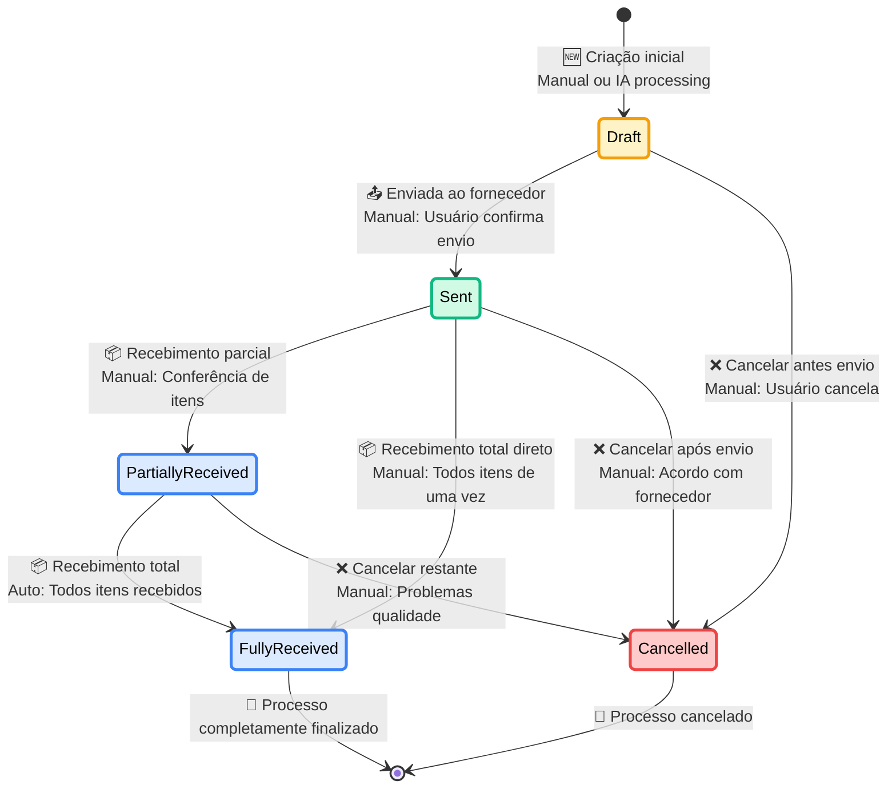
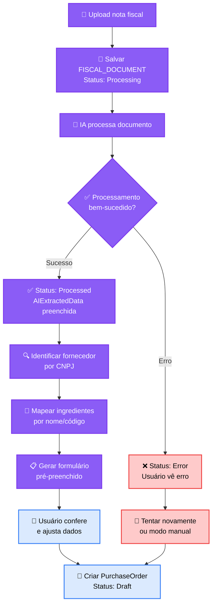
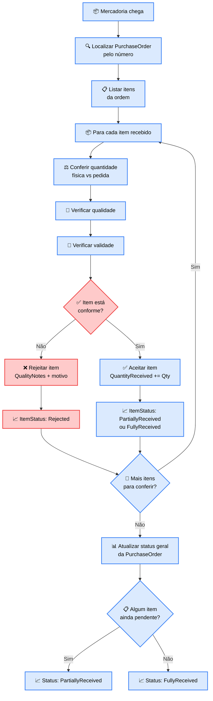
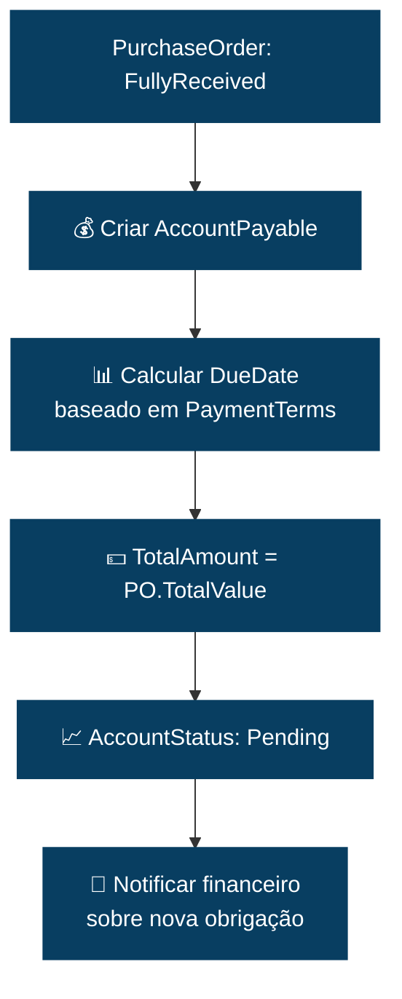
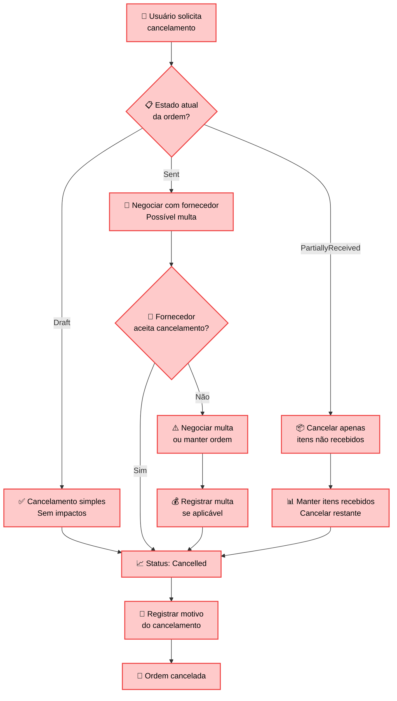

# 🛒 DIAGRAMA DE ESTADOS - CICLO DE VIDA DA ORDEM DE COMPRA

## 🎯 Visão Geral
Diagrama de estados completo mostrando o ciclo de vida de uma PurchaseOrder (Ordem de Compra), desde sua criação manual (com ou sem IA) até o recebimento total e geração automática de contas a pagar no domínio financeiro.

## 🔄 Diagrama Principal de Estados



## 📋 Detalhamento dos Estados

### **🟡 DRAFT (Rascunho)**
```
📌 Estado Inicial
├── Origem: Criação manual ou processamento IA
├── Descrição: Ordem criada mas não enviada ao fornecedor
├── Permitido: Edição livre de dados e itens
├── Bloqueado: Não gera compromissos financeiros
└── Próximo Estado: Sent ou Cancelled

Métodos de Criação:
├── 📝 Manual tradicional: Formulário em branco
├── 🤖 Com IA: Upload nota fiscal + processamento
├── 💡 Sugestão automática: Estoque mínimo
└── 📋 Recorrente: Baseada em histórico
```

**Criação com IA (Fluxo Detalhado):**


**Validações no Estado Draft:**
- ✅ Supplier deve estar selecionado e ativo
- ✅ Pelo menos 1 PurchaseOrderItem ativo
- ✅ Todos ingredientes devem estar mapeados e ativos
- ✅ Quantidades > 0 para todos itens
- ✅ Preços unitários > 0
- ✅ Total calculado corretamente

**Ações Disponíveis:**
- ✅ Adicionar/remover PurchaseOrderItem
- ✅ Editar quantidades e preços
- ✅ Alterar Supplier
- ✅ Modificar datas e condições
- ✅ Anexar/processar documentos fiscais
- ✅ Cancelar ordem
- ✅ Enviar ao fornecedor

### **🟢 SENT (Enviada)**
```
📌 Estado de Ordem Ativa
├── Trigger: Usuário confirma envio ao fornecedor
├── Descrição: Ordem enviada, aguardando entrega
├── Permitido: Receber itens parcial ou totalmente
├── Bloqueado: Editar itens e dados críticos
└── Próximo Estado: PartiallyReceived, FullyReceived ou Cancelled

Ações no Envio:
├── 📧 Notificar fornecedor (email/sistema)
├── 📅 Registrar data de envio
├── 🔒 Bloquear edições críticas
└── ⏰ Iniciar tracking de prazo de entrega
```

**Processo de Envio:**
```mermaid
flowchart TD
    A[👤 Usuário clica "Enviar"] --> B[✅ Validar dados obrigatórios]
    B --> C{🔍 Validação OK?}
    
    C -->|Não| D[⚠️ Exibir erros<br/>Corrigir antes envio]
    C -->|Sim| E[📧 Enviar para fornecedor]
    
    E --> F[📅 OrderDate = hoje]
    F --> G[📈 Status: Draft → Sent]
    G --> H[⏰ Calcular ExpectedDeliveryDate<br/>baseado em LeadTime]
    H --> I[🔔 Configurar alertas<br/>de acompanhamento]
    
    D --> A
    
    classDef validationStyle fill:#fef3c7,stroke:#f59e0b,stroke-width:2px,color:black
    class A,B,C,D validationStyle
    
    classDef sendingStyle fill:#d1fae5,stroke:#10b981,stroke-width:2px,color:black
    class E,F,G,H,I sendingStyle
```

**Tracking de Prazo:**
```
ExpectedDeliveryDate = OrderDate + Supplier.DeliveryDays

Alertas automáticos:
├── 📧 Lembrete 2 dias antes do prazo
├── ⚠️ Alerta no dia do vencimento
├── 🚨 Alerta crítico se atrasar
└── 📊 Atualizar rating do fornecedor
```

**Ações Disponíveis:**
- ✅ Receber itens (parcial ou total)
- ✅ Cancelar ordem (com acordo fornecedor)
- ✅ Acompanhar status de entrega
- ✅ Comunicar com fornecedor
- ⛔ Editar itens ou quantidades
- ⛔ Alterar fornecedor

### **🔵 PARTIALLY_RECEIVED (Parcialmente Recebida)**
```
📌 Estado de Recebimento Parcial
├── Trigger: Recebimento de alguns itens
├── Descrição: Parte da ordem foi entregue
├── Permitido: Continuar recebendo itens restantes
├── Bloqueado: Alterar itens já recebidos
└── Próximo Estado: FullyReceived ou Cancelled

Controle por Item:
├── 🔍 PurchaseOrderItem.ItemStatus individual
├── 📊 QuantityReceived vs QuantityOrdered
├── 📅 ActualDeliveryDate por item
└── 🧪 QualityNotes por item
```

**Processo de Recebimento Parcial:**


**Estados dos PurchaseOrderItem:**
```
ItemStatus possíveis:
├── 📋 Pending: Aguardando entrega
├── 📦 PartiallyReceived: Parte recebida
├── ✅ FullyReceived: Totalmente recebido
├── ❌ Rejected: Rejeitado por qualidade
└── ⏰ Overdue: Atrasado (automático)
```

**Ações Disponíveis:**
- ✅ Continuar recebendo itens pendentes
- ✅ Rejeitar itens por qualidade
- ✅ Cancelar itens restantes
- ✅ Comunicar problemas ao fornecedor
- ⛔ Alterar itens já recebidos totalmente

### **🟦 FULLY_RECEIVED (Totalmente Recebida)**
```
📌 Estado Final de Sucesso
├── Trigger: Todos itens recebidos e aceitos
├── Descrição: Ordem completamente entregue
├── Permitido: Análise e arquivo
├── Bloqueado: Qualquer alteração
└── Próximo Estado: [Finalizado]

Integrações Automáticas:
├── 🏭 Atualizar INGREDIENT_STOCK automaticamente
├── 💰 Gerar ACCOUNT_PAYABLE no Financeiro
├── 📊 Avaliar performance do fornecedor
└── 📈 Atualizar métricas de compras
```

**Atualizações Automáticas no Recebimento Total:**

#### **Atualização de Estoque:**
```sql
-- Para cada PurchaseOrderItem totalmente recebido:
UPDATE INGREDIENT_STOCK 
SET CurrentQuantity = CurrentQuantity + @QuantityReceived,
    AvailableQuantity = AvailableQuantity + @QuantityReceived,
    AverageCost = (AverageCost * CurrentQuantity + @UnitCost * @QuantityReceived) 
                  / (CurrentQuantity + @QuantityReceived),
    LastPurchaseDate = @ActualDeliveryDate,
    LastPurchaseCost = @UnitCost,
    LastUpdated = GETDATE()
WHERE IngredientId = @IngredientId
```

#### **Geração de Conta a Pagar:**


**Cálculo de Performance do Fornecedor:**
```
Métricas atualizadas:
├── ⏰ Pontualidade: ActualDeliveryDate vs ExpectedDeliveryDate
├── 🧪 Qualidade: % itens aceitos vs rejeitados
├── 💰 Precisão preço: Variação vs cotação inicial
├── 📊 Rating geral: Média ponderada das métricas
└── 📈 Histórico de entregas
```

**Ações Disponíveis:**
- ✅ Consultar dados históricos
- ✅ Analisar performance fornecedor
- ✅ Gerar relatórios de compra
- ✅ Avaliar qualidade recebida
- ⛔ Qualquer alteração

### **❌ CANCELLED (Cancelada)**
```
📌 Estado Final de Cancelamento
├── Trigger: Cancelamento manual em qualquer fase
├── Descrição: Ordem cancelada por acordo ou problema
├── Permitido: Consulta e auditoria
├── Bloqueado: Reativação
└── Próximo Estado: [Finalizado]

Motivos de Cancelamento:
├── 🚫 Usuário cancela antes do envio (Draft)
├── 🤝 Acordo com fornecedor (Sent)
├── 🧪 Problemas de qualidade (PartiallyReceived)
└── ⏰ Atraso excessivo do fornecedor
```

**Processo de Cancelamento:**


**Impactos do Cancelamento:**
```
Por Estado de Origem:

Draft → Cancelled:
├── ⚡ Ação: Exclusão simples
├── 🔄 Reversão: Nenhuma necessária
└── 📊 Impacto: Apenas PurchaseOrder

Sent → Cancelled:
├── ⚡ Ação: Cancelamento negociado
├── 🔄 Reversão: Possível multa contratual
└── 📊 Impacto: Compras + relacionamento fornecedor

PartiallyReceived → Cancelled:
├── ⚡ Ação: Cancelamento parcial
├── 🔄 Reversão: Manter itens recebidos
└── 📊 Impacto: Compras + Estoque + Financeiro
```

## ⚡ Transições Automáticas vs Manuais

### **🤖 Transições Automáticas:**
```
PartiallyReceived → FullyReceived:
├── Trigger: Último item marcado como FullyReceived
├── Condição: Todos PurchaseOrderItem recebidos
└── Tempo: Imediato após última conferência

FullyReceived → [Finalizado]:
├── Trigger: AccountPayable gerada com sucesso
├── Condição: Integrações completadas
└── Tempo: Processamento em background

Sent → Overdue (alerta):
├── Trigger: ExpectedDeliveryDate vencida
├── Condição: Ainda não recebido
└── Tempo: Job automático diário
```

### **👤 Transições Manuais:**
```
Draft → Sent:
├── Trigger: Usuário clica "Enviar ao Fornecedor"
├── Interface: Botão de envio
└── Validação: Dados obrigatórios preenchidos

Sent → PartiallyReceived:
├── Trigger: Usuário registra recebimento
├── Interface: Tela de conferência
└── Validação: Pelo menos 1 item recebido

PartiallyReceived → Cancelled:
├── Trigger: Usuário cancela itens restantes
├── Interface: Ação de cancelamento
└── Validação: Justificativa obrigatória
```

## 🚨 Validações e Alertas

### **Validações por Estado:**
```
Estado              │ Editar Item │ Alterar Fornec │ Cancelar │ Receber
══════════════════════════════════════════════════════════════════════
Draft               │     ✅      │       ✅       │    ✅    │   ⛔
Sent                │     ⛔      │       ⛔       │    ✅    │   ✅
PartiallyReceived   │     ⚠️      │       ⛔       │    ⚠️    │   ✅
FullyReceived       │     ⛔      │       ⛔       │    ⛔    │   ⛔

Legenda: ✅ Permitido | ⛔ Bloqueado | ⚠️ Apenas itens não recebidos
```

### **Alertas Automáticos:**
```
🚨 Alertas Críticos:
├── Ordem atrasada > 5 dias
├── Fornecedor com > 3 atrasos consecutivos
├── Item rejeitado por qualidade
├── Preço recebido > 20% da cotação

⚠️ Alertas de Atenção:
├── Prazo de entrega em 2 dias
├── Primeiro pedido com fornecedor novo
├── Quantidade recebida ≠ quantidade pedida
├── Ingrediente próximo do vencimento
```

### **Validações de Negócio:**
```
PurchaseOrderItem:
├── ✅ QuantityReceived ≤ QuantityOrdered
├── ✅ ActualDeliveryDate ≥ OrderDate
├── ✅ UnitCost > 0
├── ✅ ExpirationDate > hoje (se aplicável)

IngredientStock:
├── ✅ Capacidade de armazenagem suficiente
├── ✅ Ingredient ativo no sistema
├── ✅ UnitOfMeasure consistente
├── ✅ CurrentQuantity após recebimento > 0
```

## 🎯 Eventos de Domínio por Transição

```
PurchaseOrderStatusChanged:
├── PurchaseOrderId: ID da ordem
├── From: Estado anterior
├── To: Novo estado
├── Timestamp: Data/hora da mudança
├── UserId: Usuário responsável
├── Reason: Motivo da mudança (se cancelamento)
└── AdditionalData: Dados específicos

Eventos Específicos:
├── PurchaseOrderCreated: Nova ordem criada
├── PurchaseOrderSent: Ordem enviada ao fornecedor
├── ItemReceived: Item específico recebido
├── PurchaseOrderCompleted: Ordem totalmente recebida
├── StockUpdated: Estoque atualizado automaticamente
├── AccountPayableCreated: Conta a pagar gerada
├── SupplierEvaluated: Performance do fornecedor avaliada
└── PurchaseOrderCancelled: Ordem cancelada
```

## 📊 Métricas e KPIs por Estado

### **Indicadores de Performance:**
```
Por PurchaseOrder:
├── ⏰ Lead Time: OrderDate → ActualDeliveryDate
├── 💰 Cost Variance: Custo real vs estimado
├── 🧪 Quality Rate: % itens aceitos vs total
├── 📊 Fulfillment Rate: % quantidade recebida vs pedida

Por Supplier:
├── 📈 On-Time Delivery: % entregas no prazo
├── 🏆 Quality Score: Média de qualidade
├── 💵 Price Stability: Variação de preços
├── 🤝 Reliability Index: Índice geral de confiabilidade
```

---

**Arquivo**: `purchase-order-lifecycle.md`  
**Domínio**: Compras (#0562aa)  
**Tipo**: State Diagram  
**Foco**: Ciclo Completo PurchaseOrder + IA Integration + Stock Management
