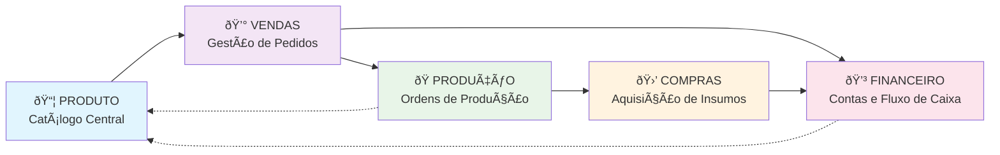
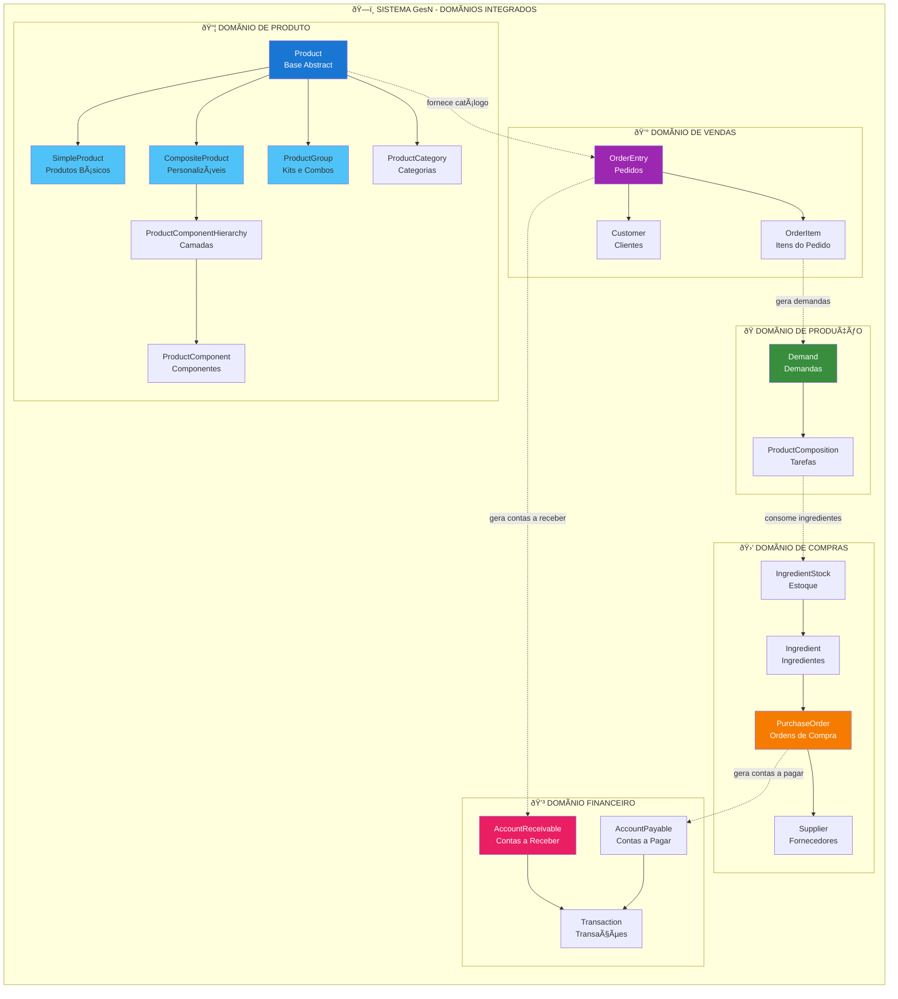
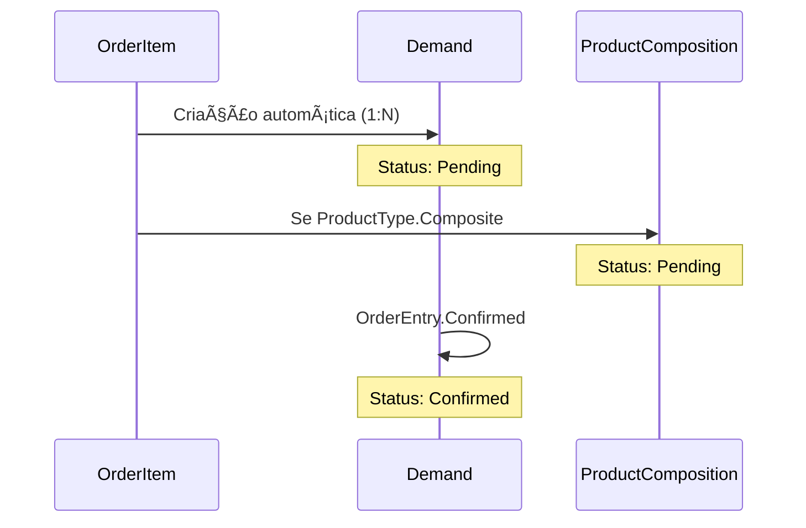
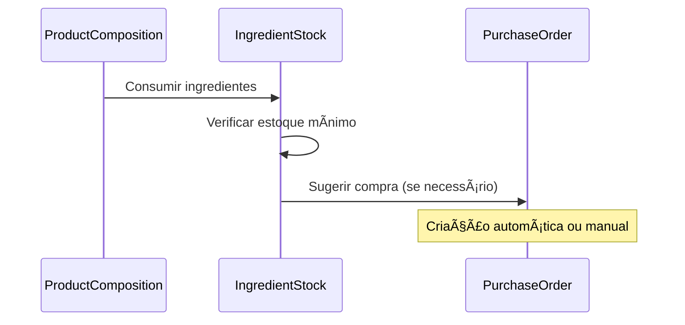
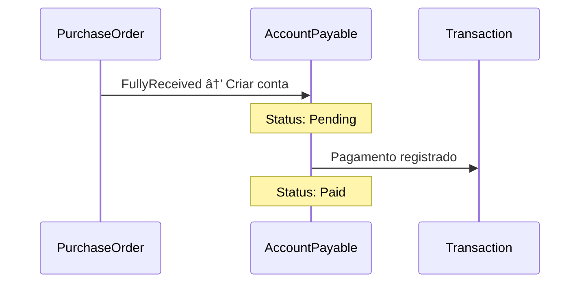
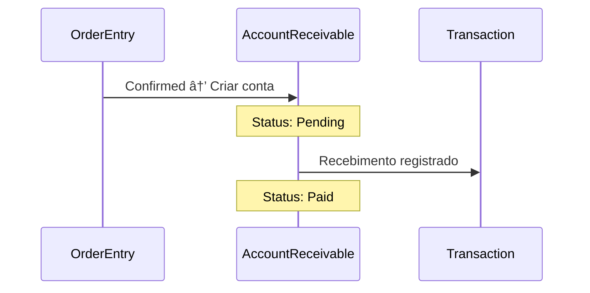

# 📖 Documentação de Domínios – GesN SaaS

## 📋 Índice

1. [Introdução](#1-introdução)
   - 1.1 [Objetivo do Documento](#11-objetivo-do-documento)
   - 1.2 [Público-Alvo](#12-público-alvo)
   - 1.3 [Escopo e Visão Geral](#13-escopo-e-visão-geral)

2. [Mapeamento de Domínios (DDD)](#2-mapeamento-de-domínios-ddd)
   - 2.1 [Context Map (Visão Geral)](#21-context-map-visão-geral)
   - 2.2 [Bounded Contexts (Por Domínio)](#22-bounded-contexts-por-domínio)
     - 2.2.1 [DOMÍNIO DE PRODUTO](#221-domínio-de-produto)
       - 2.2.1.1 [Responsabilidade Central](#2211-responsabilidade-central)
       - 2.2.1.2 [Principais Entidades](#2212-principais-entidades)
       - 2.2.1.3 [Tipos de Produtos e Casos de Uso](#2213-tipos-de-produtos-e-casos-de-uso)
         - 2.2.1.3.1 [Produto Simples](#22131-produto-simples-producttypesimple)
         - 2.2.1.3.2 [Produto Composto](#22132-produto-composto-producttypecomposite)
         - 2.2.1.3.3 [Grupo de Produtos](#22133-grupo-de-produtos-producttypegroup)
       - 2.2.1.4 [Regras de Negócio do Domínio](#2214-regras-de-negócio-do-domínio)
       - 2.2.1.5 [Integrações com Outros Domínios](#2215-integrações-com-outros-domínios)
     - 2.2.2 [DOMÍNIO DE VENDAS](#222-domínio-de-vendas)
       - 2.2.2.1 [Responsabilidade Central](#2221-responsabilidade-central)
       - 2.2.2.2 [Principais Entidades](#2222-principais-entidades)
       - 2.2.2.3 [Fluxos de Trabalho e Jornada do Usuário](#2223-fluxos-de-trabalho-e-jornada-do-usuário)
         - 2.2.2.3.1 [Listagem e Acesso aos Pedidos](#22231-listagem-e-acesso-aos-pedidos)
         - 2.2.2.3.2 [Criação de Novo Pedido](#22232-criação-de-novo-pedido)
         - 2.2.2.3.3 [Adição de Itens por Tipo de Produto](#22233-adição-de-itens-por-tipo-de-produto)
         - 2.2.2.3.4 [Finalização e Confirmação](#22234-finalização-e-confirmação)
       - 2.2.2.4 [Regras de Negócio do Domínio](#2224-regras-de-negócio-do-domínio)
       - 2.2.2.5 [Integrações com Outros Domínios](#2225-integrações-com-outros-domínios)
     - 2.2.3 [DOMÍNIO DE PRODUÇÃO](#223-domínio-de-produção)
       - 2.2.3.1 [Responsabilidade Central](#2231-responsabilidade-central)
       - 2.2.3.2 [Principais Entidades](#2232-principais-entidades)
       - 2.2.3.3 [Fluxos de Trabalho e Jornada do Usuário](#2233-fluxos-de-trabalho-e-jornada-do-usuário)
         - 2.2.3.3.1 [Painel de Demandas (Production Dashboard)](#22331-painel-de-demandas-production-dashboard)
         - 2.2.3.3.2 [Geração de Demandas](#22332-geração-de-demandas)
         - 2.2.3.3.3 [Gerenciamento e Execução de Demandas](#22333-gerenciamento-e-execução-de-demandas)
       - 2.2.3.4 [Regras de Negócio do Domínio](#2234-regras-de-negócio-do-domínio)
       - 2.2.3.5 [Integrações com Outros Domínios](#2235-integrações-com-outros-domínios)
     - 2.2.4 [DOMÍNIO DE COMPRAS](#224-domínio-de-compras)
       - 2.2.4.1 [Responsabilidade Central](#2241-responsabilidade-central)
       - 2.2.4.2 [Principais Entidades](#2242-principais-entidades)
       - 2.2.4.3 [Fluxos de Trabalho e Jornada do Usuário](#2243-fluxos-de-trabalho-e-jornada-do-usuário)
         - 2.2.4.3.1 [Gestão de Fornecedores e Ingredientes](#22431-gestão-de-fornecedores-e-ingredientes)
         - 2.2.4.3.2 [Geração de Ordens de Compra](#22432-geração-de-ordens-de-compra)
         - 2.2.4.3.3 [Ciclo de Vida da Ordem de Compra](#22433-ciclo-de-vida-da-ordem-de-compra)
       - 2.2.4.4 [Regras de Negócio do Domínio](#2244-regras-de-negócio-do-domínio)
       - 2.2.4.5 [Integrações com Outros Domínios](#2245-integrações-com-outros-domínios)
     - 2.2.5 [DOMÍNIO FINANCEIRO](#225-domínio-financeiro)
       - 2.2.5.1 [Responsabilidade Central](#2251-responsabilidade-central)
       - 2.2.5.2 [Principais Entidades](#2252-principais-entidades)
       - 2.2.5.3 [Fluxos de Trabalho e Jornada do Usuário](#2253-fluxos-de-trabalho-e-jornada-do-usuário)
         - 2.2.5.3.1 [Gestão de Contas a Receber](#22531-gestão-de-contas-a-receber)
         - 2.2.5.3.2 [Gestão de Contas a Pagar](#22532-gestão-de-contas-a-pagar)
         - 2.2.5.3.3 [Análise do Fluxo de Caixa](#22533-análise-do-fluxo-de-caixa)
       - 2.2.5.4 [Regras de Negócio do Domínio](#2254-regras-de-negócio-do-domínio)
       - 2.2.5.5 [Integrações com Outros Domínios](#2255-integrações-com-outros-domínios)
   - 2.3 [Ubiquitous Language (Glossário de Termos)](#23-ubiquitous-language-glossário-de-termos)

3. [Diagramas](#3-diagramas)
   - 3.1 [Context Map Geral](#31-context-map-geral)
   - 3.2 [Bounded Context - Domínio de Produto (Detalhado)](#32-bounded-context---domínio-de-produto-detalhado)
   - 3.3 [Fluxo de Dados - Produto para Vendas](#33-fluxo-de-dados---produto-para-vendas)

4. [Regras e Diretrizes](#4-regras-e-diretrizes)
   - 4.1 [Manutenção do Documento](#41-manutenção-do-documento)
   - 4.2 [Padrão de Nomenclatura](#42-padrão-de-nomenclatura)
   - 4.3 [Critérios para Evolução dos Domínios](#43-critérios-para-evolução-dos-domínios)

5. [Próximos Passos](#5-próximos-passos)
   - 5.1 [Documentação Pendente](#51-documentação-pendente)
   - 5.2 [Diagramas Adicionais](#52-diagramas-adicionais)
   - 5.3 [Implementação](#53-implementação)

---

## 1. Introdução

### 1.1 Objetivo do Documento

Este documento apresenta o **mapeamento completo dos domínios** do sistema **GesN (Gestão de Negócios)**, uma solução SaaS desenvolvida para gerenciar integralmente os processos de pequenas e médias empresas. A documentação utiliza conceitos de **Domain-Driven Design (DDD)** para definir bounded contexts, estabelecer a linguagem ubíqua e mapear as relações entre os domínios.

### 1.2 Público-Alvo

- **Desenvolvedores**: Para compreender a arquitetura e implementar funcionalidades alinhadas aos domínios
- **Arquitetos de Software**: Para manter a integridade dos bounded contexts e evoluir a arquitetura
- **Analistas de Negócio**: Para entender o fluxo de valor e mapear requisitos aos domínios corretos
- **Stakeholders e Product Owners**: Para visualizar como os processos de negócio se traduzem em software

### 1.3 Escopo e Visão Geral

O **GesN** é uma plataforma integrada que digitaliza a jornada completa de negócios, desde o cadastro de produtos até o controle financeiro. O sistema é estruturado em **5 domínios principais** que se integram de forma sequencial e cíclica:

```
PRODUTO → VENDAS → PRODUÇÃO → COMPRAS → FINANCEIRO
   ↑                                        ↓
   └────────── RETROALIMENTAÇÃO ──────────┘
```

**Características Principais:**
- **Arquitetura Multi-Tenant**: Isolamento completo por cliente via containers Docker
- **Tecnologia**: ASP.NET Core MVC, Dapper, SQLite, JavaScript (ES6+)
- **Padrões**: DDD, Repository Pattern, Service Layer, MVC
- **UI/UX**: Sistema de abas dinâmicas, autocomplete inteligente, grids interativas

---

## 2. Mapeamento de Domínios (DDD)

### 2.1 Context Map (Visão Geral)

O **Context Map** do GesN ilustra como os 5 domínios principais interagem através de integrações bem definidas:


```mermaid
graph LR
    A[📦 PRODUTO<br/>Catálogo Central] --> B[💰 VENDAS<br/>Gestão de Pedidos]
    B --> C[🏭 PRODUÇÃO<br/>Ordens de Produção]
    C --> D[🛒 COMPRAS<br/>Aquisição de Insumos]
    B --> E[💳 FINANCEIRO<br/>Contas e Fluxo de Caixa]
    D --> E
    E -.-> A
    C -.-> A
    
    style A fill:#e1f5fe
    style B fill:#f3e5f5
    style C fill:#e8f5e8
    style D fill:#fff3e0
    style E fill:#fce4ec
```

**Relacionamentos Chave:**
- **Produto → Vendas**: Catálogo alimenta criação de pedidos
- **Vendas → Produção**: Pedidos confirmados geram demandas de produção
- **Vendas → Financeiro**: Pedidos geram contas a receber
- **Produção → Compras**: Demandas consomem ingredientes, disparando necessidades de compra
- **Compras → Financeiro**: Ordens de compra geram contas a pagar
- **Retroalimentação**: Dados financeiros e de produção influenciam decisões de produto



```mermaid
graph TB
    subgraph "🏗️ SISTEMA GesN - DOMÍNIOS INTEGRADOS"
        direction TB
        
        subgraph "📦 DOMÍNIO DE PRODUTO"
            P[Product<br/>Base Abstract]
            SP[SimpleProduct<br/>Produtos Básicos]
            CP[CompositeProduct<br/>Personalizáveis]
            PG[ProductGroup<br/>Kits e Combos]
            PC[ProductCategory<br/>Categorias]
            PCH[ProductComponentHierarchy<br/>Camadas]
            PCO[ProductComponent<br/>Componentes]
        end
        
        subgraph "💰 DOMÍNIO DE VENDAS"
            OE[OrderEntry<br/>Pedidos]
            OI[OrderItem<br/>Itens do Pedido]
            CU[Customer<br/>Clientes]
        end
        
        subgraph "🏭 DOMÍNIO DE PRODUÇÃO"
            D[Demand<br/>Demandas]
            PRO[ProductComposition<br/>Tarefas]
        end
        
        subgraph "🛒 DOMÍNIO DE COMPRAS"
            PO[PurchaseOrder<br/>Ordens de Compra]
            S[Supplier<br/>Fornecedores]
            I[Ingredient<br/>Ingredientes]
            IS[IngredientStock<br/>Estoque]
        end
        
        subgraph "💳 DOMÍNIO FINANCEIRO"
            AR[AccountReceivable<br/>Contas a Receber]
            AP[AccountPayable<br/>Contas a Pagar]
            T[Transaction<br/>Transações]
        end
    end
    
    P --> SP
    P --> CP
    P --> PG
    P --> PC
    CP --> PCH
    PCH --> PCO
    
    P -.->|"fornece catálogo"| OE
    OE --> OI
    OE --> CU
    
    OI -.->|"gera demandas"| D
    D --> PRO
    
    PRO -.->|"consome ingredientes"| IS
    IS --> I
    I --> PO
    PO --> S
    
    OE -.->|"gera contas a receber"| AR
    PO -.->|"gera contas a pagar"| AP
    AR --> T
    AP --> T
    
    style P fill:#1976d2,color:#fff
    style SP fill:#4fc3f7
    style CP fill:#4fc3f7
    style PG fill:#4fc3f7
    style OE fill:#9c27b0,color:#fff
    style D fill:#388e3c,color:#fff
    style PO fill:#f57c00,color:#fff
    style AR fill:#e91e63,color:#fff
```


### 2.2 Bounded Contexts (Por Domínio)

---

#### 2.2.1 **DOMÍNIO DE PRODUTO**

##### 2.2.1.1 **Responsabilidade Central**
Gerenciamento completo do **Catálogo de Produtos e Serviços** da empresa. É o **domínio fundamental** e ponto de partida obrigatório para todo o sistema, pois todos os outros domínios dependem dos itens cadastrados aqui.

##### 2.2.1.2 **Principais Entidades**

###### **Entidades Centrais:**
- **`Product`** *(Classe Abstrata Base)*: Entidade principal que representa qualquer item vendável
- **`ProductCategory`**: Agrupamento lógico de produtos (ex: "Salgados Tradicionais", "Bolos Especiais")
- **`ProductIngredient`**: Relacionamento que define a "receita" de um produto (qual ingrediente e em que quantidade)

###### **Entidades de Especialização (Herança TPH):**
- **`SimpleProduct`**: Produtos básicos sem configuração (ex: "Coxinha Comum")
- **`CompositeProduct`**: Produtos personalizáveis com hierarquias de componentes (ex: "Bolo Personalizado")
- **`ProductGroup`**: Kits/combos flexíveis com regras de troca (ex: "Kit Festa p/ 20 pessoas")

###### **Entidades de Composição:**
- **`ProductComponentHierarchy`**: Define "camadas" de personalização (ex: "Massa", "Recheio", "Cobertura")
- **`ProductComponent`**: Opções específicas dentro de uma hierarquia (ex: "Massa de Chocolate", "Recheio de Brigadeiro")
- **`CompositeProductXHierarchy`**: Relacionamento M:N que define regras de composição (quantidade mín/máx, opcionalidade, ordem)

###### **Entidades de Agrupamento:**
- **`ProductGroupItem`**: Item individual dentro de um grupo (pode referenciar Product OU ProductCategory)
- **`ProductGroupExchangeRule`**: Define regras de proporção e troca entre itens do grupo

##### 2.2.1.3 **Tipos de Produtos e Casos de Uso**

###### 2.2.1.3.1 **🔷 Produto Simples (`ProductType.Simple`)**
**Definição**: Unidade mais básica do catálogo, item concreto sem variações.

**Estrutura de Dados:**
```csharp
SimpleProduct {
    Name: "Coxinha Comum"
    Price: 3.50
    Cost: 1.80
    CategoryId: "salgados-tradicionais"
    SKU: "COX001"
    AssemblyTime: 5 // minutos
}
```

**Fluxo de Criação:**
1. Definir dados básicos (nome, preço, categoria)
2. Opcional: configurar receita com ingredientes
3. Definir tempo de montagem
4. Ativar produto no catálogo

**Exemplo Real:**
```
Produto: "Coxinha Comum"
├── Categoria: "Salgados Tradicionais"  
├── Preço: R$ 3,50
├── Receita:
│   ├── Massa de Coxinha: 50g
│   ├── Frango Desfiado: 30g
│   └── Temperos Diversos: 5g
└── Tempo de Montagem: 5 minutos
```

###### 2.2.1.3.2 **🔶 Produto Composto (`ProductType.Composite`)**
**Definição**: Produto configurável onde o cliente escolhe componentes a partir de hierarquias pré-definidas.

**Estrutura de Dados:**
```csharp
CompositeProduct {
    Name: "Bolo Personalizado p/ 20 pessoas"
    BasePrice: 45.00
    Hierarchies: [
        {
            HierarchyId: "massa-bolo",
            MinQuantity: 1,
            MaxQuantity: 1,
            IsOptional: false,
            AssemblyOrder: 1
        },
        {
            HierarchyId: "recheio-bolo", 
            MinQuantity: 1,
            MaxQuantity: 2,
            IsOptional: false,
            AssemblyOrder: 2
        }
    ]
}
```

**Processo de Configuração:**
1. **Criar Hierarquias**: Definir camadas (Massa, Recheio, Cobertura, Opcionais)
2. **Criar Componentes**: Opções dentro de cada camada
3. **Configurar Produto**: Associar hierarquias com regras (min/max, ordem, opcionalidade)
4. **Definir Preços**: Preço base + custos adicionais por componente

**Exemplo Real Completo:**
```
Produto: "Bolo Personalizado p/ 20 pessoas"
├── Preço Base: R$ 45,00
├── Hierarquias:
│   ├── 1. MASSA (obrigatória, min=1, max=1)
│   │   ├── Massa Branca (sem custo adicional)
│   │   ├── Massa de Chocolate (sem custo adicional)
│   │   └── Massa Red Velvet (+R$ 8,00)
│   ├── 2. RECHEIO (obrigatória, min=1, max=2)  
│   │   ├── Brigadeiro (sem custo adicional)
│   │   ├── Beijinho (sem custo adicional)
│   │   ├── Morango (+R$ 5,00)
│   │   └── Nutella (+R$ 12,00)
│   ├── 3. COBERTURA (obrigatória, min=1, max=1)
│   │   ├── Chantilly (sem custo adicional)
│   │   ├── Ganache (+R$ 4,00)
│   │   └── Fondant (+R$ 18,00)
│   └── 4. OPCIONAIS (opcional, min=0, max=3)
│       ├── Frutas Vermelhas (+R$ 6,00)
│       ├── Granulado Colorido (+R$ 2,00)
│       └── Vela Personalizada (+R$ 15,00)
```

**Fluxo de Venda:**
1. Cliente seleciona "Bolo Personalizado"
2. Sistema apresenta hierarquias em sequência
3. Cliente faz escolhas respeitando regras de quantidade
4. Sistema calcula preço final: Base + Σ(custos adicionais)
5. Configuração é salva no OrderItem + gera Demand para produção

###### 2.2.1.3.3 **🔸 Grupo de Produtos (`ProductType.Group`)**
**Definição**: Pacote abstrato que agrupa múltiplos produtos/categorias com regras de troca flexíveis.

**Estrutura de Dados:**
```csharp
ProductGroup {
    Name: "Kit Festa p/ 50 pessoas"
    BasePrice: 280.00
    GroupItems: [
        {
            ProductId: "bolo-25-pessoas",
            Quantity: 2,
            DefaultQuantity: 2,
            IsOptional: false
        },
        {
            ProductCategoryId: "salgados-tradicionais",
            Quantity: 200,
            MinQuantity: 150,
            MaxQuantity: 250,
            DefaultQuantity: 200,
            IsOptional: false
        }
    ],
    ExchangeRules: [
        {
            SourceItem: "salgados-tradicionais",
            TargetItem: "salgados-especiais", 
            ExchangeRatio: 2.0 // 2 tradicionais = 1 especial
        }
    ]
}
```

**Exemplo Real:**
```
Kit: "Kit Festa p/ 50 pessoas" - R$ 280,00
├── Itens Base:
│   ├── 2x Bolo p/ 25 pessoas (fixo)
│   ├── 200x Salgados Tradicionais (150-250, configurável)
│   ├── 100x Doces Tradicionais (50-150, configurável)
│   └── 3x Refrigerante 2L (2-5, configurável)
├── Regras de Troca:
│   ├── Salgados Tradicionais (2) ↔ Salgados Especiais (1)
│   ├── Doces Tradicionais (3) ↔ Torta Individual (1)
│   └── Refrigerante 2L (1) ↔ Suco Natural 1L (1)
└── Flexibilidade: Cliente pode trocar itens mantendo proporções
```

**Fluxo de Configuração pelo Cliente:**
1. Cliente seleciona o kit base
2. Sistema apresenta itens configuráveis
3. Cliente ajusta quantidades dentro dos limites
4. Cliente aplica trocas baseadas nas regras
5. Sistema recalcula preço: Base + ajustes de quantidade + diferenças de troca
6. Kit configurado é adicionado ao pedido

##### 2.2.1.4 **Regras de Negócio do Domínio**

###### **Regras Gerais:**
- **SKU Único**: Quando informado, deve ser único em todo o sistema
- **Categoria Opcional**: Produtos podem existir sem categoria, mas é recomendado
- **Herança TPH**: Todos os tipos usam a tabela `Product` com discriminador `ProductType`
- **Estado Ativo**: Apenas produtos ativos aparecem no catálogo de vendas
- **Integridade Referencial**: Produto não pode ser excluído se tiver OrderItems associados

###### **Regras por Tipo:**

**Produto Simples:**
- Nome e Preço são obrigatórios
- Receita de ingredientes é opcional mas recomendada para controle de custo
- Tempo de montagem padrão: 0 minutos

**Produto Composto:**
- Deve ter pelo menos 1 hierarquia associada
- Cada hierarquia deve ter pelo menos 1 componente ativo
- MinQuantity ≥ 1 para hierarquias obrigatórias
- AssemblyOrder deve ser sequencial (1, 2, 3...)
- Validação em tempo real: escolhas do cliente devem respeitar limites

**Grupo de Produtos:**
- Deve ter pelo menos 1 item no grupo
- Item pode ser Product OU ProductCategory (mutuamente exclusivo)
- MinQuantity ≤ DefaultQuantity ≤ MaxQuantity
- Regras de troca: Source ≠ Target, ExchangeRatio > 0
- Cálculo dinâmico de preço baseado em configuração final

##### 2.2.1.5 **Integrações com Outros Domínios**

###### **→ Vendas (Customer-Supplier)**
**Integração**: O domínio de Produto **fornece** o catálogo para Vendas
- **Dados Fornecidos**: Lista de produtos ativos, preços, configurações disponíveis
- **Operações**: Busca de produtos, validação de configurações, cálculo de preços
- **Protocolo**: Vendas consome via ProductService métodos como `GetActiveProducts()`, `ValidateProductConfiguration()`, `CalculatePrice()`

###### **→ Produção (Customer-Supplier)**  
**Integração**: Produto **fornece** especificações para produção
- **Dados Fornecidos**: Receitas (ProductIngredient), instruções de montagem, tempo de produção
- **Operações**: Consulta de componentes para produtos compostos, tempo de assembly
- **Protocolo**: Produção consulta via `GetProductComposition()`, `GetAssemblyInstructions()`

###### **→ Financeiro (Conformist)**
**Integração**: Produto **informa** custos para cálculos financeiros
- **Dados Fornecidos**: Custo base dos produtos, custos adicionais de componentes
- **Operações**: Cálculo de margem, análise de lucratividade por produto
- **Protocolo**: Financeiro consome via `CalculateProductCost()`, `GetCostBreakdown()`

> 📖 **Para documentação técnica completa** do Domínio de Produto, incluindo arquitetura detalhada, código C#, fluxos Mermaid, exemplos práticos e considerações de performance, consulte: **[DOMAIN_1_PRODUCT_CONTEXT.md](./DOMAIN_1_PRODUCT_CONTEXT.md)**

---

#### 2.2.2 **DOMÍNIO DE VENDAS**

##### 2.2.2.1 **Responsabilidade Central**
O **Domínio de Vendas** é o coração operacional do GesN, responsável por capturar, gerenciar e concretizar as transações comerciais com os clientes. Este domínio consome diretamente os itens do **Catálogo de Produtos** e serve como o principal gatilho para os fluxos de trabalho dos domínios de **Produção** e **Financeiro**.

A gestão de um pedido (`OrderEntry`) é o processo central deste domínio. Um pedido bem-sucedido representa não apenas uma entrada de receita, mas também uma demanda a ser produzida e uma série de transações financeiras a serem rastreadas.

##### 2.2.2.2 **Principais Entidades**

###### **Entidades Centrais:**
- **`OrderEntry`**: Entidade central que representa um pedido de um cliente. Contém informações do cabeçalho da venda (cliente, datas, valor total, status atual)
- **`OrderItem`**: Representa um item de linha dentro de um `OrderEntry`. Cada item está associado a um `Product` e especifica quantidade, preço unitário e configurações
- **`Customer`**: Representa o cliente (pessoa física ou jurídica) que realizou o pedido

###### **Entidades de Integração:**
- **`Demand`** *(Domínio de Produção)*: Gerada automaticamente para produtos que necessitam fabricação
- **`ProductComposition`** *(Domínio de Produção)*: Detalha as escolhas específicas feitas para produtos compostos
- **`AccountReceivable`** *(Domínio Financeiro)*: Conta a receber gerada automaticamente do pedido

##### 2.2.2.3 **Fluxos de Trabalho e Jornada do Usuário**

###### **2.2.2.3.1 Listagem e Acesso aos Pedidos**
- **Grid Principal**: Visualização de todos os pedidos com funcionalidades robustas
- **Busca e Filtragem**: Por cliente, status, período, valor
- **Ações Rápidas**: Editar, visualizar detalhes, excluir, duplicar pedidos

###### **2.2.2.3.2 Criação de Novo Pedido**
**Processo em Duas Etapas:**

**1. Criação Rápida (Modal):**
```
- Seleção de Customer (autocomplete inteligente)
- Definição de datas (pedido e entrega)
- Tipo de pedido (delivery, retirada)
- Geração automática de número sequencial
```

**2. Edição Detalhada (Aba Dinâmica):**
```
- Abertura automática em nova aba
- Interface para adição de itens
- Configuração de produtos compostos
- Aplicação de regras de grupos
- Cálculo automático de totais
```

###### **2.2.2.3.3 Adição de Itens por Tipo de Produto**

**Produto Simples:**
```
1. Busca e seleção do produto
2. Definição da quantidade
3. Aplicação do preço padrão
4. Adição imediata ao pedido
```

**Produto Composto:**
```
1. Seleção do produto base
2. Apresentação de hierarquias de componentes
3. Configuração por camadas (massa, recheio, cobertura)
4. Validação de regras (min/max, opcionalidade)
5. Cálculo dinâmico: preço base + custos adicionais
6. Geração automática de Demand para produção
```

**Grupo de Produtos:**
```
1. Seleção do kit base
2. Visualização de itens componentes
3. Aplicação de regras de troca (se disponíveis)
4. Configuração de quantidades dentro dos limites
5. Cálculo proporcional de preços
```

###### **2.2.2.3.4 Finalização e Confirmação**
```
1. Revisão completa do pedido
2. Validação de dados obrigatórios
3. Registro de condições de pagamento
4. Confirmação final → Status: "Pendente" → "Confirmado"
5. Disparo automático de integrações (Produção + Financeiro)
```

##### 2.2.2.4 **Regras de Negócio do Domínio**

###### **Ciclo de Vida do Pedido (Status):**
1. **Pendente**: Pedido recém-criado, pode ser editado livremente
2. **Confirmado**: Cliente concordou, edições restritas, Demand enviada para produção
3. **Em Produção**: Equipe de produção iniciou o trabalho
4. **Pronto para Entrega**: Produção concluída, aguardando logística
5. **Entregue**: Produto entregue fisicamente ao cliente
6. **Faturado**: Pagamento totalmente recebido e conciliado
7. **Cancelado**: Pedido cancelado por qualquer motivo

###### **Regras de Validação:**
- `OrderEntry` não pode ser confirmado sem `Customer` e pelo menos um `OrderItem`
- Valor total é sempre a soma dos totais de seus `OrderItem`s
- Produtos inativos não podem ser adicionados a novos pedidos
- Exclusão só permitida em status iniciais (Pendente)
- Para outros status: fluxo correto é cancelamento

###### **Regras de Integração:**
- **Produto Composto → Produção**: Gera `Demand` + `ProductComposition` automaticamente
- **Confirmação → Financeiro**: Gera `AccountReceivable` com condições de pagamento
- **Cancelamento**: Cancela `Demand` e `AccountReceivable` relacionadas

##### 2.2.2.5 **Integrações com Outros Domínios**

###### **← Produto (Customer-Supplier)**
**Integração**: Vendas **consome** catálogo de Produto
- **Dados Consumidos**: Lista de produtos ativos, preços, configurações, regras de composição
- **Operações**: Busca de produtos, validação de configurações, cálculo de preços finais
- **Protocolo**: Vendas consome via `IProductService` métodos como `GetActiveProducts()`, `ValidateConfiguration()`, `CalculateCompositePrice()`

###### **→ Produção (Customer-Supplier)**
**Integração**: Vendas **gera** demandas para Produção
- **Dados Fornecidos**: Especificações de produtos a fabricar, quantidades, datas limite, configurações específicas
- **Operações**: Criação de demandas, cancelamento de demandas, consulta de status de produção
- **Protocolo**: `IDemandService.CreateFromOrderItem()`, `CancelDemand()`, `GetProductionStatus()`

###### **→ Financeiro (Customer-Supplier)**
**Integração**: Vendas **gera** contas a receber para Financeiro
- **Dados Fornecidos**: Valor a receber, cliente, condições de pagamento, datas de vencimento
- **Operações**: Criação de contas a receber, cancelamento por cancelamento de pedido
- **Protocolo**: `IAccountReceivableService.CreateFromOrder()`, `CancelAccountReceivable()`

###### **Eventos de Domínio:**
- `OrderConfirmed`: Dispara criação de `Demand` e `AccountReceivable`
- `OrderCancelled`: Dispara cancelamento em domínios dependentes
- `OrderItemAdded`: Recalcula totais e valida disponibilidade
- `OrderDelivered`: Atualiza status e notifica produção e financeiro

---

#### 2.2.3 **DOMÍNIO DE PRODUÇÃO**

##### 2.2.3.1 **Responsabilidade Central**
O **Domínio de Produção** é o centro de execução do GesN, responsável por traduzir os pedidos de venda confirmados em tarefas de produção tangíveis e rastreáveis. Ele funciona como a "esteira de produção" do negócio, garantindo que os produtos, especialmente os personalizados (`Composite`), sejam montados corretamente e dentro do prazo estipulado.

Este domínio é ativado principalmente pelo **Domínio de Vendas**. Quando um `OrderEntry` contendo itens que exigem fabricação é confirmado, uma ou mais `Demand` são geradas automaticamente, iniciando o fluxo de trabalho da produção.

##### 2.2.3.2 **Principais Entidades**

###### **Entidades Centrais:**
- **`Demand`**: Entidade central representando uma ordem de produção. Ligada a um `OrderItem` específico, agrega todas as informações necessárias para produção
- **`ProductComposition`**: Representa uma tarefa ou componente específico dentro de uma `Demand`. É a unidade de trabalho da produção
- **`ProductionOrder`**: Agrupamento de múltiplas demandas para otimização de produção e recursos

###### **Entidades de Referência:**
- **`Product`** *(Domínio de Produto)*: Especificação do item a ser produzido (AssemblyTime, AssemblyInstructions)
- **`ProductComponent`** *(Domínio de Produto)*: Especificação dos componentes a usar em uma tarefa
- **`Ingredient`** *(Domínio de Compras)*: Matérias-primas consumidas na produção

##### 2.2.3.3 **Fluxos de Trabalho e Jornada do Usuário**

###### **2.2.3.3.1 Painel de Demandas (Production Dashboard)**
**Dashboard Centralizado:**
```
- Cards de Resumo por Status (Pendente, Confirmado, Em Produção, Finalizando, Entregue, Atrasado)
- Grade detalhada de todas as demandas
- Informações críticas: produto, quantidade, cliente, data de entrega, status atual
```

**Filtros Avançados:**
```
- Por status da demanda
- Por produto específico  
- Por período de entrega (data inicial e final)
- Apenas demandas atrasadas
- Por cliente/pedido de origem
```

###### **2.2.3.3.2 Geração de Demandas**

**Automática (Fluxo Padrão):**
```
1. OrderEntry confirmado no Domínio de Vendas
2. Sistema analisa cada OrderItem
3. Para ProductType.Composite ou itens que necessitam produção:
   → Cria Demand automaticamente
   → Transforma escolhas do cliente em ProductComposition
   → Define data limite baseada em OrderEntry.DeliveryDate
```

**Manual (Casos Especiais):**
```
- Produção para estoque (sem pedido de cliente)
- Ordens de produção internas
- Correção de falhas no processo automático
- Produção de amostras/protótipos
```

###### **2.2.3.3.3 Gerenciamento e Execução de Demandas**

**1. Análise e Confirmação:**
```
- Nova demanda: Status "Pendente"
- Gerente revisa especificações e recursos necessários
- Validação de disponibilidade de ingredientes
- Movimentação para "Confirmado" (pronta para iniciar)
```

**2. Início da Produção:**
```
- Seleção de demanda "Confirmada"
- Verificação final de recursos e ingredientes
- Alteração de status para "Em Produção"
- Início da execução das tarefas ProductComposition
```

**3. Execução Granular das Tarefas:**
```
- Lista detalhada de ProductComposition por demanda
- Cada tarefa pode ser marcada individualmente:
  → StartProcessing() - início da tarefa
  → CompleteProcessing() - conclusão da tarefa
- Rastreamento granular do progresso
- Exemplo: "massa pronta", "recheio pronto", "cobertura pendente"
```

**4. Finalização e Entrega:**
```
- Todos ProductComposition "Completed" → Demand "Finalizando"
- Etapas finais: embalagem, decoração, acabamento
- Status "Pronto para Entrega" → aguarda logística
- Status "Entregue" → ciclo de produção finalizado
```

##### 2.2.3.4 **Regras de Negócio do Domínio**

###### **Máquina de Estados da Demanda:**
1. **Pendente**: Recém-criada, aguardando revisão da produção
2. **Confirmado**: Revisada e apta para iniciar produção
3. **Em Produção**: Trabalho na demanda foi iniciado
4. **Finalizando**: Todos componentes produzidos, em fase de montagem final/embalagem
5. **Pronto para Entrega**: Produção concluída, aguardando logística
6. **Entregue**: Ciclo de produção finalizado
7. **Cancelado**: Demanda cancelada (por cancelamento do pedido)
8. **Atrasado**: Estado de alerta quando data atual > data entrega e ainda não está pronto

###### **Regras de Transição de Status:**
- Demanda só pode ir para "Em Produção" se estiver "Confirmada"
- Status "Pronto para Entrega" só se todos `ProductComposition` estiverem "Completed"
- `ProductComposition` requer `DemandId`, `ProductComponentId` e `HierarchyName`
- Data limite sempre baseada em `OrderEntry.DeliveryDate` menos tempo de montagem

###### **Regras de Capacidade e Recursos:**
- Validação de disponibilidade de ingredientes antes de confirmar demanda
- Controle de capacidade por tempo de montagem (`AssemblyTime`)
- Priorização automática por data de entrega (FIFO modificado)
- Alertas automáticos para demandas em risco de atraso

##### 2.2.3.5 **Integrações com Outros Domínios**

###### **← Vendas (Customer-Supplier)**
**Integração**: Produção **recebe** demandas de Vendas
- **Dados Recebidos**: Especificações de produtos, quantidades, configurações escolhidas pelo cliente, data limite
- **Operações**: Criação automática de demandas, sincronização de status, cancelamentos
- **Protocolo**: Vendas chama `IDemandService.CreateFromOrderItem()`, `UpdateDemandStatus()`, `CancelDemand()`

###### **← Produto (Customer-Supplier)**
**Integração**: Produção **consulta** especificações de Produto
- **Dados Consumidos**: Receitas (`ProductIngredient`), instruções de montagem, tempo de produção, componentes
- **Operações**: Consulta de composição para produtos compostos, validação de componentes ativos
- **Protocolo**: `IProductService.GetProductComposition()`, `GetAssemblyInstructions()`, `GetProductIngredients()`

###### **→ Compras (Customer-Supplier)**
**Integração**: Produção **informa** consumo para Compras
- **Dados Fornecidos**: Ingredientes consumidos, quantidades utilizadas, datas de consumo
- **Operações**: Baixa automática de estoque, disparo de alertas de estoque mínimo
- **Protocolo**: `IIngredientStockService.ConsumeIngredients()`, `CheckMinimumLevels()`

###### **→ Vendas (Shared Kernel)**
**Integração**: Produção **atualiza** status para Vendas
- **Dados Compartilhados**: Status de produção, previsão de conclusão, alertas de atraso
- **Operações**: Sincronização de status de pedidos, notificações de conclusão
- **Protocolo**: Eventos de domínio `DemandStatusChanged`, `ProductionCompleted`, `ProductionDelayed`

###### **Eventos de Domínio:**
- `DemandCreated`: Nova demanda gerada a partir de pedido
- `DemandStarted`: Produção iniciada, atualiza status do pedido
- `DemandCompleted`: Produção finalizada, produto pronto para entrega
- `DemandDelayed`: Atraso detectado, alerta para vendas e cliente
- `IngredientConsumed`: Consumo de ingrediente, atualiza estoque

---

#### 2.2.4 **DOMÍNIO DE COMPRAS**

##### 2.2.4.1 **Responsabilidade Central**
O **Domínio de Compras** é o pilar de sustentação da cadeia de suprimentos do sistema GesN. Sua principal responsabilidade é gerenciar a aquisição de `Ingredient` (ingredientes e matérias-primas), garantindo que a produção tenha os insumos necessários para atender às demandas de vendas, ao mesmo tempo que otimiza os custos e o capital de giro imobilizado em estoque.

Este domínio opera em estreita colaboração com os domínios de **Produção** e **Financeiro**, fechando o ciclo operacional do sistema e automatizando o processo de aquisição desde a identificação da necessidade até o recebimento e pagamento.

##### 2.2.4.2 **Principais Entidades**

###### **Entidades Centrais:**
- **`Ingredient`**: Representa matéria-prima ou insumo utilizado na produção. Possui unidade de medida padrão e nível de estoque mínimo configurado
- **`Supplier`**: Representa empresa ou pessoa fornecedora dos ingredientes. Armazena informações de contato, condições comerciais e histórico
- **`PurchaseOrder`**: Documento central do domínio. Pedido de compra formalizado a um fornecedor com cabe çalho e lista de itens
- **`PurchaseOrderItem`**: Item de linha dentro de uma ordem de compra. Especifica ingrediente, quantidade, unidade e custo unitário

###### **Entidades de Controle:**
- **`IngredientStock`**: Quantidade física de um ingrediente disponível em estoque. Ponto central de integração entre domínios
- **`SupplierIngredient`**: Relacionamento entre fornecedor e ingredientes que ele pode fornecer, incluindo preços preferenciais

##### 2.2.4.3 **Fluxos de Trabalho e Jornada do Usuário**

###### **2.2.4.3.1 Gestão de Fornecedores e Ingredientes**

**Cadastro de Ingredientes:**
```
1. Registro de insumos com nome e unidade de medida padrão (KG, Litro, Unidade)
2. Definição do Estoque Mínimo (chave para automação)
3. Configuração de códigos internos e descrições
4. Estabelecimento de fornecedores preferenciais
```

**Cadastro de Fornecedores:**
```
1. Dados básicos: razão social, CNPJ, contatos
2. Condições comerciais: prazo de entrega, condições de pagamento
3. Associação com ingredientes que costuma fornecer
4. Histórico de desempenho e avaliações
```

###### **2.2.4.3.2 Geração de Ordens de Compra**

**Criação Manual:**
```
1. Seleção de fornecedor
2. Adição manual de PurchaseOrderItem:
   → Escolha de ingrediente
   → Definição de quantidade
   → Negociação de preço
3. Salvamento com status "Rascunho"
```

**Geração Sugerida (Fluxo Inteligente):**
```
1. Sistema varre IngredientStock periodicamente
2. Compara quantidade atual com Ingredient.MinimumStockLevel
3. Para ingredientes abaixo do mínimo:
   → Calcula quantidade necessária para nível seguro
   → Identifica fornecedor preferencial
   → Gera sugestão de compra
4. Usuário revisa, ajusta e converte em PurchaseOrder
5. Agrupamento automático por fornecedor
```

###### **2.2.4.3.3 Ciclo de Vida da Ordem de Compra**

**1. Rascunho (Draft):**
```
- Ordem pode ser livremente editada
- Adição/remoção de itens permitida
- Alteração de quantidades e preços
- Cancelamento sem impactos
```

**2. Enviado (Sent):**
```
- Ordem finalizada e enviada ao fornecedor
- Edições bloqueadas para manter integridade
- Aguardando confirmação e entrega
- Rastreamento de prazos iniciado
```

**3. Recebimento dos Produtos:**
```
- Chegada da entrega física
- Processo de conferência item a item:
  → Verificação de quantidade recebida vs pedida
  → Controle de qualidade dos ingredientes
  → Registro de quantidades efetivamente recebidas
```

**4. Recebimento Parcial vs Total:**
```
- Parcial: quantidade recebida < quantidade pedida
  → Item marcado como "Recebido Parcialmente"
  → Ordem continua aguardando saldo
- Total: quantidade recebida = quantidade pedida
  → Item marcado como "Recebido"
  → Atualização automática do IngredientStock
```

**5. Conclusão e Lançamento Financeiro:**
```
- Todos itens recebidos → Status "Recebido Totalmente"
- Geração automática de AccountPayable no Financeiro
- Vinculação com fornecedor para controle de pagamento
```

##### 2.2.4.4 **Regras de Negócio do Domínio**

###### **Estados da Ordem de Compra:**
1. **Rascunho (Draft)**: Pode ser editada livremente
2. **Enviado (Sent)**: Enviada ao fornecedor, edições bloqueadas
3. **Recebido Parcialmente**: Alguns itens recebidos, aguardando saldo
4. **Recebido Totalmente (Closed)**: Todos itens recebidos, ordem finalizada
5. **Cancelado**: Ordem cancelada por qualquer motivo

###### **Regras de Validação:**
- `PurchaseOrder` não pode ser enviada sem `Supplier` e pelo menos um `PurchaseOrderItem`
- Quantidade recebida não pode exceder quantidade pedida
- Exclusão só permitida no status "Rascunho"
- Após envio: fluxo correto é cancelamento, não exclusão
- `Ingredient` não pode ser excluído se tiver estoque ou ordens ativas

###### **Lógica de Estoque:**
**Entrada de Estoque:**
```
IngredientStock.Quantity += ReceivedQuantity (no recebimento da compra)
```

**Saída de Estoque:**
```
IngredientStock.Quantity -= ConsumedQuantity (na conclusão da produção)
ConsumedQuantity = Σ(ProductIngredient.Quantity) dos produtos fabricados
```

**Alertas Automáticos:**
```
- Estoque abaixo do mínimo → Sugestão de compra
- Ingredientes próximos ao vencimento → Alerta de uso prioritário
- Fornecedores com atraso recorrente → Avaliação de desempenho
```

##### 2.2.4.5 **Integrações com Outros Domínios**

###### **← Produção (Customer-Supplier)**
**Integração**: Compras **recebe** demandas de consumo de Produção
- **Dados Recebidos**: Ingredientes consumidos, quantidades utilizadas, datas de consumo
- **Operações**: Baixa automática de estoque, cálculo de necessidades futuras, alertas de estoque mínimo
- **Protocolo**: Produção chama `IIngredientStockService.ConsumeIngredients()`, `GetStockLevels()`, `CheckAvailability()`

###### **← Produto (Customer-Supplier)**
**Integração**: Compras **consulta** receitas de Produto
- **Dados Consumidos**: Receitas (`ProductIngredient`), projeções de demanda baseadas em vendas
- **Operações**: Cálculo de necessidades futuras, planejamento de compras por sazonalidade
- **Protocolo**: `IProductService.GetProductIngredients()`, `CalculateIngredientDemand()`

###### **→ Financeiro (Customer-Supplier)**
**Integração**: Compras **gera** contas a pagar para Financeiro
- **Dados Fornecidos**: Valor a pagar, fornecedor, condições de pagamento, datas de vencimento
- **Operações**: Criação automática de `AccountPayable`, cancelamento por cancelamento de ordem
- **Protocolo**: `IAccountPayableService.CreateFromPurchaseOrder()`, `CancelAccountPayable()`

###### **→ Produção (Shared Kernel)**
**Integração**: Compras **informa** disponibilidade para Produção
- **Dados Compartilhados**: Níveis de estoque atualizados, previsão de recebimentos, alertas de indisponibilidade
- **Operações**: Validação de viabilidade de demandas, bloqueio de produção por falta de insumos
- **Protocolo**: Eventos de domínio `StockUpdated`, `LowStockAlert`, `IngredientReceived`

###### **Eventos de Domínio:**
- `PurchaseOrderSent`: Ordem enviada ao fornecedor
- `IngredientReceived`: Ingrediente recebido, estoque atualizado
- `StockLevelLow`: Estoque abaixo do mínimo, necessário reposição
- `SupplierDelayed`: Fornecedor com atraso, alerta para produção
- `PurchaseOrderCompleted`: Ordem totalmente recebida, gera conta a pagar

---

#### 2.2.5 **DOMÍNIO FINANCEIRO**

##### 2.2.5.1 **Responsabilidade Central**
O **Domínio Financeiro** é o centro nervoso do sistema GesN, responsável por rastrear, gerenciar e relatar todo o fluxo de dinheiro que entra e sai da empresa. Ele consolida as atividades operacionais dos domínios de **Vendas** e **Compras**, traduzindo-as em registros financeiros claros e acionáveis, como contas a receber e a pagar.

Este domínio é fundamental para a tomada de decisões estratégicas, pois oferece uma visão precisa da saúde financeira do negócio, do fluxo de caixa e da lucratividade, automatizando a criação de lançamentos e facilitando a conciliação de pagamentos.

##### 2.2.5.2 **Principais Entidades**

###### **Entidades Centrais:**
- **`AccountReceivable`**: Representa valor que a empresa tem direito de receber de um `Customer`. Gerada a partir de `OrderEntry` com informações de valor, vencimento e status
- **`AccountPayable`**: Representa obrigação financeira que a empresa tem com um `Supplier`. Gerada a partir de `PurchaseOrder` com valor, vencimento e status
- **`Transaction`**: Entidade mais granular. Representa qualquer movimento de dinheiro (entrada/crédito ou saída/débito)
- **`CashFlow`**: Visão consolidada gerada a partir das `Transaction`. Apresenta entradas, saídas e saldo em determinado período

###### **Entidades de Controle:**
- **`PaymentMethod`**: Formas de pagamento aceitas (dinheiro, cartão, PIX, boleto)
- **`FinancialCategory`**: Categorização de receitas e despesas para relatórios gerenciais
- **`BankAccount`**: Contas bancárias da empresa para controle de saldos

##### 2.2.5.3 **Fluxos de Trabalho e Jornada do Usuário**

###### **2.2.5.3.1 Gestão de Contas a Receber**
**Fluxo de Entrada de Dinheiro:**

**1. Geração Automática:**
```
- OrderEntry confirmado no Vendas → Cria AccountReceivable automaticamente
- Condições de pagamento parceladas → Múltiplos AccountReceivable com vencimentos diferentes
- Cada parcela com valor e data de vencimento específicos
```

**2. Painel de Contas a Receber:**
```
- Lista de todas as contas a receber
- Filtros: cliente, período de vencimento, status (Pendente, Pago, Vencido)
- Indicadores visuais: próximas ao vencimento, já vencidas
- Totalizadores: a receber hoje, esta semana, este mês
```

**3. Registro de Recebimento:**
```
1. Cliente efetua pagamento
2. Usuário localiza AccountReceivable correspondente
3. Clica "Registrar Recebimento":
   → Informa valor recebido e data
   → Seleciona método de pagamento
   → Sistema cria Transaction tipo "Crédito"
4. Status atualizado:
   → Valor < Total: "Parcialmente Pago"
   → Valor = Total: "Pago"
```

###### **2.2.5.3.2 Gestão de Contas a Pagar**
**Fluxo de Saída de Dinheiro:**

**1. Geração Automática:**
```
- PurchaseOrder marcada como "Recebida Totalmente" → Cria AccountPayable automaticamente
- Valor total da nota vinculado ao fornecedor
- Data de vencimento baseada em condições comerciais
```

**2. Painel de Contas a Pagar:**
```
- Lista de todas as contas a pagar
- Filtros: fornecedor, período de vencimento, status (Pendente, Paga, Vencida)
- Alertas para contas com vencimento próximo
- Planejamento de pagamentos por disponibilidade de caixa
```

**3. Registro de Pagamento:**
```
1. Empresa decide pagar fornecedor
2. Usuário localiza AccountPayable correspondente
3. Clica "Registrar Pagamento":
   → Informa valor pago e data
   → Seleciona conta bancária/método
   → Sistema cria Transaction tipo "Débito"
4. Status atualizado para "Paga"
```

###### **2.2.5.3.3 Análise do Fluxo de Caixa**

**Relatório Dinâmico:**
```
1. Usuário seleciona período (mês atual, últimos 30 dias, personalizado)
2. Sistema busca todas Transaction no período
3. Agrupa por dia/semana/mês
4. Apresenta:
   → Saldo Inicial do período
   → Total de Entradas (Σ transações crédito)
   → Total de Saídas (Σ transações débito)
   → Saldo Operacional (Entradas - Saídas)
   → Saldo Final (Inicial + Operacional)
```

**Projeções e Análises:**
```
- Contas a receber futuras (previsão de entradas)
- Contas a pagar futuras (previsão de saídas)
- Saldo projetado por período
- Identificação de períodos críticos de caixa
```

##### 2.2.5.4 **Regras de Negócio do Domínio**

###### **Estados das Contas a Receber:**
1. **Pendente**: Aguardando pagamento do cliente
2. **Parcialmente Pago**: Pagamentos parciais recebidos
3. **Pago**: Valor total recebido e quitado
4. **Vencido**: Data de vencimento passou sem pagamento
5. **Cancelado**: Conta cancelada (por cancelamento do pedido)

###### **Estados das Contas a Pagar:**
1. **Pendente**: Aguardando pagamento ao fornecedor
2. **Paga**: Valor total pago ao fornecedor
3. **Vencida**: Data de vencimento passou sem pagamento
4. **Cancelada**: Obrigação cancelada

###### **Regras de Validação:**
- `Transaction` deve estar obrigatoriamente associada a `AccountReceivable` OU `AccountPayable`
- Soma dos valores das `Transaction` não pode exceder valor total da conta
- Não permitir novos pagamentos para contas com status "Pago" ou "Cancelado"
- Status "Vencido" aplicado automaticamente pelo sistema baseado na data atual

###### **Regras de Cálculo:**
- **Receita Bruta**: Soma de todos os `AccountReceivable` do período
- **Custo Direto**: Soma de todos os `AccountPayable` relacionados a ingredientes/produção
- **Margem Bruta**: Receita Bruta - Custo Direto
- **Fluxo de Caixa Líquido**: Σ(Transações Crédito) - Σ(Transações Débito)

##### 2.2.5.5 **Integrações com Outros Domínios**

###### **← Vendas (Customer-Supplier)**
**Integração**: Financeiro **recebe** contas a receber de Vendas
- **Dados Recebidos**: Valor a receber, cliente, condições de pagamento, datas de vencimento
- **Operações**: Criação automática de `AccountReceivable`, parcelamento, cancelamento
- **Protocolo**: Vendas chama `IAccountReceivableService.CreateFromOrder()`, `CreateInstallments()`, `CancelAccountReceivable()`

###### **← Compras (Customer-Supplier)**  
**Integração**: Financeiro **recebe** contas a pagar de Compras
- **Dados Recebidos**: Valor a pagar, fornecedor, condições comerciais, datas de vencimento
- **Operações**: Criação automática de `AccountPayable`, agendamento de pagamentos
- **Protocolo**: Compras chama `IAccountPayableService.CreateFromPurchaseOrder()`, `SchedulePayment()`, `CancelAccountPayable()`

###### **→ Produto (Conformist)**
**Integração**: Financeiro **fornece** dados de custo para Produto
- **Dados Fornecidos**: Custos reais de ingredientes, margens de lucratividade por produto, análise de rentabilidade
- **Operações**: Análise de lucratividade, sugestões de ajuste de preços, relatórios de performance
- **Protocolo**: `IFinancialAnalysisService.GetProductProfitability()`, `CalculateRealCosts()`, `GetMarginAnalysis()`

###### **→ Todos os Domínios (Shared Kernel)**
**Integração**: Financeiro **consolida** dados de todos os domínios
- **Dados Compartilhados**: Indicadores financeiros, alertas de fluxo de caixa, relatórios consolidados
- **Operações**: Dashboard executivo, relatórios gerenciais, alertas de performance
- **Protocolo**: Eventos de domínio `CashFlowAlert`, `ProfitabilityChanged`, `PaymentOverdue`

###### **Eventos de Domínio:**
- `AccountReceivableCreated`: Nova conta a receber gerada
- `PaymentReceived`: Pagamento de cliente recebido  
- `PaymentMade`: Pagamento a fornecedor efetuado
- `AccountOverdue`: Conta vencida, necessária cobrança
- `CashFlowAlert`: Alerta de fluxo de caixa baixo
- `ProfitabilityCalculated`: Lucratividade recalculada por produto

---

### 2.3 Ubiquitous Language (Glossário de Termos)

| Termo | Definição | Domínio Principal |
|-------|-----------|-------------------|
| **Produto** | Item comercializável ou fabricável no catálogo da empresa | Produto |
| **Produto Simples** | Item básico sem configurações ou variações | Produto |
| **Produto Composto** | Item personalizável com hierarquias de componentes | Produto |
| **Grupo de Produtos** | Kit/combo de múltiplos itens com regras de troca | Produto |
| **Hierarquia de Componentes** | Camada de personalização (ex: "Massa", "Recheio") | Produto |
| **Componente** | Opção específica dentro de uma hierarquia | Produto |
| **Pedido de Venda** | Solicitação comercial feita por um cliente | Vendas |
| **Item do Pedido** | Linha individual dentro de um pedido | Vendas |
| **Demanda de Produção** | Ordem interna para fabricar produtos | Produção |
| **Composição do Produto** | Tarefa específica de montagem de um componente | Produção |
| **Ordem de Compra** | Requisição de aquisição de insumos/matéria-prima | Compras |
| **Fornecedor** | Empresa/pessoa que vende insumos | Compras |
| **Ingrediente** | Matéria-prima ou insumo usado na produção | Compras |
| **Conta a Receber** | Valor que a empresa tem direito de receber | Financeiro |
| **Conta a Pagar** | Obrigação financeira com fornecedores | Financeiro |
| **Transação** | Movimento de entrada ou saída de dinheiro | Financeiro |

---

## 3. Diagramas

> **📁 Localização**: Todos os diagramas detalhados estão disponíveis no diretório [`GesN.Web/Context/DIAGRAMS/`](./DIAGRAMS/) organizados por tipo e domínio.

### 3.1 Context Map Geral


```mermaid
graph TB
    subgraph "GesN - Sistema Integrado de Gestão"
        A[📦 PRODUTO<br/>Bounded Context]
        B[💰 VENDAS<br/>Bounded Context]  
        C[🏭 PRODUÇÃO<br/>Bounded Context]
        D[🛒 COMPRAS<br/>Bounded Context]
        E[💳 FINANCEIRO<br/>Bounded Context]
    end
    
    A -->|Customer-Supplier<br/>Catálogo de Produtos| B
    A -->|Customer-Supplier<br/>Receitas e Especificações| C
    A -->|Conformist<br/>Custos de Produtos| E
    
    B -->|Customer-Supplier<br/>Demandas de Produção| C
    B -->|Customer-Supplier<br/>Contas a Receber| E
    
    C -->|Customer-Supplier<br/>Consumo de Ingredientes| D
    
    D -->|Customer-Supplier<br/>Contas a Pagar| E
    
    E -.->|Shared Kernel<br/>Dados Financeiros| A
    C -.->|Shared Kernel<br/>Dados de Produção| A
    
    style A fill:#00a86b
    style B fill:#f36b21  
    style C fill:#fba81d
    style D fill:#0562aa
    style E fill:#083e61
```

### 3.2 Entity-Relationship Diagrams (ERDs)

#### **📊 Diagramas ERD Detalhados por Domínio**

| Domínio | Arquivo | Descrição |
|---------|---------|-----------|
| 📦 **Produto** | [`01-product-domain-erd.md`](./DIAGRAMS/ERD/01-product-domain-erd.md) | ERD completo com herança TPH, componentes e grupos |
| 💰 **Vendas** | [`02-sales-domain-erd.md`](./DIAGRAMS/ERD/02-sales-domain-erd.md) | Customer → OrderEntry → OrderItem + integrações |
| 🏭 **Produção** | [`03-production-domain-erd.md`](./DIAGRAMS/ERD/03-production-domain-erd.md) | Demand, ProductComposition e ProductionOrder |
| 🛒 **Compras** | [`04-purchasing-domain-erd.md`](./DIAGRAMS/ERD/04-purchasing-domain-erd.md) | PurchaseOrder, Supplier, Ingredient com IA |
| 💳 **Financeiro** | [`05-financial-domain-erd.md`](./DIAGRAMS/ERD/05-financial-domain-erd.md) | AccountReceivable/Payable + Transactions |

### 3.3 Diagramas de Classes

#### **🏗️ Padrão Table Per Hierarchy (TPH)**

| Tipo | Arquivo | Descrição |
|------|---------|-----------|
| 🧬 **Product TPH** | [`product-tph-inheritance.md`](./DIAGRAMS/CLASS-DIAGRAMS/product-tph-inheritance.md) | Herança Product → Simple/Composite/Group + Interfaces |

### 3.4 Fluxogramas de Processo

#### **🔄 Processos Críticos por Domínio**

| Domínio | Arquivo | Processo Principal |
|---------|---------|-------------------|
| 💰 **Vendas** | [`02-sales-order-flow.md`](./DIAGRAMS/PROCESS-FLOWS/02-sales-order-flow.md) | **Criação de Pedidos**: Simple vs Composite vs Group + Ciclo de vida |
| 🏭 **Produção** | [`03-production-demand-flow.md`](./DIAGRAMS/PROCESS-FLOWS/03-production-demand-flow.md) | **Geração Automática de Demands**: 1 OrderItem → 1:N Demands |
| 🛒 **Compras** | [`04-purchasing-flow.md`](./DIAGRAMS/PROCESS-FLOWS/04-purchasing-flow.md) | **Criação Manual com IA**: Upload nota fiscal → Processamento → Validação |
| 💳 **Financeiro** | [`05-financial-flow.md`](./DIAGRAMS/PROCESS-FLOWS/05-financial-flow.md) | **Contas a Receber vs Pagar**: Geração automática + Análise lucratividade |

### 3.5 Diagramas de Estado (Ciclos de Vida)

#### **📈 Estados e Transições de Entidades Críticas**

| Entidade | Arquivo | Estados Principais |
|----------|---------|-------------------|
| 📋 **OrderEntry** | [`order-lifecycle.md`](./DIAGRAMS/STATE-DIAGRAMS/order-lifecycle.md) | Pending → Confirmed → InProduction → Delivered → Invoiced |
| 🏭 **Demand** | [`demand-lifecycle.md`](./DIAGRAMS/STATE-DIAGRAMS/demand-lifecycle.md) | Pending → Confirmed → InProduction → Ready → Delivered |
| 🛒 **PurchaseOrder** | [`purchase-order-lifecycle.md`](./DIAGRAMS/STATE-DIAGRAMS/purchase-order-lifecycle.md) | Draft → Sent → PartiallyReceived → FullyReceived |
| 💳 **Accounts** | [`account-lifecycle.md`](./DIAGRAMS/STATE-DIAGRAMS/account-lifecycle.md) | Pending → PartiallyPaid → Paid (+ Overdue) |

### 3.6 Convenções Visuais

#### **🎨 Cores por Domínio**
- **📦 Produto**: `#00a86b` (Verde)
- **💰 Vendas**: `#f36b21` (Laranja)  
- **🏭 Produção**: `#fba81d` (Dourado)
- **🛒 Compras**: `#0562aa` (Azul)
- **💳 Financeiro**: `#083e61` (Azul Escuro)

#### **📊 Tipos de Relacionamentos**
- **1:1**: Linha simples `|—|`
- **1:N**: Linha simples `|—<`  
- **N:N**: Linha simples `>—<`
- **Opcional**: Linha tracejada `|-..-|`
- **Herança**: Linha com triângulo `|—▲`

#### **⚡ Transições de Estado**
- **🤖 Automática**: Trigger do sistema
- **👤 Manual**: Ação do usuário
- **⚠️ Condicional**: Baseada em regras
- **🚨 Exceção**: Cancelamento ou erro

### 3.7 Integração entre Domínios

#### **🔗 Fluxos Automáticos Críticos**

##### **💰 Vendas → 🏭 Produção**

```mermaid
sequenceDiagram
    participant OI as OrderItem
    participant D as Demand
    participant PC as ProductComposition
    
    OI->>D: Criação automática (1:N)
    Note over D: Status: Pending
    
    OI->>PC: Se ProductType.Composite
    Note over PC: Status: Pending
    
    D->>D: OrderEntry.Confirmed
    Note over D: Status: Confirmed
```

##### **🏭 Produção → 🛒 Compras**

```mermaid
sequenceDiagram
    participant PC as ProductComposition
    participant IS as IngredientStock
    participant PO as PurchaseOrder
    
    PC->>IS: Consumir ingredientes
    IS->>IS: Verificar estoque mínimo
    IS->>PO: Sugerir compra (se necessário)
    Note over PO: Criação automática ou manual
```

##### **🛒 Compras → 💳 Financeiro**

```mermaid
sequenceDiagram
    participant PO as PurchaseOrder
    participant AP as AccountPayable
    participant T as Transaction
    
    PO->>AP: FullyReceived → Criar conta
    Note over AP: Status: Pending
    
    AP->>T: Pagamento registrado
    Note over AP: Status: Paid
```

##### **💰 Vendas → 💳 Financeiro**

```mermaid
sequenceDiagram
    participant OE as OrderEntry
    participant AR as AccountReceivable
    participant T as Transaction
    
    OE->>AR: Confirmed → Criar conta
    Note over AR: Status: Pending
    
    AR->>T: Recebimento registrado
    Note over AR: Status: Paid
```

### 3.8 Métricas e Monitoramento

#### **📊 KPIs por Domínio**

| Domínio | Métricas Principais | Alertas Críticos |
|---------|-------------------|------------------|
| **📦 Produto** | Produtos ativos, Configurações válidas | Produto inativo em pedido |
| **💰 Vendas** | Volume vendas, Ticket médio, Conversão | Pedido sem produção > 2h |
| **🏭 Produção** | Tempo ciclo, Eficiência, Qualidade | Demand atrasada, Estoque crítico |
| **🛒 Compras** | Lead time, Qualidade fornecedor, IA accuracy | Fornecedor atrasado, IA erro |
| **💳 Financeiro** | DSO, DPO, Fluxo caixa, Inadimplência | Conta vencida, Fluxo negativo |

---

## 4. Regras e Diretrizes

### 4.1 Manutenção do Documento

#### **Responsabilidades por Papel:**
- **Arquiteto de Software**: Atualizar Context Map e relacionamentos entre domínios
- **Tech Lead de cada Domínio**: Manter atualizada a seção específica do seu domínio
- **Product Owner**: Validar e aprovar mudanças na linguagem ubíqua
- **Analista de Negócio**: Garantir alinhamento entre regras de negócio e documentação

#### **Frequência de Revisão:**
- **Mensal**: Revisão geral da estrutura e relacionamentos
- **Por Sprint**: Atualização de entidades e regras modificadas
- **Por Release**: Validação completa com stakeholders

### 4.2 Padrão de Nomenclatura

#### **Entidades:**
- **PascalCase** para classes (ex: `ProductComponent`)
- **camelCase** para propriedades (ex: `additionalCost`)
- **Prefixos por Domínio**: Evitar quando possível, usar namespaces

#### **Bounded Contexts:**
- **Nome do Domínio** em português para documentação (ex: "Domínio de Produto")
- **Namespace** em inglês no código (ex: `GesN.Product`)

#### **Relacionamentos:**
- **Customer-Supplier**: Quando um domínio consome serviços de outro
- **Conformist**: Quando um domínio se adapta ao modelo de outro
- **Shared Kernel**: Para dados compartilhados entre domínios

### 4.3 Critérios para Evolução dos Domínios

#### **Criação de Novo Domínio:**
- **Complexidade**: Mais de 10 entidades inter-relacionadas
- **Equipe Dedicada**: Justifica equipe de desenvolvimento específica  
- **Ciclo de Vida Independente**: Pode evoluir sem impactar outros domínios
- **Linguagem Específica**: Possui vocabulário próprio significativo

#### **Modificação de Domínio Existente:**
- **Análise de Impacto**: Avaliar efeitos nos domínios dependentes
- **Versionamento**: Considerar compatibilidade com integrações existentes
- **Migração**: Planejar período de convivência entre versões

#### **Integração entre Domínios:**
- **Evitar Acoplamento Forte**: Preferir eventos a chamadas diretas
- **Definir Contratos Claros**: APIs bem documentadas entre domínios
- **Monitorar Performance**: Medir latência de integrações críticas

---

## 5. Próximos Passos

### 5.1 Documentação Pendente
- [x] **Detalhamento do Domínio de Vendas** (processo de pedidos, integrações) ✅ **CONCLUÍDO**
- [x] **Detalhamento do Domínio de Produção** (gestão de demandas, status) ✅ **CONCLUÍDO**
- [x] **Detalhamento do Domínio de Compras** (fornecedores, estoque) ✅ **CONCLUÍDO**
- [x] **Detalhamento do Domínio Financeiro** (contas, fluxo de caixa) ✅ **CONCLUÍDO**

### 5.2 Diagramas Adicionais
- [x] **ERDs Detalhados** para todos os 5 domínios ✅ **CONCLUÍDO**
- [x] **Diagramas de Classes** com herança TPH ✅ **CONCLUÍDO**
- [x] **Fluxogramas de Processo** para fluxos críticos ✅ **CONCLUÍDO**
- [x] **Diagramas de Estado** para ciclos de vida ✅ **CONCLUÍDO**
- [ ] **C4 Model** para cada domínio (containers e componentes)
- [ ] **Event Storming** para capturar eventos de domínio

### 5.3 Implementação
- [ ] **Validação com Stakeholders** do mapeamento atual
- [ ] **Refactoring de Código** para alinhar com bounded contexts definidos
- [ ] **Métricas de Domínio** para monitorar integridade dos contextos

---

**Documento criado em**: 16/06/2025  
**Versão**: 3.0 (Documentação Completa + Diagramas Detalhados)  
**Próxima revisão**: Julho 2025  
**Responsável**: Igor Spalenza Chaves  
**Status**: ✅ **DOCUMENTAÇÃO COMPLETA** - Todos os 5 domínios + Diagramas especializados  

### 📊 **Diagramas Incluídos nesta Versão:**
- **5 ERDs Detalhados** (todas propriedades + tipos + relacionamentos)
- **1 Diagrama de Classes TPH** (herança Product)  
- **4 Fluxogramas de Processo** (fluxos críticos por domínio)
- **4 Diagramas de Estado** (ciclos de vida principais)
- **Total**: **14 diagramas especializados** organizados em [`/DIAGRAMS/`](./DIAGRAMS/)
