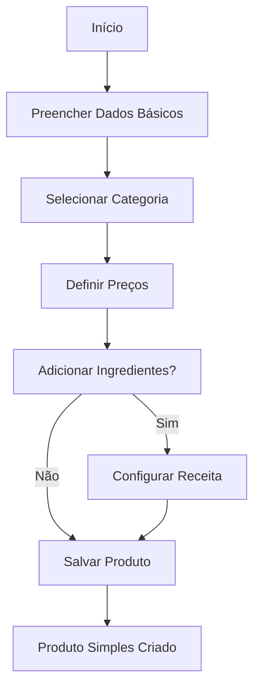
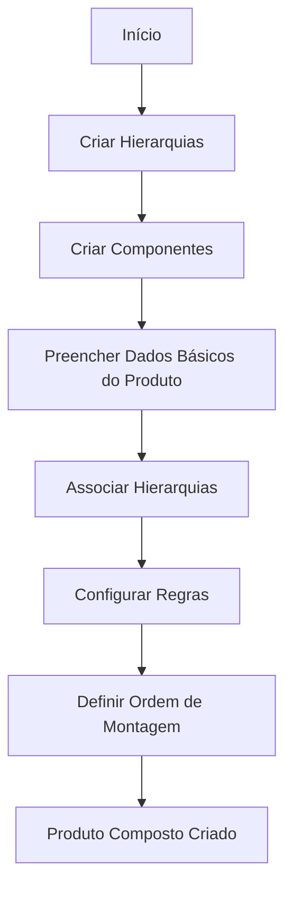
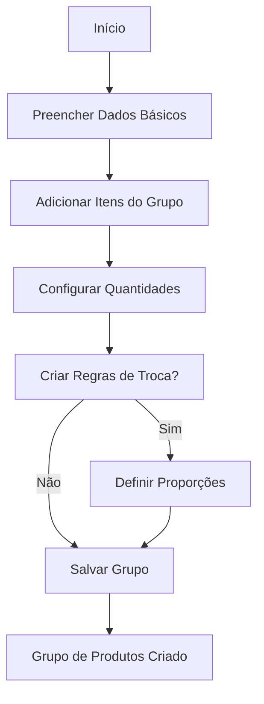
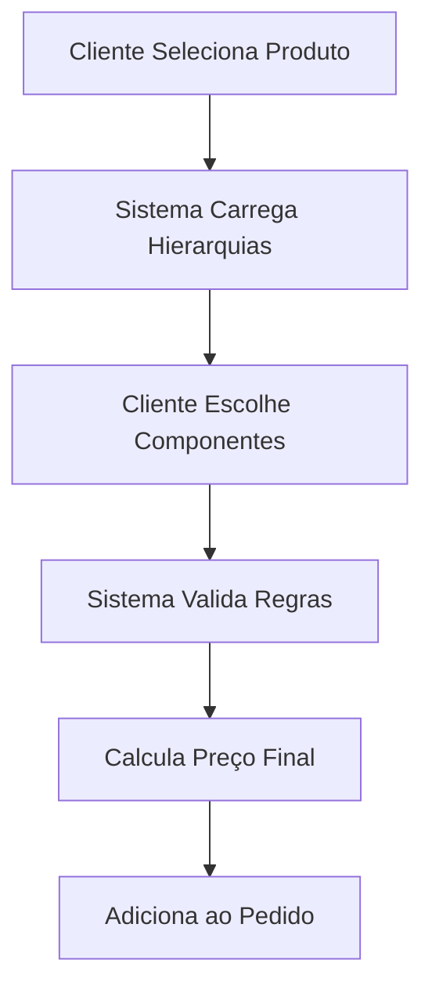
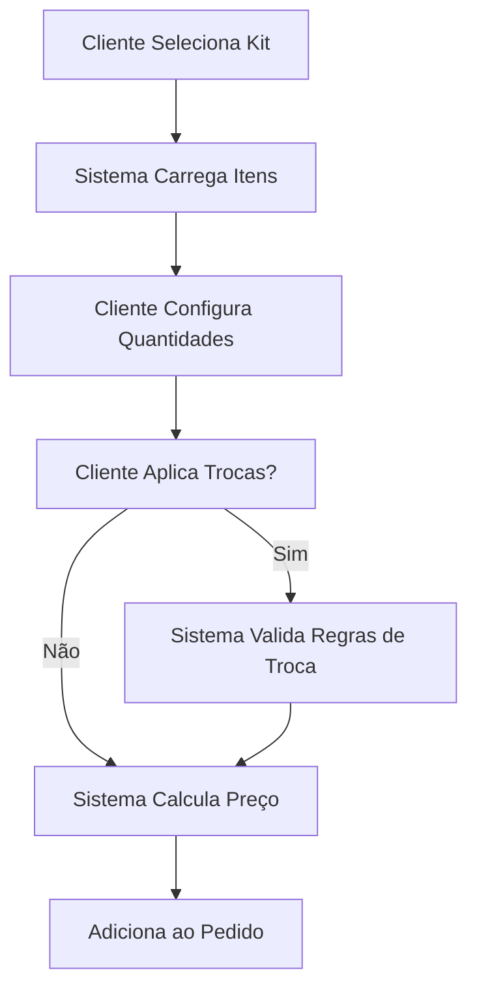

# 🏭 SISTEMA GesN - Gestão de Negócios

## 📋 Índice

1. [Visão Geral](#-visão-geral)
2. [Arquitetura e Estrutura](#-arquitetura-e-estrutura)
3. [Entidades e Relacionamentos](#-entidades-e-relacionamentos)
4. [Tipos de Produtos](#-tipos-de-produtos)
5. [Fluxos de Negócio](#-fluxos-de-negócio)
6. [Regras de Negócio](#-regras-de-negócio)
7. [Exemplos Práticos](#-exemplos-práticos)
8. [Considerações Técnicas](#-considerações-técnicas)

---

## 🎯 Visão Geral

O **Domínio de Produto** é o núcleo fundamental do sistema GesN, representando a **primeira etapa obrigatória** na jornada do usuário. Este domínio gerencia todo o **Catálogo de Produtos** da empresa e serve como base para todos os outros domínios do sistema:

- **Domínio de Vendas**: Depende dos produtos para criar pedidos
- **Domínio de Produção**: Utiliza a estrutura de produtos para gerar demandas
- **Domínio Financeiro**: Calcula receitas baseadas nas vendas de produtos  
- **Domínio de Compras**: Estima ingredientes necessários baseado na produção

### 🔄 Cadeia de Dependências

```
PRODUTO → VENDAS → PRODUÇÃO → COMPRAS → FINANCEIRO
   ↑                                        ↓
   └────────── RETROALIMENTAÇÃO ──────────┘
```

---

## 🏗 Arquitetura e Estrutura

### Padrão Arquitetural
- **Domain-Driven Design (DDD)**
- **Repository Pattern** para acesso a dados
- **Service Layer** para regras de negócio
- **Entity Framework** com herança TPH (Table Per Hierarchy)

### Estrutura de Diretórios
```
GesN.Web/
├── Models/Entities/Production/
│   ├── Product.cs (classe abstrata base)
│   ├── SimpleProduct.cs
│   ├── CompositeProduct.cs
│   ├── ProductGroup.cs
│   ├── ProductCategory.cs
│   ├── ProductComponent.cs
│   ├── ProductComponentHierarchy.cs
│   ├── ProductGroupItem.cs
│   ├── ProductGroupExchangeRule.cs (GroupExchangeRule.cs)
│   └── CompositeProductXHierarchy.cs
├── Services/
│   ├── ProductService.cs
│   ├── ProductGroupService.cs
│   ├── ProductCategoryService.cs
│   └── ProductComponentService.cs
├── Controllers/
│   ├── ProductController.cs
│   ├── ProductGroupController.cs
│   ├── ProductCategoryController.cs
│   └── ProductComponentController.cs
└── Views/
    ├── Product/
    ├── ProductCategory/
    ├── ProductComponent/
    ├── ProductGroup/
    └── ProductComponentHierarchy/
```

---

## 🗄 Entidades e Relacionamentos

### 1. **Product** (Classe Abstrata Base)
**Tabela**: `Product`  
**Tipo**: Classe abstrata com herança TPH

```csharp
public abstract class Product : Entity
{
    public virtual ProductType ProductType { get; protected set; }
    public string Name { get; set; }
    public string? Description { get; set; }
    public decimal Price { get; set; }
    public int QuantityPrice { get; set; }
    public decimal UnitPrice { get; set; }
    public decimal Cost { get; set; }
    public string? CategoryId { get; set; }
    public string? Category { get; set; }
    public string? SKU { get; set; }
    public string? ImageUrl { get; set; }
    public string? Note { get; set; }
    public int AssemblyTime { get; set; }
    public string? AssemblyInstructions { get; set; }
    
    // Propriedade navegacional
    public ProductCategory? CategoryNavigation { get; set; }
}
```

**Relacionamentos:**
- `1:N` com ProductCategory (opcional)
- `1:N` com ProductIngredient
- `1:N` com OrderItem
- `1:N` com ProductGroupItem

### 2. **ProductCategory**
**Tabela**: `ProductCategory`  
**Propósito**: Agrupar produtos por categorias (ex: Salgados Tradicionais, Doces Especiais)

```csharp
public class ProductCategory : Entity
{
    public string Name { get; set; }
    public string? Description { get; set; }
}
```

**Relacionamentos:**
- `1:N` com Product
- `1:N` com ProductGroupItem

### 3. **SimpleProduct** 
**Herda de**: Product  
**ProductType**: `Simple`  
**Propósito**: Produtos básicos sem estrutura complexa

**Exemplos**: Coxinha Comum, Kibe com Catupiry, Quiche de Alho Poró

### 4. **CompositeProduct**
**Herda de**: Product  
**ProductType**: `Composite`  
**Propósito**: Produtos formados por componentes organizados em hierarquias

**Exemplos**: Bolo p/ 20 pessoas, Pacote Comida Di Buteco, Serviço de Jantar

```csharp
public class CompositeProduct : Product
{
    public ICollection<ProductComponent> Components { get; set; }
}
```

**Relacionamentos:**
- `N:N` com ProductComponentHierarchy através de CompositeProductXHierarchy

### 5. **ProductGroup**
**Herda de**: Product  
**ProductType**: `Group`  
**Propósito**: Produtos abstratos que representam conjuntos flexíveis de itens

**Exemplos**: Kit p/ 20 pessoas, Kit Festa na Caixa

```csharp
public class ProductGroup : Product
{
    public ICollection<ProductGroupItem> GroupItems { get; set; }
    public ICollection<ProductGroupExchangeRule> ExchangeRules { get; set; }
}
```

### 6. **ProductComponentHierarchy**
**Tabela**: `ProductComponentHierarchy`  
**Propósito**: Define "camadas" ou "níveis" de componentes para produtos compostos

**Exemplos**: Massa de Pão de Ló, Recheio de Bolo, Cobertura de Bolo, Opcionais

```csharp
public class ProductComponentHierarchy : Entity
{
    public string Name { get; set; }
    public string? Description { get; set; }
    public string? Notes { get; set; }
    
    public ICollection<ProductComponent> Components { get; set; }
    public ICollection<CompositeProductXHierarchy> CompositeProductRelations { get; set; }
}
```

### 7. **ProductComponent**
**Tabela**: `ProductComponent`  
**Propósito**: Componentes específicos dentro de uma hierarquia

**Exemplos**: Massa Branca, Massa Preta, Recheio de Brigadeiro, Recheio de Morango

```csharp
public class ProductComponent : Entity
{
    public string Name { get; set; }
    public string? Description { get; set; }
    public string ProductComponentHierarchyId { get; set; }
    public decimal AdditionalCost { get; set; }
    
    public ProductComponentHierarchy? ProductComponentHierarchy { get; set; }
}
```

### 8. **CompositeProductXHierarchy**
**Tabela**: `CompositeProductXHierarchy`  
**Propósito**: Relaciona produtos compostos com suas hierarquias de componentes

```csharp
public class CompositeProductXHierarchy
{
    public int Id { get; set; } // Auto-incremental
    public string ProductComponentHierarchyId { get; set; }
    public string ProductId { get; set; }
    public int MinQuantity { get; set; }
    public int MaxQuantity { get; set; }
    public bool IsOptional { get; set; }
    public int AssemblyOrder { get; set; }
    public string? Notes { get; set; }
}
```

### 9. **ProductGroupItem**
**Tabela**: `ProductGroupItem`  
**Propósito**: Itens que compõem um grupo de produtos

```csharp
public class ProductGroupItem : Entity
{
    public string ProductGroupId { get; set; }
    public string? ProductId { get; set; }        // OU
    public string? ProductCategoryId { get; set; } // OU (mutuamente exclusivos)
    public int Quantity { get; set; }
    public int MinQuantity { get; set; }
    public int? MaxQuantity { get; set; }
    public int DefaultQuantity { get; set; }
    public bool IsOptional { get; set; }
    public decimal ExtraPrice { get; set; }
}
```

**Relacionamentos:**
- `N:1` com Product (ProductGroupId)
- `N:1` com Product (ProductId) - **OPCIONAL**
- `N:1` with ProductCategory (ProductCategoryId) - **OPCIONAL**

### 10. **ProductGroupExchangeRule** (GroupExchangeRule.cs)
**Tabela**: `ProductGroupExchangeRule`  
**Propósito**: Define regras de troca entre itens de um grupo

```csharp
public class ProductGroupExchangeRule : Entity
{
    public string ProductGroupId { get; set; }
    public string SourceGroupItemId { get; set; }
    public int SourceGroupItemWeight { get; set; }
    public string TargetGroupItemId { get; set; }
    public int TargetGroupItemWeight { get; set; }
    public decimal ExchangeRatio { get; set; }
    public bool IsActive { get; set; }
}
```

---

## 📦 Tipos de Produtos

### 1. 🔷 **Produto Simples (Simple)**

**Características:**
- Estrutura mais básica possível
- Não requer parametrizações específicas
- Relacionamentos padrão: ProductCategory + ProductIngredient

**Processo de Criação:**
1. Definir dados básicos (Nome, Preço, Categoria)
2. Configurar ingredientes e quantidades (opcional)
3. Definir tempo de montagem (opcional)

**Exemplo Real:**
```
Produto: "Coxinha Comum"
├── Categoria: "Salgados Tradicionais"
├── Preço: R$ 3,50
├── Ingredientes:
│   ├── Massa de Coxinha: 50g
│   ├── Frango Desfiado: 30g
│   └── Temperos: 5g
└── Tempo de Montagem: 5 minutos
```

### 2. 🔶 **Produto Composto (Composite)**

**Características:**
- Estrutura flexível mas **concreta**
- Requer parametrização de hierarquias e componentes
- Permite customização controlada pelo cliente

**Processo de Criação:**
1. **Criar Hierarquias**: Definir "camadas" do produto
2. **Criar Componentes**: Opções dentro de cada camada
3. **Configurar Produto**: Associar hierarquias com regras
4. **Definir Montagem**: Ordem e obrigatoriedade

**Exemplo Real - "Bolo p/ 20 pessoas":**

**Passo 1 - Hierarquias:**
```
Hierarquia 1: "Massa de Pão de Ló"
Hierarquia 2: "Recheio de Bolo"  
Hierarquia 3: "Cobertura de Bolo"
Hierarquia 4: "Opcionais"
```

**Passo 2 - Componentes:**
```
Massa de Pão de Ló:
├── Massa Branca
├── Massa Preta
└── Massa Mesclada

Recheio de Bolo:
├── Brigadeiro
├── Morango
├── Ninho
└── Doce de Leite

Cobertura de Bolo:
├── Chantilly
├── Glacê
└── Chocolate

Opcionais:
├── Frutas Vermelhas
├── Granulado
└── Vela Personalizada
```

**Passo 3 - Configuração do Produto:**
```sql
CompositeProductXHierarchy:
├── Massa: Min=1, Max=1, Opcional=false, Ordem=1
├── Recheio: Min=1, Max=2, Opcional=false, Ordem=2  
├── Cobertura: Min=1, Max=1, Opcional=false, Ordem=3
└── Opcionais: Min=0, Max=3, Opcional=true, Ordem=4
```

### 3. 🔸 **Grupo de Produtos (Group)**

**Características:**
- Estrutura mais flexível e **abstrata**
- Itens podem ser Products OU ProductCategories
- Permite regras de troca entre itens
- Não é um produto físico, mas um "pacote configurável"

**Processo de Criação:**
1. **Criar Itens do Grupo**: Definir o que compõe o kit
2. **Configurar Quantidades**: Min/Max/Padrão de cada item
3. **Criar Regras de Troca**: Proporções entre itens
4. **Definir Preço**: Base + extras dos itens

**Exemplo Real - "Kit p/ 10 pessoas":**

**Passo 1 - Itens do Grupo:**
```
Item 1: 1x "Bolo p/ 10 pessoas" (Product)
Item 2: 100x "Salgados Tradicionais" (ProductCategory)
Item 3: 100x "Doces Tradicionais" (ProductCategory)  
Item 4: 1x "Batata Frita 1kg" (Product)
```

**Passo 2 - Regras de Troca:**
```
Regra 1: Salgados Tradicionais (1) ↔ Doces Tradicionais (1)
Regra 2: Salgados Tradicionais (2) ↔ Salgados Especiais (1)
Regra 3: Doces Tradicionais (3) ↔ Pratos Quentes (1)
```

**Por que é "Abstrato"?**
- O cliente não compra um produto físico específico
- Ele configura um pacote baseado nas opções disponíveis
- A composição final varia conforme as escolhas e trocas
- O sistema calcula o preço dinamicamente

---

## 🔄 Fluxos de Negócio

### 1. **Fluxo de Criação - Produto Simples**



### 2. **Fluxo de Criação - Produto Composto**



### 3. **Fluxo de Criação - Grupo de Produtos**



### 4. **Fluxo de Venda - Produto Composto**



### 5. **Fluxo de Venda - Grupo de Produtos**



---

## ⚖️ Regras de Negócio

### **Regras Gerais**

1. **Categoria Opcional**: Produtos podem existir sem categoria
2. **SKU Único**: Quando informado, deve ser único no sistema
3. **Preços Positivos**: Price, UnitPrice e Cost devem ser ≥ 0
4. **Estado Ativo**: Apenas produtos ativos aparecem nas vendas
5. **Herança TPH**: Todos os tipos usam a mesma tabela `Product`

### **Produto Simples**

1. **Dados Mínimos**: Nome e Preço são obrigatórios
2. **SKU Recomendado**: Para controle de estoque
3. **Ingredientes Opcionais**: Podem ter receita definida
4. **Tempo de Montagem**: Opcional, em minutos

### **Produto Composto**

1. **Hierarquias Obrigatórias**: Deve ter pelo menos 1 hierarquia associada
2. **Componentes por Hierarquia**: Cada hierarquia deve ter ≥ 1 componente
3. **Quantidade Mínima**: MinQuantity ≥ 1 para hierarquias obrigatórias
4. **Ordem de Montagem**: AssemblyOrder deve ser sequencial (1, 2, 3...)
5. **Validação de Limites**: Quantidade selecionada deve respeitar Min/Max
6. **Componentes Ativos**: Apenas componentes ativos ficam disponíveis

### **Grupo de Produtos**

1. **Itens Obrigatórios**: Deve ter pelo menos 1 item no grupo
2. **Exclusividade**: Item pode ser Product OU ProductCategory (não ambos)
3. **Quantidades Válidas**: MinQuantity ≤ DefaultQuantity ≤ MaxQuantity
4. **Regras de Troca**:
   - Source ≠ Target (não pode trocar item por ele mesmo)
   - Ambos os itens devem pertencer ao mesmo grupo
   - Pesos devem ser > 0
   - ExchangeRatio deve ser > 0
5. **Cálculo de Preço**: Base + (Σ itens * quantidade * preço_efetivo)

### **Hierarquias e Componentes**

1. **Nome Único**: Hierarquias devem ter nomes únicos
2. **Componentes Ativos**: Apenas componentes ativos são utilizáveis
3. **Custo Adicional**: AdditionalCost ≥ 0
4. **Relacionamento**: Componente deve pertencer a uma hierarquia

### **Regras de Troca**

1. **Mesma Família**: Só pode trocar itens do mesmo grupo
2. **Proporção Válida**: ExchangeRatio > 0
3. **Pesos Positivos**: SourceWeight > 0 e TargetWeight > 0
4. **Ativação**: Regra deve estar ativa para ser aplicada
5. **Disponibilidade**: Itens envolvidos devem estar ativos

---

## 💡 Exemplos Práticos

### **Exemplo 1: Restaurante de Salgados**

**Produtos Simples:**
```
- Coxinha Comum (Salgados Tradicionais) - R$ 3,50
- Kibe (Salgados Tradicionais) - R$ 3,00  
- Pastel de Carne (Salgados Tradicionais) - R$ 4,00
- Torta de Frango (Salgados Especiais) - R$ 8,50
```

**Produto Composto - "Bolo Personalizado":**
```
Hierarquias:
├── Massa (obrigatória, min=1, max=1)
│   ├── Massa de Chocolate
│   ├── Massa de Baunilha  
│   └── Massa Red Velvet (+R$ 5,00)
├── Recheio (obrigatória, min=1, max=2)
│   ├── Brigadeiro
│   ├── Beijinho
│   └── Nutella (+R$ 8,00)
└── Cobertura (opcional, min=0, max=1)
    ├── Chantilly
    ├── Ganache (+R$ 3,00)
    └── Fondant (+R$ 15,00)
```

**Grupo de Produtos - "Kit Festa 50 pessoas":**
```
Itens Base:
├── 2x Bolo p/ 25 pessoas
├── 200x Salgados Tradicionais  
├── 100x Doces Tradicionais
└── 2x Refrigerante 2L

Regras de Troca:
├── Salgados Tradicionais (2) ↔ Salgados Especiais (1)
├── Doces Tradicionais (3) ↔ Torta Individual (1)
└── Refrigerante 2L (1) ↔ Suco Natural 1L (1)
```

### **Exemplo 2: Padaria**

**Produtos Simples:**
```
- Pão Frances (Pães) - R$ 0,50
- Croissant (Pães Especiais) - R$ 3,50
- Baguete (Pães Especiais) - R$ 4,00
```

**Produto Composto - "Sanduíche Personalizado":**
```
Hierarquias:
├── Pão (obrigatória, min=1, max=1)
│   ├── Pão Frances
│   ├── Pão Integral (+R$ 1,00)
│   └── Ciabatta (+R$ 2,50)
├── Proteína (obrigatória, min=1, max=2)  
│   ├── Presunto
│   ├── Peito de Peru (+R$ 2,00)
│   └── Salmão (+R$ 8,00)
├── Queijo (opcional, min=0, max=2)
│   ├── Mussarela
│   ├── Prato (+R$ 1,00)
│   └── Brie (+R$ 4,00)
└── Extras (opcional, min=0, max=5)
    ├── Alface
    ├── Tomate
    ├── Cebola
    └── Azeitona (+R$ 1,50)
```

---

## 🔧 Considerações Técnicas

### **Banco de Dados**

**Estratégia de Herança**: Table Per Hierarchy (TPH)
- Uma única tabela `Product` com coluna discriminadora `ProductType`
- Valores: 'Simple', 'Composite', 'Group'
- Constraint: `CHECK (ProductType IN ('Simple', 'Composite', 'Group'))`

**Chaves Estrangeiras Opcionais**:
```sql
-- ProductGroupItem pode referenciar Product OU ProductCategory
ProductId TEXT NULL,
ProductCategoryId TEXT NULL,
-- Constraint: exatamente um deve ser preenchido
```

**Índices Recomendados**:
```sql
CREATE INDEX IX_Product_ProductType ON Product(ProductType);
CREATE INDEX IX_Product_CategoryId ON Product(CategoryId);
CREATE INDEX IX_Product_StateCode ON Product(StateCode);
CREATE INDEX IX_ProductGroupItem_ProductGroupId ON ProductGroupItem(ProductGroupId);
```

### **Performance**

1. **Lazy Loading**: Configurar relacionamentos como lazy por padrão
2. **Eager Loading**: Usar `.Include()` quando necessário
3. **Pagination**: Implementar paginação em listagens
4. **Caching**: Cache de categorias e hierarquias (dados estáticos)
5. **Async/Await**: Todas as operações de banco são assíncronas

### **Validações**

**Model Validation**:
```csharp
[Required(ErrorMessage = "Nome é obrigatório")]
[StringLength(200, ErrorMessage = "Nome deve ter no máximo 200 caracteres")]
public string Name { get; set; }

[Range(0, double.MaxValue, ErrorMessage = "Preço deve ser maior ou igual a zero")]
public decimal Price { get; set; }
```

**Business Validation**:
```csharp
public async Task<bool> ValidateProductGroupAsync(ProductGroup group)
{
    // Verificar se tem pelo menos 1 item
    if (!group.GroupItems.Any())
        return false;
        
    // Verificar se todos os itens são válidos
    foreach (var item in group.GroupItems)
    {
        if (!item.IsValidItemConfiguration())
            return false;
    }
    
    return true;
}
```

### **Padrões de Código**

**Repository Pattern**:
```csharp
public interface IProductRepository
{
    Task<Product?> GetByIdAsync(string id);
    Task<IEnumerable<Product>> GetByTypeAsync(ProductType type);
    Task<string> CreateAsync(Product product);
    Task<bool> UpdateAsync(Product product);
    Task<bool> DeleteAsync(string id);
}
```

**Service Layer**:
```csharp
public class ProductService : IProductService
{
    private readonly IProductRepository _productRepository;
    
    public async Task<string> CreateProductAsync(Product product)
    {
        // Validações de negócio
        await ValidateProductAsync(product);
        
        // Configurações específicas do tipo
        ConfigureProductType(product);
        
        // Persistir
        return await _productRepository.CreateAsync(product);
    }
}
```

### **Autocomplete e UX**

**Padrão Implementado**:
- **HTML**: Estrutura com floating labels e inputs hidden
- **JavaScript**: Algolia Autocomplete.js com containers específicos
- **Backend**: Endpoints padronizados com validação e filtros
- **Responsividade**: Dropdown se ajusta ao container pai

**Exemplo de Uso**:
```javascript
// Inicialização do autocomplete de categoria
productManager.autocomplete.initializeCategoryAutocomplete(container);

// Inicialização do autocomplete de hierarquia  
compositeProductManager.initializeHierarchyAutocomplete(container);
```

---

## 🎯 Conclusão

O **Sistema GesN** oferece uma arquitetura robusta e flexível que suporta desde produtos simples até estruturas complexas com hierarquias e regras de troca. A implementação seguindo padrões DDD garante manutenibilidade e extensibilidade, enquanto a interface moderna com autocomplete proporciona uma excelente experiência do usuário.

Esta documentação serve como referência completa para desenvolvedores, analistas de negócio e usuários finais que precisam compreender o funcionamento detalhado do sistema GesN.

---

**Última atualização**: Janeiro 2025  
**Versão**: 1.0  
**Autor**: Sistema GesN - Gestão de Negócios


